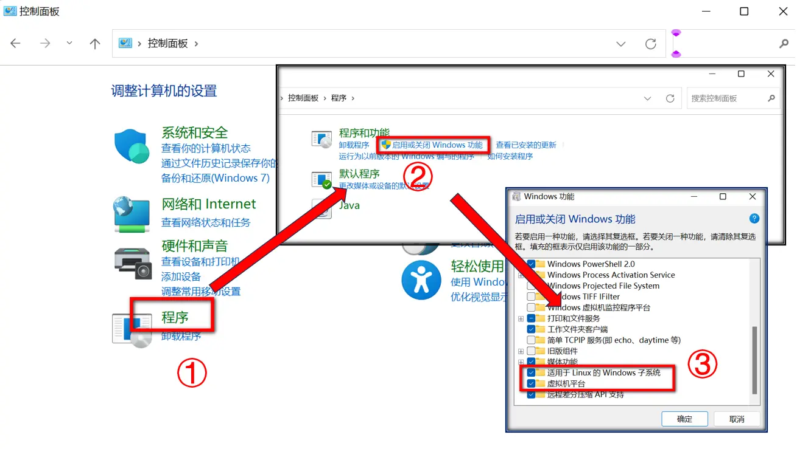
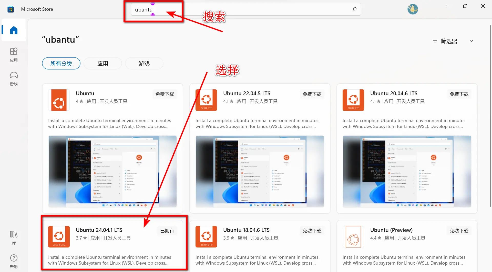
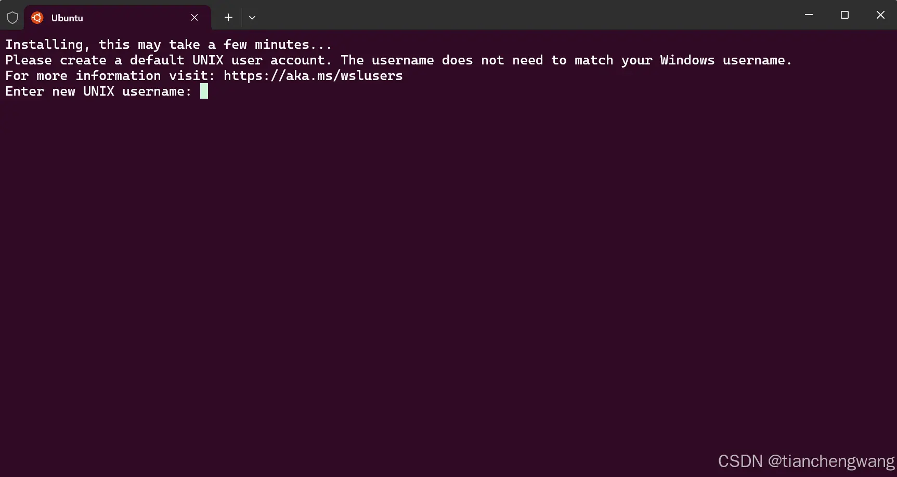
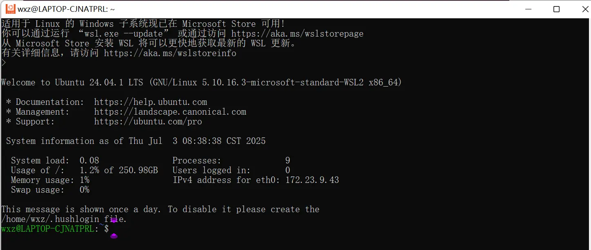
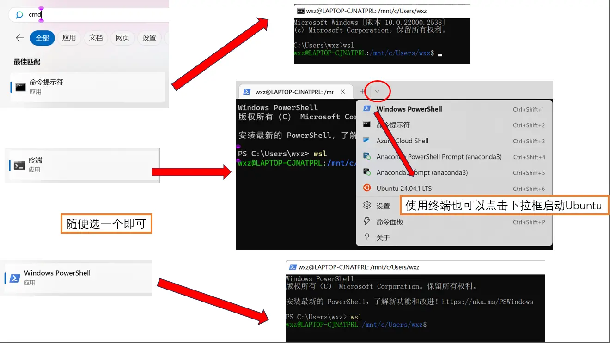
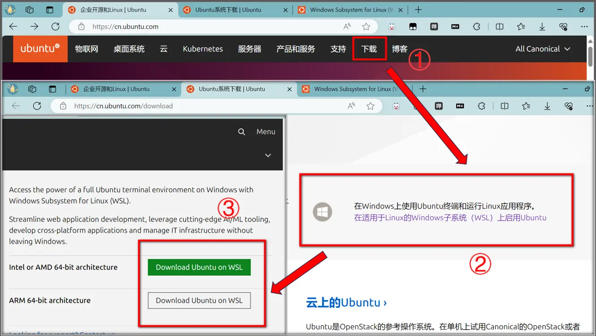
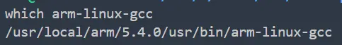
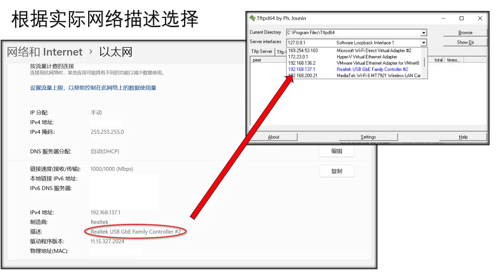
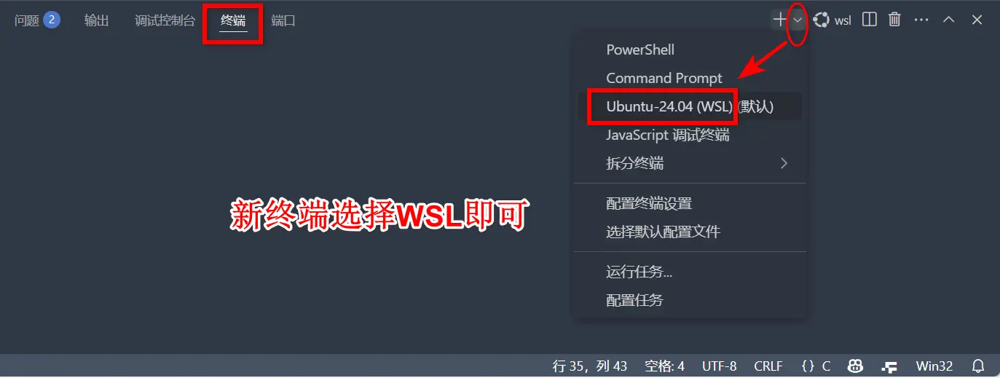
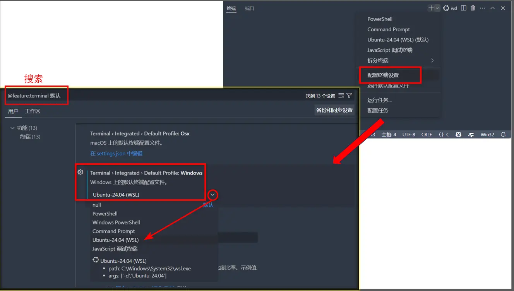

# 引入

最近在学习嵌入式开发，为了降低虚拟机资源占用与减少界面切换冗余操作，发现wsl可以集成到vscode中。已尝试完成基础环境配置，下文详述具体流程。

# 1. 下载并使用

## 1.1 wsl启用

### 一般配置

通过系统功能启用 WSL，步骤如下：
打开 `控制面板 > 程序 > 程序和功能 > 启用或关闭 Windows 功能`。
勾选以下选项（如图）：

-   **适用于 Linux 的 Windows 子系统**
-   **虚拟机平台**

**注**：若存在 `Hyper-V` 选项，则一同启用。



重启计算机。

（**可能还需要下一步**：如果后续出现错误0x800701bc）

### 安装wsl2内核升级包：

WSL官网 [https://learn.microsoft.com/zh-cn/windows/wsl/install-manual#step-4---download-the-linux-kernel-update-package](https://link.zhihu.com/?target=https%3A//learn.microsoft.com/zh-cn/windows/wsl/install-manual%23step-4---download-the-linux-kernel-update-package) 下载安装适用于 x64 计算机的最新 WSL2 Linux 内核更新包，下载并安装wsl的内核升级包 下载地址：[https://wslstorestorage.blob.core.windows.net/wslblob/wsl_update_x64.msi](https://link.zhihu.com/?target=https%3A//wslstorestorage.blob.core.windows.net/wslblob/wsl_update_x64.msi) 下载后直接双击安装

【来自知乎：[安装WSL时，出现错误0x800701bc - 知乎 (zhihu.com)](https://zhuanlan.zhihu.com/p/650240196)】

**备用下载**[密码:esa3]：[wsl_update_x64.exe (lanzoue.com)](https://wwae.lanzoue.com/iwmFK305mmzi)
（因平台限制需手动修改文件扩展名，下载后修改后缀为msi再双击运行）

## 1.2 安装适用于wsl的Ubuntu

### 一般配置

通过 Microsoft Store(微软商店) 安装 **Ubuntu 24.04.1 LTS**。



安装完成后启动该软件
输入用户名和密码**（请记住（后续操作依赖）**
密码输入没有视觉反馈，直接按Enter提交



【本张图源CSDN：[Windows Subsystem for Linux (WSL, Ubuntu) 最新安装教程（2024.11 更新）-CSDN博客](https://blog.csdn.net/wangtcCSDN/article/details/137950545)】



出现类似界面就表示这一步完成了，之后使用Windows终端/CMD/power shell 输入wsl启动



关闭wsl：在新开一个终端输入

```
wsl --shutdown
```

### 微软商店用不了？

**如果**因为关闭了系统更新或者是其他原因导致**微软商店不能用**，那就去Ubuntu官网下载WSL安装包。



根据实际CPU架构选择版本，不知道就选择第一个。

# 2. 配置环境

## 2.1 修改软件源

```
# 替换为24.04(noble)的阿里云源
sudo tee /etc/apt/sources.list << 'EOF'
deb http://mirrors.aliyun.com/ubuntu/ noble main restricted universe multiverse
deb http://mirrors.aliyun.com/ubuntu/ noble-security main restricted universe multiverse
deb http://mirrors.aliyun.com/ubuntu/ noble-updates main restricted universe multiverse
deb http://mirrors.aliyun.com/ubuntu/ noble-proposed main restricted universe multiverse
deb http://mirrors.aliyun.com/ubuntu/ noble-backports main restricted universe multiverse
EOF

# 然后执行
sudo apt update

#备用（上面一条指令没有问题就别用）
sudo apt-key adv --keyserver keyserver.ubuntu.com --recv-keys 3B4FE6ACC0B21F32
```

不使用阿里云也可以使用清华大学源

```
sudo tee /etc/apt/sources.list << 'EOF'
deb https://mirrors.tuna.tsinghua.edu.cn/ubuntu/ noble main restricted universe multiverse
deb https://mirrors.tuna.tsinghua.edu.cn/ubuntu/ noble-security main restricted universe multiverse
deb https://mirrors.tuna.tsinghua.edu.cn/ubuntu/ noble-updates main restricted universe multiverse
deb https://mirrors.tuna.tsinghua.edu.cn/ubuntu/ noble-proposed main restricted universe multiverse
deb https://mirrors.tuna.tsinghua.edu.cn/ubuntu/ noble-backports main restricted universe multiverse
EOF

# 后续步骤不变
```

## 2.2 安装gcc

```
sudo apt-get install build-essential
```

## 2.3 安装交叉开发用gcc

因为我们的开发板上的处理器(ARM）与电脑上面的处理器(Intel）有本质的不同
所以我们需要使用专门的编译器来编译代码
		**arm-linux-gcc**

蓝奏云链接[密码:91r7]：[gcc-linaro-5.5.0-2017.10-x86_64_arm-linux-gnueabi.tar (lanzoue.com)](https://wwae.lanzoue.com/iJWhH305my4j)
（因平台限制需手动修改文件扩展名，下载后改后缀为tar.xz）

1、把gcc-linaro-5.5.0-2017.10-x86_64_arm-linux-gnueabi.tar.xz复制到虚拟机的共享目录
2、把gcc-linaro-5.5.0-2017.10-x86_64_arm-linux-gnueabi.tar.xz解压到/usr/local目录

```
# 定位至压缩包目录执行解压命令
sudo tar -xvf gcc-linaro-5.5.0-2017.10-x86_64_arm-linux-gnueabi.tar.xz -C
/usr/local/

# 进入到/usr/local目录下
cd /usr/local/

# 将解压出来的这个目录的名字改短一点（一般情况下使用这个，但我的工程用的不是这个路径，如果用我的工程需要跳过这一步）
sudo mv gcc-linaro-5.5.0-2017.10-x86_64_arm-linux-gnueabi arm-linux

# 我的工程使用路径（不使用我的工程就跳过这一步）
sudo mkdir arm
sudo mkdir arm/5.4.0
sudo cd arm/5.4.0
sudo mv gcc-linaro-5.5.0-2017.10-x86_64_arm-linux-gnueabi usr
```

3、进入到命令目录，添加软链接

```
# 进入到命令目录
cd usr/bin
# 添加软链接
sudo ln -s arm-linux-gnueabi-gcc arm-linux-gcc
# 把arm.sh这个脚本拷贝到命令目录
cd /mnt/hgfs/CS2421F/1_第一阶段/4_交叉开发/gec6818/
sudo cp ./arm.sh /usr/local/arm-linux/bin/
# 之后回到命令目录，执行这个脚本
sudo ./arm.sh
```

说明：

arm.sh的内容：

```
#!/bin/bash

var1=arm-linux-gnueabi-*

for i in $(ls $var1)
do
	var3=${i##*gnueabi-}
	ln -s $i arm-linux-$var3
done

exit 0
```

5、修改PATH这个环境变量，PATH是命令搜索路径
把以下指令添加到/etc/profile文件中

```
# 1、打开文件
sudo vim /etc/profile
# 2、把下面两行命令加入到末尾
export PATH=$PATH:/usr/local/arm-linux/bin
export LD_LIBRARY_PATH=$LD_LIBRARY_PATH:/usr/local/arm-linux/lib
# 3、重启虚拟机
# wsl重启方式 先关闭当前终端
# 在另一个终端（powershell）输入
wsl --shutdown
# 再输入
wsl
```

6、测试

```
arm-linux-gcc --version
```



（这是我项目使用编译器的路径）

## 2.4 安装cmake

使用命令安装即可

```
sudo apt-get install cmake
```

# 3. 网线传输

由于我的wsl版本较低，网络默认使用NAT模式，这里不再修改wsl的网络配置。
暂时使用Windows开启tftp服务传输文件。

## 3.1 安装tftpd

官网：[TFTPD64 : an opensource IPv6 ready TFTP server/service for windows : TFTP server (pjo2.github.io)](https://pjo2.github.io/tftpd64/)

下载，这里我已经下载完了，使用蓝奏云链接即可
蓝奏云链接 [密码:gmzr]：[Tftpd64_Installer_v4.70.exe (lanzoue.com)](https://wwae.lanzoue.com/iTMJz305mlna)

## 3.2 启动tftp

安装完后启动tftpd64

查看网络描述：`设置-->网络和Internet-->对应的网络【属性】`



## 3.3 选择tftp传输文件夹


## 3.4 开发板网络配置

```
# 编辑
vi /etc/profile
# 按shift+G，在末尾添加
ifconfig eth0 192.168.137.115 netmask 255.255.255.0 up
              （根据实际IP）
# 只要前三个数和网线IP一样即可
# 比如网线IP为172.113.31.12
# 那么这里填 172.113.31.xx（xx填12意外的数字）
# 开发板重启
reboot
```

现在就可以正常使用tftp传输文件了

# 4. VS Code集成wsl

## 4.1 新终端开启



## 4.2 设置终端默认为wsl

`文件 > 首选项 > 设置 > Terminal > Integrated > Default Profile`



# 5. 后续工具安装

```
# 安装 net-tools 使用 ifconfig 命令
# 如果不使用ifconfig命令可以不安装，备用命令：ip addr
sudo apt install net-tools

# 安装tcpdump（网络分析用）
sudo apt install tcpdump

# 安装tree（非必要，根据个人喜好）
sudo apt install tree

# 安装………………
```

备选标题：
WSL配置指南：替代虚拟机实现嵌入式嵌入式设备全流程开发
使用WSL配置Linux替代虚拟机进行开发板全流程搭建
使用WSL配置Linux替换虚拟机实现开发板端到端开发环境
基于WSL配置Linux替代虚拟机用于嵌入式设备全流程开发
使用WSL替代虚拟机进行嵌入式开发及TFTP通信配置
WSL环境下嵌入式系统开发环境搭建与网络调试指南
从零配置WSL+Ubuntu用于ARM开发板交叉编译与TFTP传输
WSL嵌入式开发实战：交叉工具链搭建与TFTP文件传输教程
构建基于WSL的嵌入式开发平台并实现开发板网络通信
WSL_嵌入式开发环境搭建指南
从零开始的WSL嵌入式开发教程
WSL配置ARM交叉编译+TFTP传输流程
开发板网络调试与WSL环境配置说明
WSL嵌入式开发实战：交叉工具链搭建与TFTP文件传输教程
WSL替代虚拟机指南：ARM开发板交叉编译与TFTP通信配置
基于WSL的嵌入式全流程开发：从工具链到网络调试
WSL嵌入式开发平台构建：Ubuntu环境与TFTP传输实战