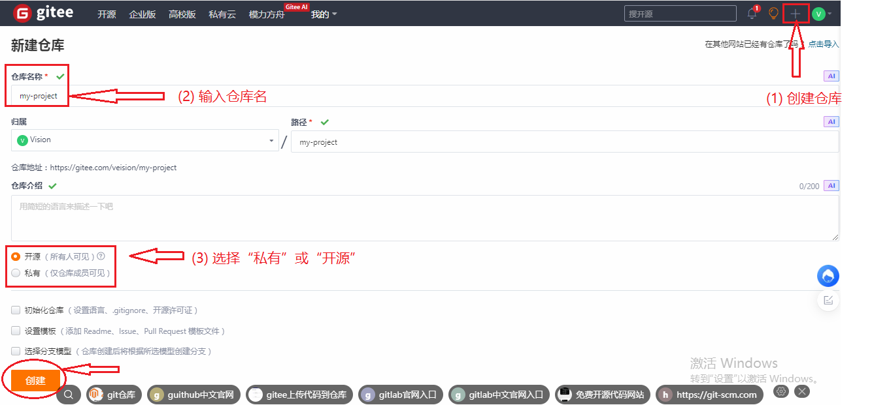
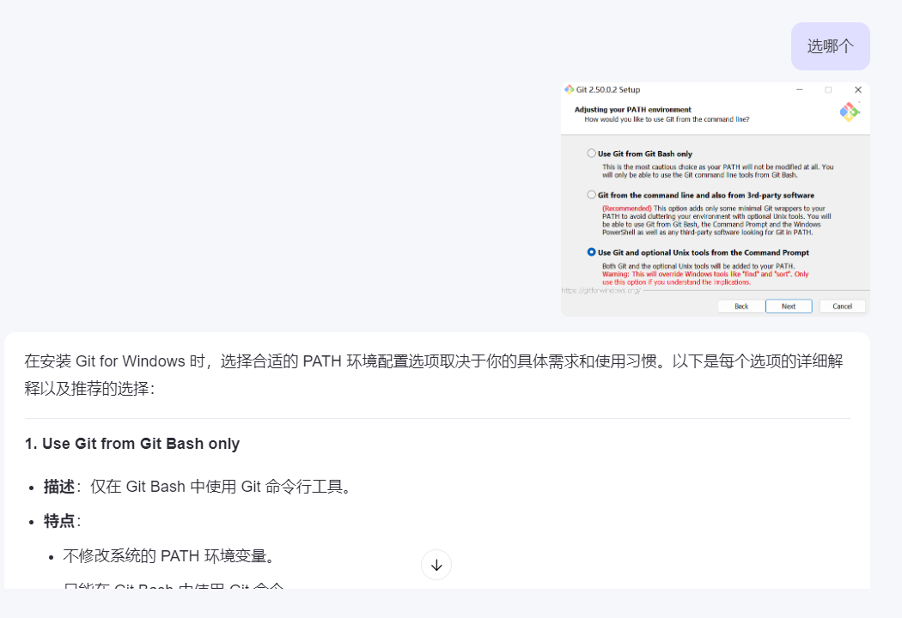

# 6. git的简单使用

## 6.1 注册 Gitee

### 6.1.1 注册 Gitee 账号

​	访问 [Gitee 官网](https://gitee.com/)。
​	点击'注册'按钮，填写用户名、邮箱及密码，完成账号创建。
​	登录你的 Gitee 账号。

### 6.1.2 创建远程仓库

登录 Gitee 后，点击页面右上角的“+”号，选择“新建仓库”。
填写仓库名称、描述等信息。
选择仓库的可见性（公开或私有）。
点击“创建”按钮，完成远程仓库的创建。


## 6.2 git初始配置

### 6.2.1 安装git：

```
sudo apt-get install git
```

### 6.2.2 设置全局用户名：

使用以下命令设置全局用户名（将 Your Name 替换为你的名字）

```
git config --global user.name "Your Name"
```

### 6.2.3 设置全局邮箱：

使用以下命令设置全局邮箱（将  `your_email@example.com` 替换为你的邮箱）

```
git config --global user.email "your_email@example.com"
```

### 6.2.4 验证配置：

使用以下命令查看当前的 GIT 配置，确认用户名和邮箱是否正确：

```
git config --list
```

会看到类似以下的输出：

```
user.name=Your Name
user.email=your_email@example.com
```

## 6.3 添加远程仓库

### 6.3.1 查看当前远程仓库

使用以下命令查看当前配置的远程仓库：

```
git remote -v
```

如果没有任何输出，表示尚未配置远程仓库。

### 6.3.2 添加远程仓库：

使用以下命令添加远程仓库（将 <repository_url> 替换为实际的远程仓库 URL）：

```
git remote add origin <repository_url>
# <repository_url>格式一般为：https://<git-platform>.com/<username>/<repository-name>.git
```

### 6.3.3 验证远程仓库：

再次使用 git remote -v 查看远程仓库是否添加成功：

```
git remote -v
```

输出应类似于：

```
origin <repository_url> (fetch)
origin <repository_url> (push)
```

## 6.4.推送代码到远程仓库

### 6.4.1 初始化本地仓库

（如果尚未初始化）

    git init
    # 解释:"git init" 表示在当前的项目目录中生成本地的git管理

### 6.4.2 添加文件并提交

    git add .
    # 解释:"git add filelsit" 将"filelist"文件保存至缓存区，实际开发中一般使用"git add ."：暂存工作区中所有变更（包括新增、修改及删除）

### 6.4.3 添加远程仓库

  ```
git commit -m "Initial commit"
# 解释:"git commit -m" 将代码从缓存区保存至本地仓库，-m接文字说明。
  ```

### 6.4.4 推送代码

```
git push -u origin "master"
# 解释: "git push -u origin master" 将本地仓库代码推送至远程仓库，实际开发中该指令后需要输入gitee账号以及密码。 (注意:首次推送需使用'-u'参数绑定默认远程分支（后续推送可简化为git push）)
```

## 6.5 解决每次推送都需要输入密码

### 6.5.1 生成 SSH 密钥

```
ssh-keygen -t rsa -C "your_email@example.com"
```

一路回车即可，默认会在 `~/.ssh/` 下生成两个文件：

-   `id_rsa`（私钥，不要泄露）
-   `id_rsa.pub`（公钥）

### 6.5.2 添加公钥到 Gitee

复制公钥内容：

```
cat ~/.ssh/id_rsa.pub
```

然后登录 Gitee（或 GitHub），进入账户设置 → 安全设置 → SSH 公钥 → 添加新公钥。
粘贴进去并保存。

### 6.5.3 修改远程仓库地址为 SSH 地址

修改为 SSH 地址：

```
git remote set-url origin git@xxx.com:yourname/your-repo.git
```

验证是否修改成功：

```
git remote -v
```

你应该看到输出变成：

```
origin  git@xxx.com:yourname/your-repo.git (fetch)
origin  git@xxx.com:yourname/your-repo.git (push)
```

如果看到 `git@` 开头的地址，说明你已经成功切换为 SSH 协议！
之后再执行 `git push` 就不会再提示输入账号密码了！

## 6.6 删除远程仓库文件或清空远程仓库

测试中可能上传了错误的文件或者想删掉整个仓库应该怎么做呢？

### 6.6.1 删除远程仓库文件

```
# 进入你的项目目录
cd /path/to/your/project

# 使用 git rm --cached 移除要删除的 文件/文件夹 的版本控制
# 如果是删除文件可以不添加 -r 选项
git rm --cached -r <要删除的文件(夹)名>

# 提交这次更改
git commit -m "Remove delete folder from repository"

# 推送更改
git push origin master
```

### 6.6.2 清空远程仓库

```
# 新建空目录并初始化仓库，重复6.3至6.4步骤，然后强制覆盖远程内容
git init
git remote add origin <repository_url>
git add .
git commit -m "delete commit"
# 强制推送
git push -f origin master
```

## 6.7 合并云端子模块到主仓库(未解决)

【没有解决，最后的方法是，从GitHub下载源码压缩包手动整合到一起，然后再上传到gitee】

试了一下把github的仓库移到gitee，发现有一些子模块还是引用的github链接，这怎么行呢，从gitee下载源码压缩包的时候下不了这些引用子模块，解决一下

### 6.7.1 删除子模块配置

```
rm .gitmodules  
```

### 6.7.2 清除子模块绑定

```bash
# 取消子模块注册
git submodule deinit -f --all  
/*清理 .git/modules/ 下与子模块相关的管理信息（如果存在）
移除 Git 对子模块路径的跟踪（比如不再认为某个目录是子模块）
不会删除实际的文件或 .git 文件*/

# 删除.git内缓存的子模块配置
rm -rf .git/modules/*  
/*子模块的完整 Git 历史记录被删除；
Git 将完全“忘记”这些子模块曾经存在过；
后续无法再用 git submodule update 等命令恢复。*/

# 删除子模块目录下的.git文件（关键！）
find . -type f -name ".git" | xargs rm -f  
/*查找当前目录及其子目录中所有名为 .git 的文件并删除。
在某些情况下，子模块目录中可能会保留自己的 .git 文件（其实是一个指向 .git/modules/xxx 的符号链接），例如：
lvgl/.git
FreeRTOS/.git
这个文件的存在会让 Git 认为该目录仍然是一个子模块（即使你已经运行了 deinit）。所以这一行是为了彻底清理这些残留引用。
注意：这个命令只会删除 .git 文件，不会删除普通 .git 目录（如主仓库的 .git）。
*/
```

### 6.7.3 重新添加上传

```
git add .  # 添加所有原子模块文件
git commit -m "合并子模块到主仓库"
git push
```

### 6.7.4 可能的方法？

```
git remote add -f 子模块名 子模块URL     # 添加子模块远程库
git subtree add --prefix=本地路径 子模块名 分支 --squash 
git push origin master                   # 推送合并后代码
```

## 6.8 Windows 下 git

### 6.8.1 下载git

下载git，官方网站：[Git (git-scm.com)](https://git-scm.com/)
从github下：[git-for-windows/git: A fork of Git containing Windows-specific patches. (github.com)](https://github.com/git-for-windows/git)

一路安装就好了，安装的时候有很多选项，一直默认也没有关系，现在AI很发达，想自定义可以截图问AI

备用链接：[Git-2.50.0.2-64-bit.exe (lanzoue.com)](https://wwae.lanzoue.com/ikwgW30ebsob)
【密码:3iao】



​							**随便问的一个AI**

### 6.8.2 一些配置

```
# 关闭自动换行符转换(在powershell中执行)
git config --global core.autocrlf false
# 复制公钥(在wsl中执行)
cp ~/.ssh/* /mnt/c/Users/<你的名字>/.ssh	
```

备选标题

Git与Gitee协作指南：从入门到实战部署
Git版本控制实践指南：Gitee平台全流程操作详解
高效代码管理：Git核心操作与Gitee远程仓库集成
开发者必备：Git命令解析与Gitee项目托管实战
Git入门指南：Gitee基础操作与代码托管实战
零基础掌握Git：Gitee远程仓库操作详解
Git简易工作流：从本地配置到Gitee代码推送
Git极简使用手册：Gitee平台快速上手
Git基础四步走：安装、配置、推送与Gitee集成