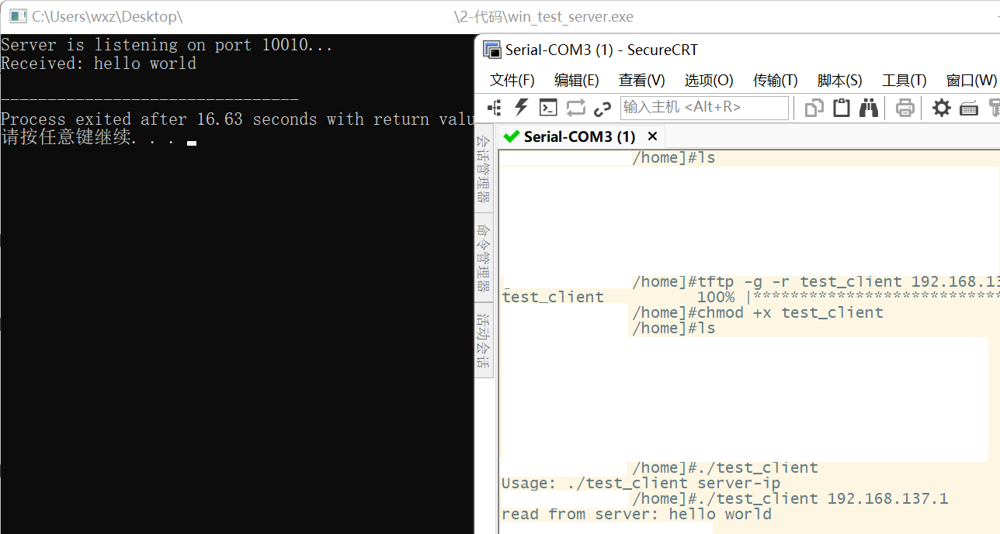

# 7.【实战】利用win作服务器主机与开发板通信

之前我已经完成了用 WSL 替代虚拟机来进行开发板学习的相关工作，但还剩下最后一步。此前我编写了一段代码，用于在 Linux 平台上作为服务器与开发板进行通信。现在由于改用了 WSL，而为 WSL 配置桥接网络较为麻烦，又不想重新启动虚拟机软件，因此最便捷的解决方案就是将原本运行在 Linux 上的代码移植到 Windows 平台上。这样一来，不仅可以避免配置 WSL 网络模式的麻烦，还能在代码移植过程中学习一点跨平台开发的方法。

## 原始服务器代码

```c
#include <stdio.h>
#include <stdlib.h>
#include <sys/socket.h>
#include <netinet/in.h>
#include <arpa/inet.h>
#include <strings.h>
#include <unistd.h>
#include <string.h>

int main(int argc, char const *argv[]){
    // 创建通信节点, 创建流式套接字
    int sockfd = socket(AF_INET, SOCK_STREAM, 0);
    if (sockfd == -1){
        perror("socket error");
        exit(1);
    }

    // 绑定通信地址
    struct sockaddr_in addr;
    bzero(&addr, sizeof(addr)); // 把结构清零
    addr.sin_family = AF_INET; // 表示使用ipv4
    addr.sin_port = htons(10010); // 设置端口号，网络字节序
    addr.sin_addr.s_addr = inet_addr("192.168.137.1");

    int r = bind(sockfd, (struct sockaddr*)&addr, sizeof(addr));
    if (r == -1){
        perror("bind error");
        exit(1);
    }

    // 监听，监听完成后，sockfd称为监听套接字，只能用来接收连接，不能用来通信。
    r = listen(sockfd, 10);
    if (r == -1){
        perror("listen error");
        exit(1);
    }

    int confd = accept(sockfd, NULL, NULL);
    if (confd == -1){
        perror("accept error");
        exit(1);
    }

    //    接收客户端发来的数据
    char buf[200] = {0};
    read(confd, buf, sizeof(buf));
    write(confd, buf, sizeof(buf));
    
    usleep(100000);
    close(confd);    
    close(sockfd);    
    return 0;
}
```

## 更改后服务器代码

```
#include <stdio.h>
#include <stdlib.h>
#include <winsock2.h>  // Windows socket 头文件
#include <ws2tcpip.h>  // 提供 inet_pton 等功能

#pragma comment(lib, "ws2_32.lib")  // 链接 Winsock 库

int main(int argc, char const *argv[]) {
    // 初始化 Winsock
    WSADATA wsaData;
    int result = WSAStartup(MAKEWORD(2, 2), &wsaData);
    if (result != 0) {
        printf("WSAStartup failed: %d\n", result);
        return 1;
    }

    // 创建套接字
    SOCKET sockfd = socket(AF_INET, SOCK_STREAM, IPPROTO_TCP);
    if (sockfd == INVALID_SOCKET) {
        printf("Socket creation failed: %ld\n", WSAGetLastError());
        WSACleanup();
        return 1;
    }

    // 绑定地址和端口
    struct sockaddr_in addr;
    ZeroMemory(&addr, sizeof(addr));
    addr.sin_family = AF_INET;
    addr.sin_port = htons(10010);            // 设置端口
    addr.sin_addr.s_addr = INADDR_ANY;       // 接受任意 IP 地址连接

    if (bind(sockfd, (struct sockaddr*)&addr, sizeof(addr)) == SOCKET_ERROR) {
        printf("Bind failed: %ld\n", WSAGetLastError());
        closesocket(sockfd);
        WSACleanup();
        return 1;
    }

    // 监听连接
    if (listen(sockfd, 10) == SOCKET_ERROR) {
        printf("Listen failed: %ld\n", WSAGetLastError());
        closesocket(sockfd);
        WSACleanup();
        return 1;
    }
    printf("Server is listening on port 10010...\n");

    // 接收客户端连接
    SOCKET confd = accept(sockfd, NULL, NULL);
    if (confd == INVALID_SOCKET) {
        printf("Accept failed: %ld\n", WSAGetLastError());
        closesocket(sockfd);
        WSACleanup();
        return 1;
    }

    // 接收数据
    char buf[200] = {0};
    int bytesReceived = recv(confd, buf, sizeof(buf), 0);
    if (bytesReceived > 0) {
        printf("Received: %s\n", buf);

        // 回传数据给客户端
        send(confd, buf, bytesReceived, 0);
    } else if (bytesReceived == 0) {
        printf("Client disconnected.\n");
    } else {
        printf("recv failed: %ld\n", WSAGetLastError());
    }

    // 关闭连接
    Sleep(100);  // 替代 usleep，在 windows 中用 Sleep(ms)
    closesocket(confd);
    closesocket(sockfd);
    WSACleanup();

    return 0;
}
```

## 服务器编译指令

```
# 在vsCode中新开一个终端（选择PowerShell）
gcc tcp_server.c -o tcp_server.exe -lws2_32 -static-libgcc -static-libstdc++
# 需要配置好MinGW-w64
# MinGW-w64大致配置步骤就是下载解压添加到环境
# 和arm-linux-gcc配置差不多
```

## 客户端代码

```
#include <stdio.h>
#include <stdlib.h>
#include <sys/socket.h>
#include <netinet/in.h>
#include <arpa/inet.h>
#include <strings.h>
#include <unistd.h>
#include <string.h>

int main(int argc, char const *argv[]){
    if (argc != 2){
        fprintf(stderr, "Usage: %s server-ip \n", argv[0]);
        exit(1);
    }
    // 创建套接字
    int confd = socket(AF_INET, SOCK_STREAM, 0);
    if (confd == -1){
        perror("socket error");
        exit(1);
    }
    // 连接服务端
    // 先准备服务端的通信地址
    struct sockaddr_in addr;
    bzero(&addr, sizeof(addr)); // 把结构清零
    addr.sin_family = AF_INET; // 表示使用ipv4
    addr.sin_port = htons(10010); // 设置端口号，网络字节序
    addr.sin_addr.s_addr = inet_addr(argv[1]); // 设置IP地址，把点分十进制形式的IP转成网络字节序形式的整数
    // 再连接
    int r = connect(confd, (struct sockaddr*)&addr, sizeof(addr));
    if (r == -1){
        perror("connect error");
        exit(10);
    }

    //    连接成功，给服务器发消息
    const char* msg = "hello world";
    write(confd, msg, strlen(msg));
    
    char buf[100] = {0};
    read(confd, buf, sizeof(buf));
    printf("read from server: %s \n", buf);
    
    close(confd);    
    return 0;
}
```

## 客户端编译指令

```
# 在vsCode中新开一个终端（选择wsl）
arm-linux-gcc tcp_client.c -o client
```

把客户端传输到开发板（tftp传输）

## 主机运行

```
# 启动好tftpd64
# wsl 终端中
cp client /mnt/d/tftpboot #这是我设置的tftp文件夹，根据实际情况来
# powershell 终端中
.\tcp_server.exe
```

## 开发板运行

```
tftp -g -r client <实际网线IP>
chmod +x client
./client <服务器IP>
```

## 运行成功!



## 跨平台代码编写

通过条件编译实现跨平台适配

```c
#include <stdio.h>
#include <stdlib.h>
#include <string.h>

// 平台检测宏
#ifdef _WIN32
    #define PLATFORM_WINDOWS 1
    #include <winsock2.h>
    #include <ws2tcpip.h>
    #pragma comment(lib, "ws2_32.lib")
#else
    #define PLATFORM_LINUX 1
    #include <sys/socket.h>
    #include <netinet/in.h>
    #include <arpa/inet.h>
    #include <strings.h>
    #include <unistd.h>
#endif

// 统一套接字类型
#ifdef PLATFORM_WINDOWS
    typedef SOCKET SOCKET_TYPE;
    #define INVALID_SOCKET_VAL INVALID_SOCKET
#else
    typedef int SOCKET_TYPE;
    #define INVALID_SOCKET_VAL (-1)
#endif

// 统一关闭套接字操作
#ifdef PLATFORM_WINDOWS
    #define CLOSE_SOCKET(s) closesocket(s)
#else
    #define CLOSE_SOCKET(s) close(s)
#endif

// 统一休眠函数（毫秒）
#ifdef PLATFORM_WINDOWS
    #define SLEEP_MS(ms) Sleep(ms)
#else
    #define SLEEP_MS(ms) usleep((ms) * 1000)
#endif

// 统一错误处理
#ifdef PLATFORM_WINDOWS
    #define PRINT_ERROR(msg) printf("%s failed: %ld\n", msg, WSAGetLastError())
#else
    #define PRINT_ERROR(msg) perror(msg)
#endif

int main(int argc, char const *argv[]) {
    // Windows需要Winsock初始化
    #ifdef PLATFORM_WINDOWS
        WSADATA wsaData;
        int result = WSAStartup(MAKEWORD(2, 2), &wsaData);
        if (result != 0) {
            printf("WSAStartup failed: %d\n", result);
            return 1;
        }
    #endif

    // 创建套接字
    SOCKET_TYPE sockfd = socket(AF_INET, SOCK_STREAM, 0);
    #ifdef PLATFORM_WINDOWS
        if (sockfd == INVALID_SOCKET) {
    #else
        if (sockfd == -1) {
    #endif
        PRINT_ERROR("socket");
        #ifdef PLATFORM_WINDOWS
            WSACleanup();
        #endif
        exit(1);
    }

    // 绑定地址和端口
    struct sockaddr_in addr;
    #ifdef PLATFORM_WINDOWS
        ZeroMemory(&addr, sizeof(addr));
    #else
        bzero(&addr, sizeof(addr));
    #endif
    
    addr.sin_family = AF_INET;
    addr.sin_port = htons(10010);
    // addr.sin_addr.s_addr = inet_addr("192.168.137.1");
    #ifdef PLATFORM_WINDOWS
        addr.sin_addr.s_addr = INADDR_ANY;
    #else
        addr.sin_addr.s_addr = htonl(INADDR_ANY);
    #endif

    #ifdef PLATFORM_WINDOWS
        if (bind(sockfd, (struct sockaddr*)&addr, sizeof(addr)) == SOCKET_ERROR) {
    #else
        if (bind(sockfd, (struct sockaddr*)&addr, sizeof(addr)) == -1) {
    #endif
        PRINT_ERROR("bind");
        CLOSE_SOCKET(sockfd);
        #ifdef PLATFORM_WINDOWS
            WSACleanup();
        #endif
        exit(1);
    }

    // 监听连接
    #ifdef PLATFORM_WINDOWS
        if (listen(sockfd, 10) == SOCKET_ERROR) {
    #else
        if (listen(sockfd, 10) == -1) {
    #endif
        PRINT_ERROR("listen");
        CLOSE_SOCKET(sockfd);
        #ifdef PLATFORM_WINDOWS
            WSACleanup();
        #endif
        exit(1);
    }

    printf("Server is listening on port 10010...\n");

    // 接受客户端连接
    SOCKET_TYPE confd = accept(sockfd, NULL, NULL);
    #ifdef PLATFORM_WINDOWS
        if (confd == INVALID_SOCKET) {
    #else
        if (confd == -1) {
    #endif
        PRINT_ERROR("accept");
        CLOSE_SOCKET(sockfd);
        #ifdef PLATFORM_WINDOWS
            WSACleanup();
        #endif
        exit(1);
    }

    // 接收和回传数据
    char buf[200] = {0};
    #ifdef PLATFORM_WINDOWS
        int bytesReceived = recv(confd, buf, sizeof(buf), 0);
        if (bytesReceived > 0) {
            send(confd, buf, bytesReceived, 0);
        } else if (bytesReceived == 0) {
            printf("Client disconnected.\n");
        } else {
            PRINT_ERROR("recv");
        }
    #else
        if (read(confd, buf, sizeof(buf)) > 0) {
            write(confd, buf, sizeof(buf));
        }
    #endif

    // 关闭连接前短暂休眠
    SLEEP_MS(100);  // 100毫秒
    
    CLOSE_SOCKET(confd);
    CLOSE_SOCKET(sockfd);
    
    #ifdef PLATFORM_WINDOWS
        WSACleanup();
    #endif

    return 0;
}
```

关于`_MSC_VER` 和 `_WIN32` 两个常用的预处理器宏

-   _MSC_VER

```
定义场景
由 Windows SDK 或编译器（如 MSVC、MinGW）自动定义，只要目标平台是 Windows 系统（无论 32/64 位）就会存在。
核心作用
用于区分操作系统环境，常见于跨平台代码中隔离 Windows 专属逻辑（如 API 调用、路径分隔符处理）
注意事项
在 64 位 Windows 中，_WIN32 仍会被定义，同时 _WIN64 用于标识 64 位环境。
```

-   _WIN32

```
定义场景
仅由 Microsoft Visual C++ 编译器（MSVC）定义，其他编译器（如 GCC、Clang）不会定义此宏。
核心作用
标识 MSVC 编译器的版本号，用于处理编译器特性差异或兼容性问题（如新版本支持的 C++ 标准、废弃的 API）
```

**总结**

-  **`_WIN32`**：检测**操作系统环境**（所有Windows平台均定义）  
- **`_MSC_VER`**：检测**编译器类型**（仅MSVC编译器定义）  

备选标题：
Windows服务器实战：开发板通信与跨平台代码迁移
嵌入式通信开发：Windows平台服务器搭建指南
从Linux到Windows：开发板通信的跨平台实现
Socket编程实战：Windows主机与开发板数据互通
Linux服务器迁移Windows实战：WSL环境下的Socket通信改造
告别虚拟机：Windows原生运行Linux服务器代码指南
WSL赋能开发：Linux Socket服务器到Windows的代码迁移术
跨平台通信开发实战：Windows主机与开发板直连方案
极简迁移术：Linux C代码在Windows平台的编译与运行​