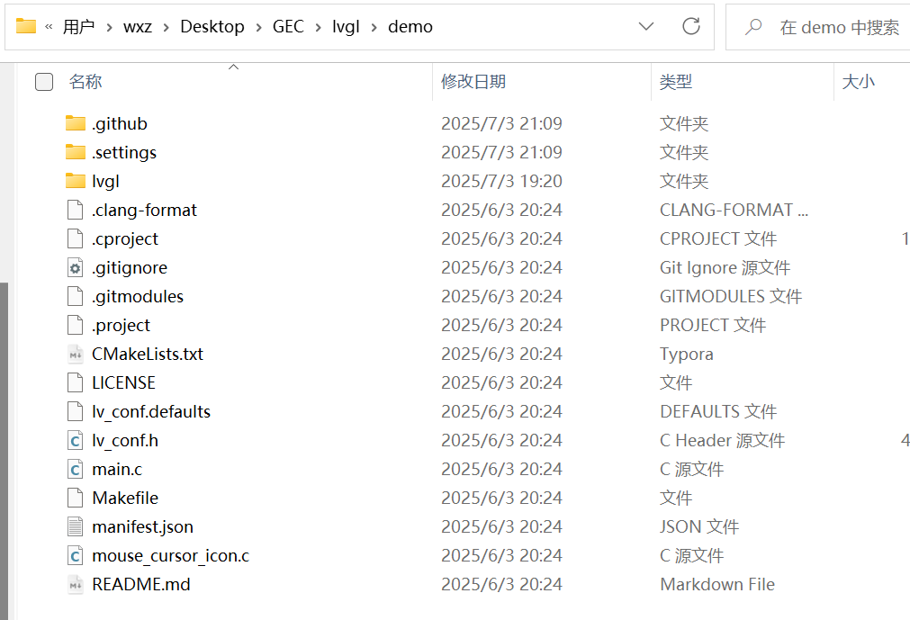
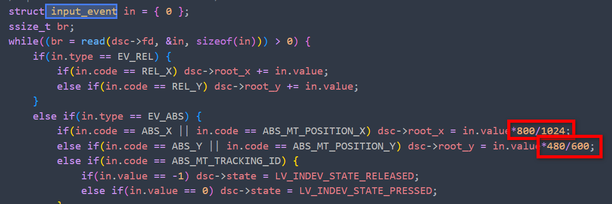
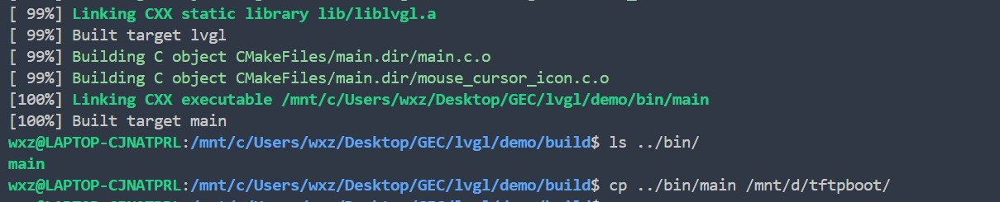

# 8.【实战】从零开始移植lvgl

## 下载源码

首先获取GitHub下载脚本（实际上是镜像下载链接）
[Github 增强 - 高速下载 (greasyfork.org)](https://greasyfork.org/zh-CN/scripts/412245-github-enhancement-high-speed-download)

然后下载下面两个仓库

**仓库一：**[lvgl/lvgl: Embedded graphics library to create beautiful UIs for any MCU, MPU and display type. (github.com)](https://github.com/lvgl/lvgl)---包含了LVGL图形界面控件源码、驱动接口源代码以及例程

**仓库二：**【不要下载这个，点击分支选择对应版本分支源码】[lvgl/lv_port_linux: LVGL configured to work with a standard Linux framebuffer (github.com)](https://github.com/lvgl/lv_port_linux)---适配有frame buffer的linux系统的接口

​	**正确的分支**【当前使用的是9.3】：[lvgl/lv_port_linux at release/v9.3 (github.com)](https://github.com/lvgl/lv_port_linux/tree/release/v9.3)

若网络访问受限，下面提供备用链接：
[lvgl-master.zip - 蓝奏云 (lanzoue.com)](https://wwae.lanzoue.com/itEfj30ec70h)

[lv_port_linux-release-v9.3.zip - 蓝奏云 (lanzoue.com)](https://wwae.lanzoue.com/iefym30ebzji)

## 项目结构

创建一个demo 文件夹（作为项目根目录）
解压 `lvgl-master.zip` 并重命名为 `lvgl`   ，放入`demo`文件夹。
将 `lv_port_linux-release-v9.3.zip` 内所有文件解压至 `demo` 目录



​										**最后项目结构**

## 修改源码内容

### CMakeList.txt

直接替换即可

```
cmake_minimum_required(VERSION 3.10)
# 设置交叉编译
set(CMAKE_SYSTEM_NAME Linux)
set(CMAKE_SYSTEM_PROCESSOR arm)
# 这里指定的路径必须是绝对路径
set(CMAKE_C_COMPILER /usr/local/arm/5.4.0/usr/bin/arm-linux-gcc)
set(CMAKE_CXX_COMPILER /usr/local/arm/5.4.0/usr/bin/arm-linux-g++)

project(lvgl)

set(CMAKE_C_STANDARD 99)#C99 # lvgl officially support C99 and above
set(CMAKE_CXX_STANDARD 17)#C17
set(CMAKE_CXX_STANDARD_REQUIRED ON)

set(EXECUTABLE_OUTPUT_PATH ${PROJECT_SOURCE_DIR}/bin)

add_subdirectory(lvgl)
target_include_directories(lvgl PUBLIC ${PROJECT_SOURCE_DIR})

add_executable(main main.c mouse_cursor_icon.c)

# 注释掉下面两行，如果要使用DRM驱动，则需要放开这行
# include(${CMAKE_CURRENT_LIST_DIR}/lvgl/tests/FindLibDRM.cmake)
# include_directories(${Libdrm_INCLUDE_DIRS})

# 注释掉下面三个，这个是在PC端使用的
# find_package(SDL2)
# find_package(SDL2_image)
# include_directories(${SDL2_INCLUDE_DIRS} ${SDL2_IMAGE_INCLUDE_DIRS})

target_link_libraries(main lvgl lvgl::examples lvgl::demos lvgl::thorvg ${SDL2_LIBRARIES} ${SDL2_IMAGE_LIBRARIES} ${Libdrm_LIBRARIES} m pthread)
add_custom_target (run COMMAND ${EXECUTABLE_OUTPUT_PATH}/main DEPENDS main)
```

### lv_conf.h

```
// 根据你屏幕的选择合适的色深（默认32位，不用改）
#define LV_COLOR_DEPTH 32
// 14毫秒刷新一次
#define LV_DEF_REFR_PERIOD  14 
// 关闭调试检测以提升性能（默认开启会显著增加资源消耗）
#define LV_USE_ASSERT_STYLE         0
#define LV_USE_ASSERT_MEM_INTEGRITY 0
#define LV_USE_ASSERT_OBJ           0
// 对象样式缓存默认1，这里设置20
#define LV_OBJ_STYLE_CACHE      20
// 系统监控（默认关闭，不用改）
#define LV_USE_SYSMON   0
#define LV_USE_PERF_MONITOR 0
#define LV_USE_MEM_MONITOR 0
// 开启framebuffer，确保这一项是开启的，
// 如果要使用DRM驱动，请配置LV_USE_LINUX_DRM 1
// （默认开启framebuffer，不用改）
#define LV_USE_LINUX_FBDEV      1
// 开启输入设备驱动，这项默认是关闭的
#define LV_USE_EVDEV    1
```

### main.c

```
// 在main.c里lv_linux_disp_init();下添加下面这条
lv_indev_t * indev = lv_evdev_create(LV_INDEV_TYPE_POINTER, "/dev/input/event0");
// Crrl+左键lv_evdev_create 函数中跳转到lv_evdev.c文件，搜索函数lv_indev_set_read_cb ，再通过它的第2形参 _evdev_read 回调函数跳转到read函数。将触摸屏坐标进行校准。

// 【注意，LVGL v9.3 已内置自动坐标校准，无需手动调整 `_evdev_read` 回调函数】
// 【注意，LVGL v9.3 已内置自动坐标校准，无需手动调整 `_evdev_read` 回调函数】
```



## 编译运行

```
先切换到 demo/下面去 ：
mkdir build
cd build 
cmake ..
make -j
```




利用tftp传输文件到开发板上运行


备用标题

【实战】LVGL 最新(9.3)移植指南：嵌入式Linux帧缓冲环境配置与开发板部署
嵌入式GUI实战：从零构建LVGL Linux运行环境（v9.3+ARM交叉编译）
LVGL移植避坑指南：Linux帧缓冲驱动与触摸输入适配实战
轻量级GUI移植实战：LVGL 9.3在嵌入式Linux的部署与优化