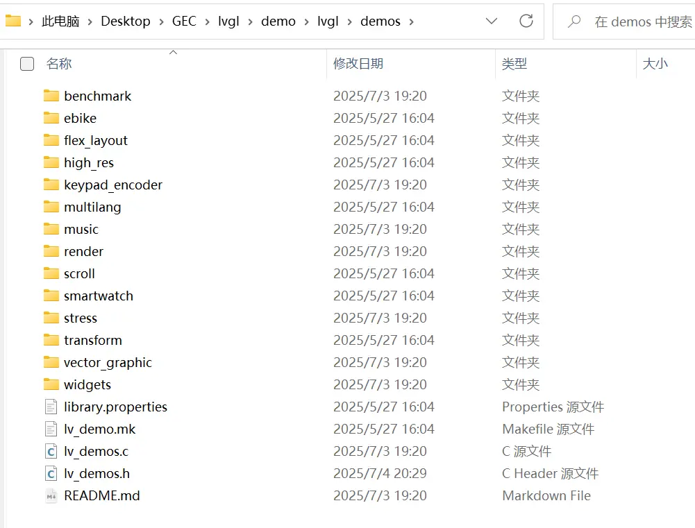

# 9.【拓展】lvgl官方demo演示

## 9.1 main.c 解析

```
// 头文件引入
#include "lvgl/lvgl.h"           // LVGL核心库
#include "lvgl/demos/lv_demos.h" // LVGL官方示例（后续不需要demo可以去掉）
#include <unistd.h>              // 系统调用（如usleep）
#include <pthread.h>             // 线程支持
#include <time.h>                // 时间函数
#include <stdio.h>               // 标准输入输出
#include <stdlib.h>              // 标准库（如atoi, getenv）

// 安全获取环境变量（如显示设备路径或窗口尺寸），避免空指针错误
static const char *getenv_default(const char *name, const char *dflt)
{
    return getenv(name) ? : dflt;// 获取环境变量，不存在则返回默认值
}

// 显示设备初始化（条件编译）
// 因为lv_conf.h中已经设置LV_USE_LINUX_FBDEV为1，所以这里只会编译第一块
#if LV_USE_LINUX_FBDEV
static void lv_linux_disp_init(void)
{
    const char *device = getenv_default("LV_LINUX_FBDEV_DEVICE", "/dev/fb0");
    lv_display_t * disp = lv_linux_fbdev_create();

    lv_linux_fbdev_set_file(disp, device);
}
#elif LV_USE_LINUX_DRM
static void lv_linux_disp_init(void)
{
    const char *device = getenv_default("LV_LINUX_DRM_CARD", "/dev/dri/card0");
    lv_display_t * disp = lv_linux_drm_create();

    lv_linux_drm_set_file(disp, device, -1);
}
#elif LV_USE_SDL
static void lv_linux_disp_init(void)
{
    const int width = atoi(getenv("LV_SDL_VIDEO_WIDTH") ? : "800");
    const int height = atoi(getenv("LV_SDL_VIDEO_HEIGHT") ? : "480");

    lv_sdl_window_create(width, height);
}
#else
#error Unsupported configuration
#endif

int main(void)
{
    lv_init(); // 初始化LVGL库（内存管理、定时器等）
    
    /*Linux display device init*/
    // 显示设备初始化
    lv_linux_disp_init();
    // 输入设备初始化
    lv_indev_t * indev = lv_evdev_create(LV_INDEV_TYPE_POINTER, "/dev/input/event0");
    /*Create a Demo*/
    // 加载官方控件示例
    lv_demo_widgets();
    // 启动自动幻灯片演示，注释掉以取消滚动
    //lv_demo_widgets_start_slideshow();

    /*Handle LVGL tasks*/
    // 主事件循环
    while(1) {
   		lv_timer_handler(); // 处理LVGL任务（渲染、输入、动画）
    	usleep(5000);       // 休眠5ms（约200Hz刷新率）
	}
    return 0;
}

```

## 9.2 运行音乐播放器

lv_conf.h中V_USE_DEMO_MUSIC默认设为1，不用更改，但是可以更改一些参数
【谨慎修改，修改lv_conf.h会导致需要重新编译lvgl】
【横屏显示器启用其他布局效果不明显】

```
** Music player demo */
    #define LV_USE_DEMO_MUSIC 1
    #if LV_USE_DEMO_MUSIC
        #define LV_DEMO_MUSIC_SQUARE    0  // 启用方形布局
        #define LV_DEMO_MUSIC_LANDSCAPE 0  // 启用横向布局
        #define LV_DEMO_MUSIC_ROUND     0  // 启用圆形布局
        #define LV_DEMO_MUSIC_LARGE     0  // 启用大屏布局
        // 默认使用横向布局，
        #define LV_DEMO_MUSIC_AUTO_PLAY 0  // 禁用自动播放
    #endif
```

修改main.c 中 / * Create a Demo* / 区块

```
/*Create a Demo*/
    //lv_demo_widgets();
    //lv_demo_widgets_start_slideshow();
    lv_demo_music();
```

## 9.3 性能基准测试

lv_conf.h

```
/** Benchmark your system */
    #define LV_USE_DEMO_BENCHMARK 1  // 启用Benchmark Demo

    #if LV_USE_DEMO_BENCHMARK
        /** Use fonts where bitmaps are aligned 16 byte and has Nx16 byte stride */
        #define LV_DEMO_BENCHMARK_ALIGNED_FONTS 0  // 默认禁用字体对齐优化
    #endif
```

main.c

```
lv_demo_benchmark();  //（测量渲染效率）
```

## 9.4 压力测试

lv_conf.h

```
 /** Stress test for LVGL */
    #define LV_USE_DEMO_STRESS 1
```

main.c

```
lv_demo_stress();     //（创建大量对象检验稳定性）
```

## 9.5 键盘/编码器控制演示

lv_conf.h

```
/** Demonstrate usage of encoder and keyboard. */
    #define LV_USE_DEMO_KEYPAD_AND_ENCODER 1
```

main.c

```
lv_demo_keypad_and_encoder(); // （非触控设备）
```

## 9.6 原始渲染测试

lv_conf.h

```
/** Render test for each primitive.
     *  - Requires at least 480x272 display. */
    #define LV_USE_DEMO_RENDER 1
```

main.c

```

```

## 9.7 矢量图形演示

lv_conf.h

```
/** Vector graphic demo */
// 默认禁用
    #define LV_USE_DEMO_VECTOR_GRAPHIC  0
```

main.c

```

```

## 9.8 其他高级demo

**注：高级demo需要下载另一个仓库：**
仓库地址：[lvgl/lv_demos: Examples, tutorials and applications for the LVGL embedded GUI library (github.com)](https://github.com/lvgl/lv_demos)

【不要下载归档，归档已经很久没更新了，请直接下载源码】

备用链接：[lv_demos-master.zip - 蓝奏云 (lanzoue.com)](https://wwae.lanzoue.com/icVKf30ecgpg)

把解压后的src文件夹里的内容放入lvgl/demos

demo整合后的目录结构：



整合一下`lv_demos.h`

```c
# 在lv_demos.h添加

#if LV_USE_DEMO_FLEX_LAYOUT
#include "flex_layout/lv_demo_flex_layout.h"
#endif

#if LV_USE_DEMO_TRANSFORM
#include "transform/lv_demo_transform.h"
#endif

#if LV_USE_DEMO_SCROLL
#include "scroll/lv_demo_scroll.h"
#endif

#if LV_USE_DEMO_MULTILANG
#include "multilang/lv_demo_multilang.h"
#endif

// 需要把LV_USE_BIDI 和LV_USE_ARABIC_PERSIAN_CHARS 置为1
#if LV_USE_DEMO_EBIKE
#include "ebike/lv_demo_ebike.h"
#endif

#if LV_USE_DEMO_HIGH_RES
#include "high_res/lv_demo_high_res.h"
#endif

// LV_USE_DEMO_HIGH_RES还要启用下面几项：
#define LV_FONT_FMT_TXT_LARGE 1
/** Setting a default driver letter allows skipping the driver prefix in filepaths.
 *  Documentation about how to use the below driver-identifier letters can be found at
 *  https://docs.lvgl.io/master/details/main-modules/fs.html#lv-fs-identifier-letters . */
#define LV_FS_DEFAULT_DRIVER_LETTER 'A'

/** API for fopen, fread, etc. */
#define LV_USE_FS_STDIO 0
#if LV_USE_FS_STDIO
    #define LV_FS_STDIO_LETTER 'A'
    #define LV_FS_STDIO_PATH ""         /**< Set the working directory. File/directory paths will be appended to it. */
    #define LV_FS_STDIO_CACHE_SIZE 0    /**< >0 to cache this number of bytes in lv_fs_read() */
#endif

/** API for open, read, etc. */
#define LV_USE_FS_POSIX 1
#if LV_USE_FS_POSIX
    #define LV_FS_POSIX_LETTER 'A'     /*Set an upper cased letter on which the drive will accessible (e.g. 'A')*/
    #define LV_FS_POSIX_PATH ""         /*Set the working directory. File/directory paths will be appended to it.*/
    #define LV_FS_POSIX_CACHE_SIZE 0    /*>0 to cache this number of bytes in lv_fs_read()*/
#endif

//【后续使用模拟器时，还要修改源码lvgl\src\libs\fsdrv\lv_fs_posix.c，现在不用改】
/*添加#include <sys/stat.h>
注释掉
static lv_fs_res_t fs_dir_read(lv_fs_drv_t * drv, void * dir_p, char * fn, uint32_t fn_len)
{
    LV_UNUSED(drv);
    if(fn_len == 0) return LV_FS_RES_INV_PARAM;

    struct dirent * entry;
    do {
        entry = readdir(dir_p);
        if(entry) {
            if(entry->d_type == DT_DIR) lv_snprintf(fn, fn_len, "/%s", entry->d_name);
            else lv_strlcpy(fn, entry->d_name, fn_len);
        }
        else {
            lv_strlcpy(fn, "", fn_len);
        }
    } while(lv_strcmp(fn, "/.") == 0 || lv_strcmp(fn, "/..") == 0);

    return LV_FS_RES_OK;
}
修改为：
static lv_fs_res_t fs_dir_read(lv_fs_drv_t * drv, void * dir_p, char * fn, uint32_t fn_len)
{
    LV_UNUSED(drv);
    if(fn_len == 0) return LV_FS_RES_INV_PARAM;

    struct dirent * entry;
    do {
        entry = readdir(dir_p);
        if(entry) {
            char full_path[PATH_MAX];
            lv_snprintf(full_path, sizeof(full_path), "%s/%s", ((DIR *)dir_p)->dd_name, entry->d_name);

            struct stat st;
            if(stat(full_path, &st) == 0) {
                if(S_ISDIR(st.st_mode)) {
                    lv_snprintf(fn, fn_len, "/%s", entry->d_name);  // Add '/' prefix for directories
                } else {
                    lv_strlcpy(fn, entry->d_name, fn_len);  // No prefix for files
                }
            } else {
                lv_strlcpy(fn, entry->d_name, fn_len);  // Fallback: assume it's a file
            }
        }
        else {
            lv_strlcpy(fn, "", fn_len);
        }
    } while(entry && (lv_strcmp(fn, "/.") == 0 || lv_strcmp(fn, "/..") == 0));

    return LV_FS_RES_OK;
}
*/

/* Smart watch demo */
    #define LV_USE_DEMO_SMARTWATCH      0
```

`lv_conf.h`

```
/*---------------------------
     * Demos from lvgl/lv_demos
      ---------------------------*/
    
    /** Flex layout demo */
    // 弹性布局demo。展示LVGL的Flex布局功能，类似于CSS Flexbox的布局系统
    #define LV_USE_DEMO_FLEX_LAYOUT     1
    
    /** Smart-phone like multi-language demo */
    // 多语言支持demo。展示类似智能手机的多语言切换界面
    #define LV_USE_DEMO_MULTILANG       1
    
    /** Widget transformation demo */
    // 小部件变换demo。展示各种变换效果
    #define LV_USE_DEMO_TRANSFORM       1
    
    /** Demonstrate scroll settings */
    // 滚动设置演示demo。展示LVGL的各种滚动效果和设置
    #define LV_USE_DEMO_SCROLL          1
    
    /*E-bike demo with Lottie animations (if LV_USE_LOTTIE is enabled)*/
    电动自行车仪表盘demo（需要启用LV_USE_LOTTIE）。有纵向和横向两种显示模式
    #define LV_USE_DEMO_EBIKE           0
    #if LV_USE_DEMO_EBIKE
        #define LV_DEMO_EBIKE_PORTRAIT  0    /*0: for 480x270..480x320, 1: for 480x800..720x1280*/
    #endif
    
    /** High-resolution demo */
    高分辨率演示demo。针对高分辨率屏幕优化
    #define LV_USE_DEMO_HIGH_RES        0
    
    /* Smart watch demo */
    智能手表界面demo。模拟智能手表的各种界面和交互
    #define LV_USE_DEMO_SMARTWATCH      0
```

`main.c?`

```
函数接口命名很规范，找规律即可
还是列出吧：

```


备用标题：
LVGL官方Demo全解析：嵌入式GUI开发实战指南
深度解锁LVGL Demo：从音乐播放器到高分辨率渲染
LVGL Demo高效集成术：跨平台部署与性能调优
嵌入式GUI开发利器：LVGL官方Demo配置与高级应用
LVGL官方Demo全解析：从音乐播放器到高分辨率渲染