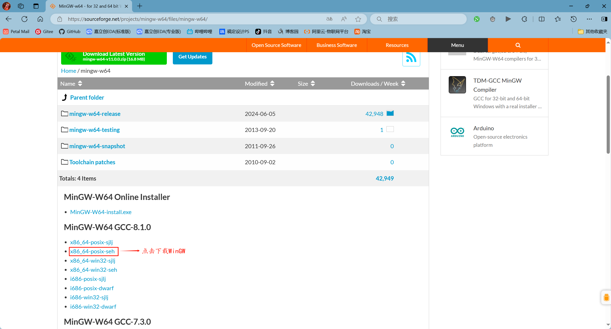
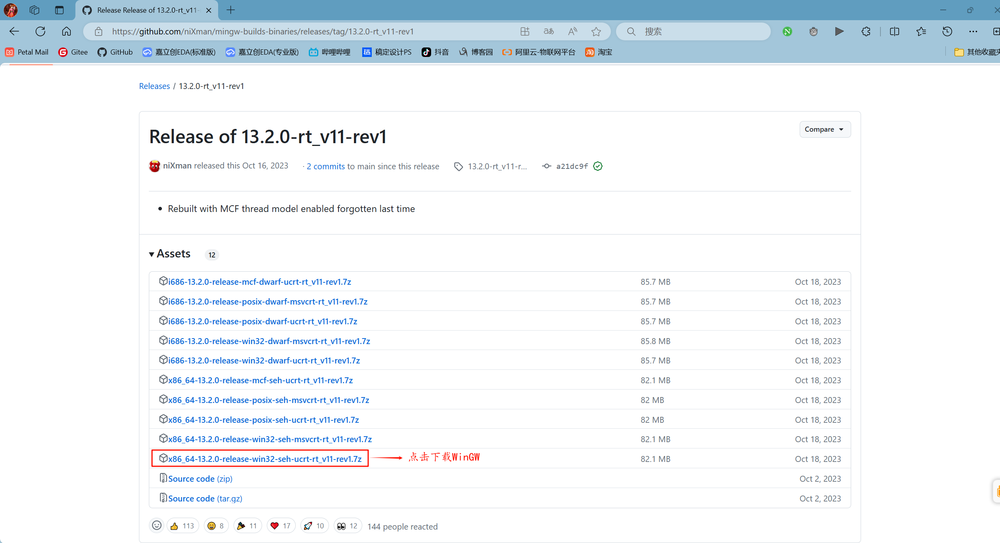
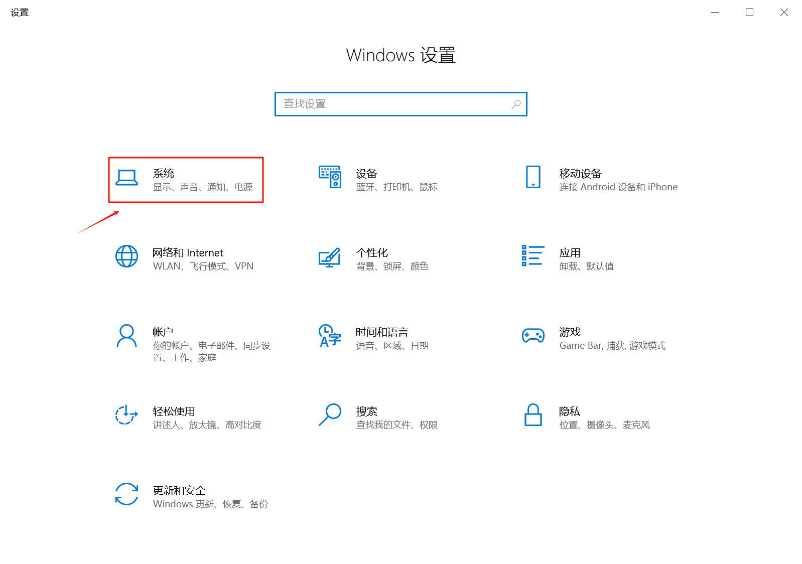
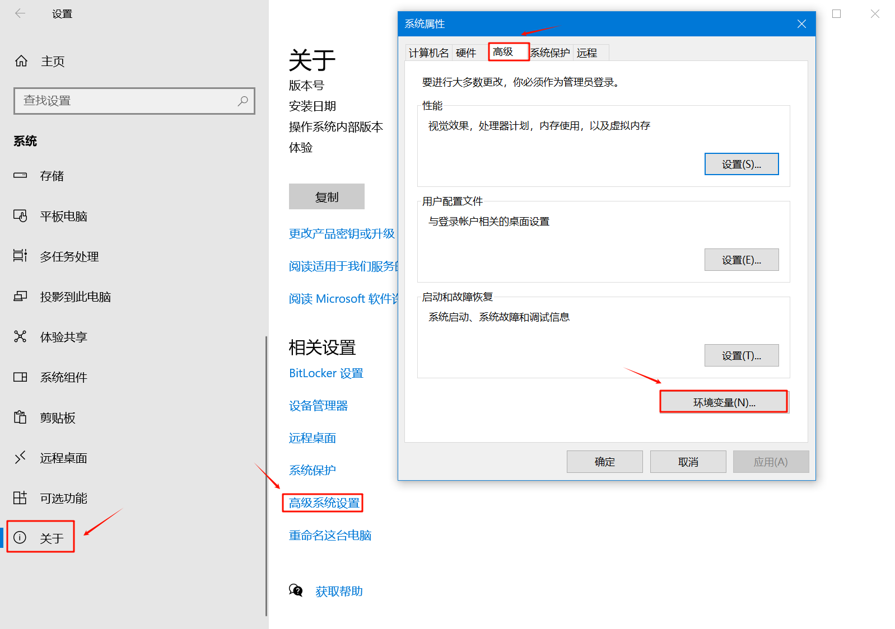
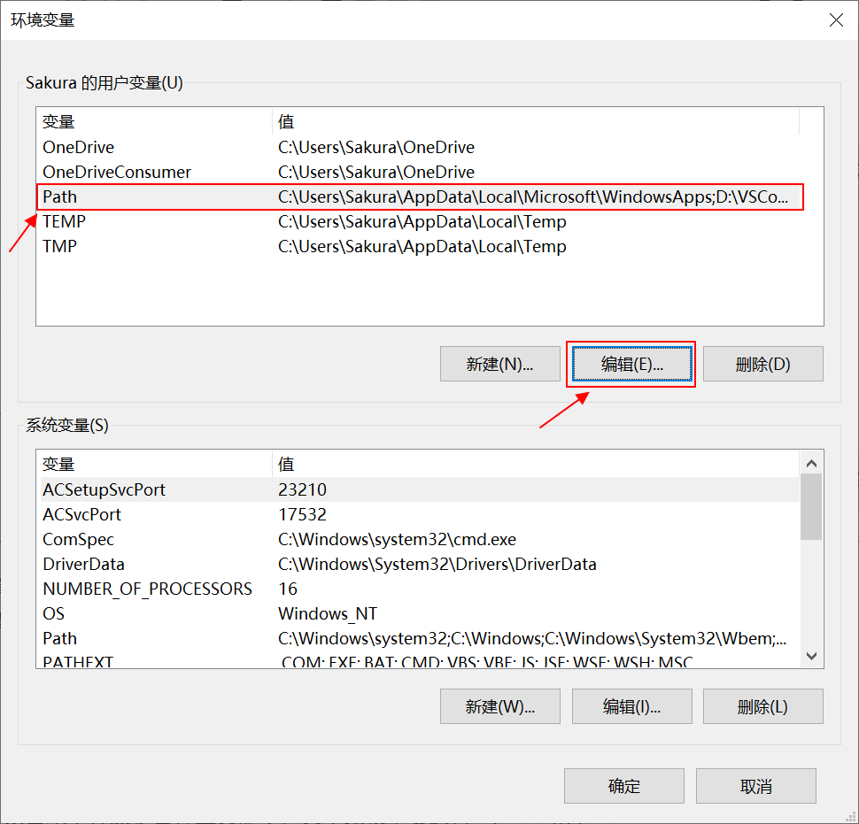
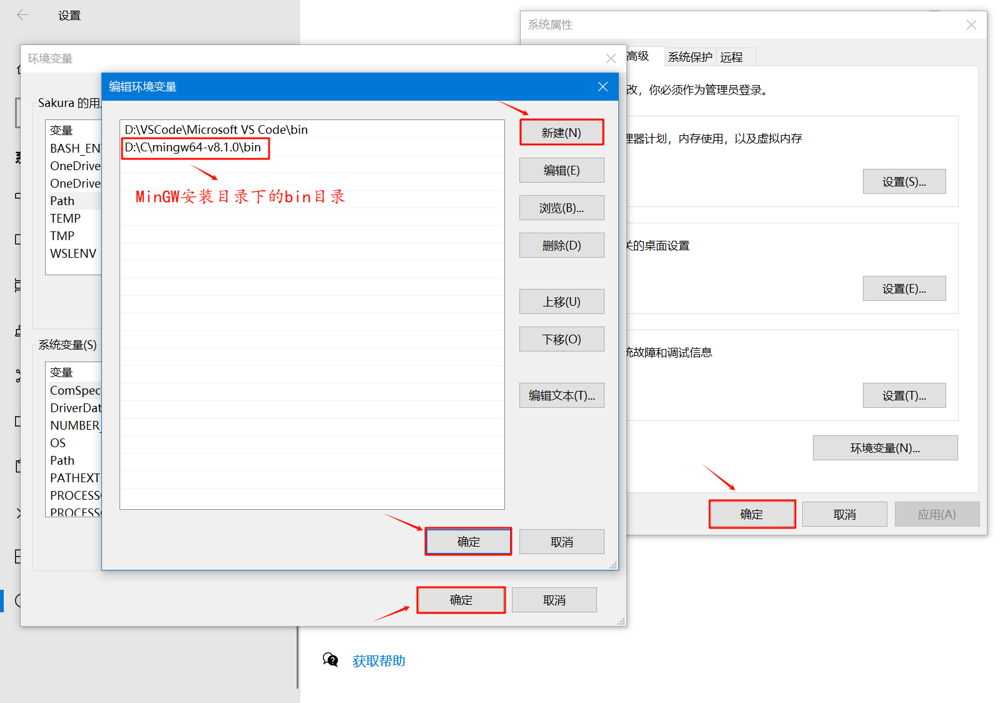
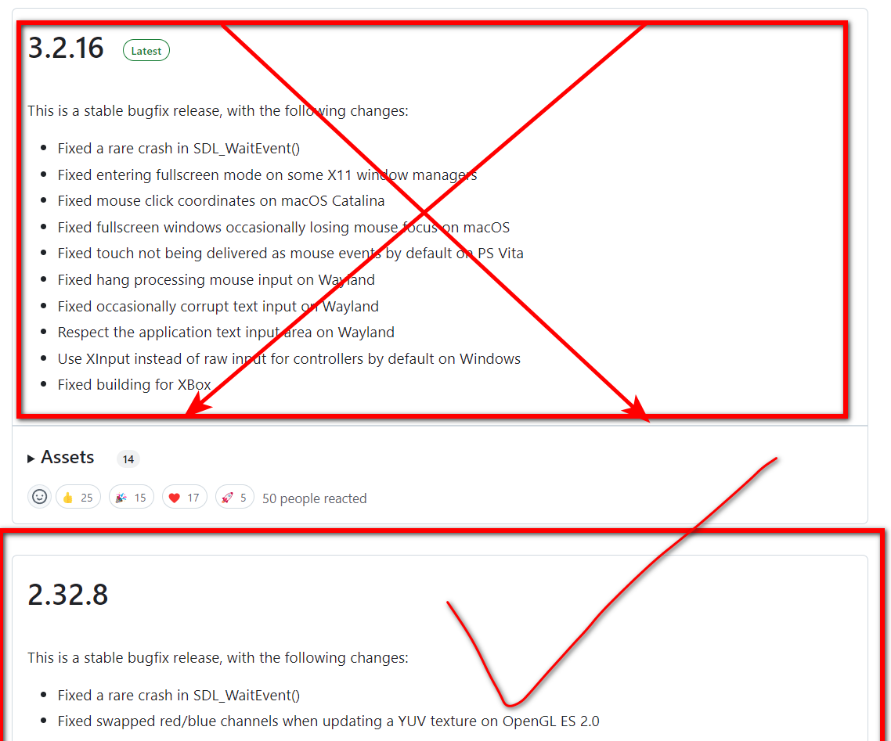
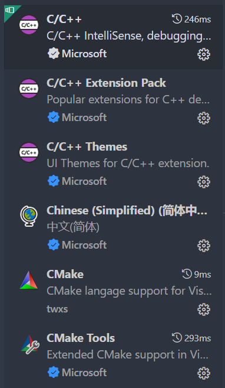
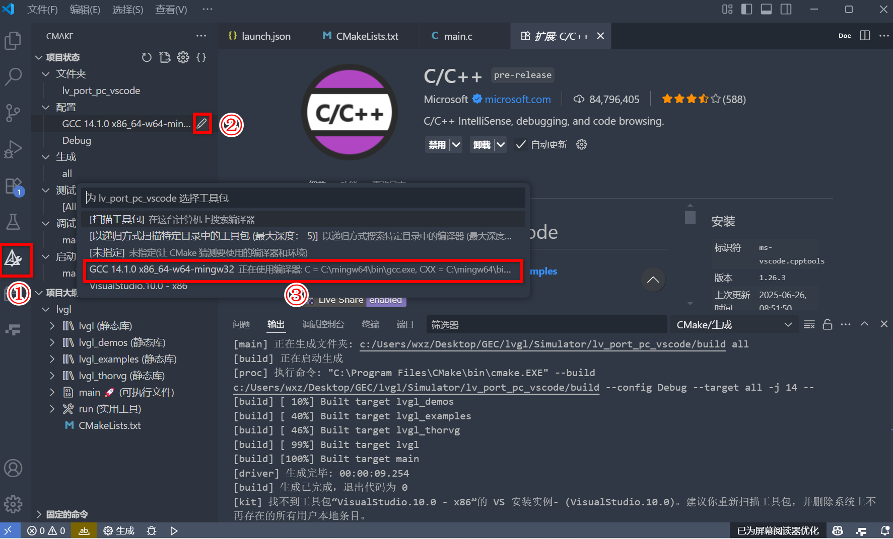
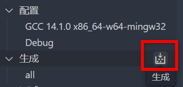

# 10.【实战】使用LVGL Simulator

本章节主要根据[博客园](https://home.cnblogs.com/)的[星光映梦](https://home.cnblogs.com/u/star-light-glimmer)的笔记，不够那个有些过时了，有些步骤不太一样，这里写一下最新步骤

## 1. 下载mingW64

【本小节（10.1）全部来自[02. LVGL模拟器的使用 - 星光映梦 - 博客园 (cnblogs.com)](https://www.cnblogs.com/star-light-glimmer/p/18107149)】

之前第7章节没讲，这里正好说一下

MinGW，是 Minimalist GNU for Windows 的缩写。它是一个可自由使用和自由发布的 Windows 特定头文件和使用 GNU 工具集导入库的集合，允许你在 GNU/Linux 和 Windows 平台生成本地的 Windows 程序而不需要第三方 C 运行时（C Runtime）库。它的下载地址如下：https://sourceforge.net/projects/mingw-w64/files/mingw-w64/ 或 https://github.com/niXman/mingw-builds-binaries/releases。





  下载完后，我们需要把 MinGW 的安装目录下的【bin】目录添加到 Path 环境变量。









## 2. 下载SDL2

官方库：[libsdl-org/SDL: Simple Directmedia Layer (github.com)](https://github.com/libsdl-org/SDL)

【去releases页面下载SDL2version，不要下错成3version了（也许3version也行？）】

备用链接：[SDL2-devel-2.32.8-mingw.zip - 蓝奏云 (lanzoue.com)](https://wwae.lanzoue.com/i5afn30ecqef)



将下载的 SDL2 压缩包解压，并将【cmake】和【x86_64-w64-mingw32】复制到安装 MinGW 的路径下。

## 3. 下载CMake

官方链接：[Kitware/CMake: Mirror of CMake upstream repository (github.com)](https://github.com/Kitware/CMake)

【去releases页面下载[cmake-4.1.0-rc1-windows-x86_64.msi](https://github.com/Kitware/CMake/releases/download/v4.1.0-rc1/cmake-4.1.0-rc1-windows-x86_64.msi)，当然也可以下载非安装版[cmake-4.1.0-rc1-windows-x86_64.zip](https://github.com/Kitware/CMake/releases/download/v4.1.0-rc1/cmake-4.1.0-rc1-windows-x86_64.zip)，不过那就得自己去设置环境变量了】

备用链接：[cmake-4.1.0-rc1-windows-x86_64.msi.zip - 蓝奏云 (lanzoue.com)](https://wwae.lanzoue.com/iHshP30eco4d)

【因平台限制，下载后改后缀为msi再双击运行】

双击下载好的msi文件一直选择确认即可

## 4. 下载库

使用命令下载

```
git clone --recursive https://github.com/lvgl/lv_port_pc_vscode
```

如果网络允许，那么一般来说都不太行，所以……
只要下载好了主仓库和FreeRTOS库就可以了，lvgl库比较大，可能会下载失败。
但是之前已经下好了lvgl库，那么这里使用本地lvgl库就好了

```bash
$ git clone --recursive https://github.com/lvgl/lv_port_pc_vscode
Cloning into 'lv_port_pc_vscode'...
remote: Enumerating objects: 565, done.
remote: Counting objects: 100% (321/321), done.
remote: Compressing objects: 100% (117/117), done.
remote: Total 565 (delta 268), reused 207 (delta 203), pack-reused 244 (from 2)
Receiving objects: 100% (565/565), 178.79 KiB | 304.00 KiB/s, done.
Resolving deltas: 100% (287/287), done.
【到此，说明主仓库克隆完毕】
Submodule 'FreeRTOS' (https://github.com/FreeRTOS/FreeRTOS-Kernel.git) registered for path 'FreeRTOS'
Submodule 'lvgl' (https://github.com/lvgl/lvgl.git) registered for path 'lvgl'
Cloning into '/mnt/c/Users/wxz/Desktop/GEC/lvgl/Simulator/lv_port_pc_vscode/FreeRTOS'...
remote: Enumerating objects: 177188, done.        
remote: Counting objects: 100% (939/939), done.        
remote: Compressing objects: 100% (34/34), done.
remote: Total 177188 (delta 916), reused 905 (delta 905), pack-reused 176249 (from 3)     
Receiving objects: 100% (177188/177188), 120.13 MiB | 329.00 KiB/s, done.
Resolving deltas: 100% (125544/125544), done.
【到此，说明FreeRTOS库克隆完毕】
【下面说明了lvgl库克隆失败】
Cloning into '/mnt/c/Users/wxz/Desktop/GEC/lvgl/Simulator/lv_port_pc_vscode/lvgl'...
remote: Enumerating objects: 125217, done.        
remote: Counting objects: 100% (1120/1120), done.        
remote: Compressing objects: 100% (626/626), done.        
Receiving objects:  13% (16518/125217), 61.20 MiB | 608.00 KiB/s
error: RPC failed; curl 56 Recv failure: Connection reset by peer
error: 4517 bytes of body are still expected
fetch-pack: unexpected disconnect while reading sideband packet
fatal: early EOF
fatal: fetch-pack: invalid index-pack output
fatal: clone of 'https://github.com/lvgl/lvgl.git' into submodule path '/mnt/c/Users/wxz/Desktop/GEC/lvgl/Simulator/lv_port_pc_vscode/lvgl' failed
Failed to clone 'lvgl'. Retry scheduled
Cloning into '/mnt/c/Users/wxz/Desktop/GEC/lvgl/Simulator/lv_port_pc_vscode/lvgl'...
remote: Enumerating objects: 125217, done.        
remote: Counting objects: 100% (1120/1120), done.        
remote: Compressing objects: 100% (626/626), done.        
error: RPC failed; curl 56 Recv failure: Connection reset by peer 
error: 7637 bytes of body are still expected
fetch-pack: unexpected disconnect while reading sideband packet
fatal: early EOF
fatal: fetch-pack: invalid index-pack output
fatal: clone of 'https://github.com/lvgl/lvgl.git' into submodule path '/mnt/c/Users/wxz/Desktop/GEC/lvgl/Simulator/lv_port_pc_vscode/lvgl' failed
Failed to clone 'lvgl' a second time, aborting
```

进入到主仓库

```
cd lv_port_pc_vscode/
```

初始化子仓库

```
git submodule init
```

单独更新FreeRTOS模块

```bash
$ git submodule update --init --depth=1 FreeRTOS
Submodule path 'FreeRTOS': checked out '23cfd114d314b0e2dc5e53a3540b0647fc0a1b5b'
```

确定你的本地lvgl库的位置

```bash
【这是我的本地lvgl库的位置，请自行确定你的lvgl库的位置】
$ ls -a ../../lvgl-master
.                        COPYRIGHTS.md  env_support         lvgl.h
..                       Kconfig        examples            lvgl.mk        
.devcontainer            LICENCE.txt    idf_component.yml   lvgl.pc.in     
.github                  README.md      library.json        lvgl_private.h
.gitignore               SConscript     library.properties  scripts        
.pre-commit-config.yaml  component.mk   libs                src
.typos.toml              configs        lv_conf_template.h  tests
CMakeLists.txt           demos          lv_version.h        xmls
CMakePresets.json        docs           lv_version.h.in     zephyr
```

替换lvgl库

```bash
$ rm -rf .git/modules/lvgl
$ rm -rf lvgl
$ cp -r ../../lvgl-master lvgl
【根据你的本地lvgl库的位置更改文件路径】
$ git config submodule.lvgl.update none
```

【【【手动安装版】】】：
链接①：[lv_port_pc_vscode-master.zip - 蓝奏云 (lanzoue.com)](https://wwae.lanzoue.com/iqIlP30ecova)

链接②：[FreeRTOS-Kernel-23cfd114d314b0e2dc5e53a3540b0647fc0a1b5b (1).zip - 蓝奏云 (lanzoue.com)](https://wwae.lanzoue.com/ideuz30ecoji)

链接③：[lvgl-master.zip - 蓝奏云 (lanzoue.com)](https://wwae.lanzoue.com/itEfj30ec70h)

手动安装：把**①**作为项目根目录，**②**重命名为`FreeRTOS`放入项目根目录，**③**重命名为`lvgl`放入项目根目录


## 5. 安装vsCode插件



## 6. 使用cmake插件编译



然后点击生成



生成没有问题之后，然后在点击运行按钮，但是图形未显示出来，则将下载的 SDL 文件夹下的【x86_64-w64-mingw32】下的【bin】下的 SDL2.dll 库复制到工程文件中的生成的【bin】文件中，即可显示界面。

或者在CMakeLists.txt中增加自动拷贝逻辑

```
if(EXISTS "C:/mingw64/x86_64-w64-mingw32/bin/SDL2.dll")
    add_custom_command(TARGET ${PROJECT_NAME} POST_BUILD
      COMMAND ${CMAKE_COMMAND} -E copy
          "C:/mingw64/x86_64-w64-mingw32/bin/SDL2.dll"
          $<TARGET_FILE_DIR:${PROJECT_NAME}>
    )
else()
  message(WARNING "SDL2.dll not found at expected location: C:/mingw64/x86_64-w64-mingw32/bin/SDL2.dll")
endif()
```

**注：**由于终端默认使用wsl，所以需要手动去bin目录里启动生成的exe文件

## 7. 更改lv_conf.h关闭监测

运行时，后台总是报警告，不想看关闭这四个选项

```
#define LV_USE_ASSERT_STYLE         0
#define LV_USE_ASSERT_MEM_INTEGRITY 0
#define LV_USE_ASSERT_OBJ           0

#define LV_USE_SYSMON   0
```

## 8. 简单修改后的开发板与模拟器的lv_conf.h比较

```
# 只有模拟器有：
/** Draw using espressif PPA accelerator */
#define LV_USE_PPA  0
#if LV_USE_PPA
    #define LV_USE_PPA_IMG 0
#endif
// 控制是否使用 Espressif PPA（Pixel Processing Acceleration） 硬件加速器。
// PPA 是 ESP32-S3 上的一个图形加速模块，可以加速像素操作（如旋转、缩放、颜色格式转换等）。


#define LV_USE_ARCLABEL  1
// 是否启用 ArcLabel（弧形标签）控件。
// ArcLabel 是一个可以在圆弧上显示文本的组件，常用于仪表盘、圆形菜单等 UI 设计中。

/** 1: Enable text translation support */
#define LV_USE_TRANSLATION 0
// 是否启用 文本翻译支持。
// 启用后可以通过 lv_trad() 函数实现多语言切换

/** Driver for NXP ELCDIF */
#define LV_USE_NXP_ELCDIF   0
// 是否启用 NXP ELCDIF（Enhanced LCD Interface） 显示控制器驱动。
// ELCDIF 是 NXP（恩智浦）MCU（如 i.MX RT 系列）中的一个 LCD 控制器。
--------如果从模拟器移植到开发板就把上面这几个删掉
-------------------------------------------------
# 比较
#define LV_USE_SDL   //模拟器启用，开发板关闭
#define LV_USE_LINUX_FBDEV    //模拟器关闭，开发板开启
#define LV_USE_EVDEV  //模拟器关闭，开发板开启
--------如果从模拟器移植到开发板就把上面这几个值替换
----------------------------------------------------
# 比较两个特殊的宏
#define LV_USE_LINUX_DRM_GBM_BUFFERS 0  //模拟器使用
#define LV_LINUX_DRM_GBM_BUFFERS 0		//开发板使用
--------如果从模拟器移植到开发板就
--------搜索LV_USE_LINUX_DRM_GBM_BUFFERS，改为LV_LINUX_DRM_GBM_BUFFERS
```

备用标题：
LVGL模拟器实战指南：Windows环境搭建与跨平台移植
嵌入式GUI开发利器：LVGL模拟器高效配置与调试技巧
从仿真到部署：LVGL模拟器开发板移植全解析
LVGL仿真环境搭建避坑指南：SDL2配置与子模块管理
VSCode搭建LVGL模拟器全指南：SDL2配置与开发板移植对比
避坑指南：VSCode+MinGW构建LVGL模拟器｜子模块处理与CMake自动化
LVGL跨平台开发实战：VSCode模拟器环境搭建与ARM配置迁移
VSCode极简LVGL仿真：SDL2集成+多分辨率调试技巧
解决子模块下载失败：VSCode本地集成LVGL库与模拟器编译指南
VSCode调试LVGL必选项：关闭监测警告与移植配置项精调
【实战】LVGL模拟器搭建指南：VSCode+MinGW构建+CMake自动化