# 有线连接

## 一、实物连线

使用网线与笔记本网口连接(如果笔记本无网口可能需要扩展坞)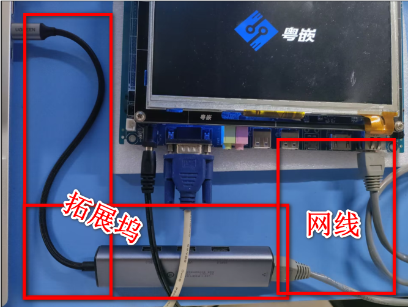

## 二、笔记本端设置

### 1、桌面搜索并进入 "查看网络连接"

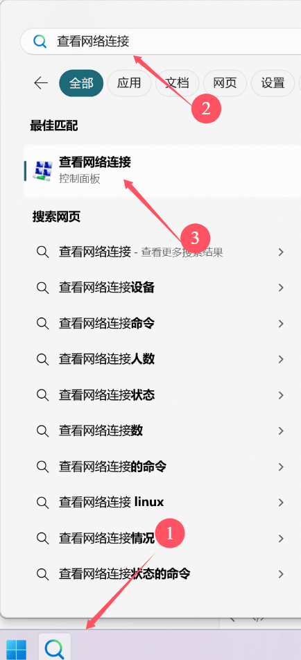


### 2、进入 WLAN 网卡设置

出现的网卡数量/名字不一样没有关系
主要需要有 以太网网卡(后面的数字无影响)、WLAN网卡

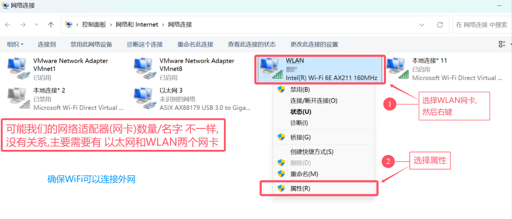

### 3、设置 WLAN 为共享

按照以下四步操作即可将 WiFi网络共享给有线网卡

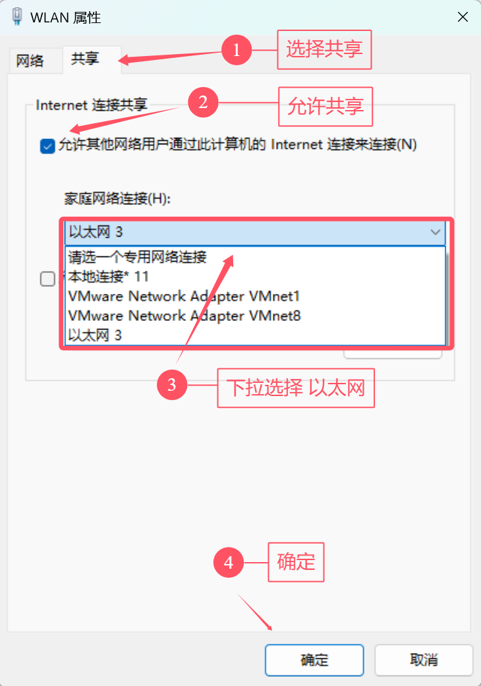

设置成功出现以下内容

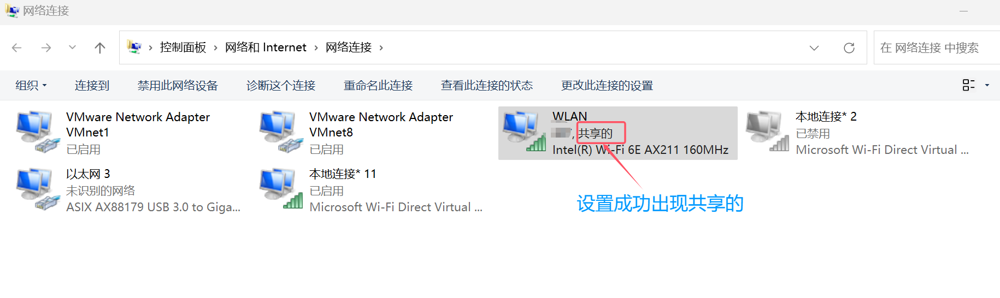

## 三、开发板端设置

开发板开机并且连上网线
在 SecureCRT 中执行以下操作

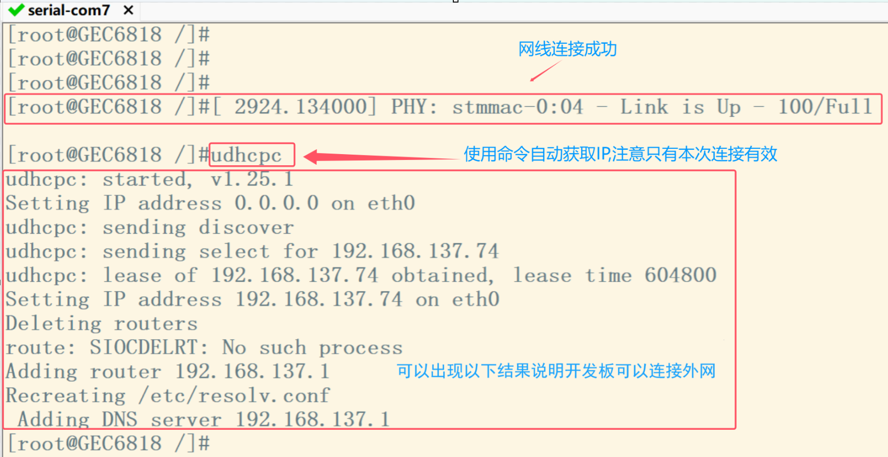

测试验证如下,如果无误 恭喜成功

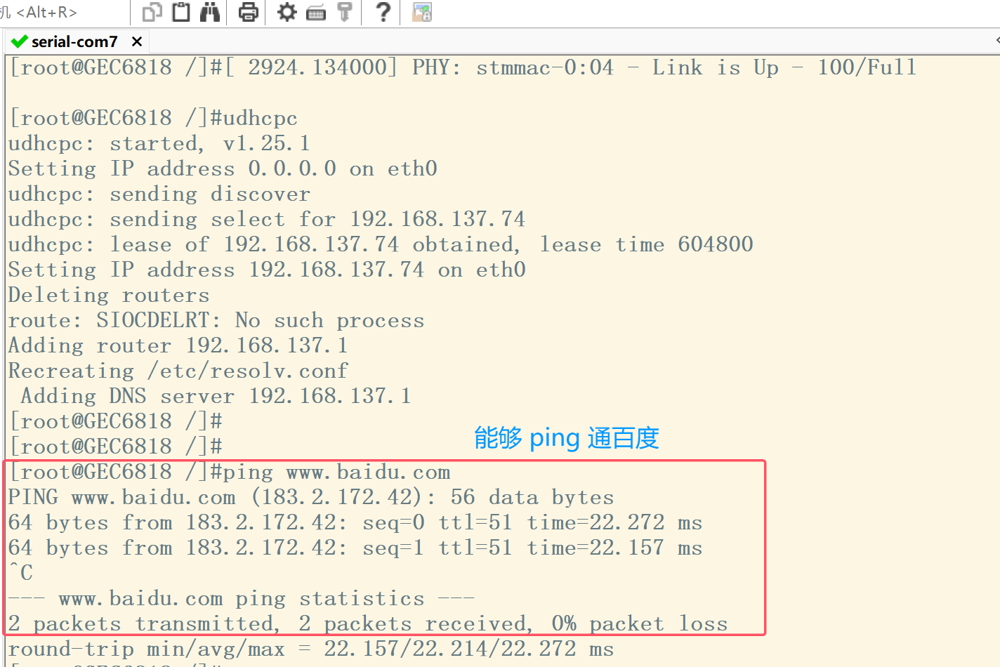

注意
①以上操作基于 WIFI 可以连接外网!!!  
②如果不需要继续共享 WIFI ,只需将"二"中操作的共享勾选框取消即可!!!  
③使用以上设置,GEC6818开发板就不能与Ubuntu网络通信(网关问题)   


# 无线连接

首先配置网卡驱动及网络工具，详情参考[GEC6818 移植 rtl8723bu wifi驱动_x6818开发板安装wifi驱动](https://blog.csdn.net/weixin_40209493/article/details/128841477)

这里只写完成配置后连外网的步骤。

## 笔记本端设置

1、桌面搜索并进入 "查看网络连接"    

2、进入 WLAN 网卡设置    

前两步一样    

### 3、设置 WLAN 为共享

可能会有一个弹窗，点击“是”即可

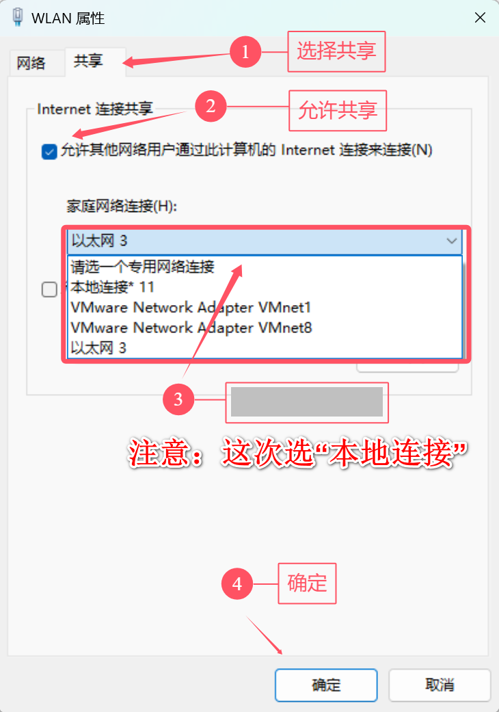

### 4. 查看当前网关

双击有网的被共享的网络

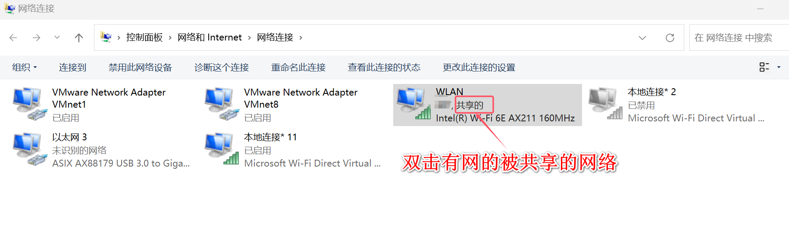

点击详细信息

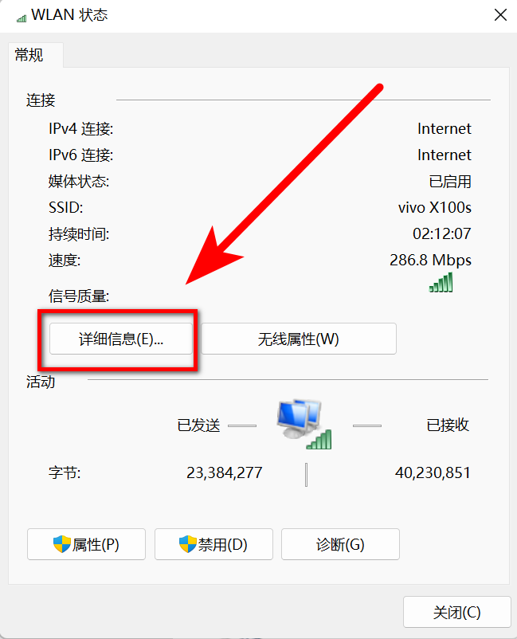

查看当前的网关（要记住）

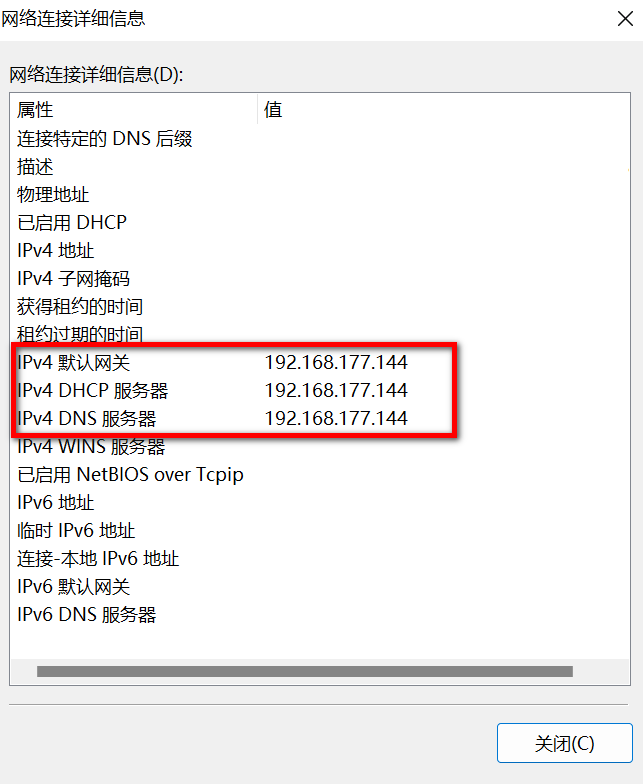


## 开发板端设置	

```bash
# 在之前的有线连接中，我的配置是：
# ifconfig eth0 192.168.137.115 netmask 255.255.255.0 up
# 先启动 wpa_supplicant
wpa_supplicant -B -i wlan0 -c /etc/wpa_supplicant.conf
# 现在是无线连接，我的配置是（IP第三个字段不能和有线连接一样）：
# IP第四位可以是任意三位数
ifconfig wlan0 192.168.177.100 netmask 255.255.255.0 up
# 删除路由（不需要）
# route del default
# 添加新路由（ip就是上一步的wang'w）
route add default gw 192.168.177.144 wlan0
# 添加dns解析（ip同上）
echo "nameserver 192.168.177.144" > /etc/resolv.conf    
```

### 固定默认启动

```
# 编辑profile文件
vi /etc/profile

# 把下面几个添加进去（添加到末尾即可）
source /IOT/driver_ko/insmod_driver.sh               
                                                            
sleep 2                               
wpa_supplicant -B -i wlan0 -c /etc/wpa_supplicant.conf
ifconfig wlan0 192.168.7.100 netmask 255.255.255.0 up  
route add default gw 192.168.7.241 wlan0
echo "nameserver 192.168.7.241" > /etc/resolv.conf
telnetd                                               
```


## 开启远程登陆


开发板端输入命令

```shall
# 开启远程登陆
telnetd
# 设置密码
passwd root
```

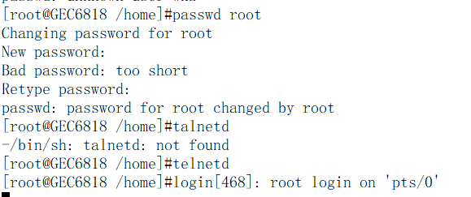

笔记本端使用secure CRT远程登陆

新建会话选【telent】

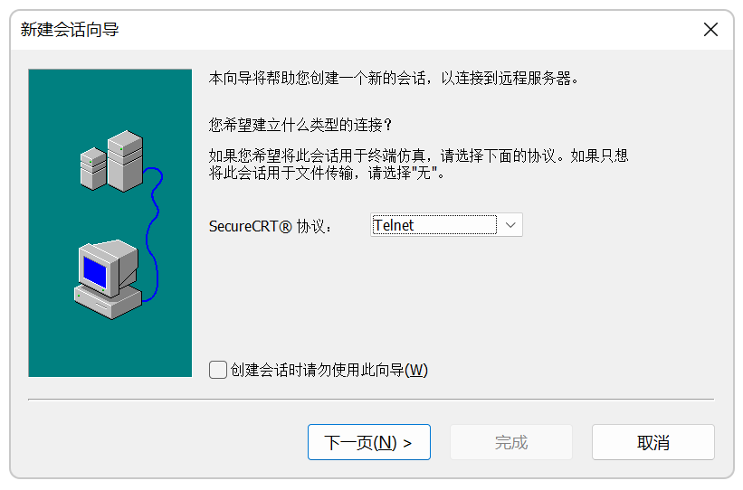

主机名填开发板ip

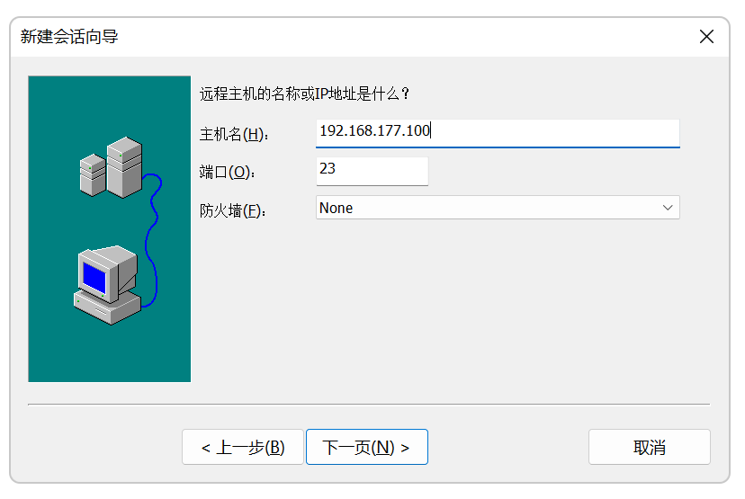

用户名填root

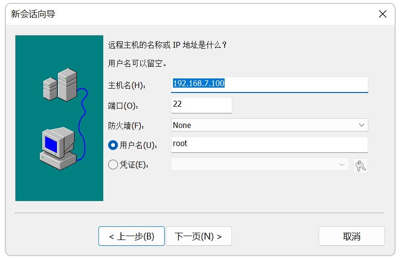

然后登陆，也要填用户名和密码

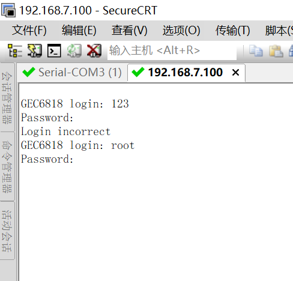
