# [OPT小讲堂第一课 〡 Smart视觉软件应用入门](https://www.optmv.com/content/details114_4323.html)

         **Smart智能视觉软件的特点：**

        **1、稳定：10000+工站实施验证稳定性；**

        **2、易用：可视化流程图方案设计，所见即所想；**

        **3、高性能：聚焦高频率工具的性能优化。**

        下面就让我们来了解一下Smart智能视觉软件的构架、工作模式、人机交互和应用领域。

**一、Smart智能视觉软件构架**

        Smart是由OPT自主研发的智能视觉软件，其界面简洁直观，能实现图像采集、图像预处理、模板匹配、找圆、找边、Blob分析、间隙测量、几何测量、划痕检测、边缘检测、OCR检测、串口通讯、以太网通讯等一系列常用的功能。组合不同功能，能简单快速地生成工业视觉检测、测量方案。

        **1、软件操作界面如图1、图2所示**

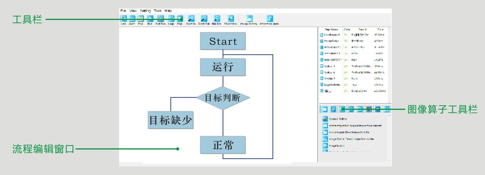

图1  流程编辑界面

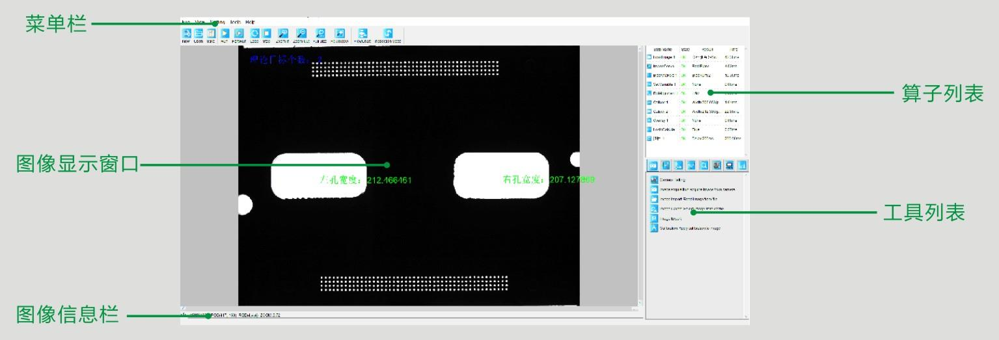

图2  图像显示界面

        **2、  Smart智能视觉软件功能模块**

**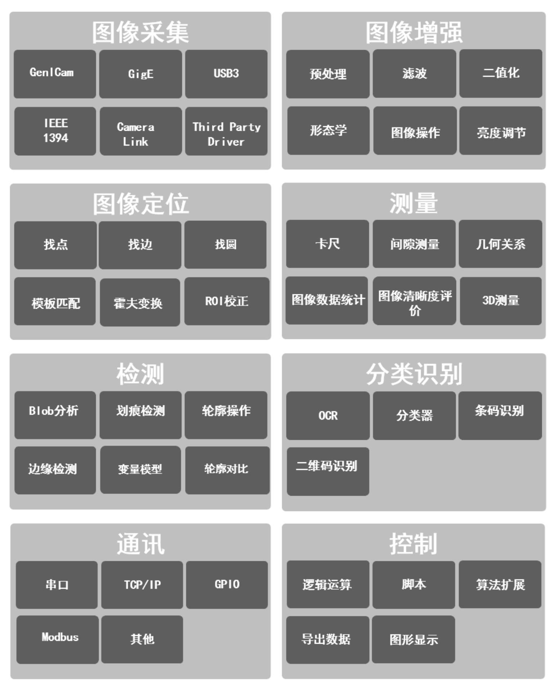  
**

图3  Smart智能视觉软件功能模块

**二、Smart智能视觉软件工作模式**

        Smart智能视觉软件无需添加传统繁杂的语言代码，仅通过可视化的流程结构便能实现检测功能，简单、易用。视觉方案在执行算子块添加检测、定位等算子的过程中，可结合单条件、多条件、多线程算子块完成方案综合运行，达到检测、定位等要求，然后循环结构可进行下一次的检测和定位。

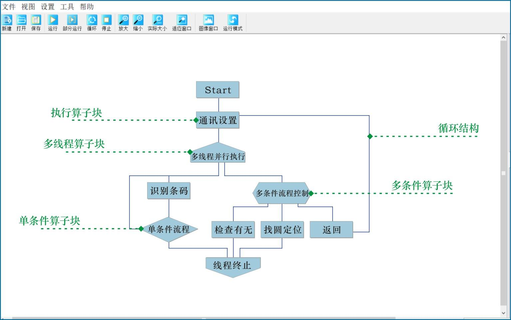  

图4  项目方案流程结构示意图

        接下来我们通过两个实例来了解检测流程的搭建和操作。

        **项目要求：**

        1、定位图5中的外圆，返回结果。

        2、对图6中的产品二维码进行识别，返回结果。

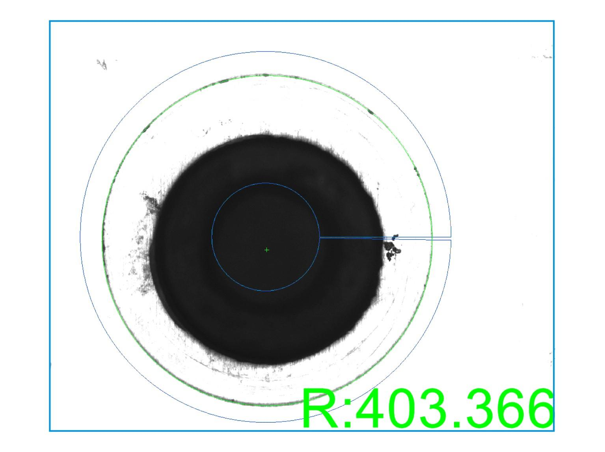  

图5  找圆

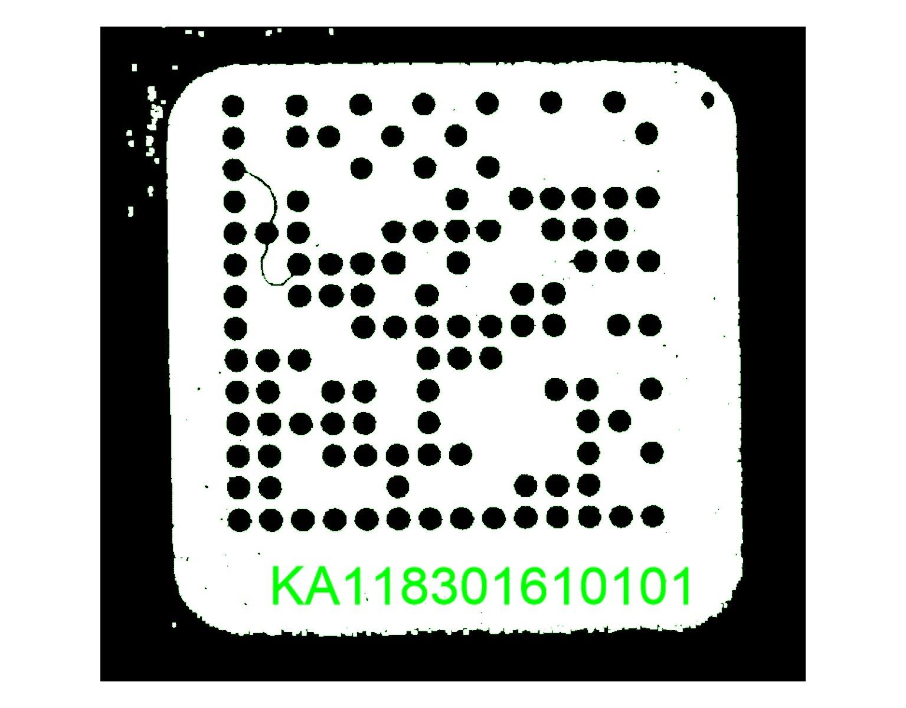

图6  二维码识别

        通过直观的流程就可以完成项目，并且能看到比较清晰的项目思路，如下:

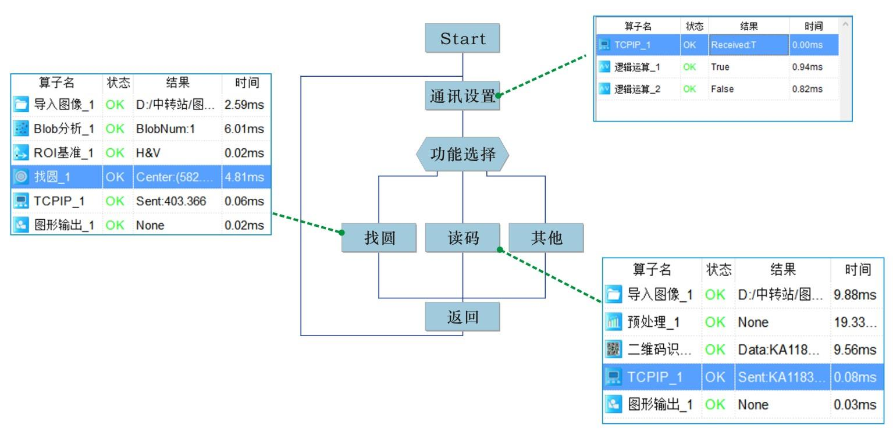  

图7  流程明细

        点击“运行模式”按钮可切换到运行模式。该模式界面比编辑模式界面更加简洁，还可以多个窗口显示：

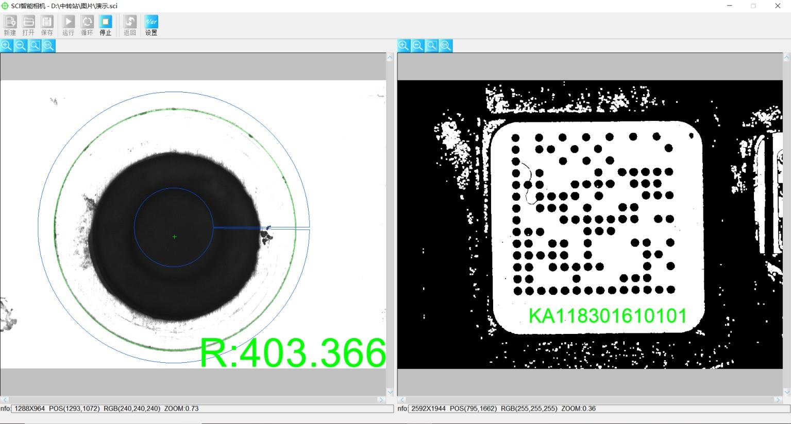  

图8  运行模式多窗口显示

**三、Smart智能视觉软件拥有简洁的人机交互界面**

        简洁的人机交互界面意味着软件能够直观的呈现图像处理效果、清晰的呈现数据处理结果、明确的呈现检测处理流程。

        简洁的人机交互界面使Smart智能视觉软件上手简单，对于大部分的应用，只需要几步操作即可完成：

        **第一步：**明确图像检测极性（由外到里/从白到黑）

        **第二步：**调整处理参数值（边缘强度/边缘宽度）

        **第三步：**查看数据结果（X、Y和半径）

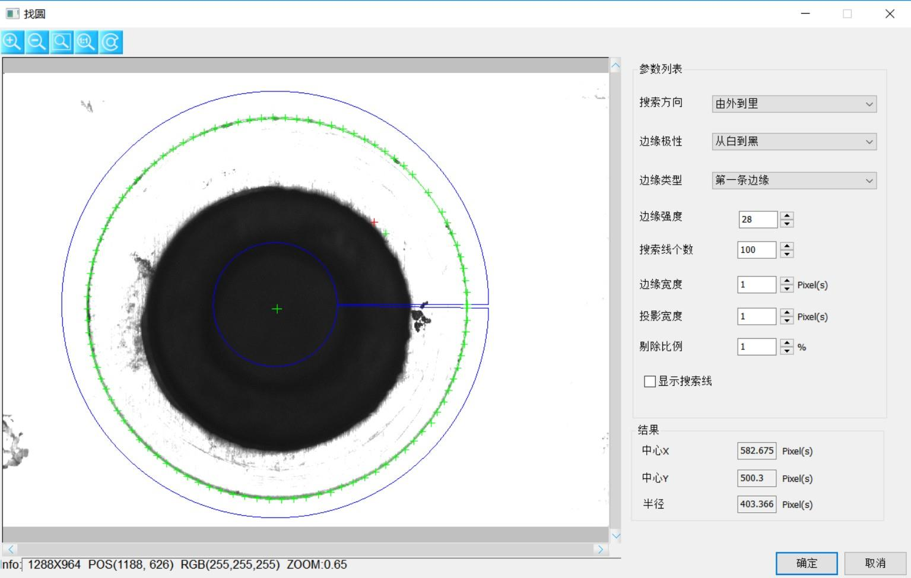  

图9  算子界面层

**四、Smart智能视觉软件应用领域广泛**

        1、超过15000家客户的支持和信赖；

        2、超过50000多个项目应用案列；

        3、超过500000个产品使用验证了OPT产品的质量；

        4、全球技术服务。

  

图10  奥普特Smart智能视觉软件应用于全球各大设备厂商

        第一课讲完了，入门操作get到了吗？如果大家想要更深入的了解，或者想要使用Smart智能视觉软件，欢迎在留言区留言或拨打我们的全国服务热线400-0769-068。

# [OPT小讲堂第二课∣Smart如何轻松采图和导出图像？](https://www.optmv.com/content/details114_4319.html)

        本课将从以下五个部分进行讲解：一、软件支持的硬件传输接口；二、相机驱动的安装；三、相机驱动的设定；四、软件采集设置；五、图像的导入和导出。

**一、Smart支持的硬件传输接口**

        Smart智能视觉软件支持目前业内常用的硬件传输接口：GigE，USB，IEEE1394，Camera LinK和CoaXPress等。

**二、相机驱动的安装**

        首先我们需要依据相机硬件的类型，选择相应的接口安装相机驱动。双击相机驱动的安装文件，准备进行安装，如图1所示。

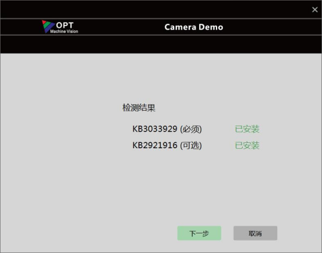

图1  补丁检测

        如果是win7操作系统则电脑需要安装补丁，若没有提示安装补丁，请打开Smart的X64或X86版本（与电脑系统保持一致）文件夹中的更新文件，预先安装，或等相机驱动安装完成后再进入安装。点击“下一步”进入下一界面，如图2所示。

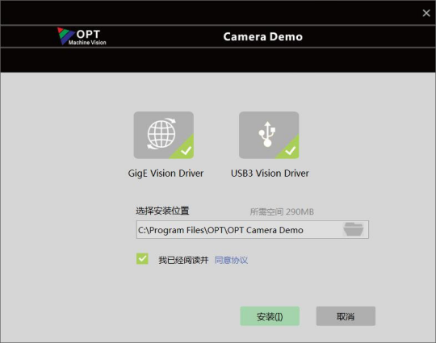

图2  接口和路径选择

        选择连接相机的接口类型，如果需要修改相机接口类型，再次运行安装文件进行修改。安装目录暂不支持修改。

        点击“安装”，相机驱动程序安装开始，如图3所示。

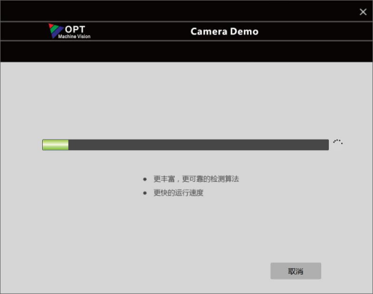

图3  安装运行    

        点击“完成”，完成驱动安装，如图4所示。

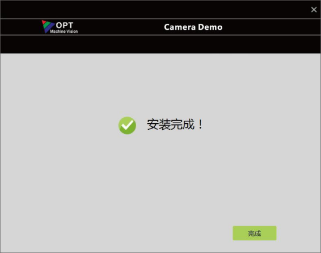

图4  安装完成

**三、相机驱动软件的设定**

        完成相机驱动的安装，接来下我们要对相机硬件驱动的参数配置和Smart智能视觉软件的参数配置进行设定。

        **软件列表图标说明：**

        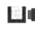：可以连接的工业相机。

        ：IP设置无效的工业相机不可连接。需要修改相机IP后，才能连接。

        ：OPTCameraDemo连接中的工业相机。OPTCameraDemo同时只能连接1台相机进行操作。

        **主界面软件列表说明：**1、相机连接；2、相机IP设置；3、网口信息；4、相机信息。（如图5所示）

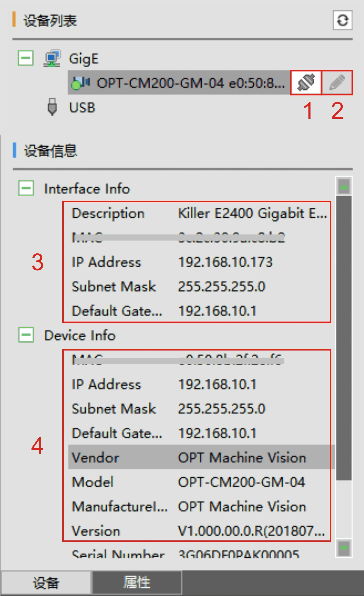

图5  相机驱动主界面

        **点击相机IP设置：**

        图6中显示本机IP地址为192.168.10.173，子网掩码为255.255.255.0；

        我们需将相机IP设成192.168.10.1，子网掩码设成255.255.255.0，如图7所示；

        相机的IP和电脑主机的IP地址在同一网段，网关协议一致即可。

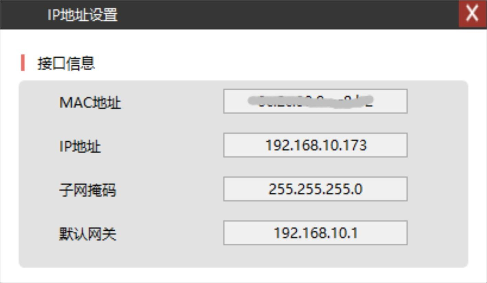  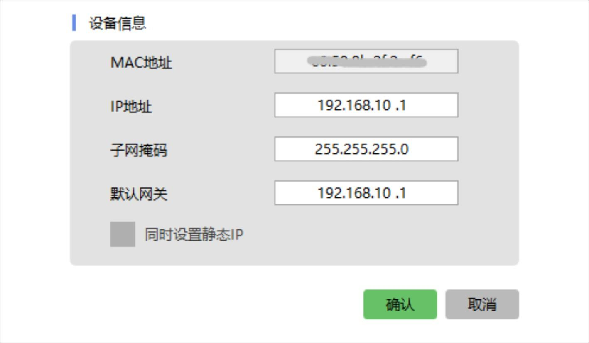

图6  相机接口IP地址信息                                                                  图7  本机IP地址信息

        为了系统的智能检测，能直接根据IP地址匹配好对应的相机，我们需要为相机设置静态IP。

        **相机静态IP设置：**

        配置完成后，断电重启，相机静态IP设置生效。

        启用自动IP设置：GevCurrentIPConfigurationLLA：True

        禁用动态IP设置：GevCurrentIPConfigurationDHCP：False

        启用静态IP设置：GevCurrentIPConfigurationPersistentIP：True

        GevPersistentIPAddress：相机静态IP

        GevPersistentSubnetMask：相机静态IP的子网掩码 

        GevPersistentDefaultGateway：相机静态IP的默认网关

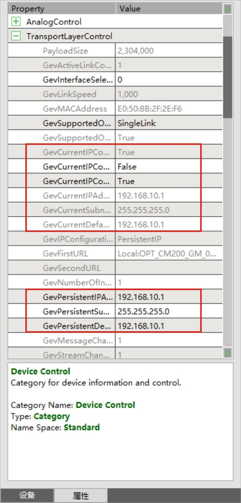

图8  相机静态IP设置

        相机IP地址匹配成功后，我们需要将相机参数进行加载、设定并保存（如图9所示）。

        **1、加载参数配置：**点击UserSetLoad按钮，加载选择的配置。

        **2、保存参数配置：**

        路径选择：

        在UserSetControl的UserSetSelector里，选择配置保存的位置。支持3个存放位置：Default、UserSet1、UserSet2。

        保存设定：

        点击UserSetSave按钮，保存当前相机配置到选择好的保存位置。

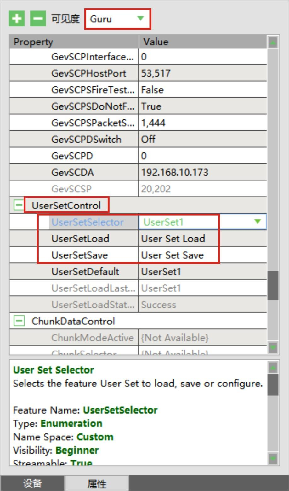

图9  相机参数的加载与保存

**四、采集设置**

        将相机驱动软件设定好后，打开Smart软件，通过Smart智能视觉软件来采集相机图像、调整图像和存储图像。

        采集设置的作用是对相机参数及光源参数进行基本参数设置，以获取符合图像处理要求的图像，点击，弹出采集设置工具常规页面。我们可以看到可用相机，单击进行选定，如图10所示；

        根据相机的实际成像，我们可以通过调整曝光值来采集优质的图像，如图11所示。（注：相机参数前的勾选框被勾选时，表示算子运行时会更新设置该参数。）

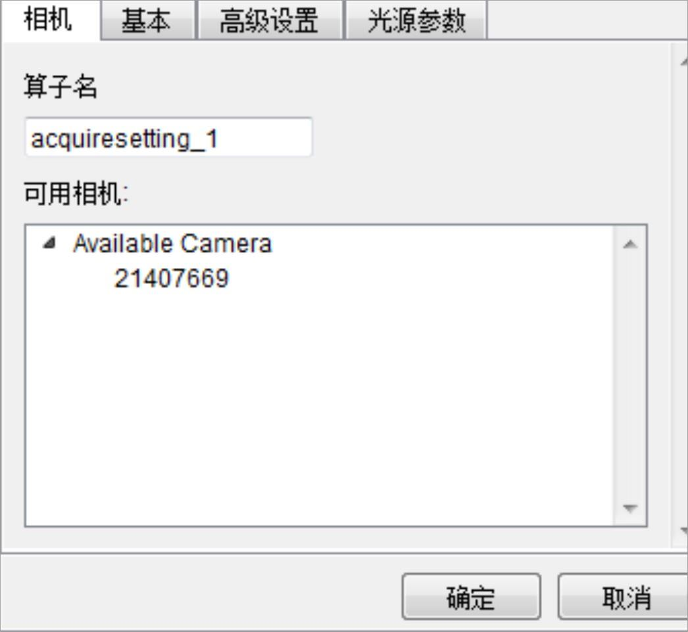  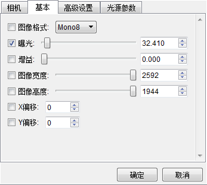

图10  选择相机设置参数                                                                     图11  相机参数设定界面

        一般图像采集分为软件触发采集和硬件触发采集两种方式，根据项目需求情况采取不同的方式：

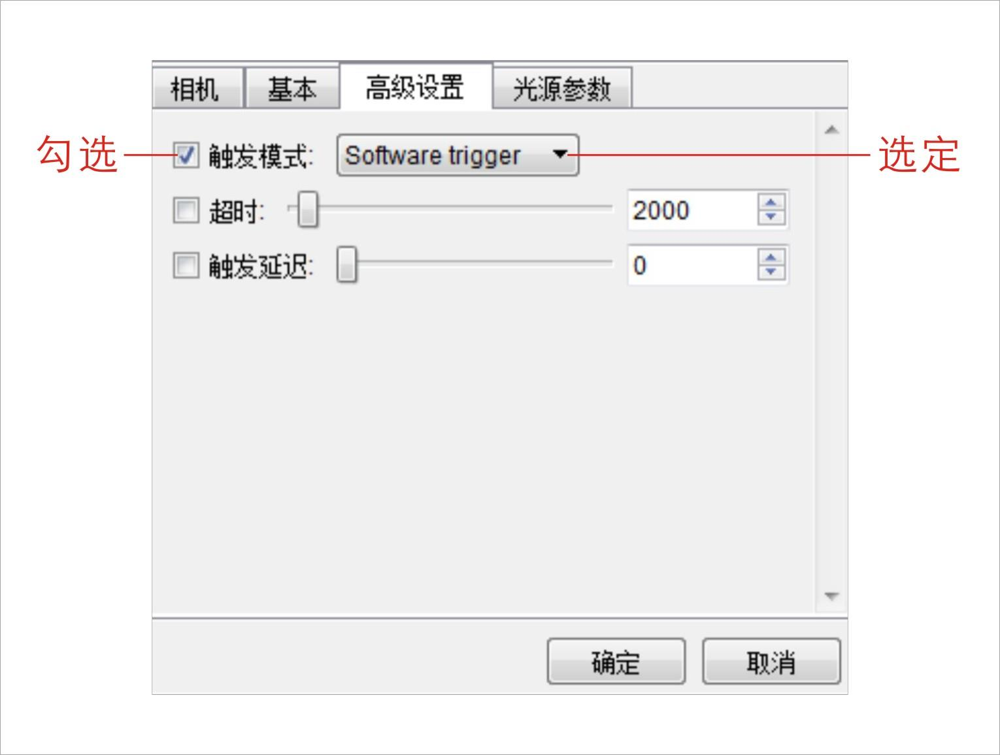  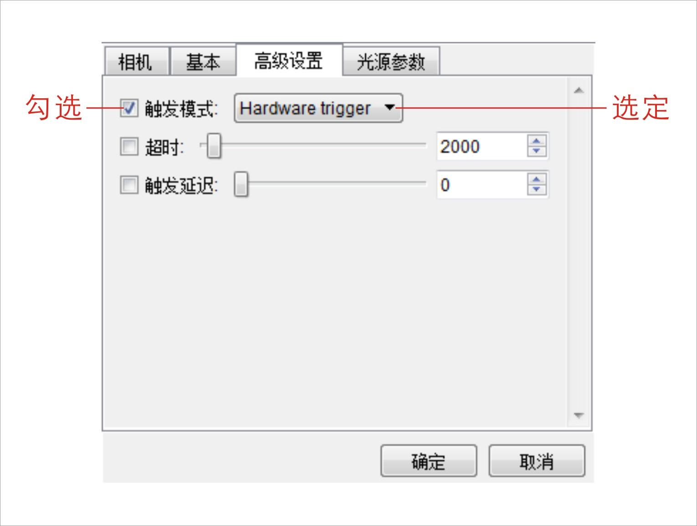

图12  软触发设置                                                                       图13  硬触发设置

        Smart软件中的采集设置模块还集成了对光源的控制，以TCP/IP为例进行讲述，如图14、图15所示：

        如果相机是软触发，照明模式设为常亮模式，进行控制。

        如果相机是硬触发，照明模式设为触发闪亮，进行控制。

        （注：勾选更新项，光源的状态才能够有效进行实时更新。）

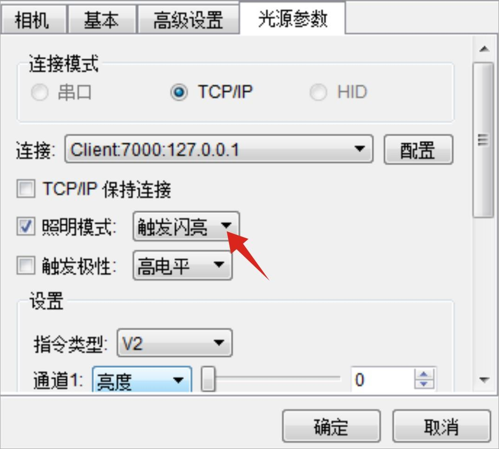  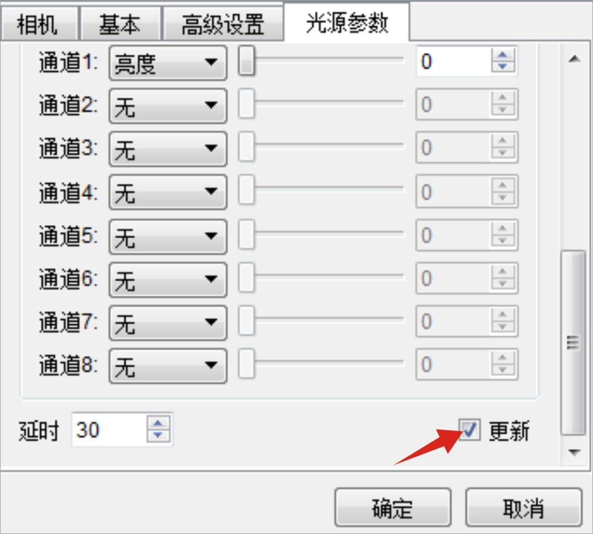

图14  触发模式设定                                                                       图15  触发状态选定

**五、图像采集**

         **1、从相机采集图像，点击****进入界面（需要插入加密狗授权） 。**

        图像采集工具用于从相机获取图像。在可用相机列表栏里列举了当前可用相机名称。如果新连接的相机在相机列表内未找到，可以通过“工具”-“扫描相机”，重新扫描相机。

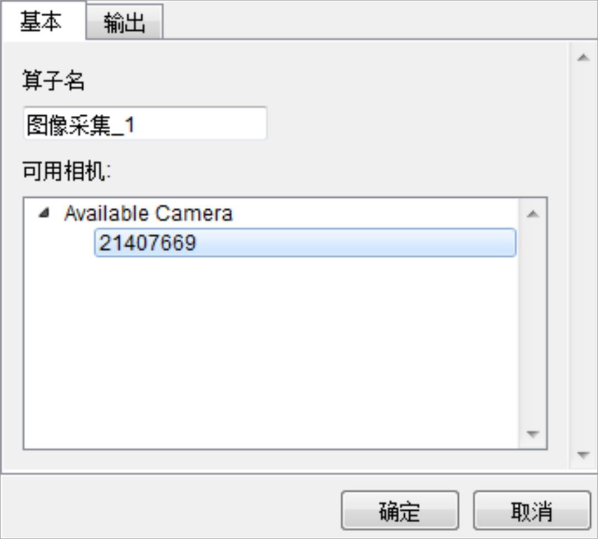

图16  相机选择

        **基本参数：**

        基本页面用于从相机列表中选取相机。

        1)算子名：当前步骤名称，可更改，支持中文和英文。

        2)可用相机：相机选择列表，选择相机的名称或ID。

        **输出参数：**

        输出图像备份：勾选此项表示将采集到的原始图像备份并添加到算子输出，输出图像可以被“图像缓存”功能使用。

        **2、导入图片：从文件写入图片，点击****进入界面。**

        导入图像工具用于从本地路径导入图像。

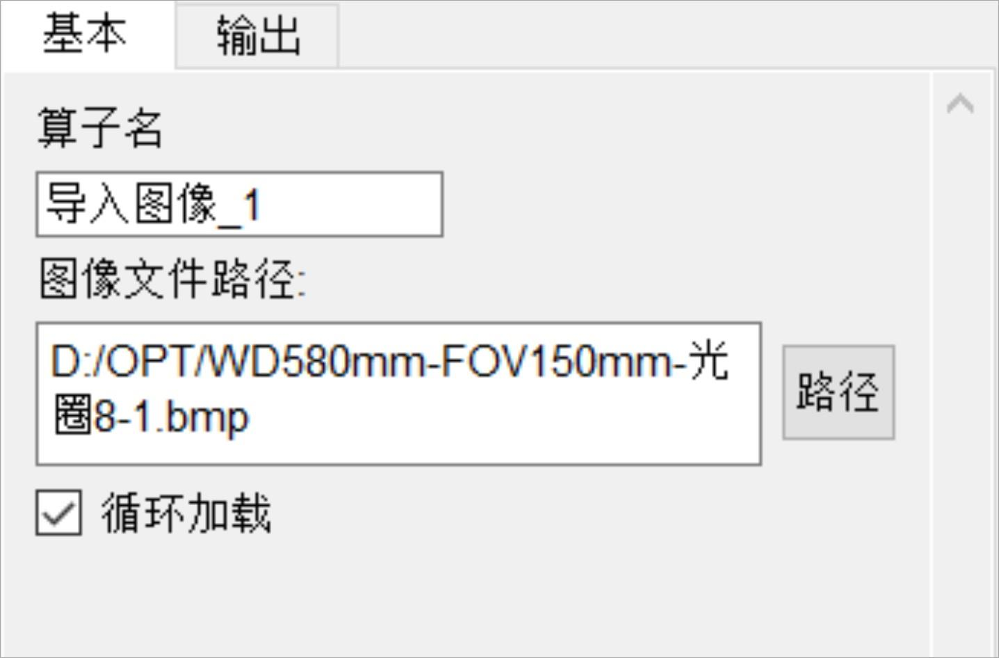

图17  本地图像路径选择

        **基本参数：**

        1)算子名：当前步骤名称，可更改，支持中文和英文。

        2)图像文件路径：当前图像文件路径，点击“路径”弹出打开文件对话框，选择图像来源。

        3)循环加载：勾选循环加载项，则导入图像算子运行时依字母顺序从当前图像所在文件夹中导入图像文件；若不勾选此项，则加载当前图片。

        输出参数设置，切换到输出界面。

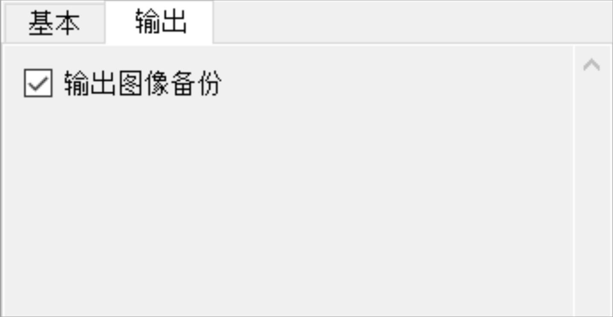

图18  输出界面

        输出界面用于配置算子输出状态。

        输出图像备份：勾选此项表示将导入的原始图像备份并添加到算子输出，输出图像可以被“图像缓存”功能使用。

        **3、图像缓存：从图像缓存区读取图像，点击****进入界面。**

        用于选择其他功能输出的图像，通常用于实现算子块内的图像切换或算子块间的图像传递。

        算子块内：当前后处理的图像不一致时，我们需要切换选择对应图像

        算子快间：跨算子调用采集的图像，完成对图像的处理

       **4、导出图像：用于将图像保存到路径，点击****进入界面。**

        基本页面用于保存原图、窗口截图或中间过程处理后的图片。

        1)算子名：当前步骤名称，可更改，支持中文和英文。

        2)路径：设置保存图像的路径。

        3)子路径：启用子路径选项功能。在指定路径下创建子文件夹，文件夹名称可以是字符串常量或引用变量值，右图即为变量值的引用。

        4)文件名：即导出图像的名称，可引用。引用方式与子路径引用相同。

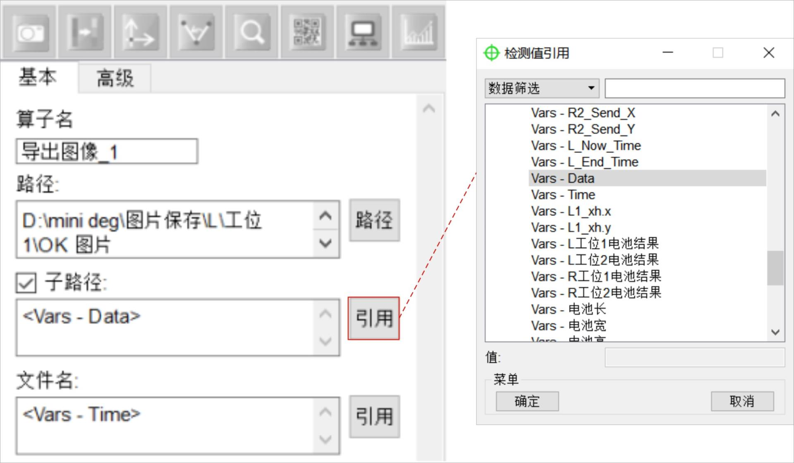

图19  图像导出路径设定

        切换到图像保存的高级设置页面，如图20。

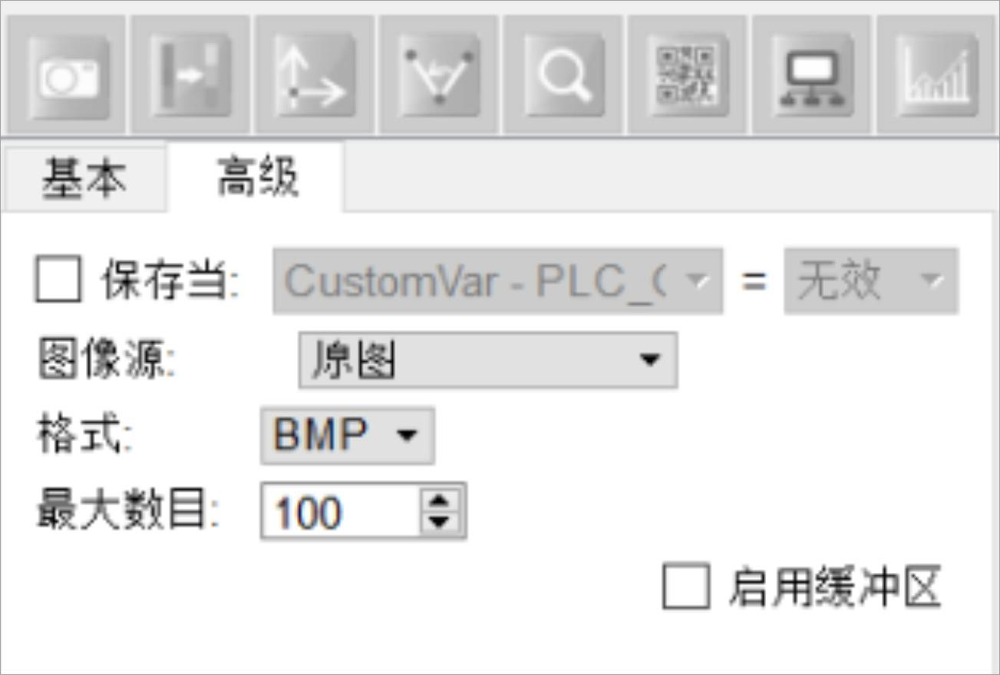

图20  图像导出格式设定

       **保存当：**勾选之后选择一张算子操作后的图片状态“=”真（假或者无效），即当该图片的状态满足该条件时，基本操作界面设置的图片才会满足导出功能，不满足该条件的话之前的操作无效；如果不勾选“保存当”，则图片随时可以被导出到指定的路径下的文件夹中。

        **图像源：**可保存原图，用于测试；可保存窗口图，直观查看检测项和数据值。

        **格式：**可保存为BMP无损格式，用于测试；还可保存为JPG、PNG和TIF格式，用于存储记录。

        **最大数目：**最大保存数量，默认值为100，当设置为0时，图片保存数量无限制。

       **启用缓冲区：**如果导出图片过多时，勾选该项可以加快图片导出速度。

        以上就是Smart软件应用于操作系列的第二课时内容。读完这一篇，有没有发现，原来轻松掌握采图和导出图像，玩转智能视觉软件，就是这样简单？有任何感受、建议、意见或者疑问，欢迎拨打OPT全国服务热线400-0769-068。

# [OPT小讲堂第三课∣Smart流程结构详解](https://www.optmv.com/content/details114_4318.html)

        Smart智能视觉软件无需添加传统繁杂的语言代码，采用图形化编辑流程即可实现检测功能。所见即所想的可视化设计方式，可以让更多的非编程人员更快、更从容的完成视觉应用，让项目实现周期变得非常短。

        流程框架中包含两种元素，即普通算子块和流程控制块(流程控制块包括条件算子块、多条件算子块、多线程算子块等)，通过这两种元素互相结合使用即可构造出顺序流程结构、If流程结构、Switch流程结构、循环流程结构和多线程流程结构等流程结构。建立好流程图后，将算子添加到算子块中并设置好流程控制条件，即可实现检测过程。

**一、如何添加模块**

        在流程编辑区，单击鼠标右键弹出创建对话框，如图1所示，然后选择需要创建的模块。（注意：Start模块每个方案有且仅有一个，新建方案时会自动生成。它代表着方案流程的起点，不能通过手动创建的方法创建。）

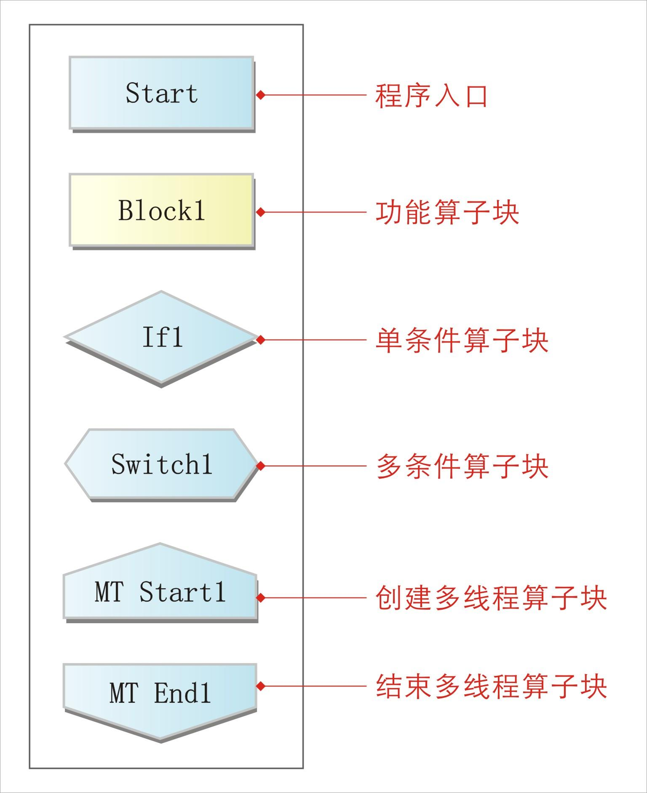  

图1  算子块界面

**二、流程如何运行**

        流程从Start模块开始，沿着连线从上至下执行。若有If/Switch模块，则只会执行其符合条件的一个分支。若有创建线程模块，则会“一分多”线程同时运行，当多个线程连接到终止线程模块则会“多合一”之后往下运行。一个线程执行到流出端，没有连线的模块会自动停止运行，而方案流程会在所有线程都停止或用户按下停止键之后才会停止运行，如图2所示。

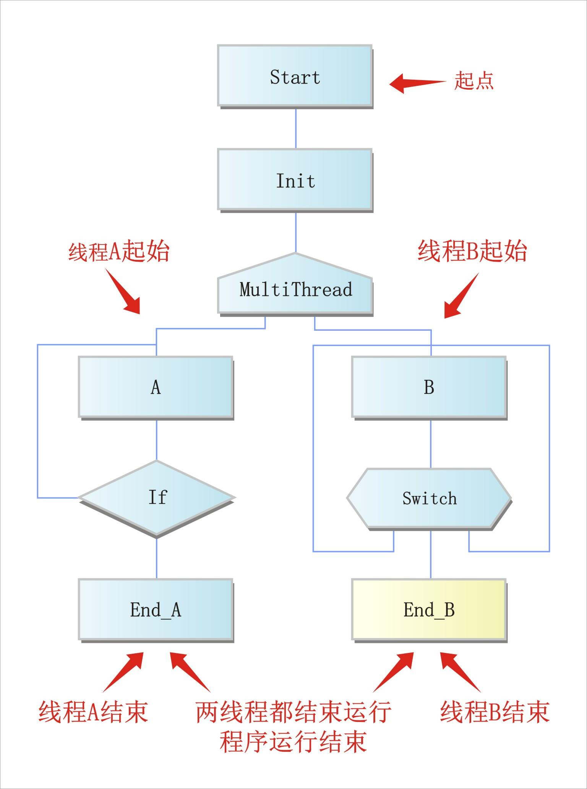

图2  流程运行过程演示

**三、流程结构**

        **1****、顺序流程结构**

        1）流程从上往下按顺序依次执行；

        2）适用于简易的单次性工作模式。

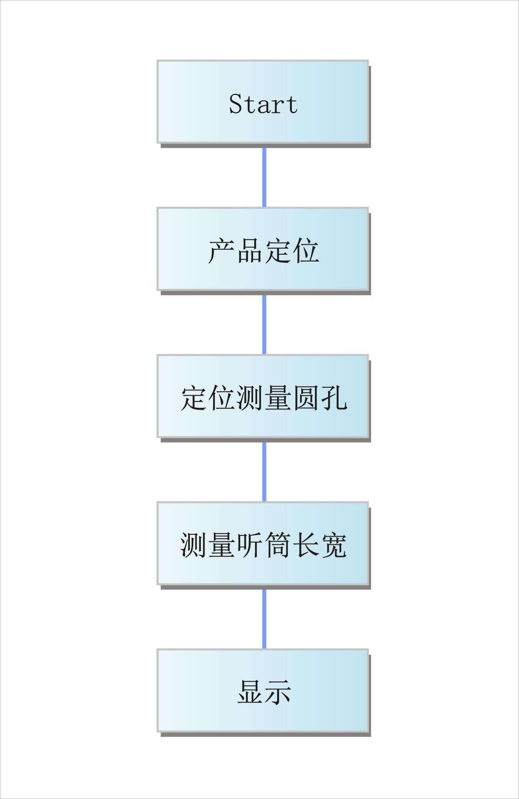  

图3  顺序流程结构

        **2、If流程结构**

        1）根据所选布尔型变量的逻辑值是否为TRUE/FALSE/无效，对流程进行控制。如条件中测量值设为TRUE，当Bool变量的值为TRUE时，流程从端口流出；

        2）如图4通过If流程结构实现：“逻辑运算\_1”算子判断TCP/IP接收指令是否为有效的拍照指令，在If流程结构中若检测到“逻辑运算\_1”的值为TRUE(即拍照指令有效)，则流程向下执行“相机采集”模块从而进行相机采集等操作，否则流程向If控制块的Else端执行回到“指令接收”模块继续等待接收TCP/IP指令。

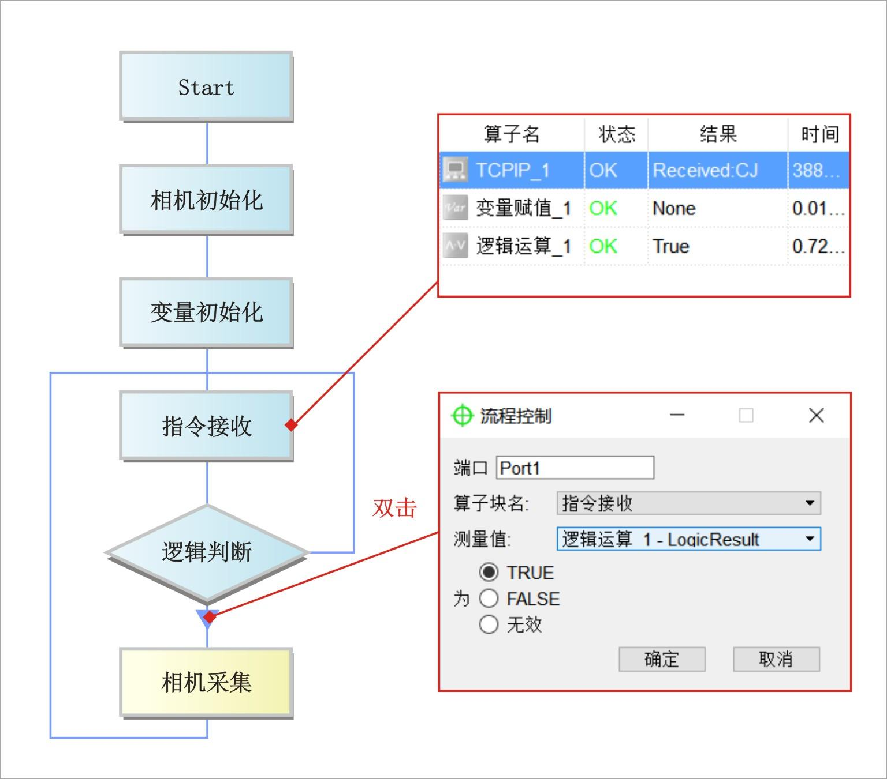  

图4  If流程结构

        **3、Switch流程结构**

        1）Switch块端口控制条件的判定顺序为从左到右，流程从控制条件最先判定为“真”的端口流出，每次循环只执行一个分支；

        2）如图5通过Switch流程结构实现：通过判断接收到的拍照指令来区分不同工位的相机进行拍照。如Bool型的变量Var-T1用于存储接收拍照指令是否为相机1有效的拍照指令的状态，当Switch控制块的第一个端口设置检测变量Var-T1的值为TRUE(即接收指令为相机1拍照有效指令)时，则流程向“相机采集”模块执行从而进行相机采集等操作。

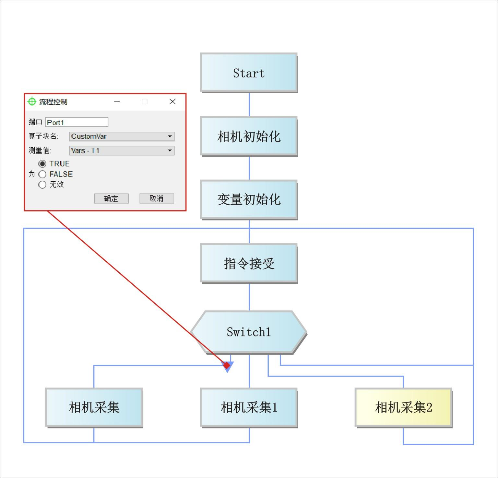  

图5  Switch流程结构          

        **4****、循环流程结构**

        1）有循环体结构时，当一个流程结束后会自动循环加载运行对应流程；

        2）生产线中工站的流程基本都是循环体，检测程序每走完一个流程需要自动循环，才能符合生产线的要求，此时便需要建立循环结构。

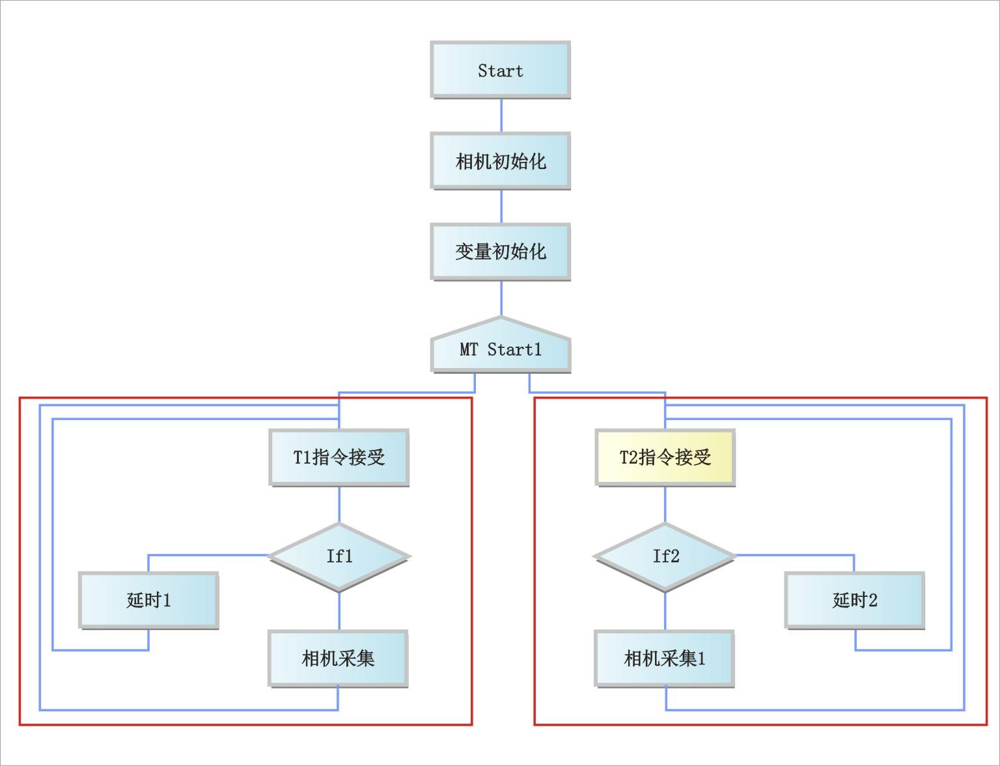  

图6  循环流程结构

        **5、多线程流程结构**

        1）同一时间执行多项任务的时候，使用多线程流程结构，即可实现同步执行。如使用多线程实现多工位同时工作、同工位多项检测内容同步检测等；

        2）可通过“终止线程算子块”模块汇总等待各线程执行结束后再继续往下执行。

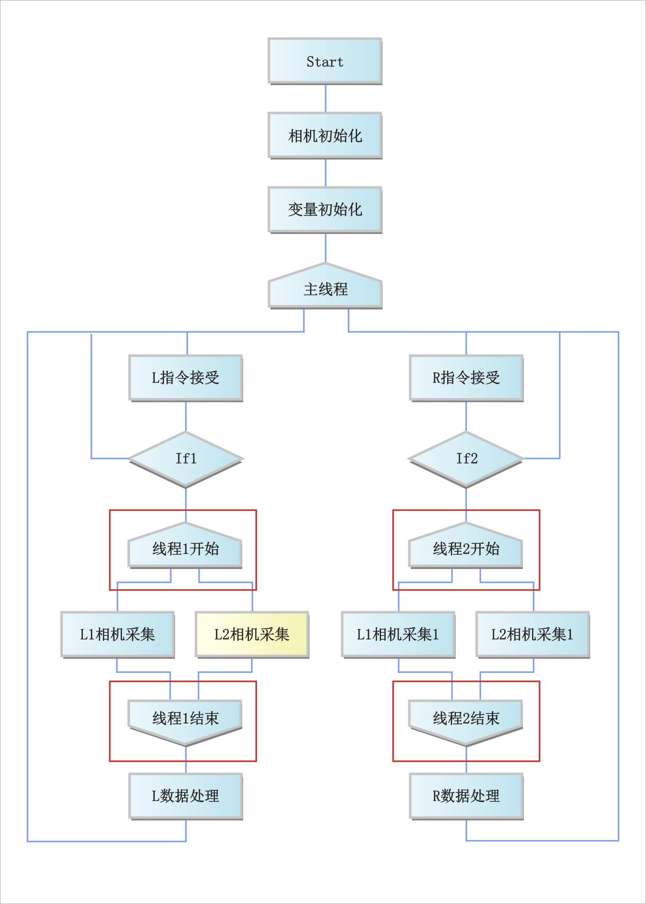  

图7  多线程流程结构

        以上为OPT小讲堂之Smart智能视觉软件操作培训第三课内容，如有任何问题欢迎在留言区留言或来电咨询，全国服务热线400-0769-068。

# [OPT小讲堂第四课 ∣ Smart图像增强之滤波](https://www.optmv.com/content/details114_4315.html)

**什么是图像增强？**

        简单的说，图像增强是指针对给定图像的应用场合，有目的地强调图像的整体或局部特性，例如边缘、轮廓、对比度等，将原来不清晰的图像变得清晰；或强调某些感兴趣的特征，扩大图像中不同物体特征之间的差别；又或是抑制不感兴趣的特征，使图像质量改善、丰富信息量，加强图像判读识别效果，满足软件在项目实施中多样化的应用需要。

        打开Smart，在主界面右下方工具箱栏点击图像增强的图标。在图像增强功能列表中可以看到，除滤波外，还有预处理、二值化、通道提取、形态学、直方图均衡化等功能，如图1。

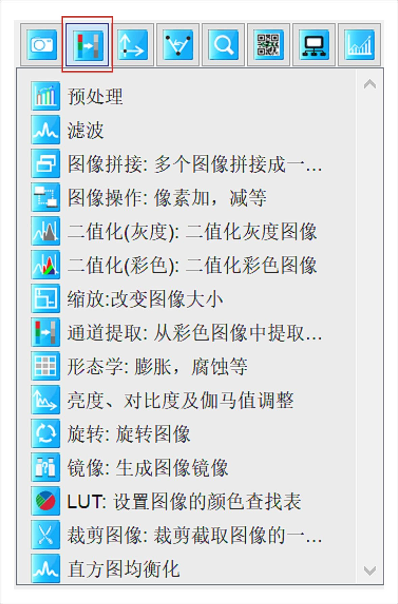

图1  图像增强工具箱

        **什么是滤波？**

        滤波简单理解就是对图像中的噪声信号进行抑制，并且保证图像的细节不被破坏的过程。

图像在其成像、传输和描述等过程中往往会受到多种信号的干扰而产生噪声，噪声在图像上常表现为视觉效果较强的孤立像素点或像素块。数字图像处理中常用滤波处理这样的图像。

        **滤波的原理是什么？**

        滤波通常是图像卷积的过程，具体来说，就是将滤波核的中心逐个覆盖原图中的像素点，然后和它邻域内的像素进行卷积求和。

**一、滤波的参数设置**

        Smart智能视觉软件中滤波算子界面用于选择滤波器和调节滤波参数，如图2。

        **1、选择滤波方法：**可点击下拉框，选择不同的滤波算法。

        **2、滤波核大小：**滤波核尺寸，范围是\[3, 99\]，步进值为2。滤波核尺寸越大，滤波效果越明显。

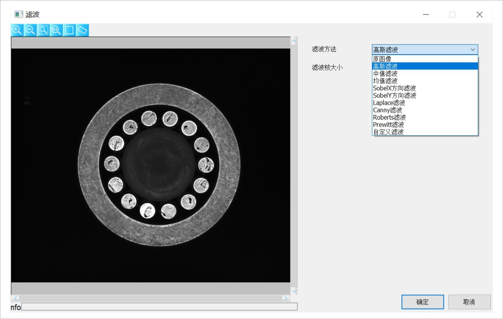

图2  滤波算子界面

**二、平滑滤波**

        根据功能的不同，滤波分为平滑滤波、锐化滤波以及自定义滤波。

        平滑滤波主要用于平滑图像，去除噪点，也就是滤掉图像的高频部分。根据选取滤波核的不同，平滑滤波又可分为均值滤波、高斯滤波以及中值滤波等。

        **1、均值滤波**

        均值滤波是一种典型的线性滤波算法。对目标像素给出一个滤波核，该滤波核覆盖其周围的像素，但不含目标像素本身，再用核中全部像素的平均灰度值代替目标像素的灰度值。均值滤波在去除噪声的同时，会对图像的边缘轮廓产生模糊效果。

        **2、高斯滤波**

        高斯滤波就是对整幅图像进行加权平均的过程，每一个像素点的值，都由其本身和邻域内的其他像素值经过加权平均后得到。

        高斯滤波的具体操作是：用一个模板(或称卷积、掩模)扫描图像中的每一个像素，用模板确定的邻域内像素的加权平均灰度值，去替代模板中心像素点的值。

        **3、中值滤波**

        中值滤波是一种非线性滤波算法。定义一个滤波核，取出滤波核所对应像素点的灰度值的中值，然后用灰度值的中值替代核中心点对应像素点的灰度值。以这样的方法遍历整张图像，可以有效去除噪声点，且对图像的边缘轮廓、细节影响较小。

        均值滤波、高斯滤波、中值滤波的效果对比如图3。

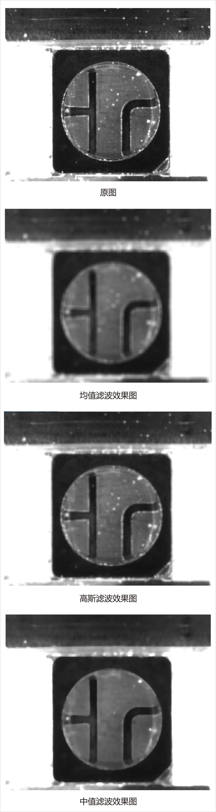

图3  三种平滑滤波效果对比

        **4、平滑滤波各算法特点对比**

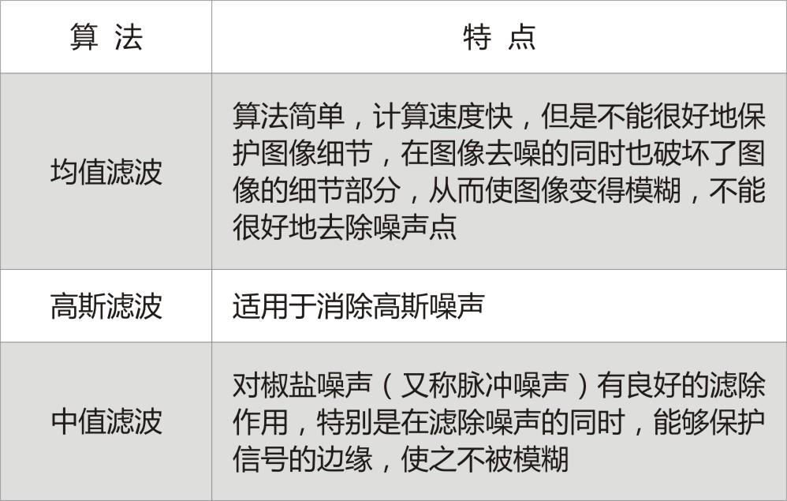

表1  平滑滤波各算法对比

**三、锐化滤波**

        锐化滤波正好与平滑滤波相反，锐化滤波常用于增强被模糊的细节或目标的边缘，强化图像的细节。锐化滤波包括了Sobel滤波、Laplace滤波、Canny滤波、Roberts滤波以及Prewitt滤波等。

        **1、Sobel滤波**

        Sobel滤波包含两组3\*3的矩阵，分别为横向及纵向，通过矩阵与像素灰度值进行卷积，即可分别得出横向及纵向的差分近似值，Sobel核矩阵如下：

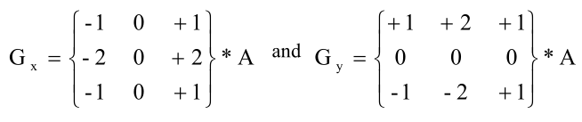

        Gx、Gy为卷积值，是滤波后的对应像素的灰度值；A为滤波前Sobel核对应的像素点的灰度值。Sobel滤波的结果是突出图像的轮廓，轮廓高亮显示，而在轮廓两边图像明显变暗，效果对比如图4。

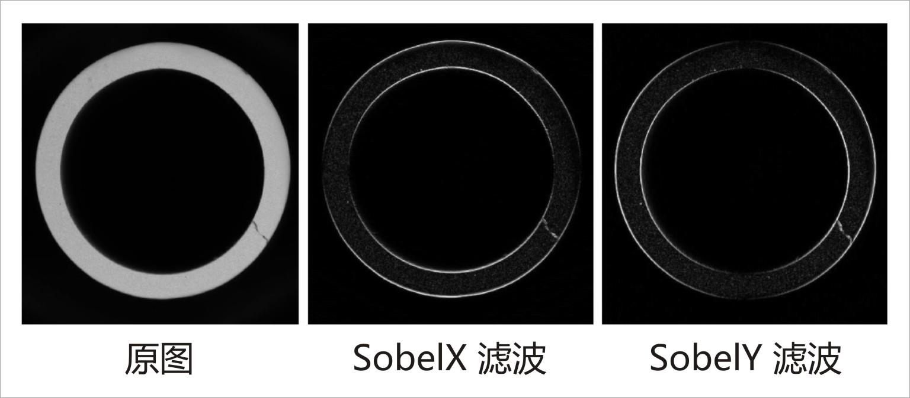

图4  Sobel滤波效果图

        **2、Laplace滤波**

        Laplace滤波，也叫拉普拉斯滤波，是一种高通滤波器，主要是通过增强图像中的高频信息分量(图像边缘、轮廓等灰度值变化较大的部分属于高频分量，灰度值变化相对缓慢的中间部分则属于低频分量)，以实现图像的锐化，从而达到增强图像边缘和轮廓的效果，效果对比如图5。

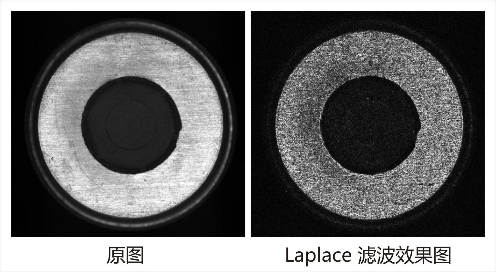

图5  Laplace滤波效果示意图

        **3、Canny滤波**

        Canny滤波是一种常用的边缘检测算子，它使用离散化梯度逼近函数，根据二维灰度矩阵梯度向量，来寻找图像灰度矩阵的灰度跃变位置，然后在图像中将这些位置的点连起来就构成了所谓的图像边缘。Canny滤波分为三个步骤：去噪声，即对原始的图像进行一个高斯滤波；寻找图像中的亮度梯度，从原始图像上生成每个点灰度梯度图以及灰度梯度的方向；在图像中跟踪边缘，以此边缘片段为连续的曲线。Canny滤波的效果如图6。

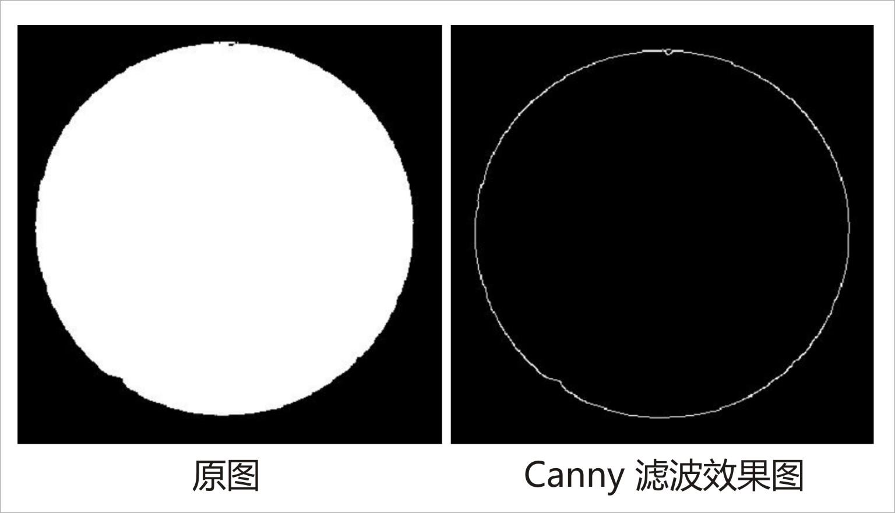

图6  Canny滤波效果示意图

        **4、Roberts滤波**

        Roberts滤波定义一个2\*2的模板，利用局部差分算子寻找边缘。其采用对角线方向相邻两个像素之差近似梯度幅值检测边缘。检测垂直边缘的效果好于斜向边缘，定位精度高，对噪声敏感，无法抑制噪声的影响。效果对比如图7。

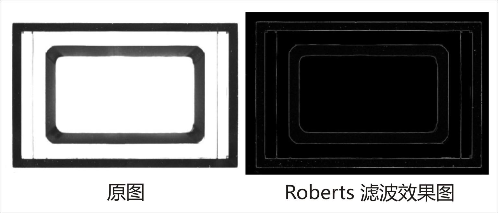

图7  Roberts滤波效果示意图

        **5、Prewitt滤波**

        Prewitt滤波是一种一阶微分算子，利用像素点上下、左右相邻点的灰度值差，在边缘处达到极值检测边缘，去掉部分伪边缘，对噪声具有平滑作用。其原理是在图像空间利用两个方向模板与图像进行邻域卷积来完成的，其效果如图8。

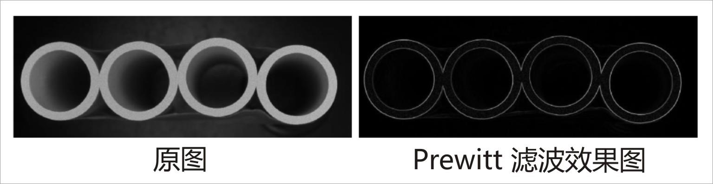

图8  Prewitt滤波效果示意图

        **6、锐化滤波各算法特点对比**

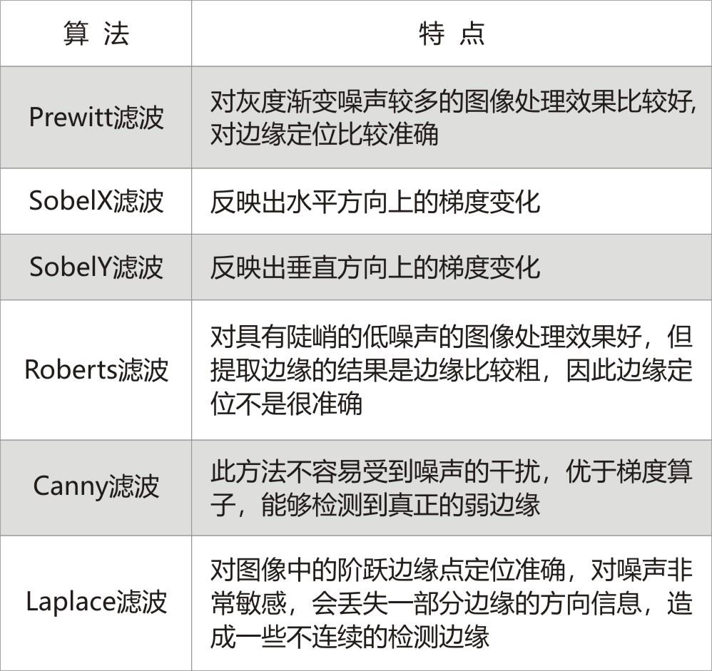

表2  锐化滤波各算法对比

**四、自定义滤波**

        自定义滤波是将源图像与滤波核进行卷积。用户可以自己设定滤波核的大小，设定滤波核内的算法内容，实现灵活多变的滤波效果。设置界面如图9所示。

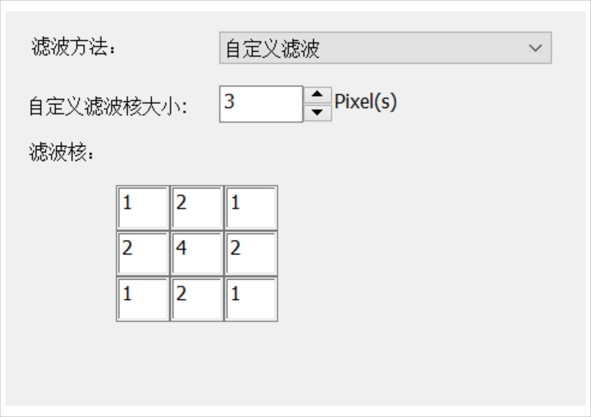

图9  自定义滤波参数设置

        例如，定义3\*3的滤波核尺寸算法内容设为：

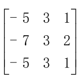

        滤波效果如图10。

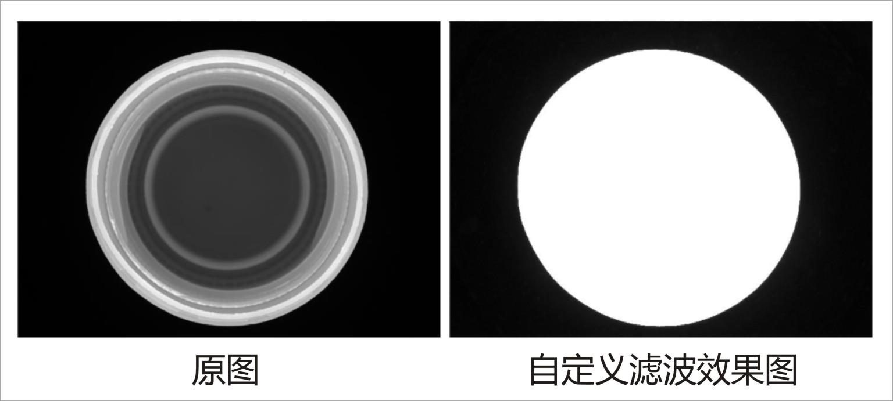

图10  自定义滤波效果示意图

        以上为OPT小讲堂之Smart智能视觉软件操作培训第四课内容，如有任何问题欢迎在留言区留言或来电咨询，全国服务热线400-0769-068。

# [OPT小讲堂第五课 ∣ smart图像增强之形态学](https://www.optmv.com/content/details114_4311.html)

        形态学图像处理的基本原理，可以简单理解为利用结构元素作为“探针”在图像中不断的移动，在此过程中收集图像的信息，分析图像各部分间的逻辑关系，从而了解图像的结构特征。最基本的形态学运算有腐蚀、膨胀、开运算、闭运算等。用这些算子及其组合来进行图像形状和结构的分析及处理，可以解决噪声抑制、特征提取、边缘检测、形状识别、纹理分析、图像恢复与重建等方面的问题。

**一、参数设置**

        点击形态学中的“设置”按钮，打开设置参数界面，如图1。

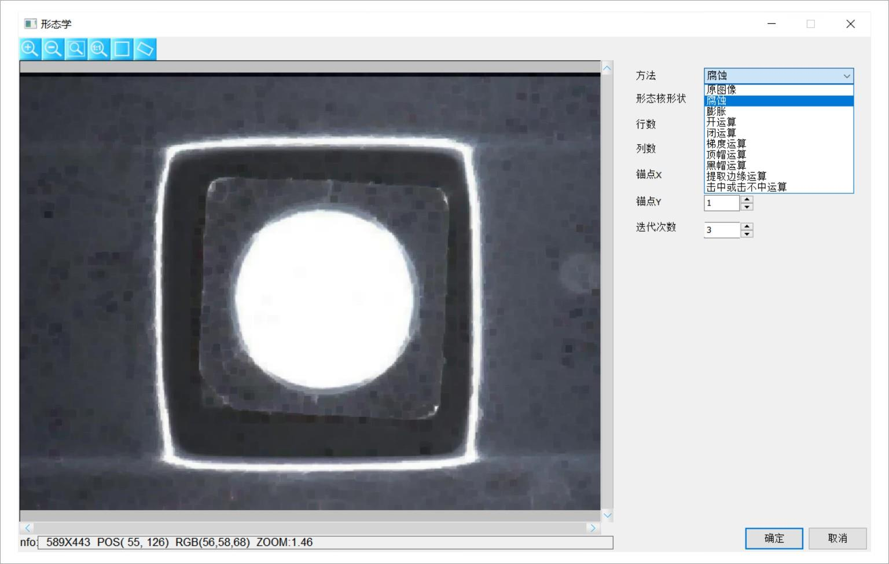

图1  形态学工具界面

        **1、设置方法：**点击下拉框，可选择腐蚀、膨胀、开运算、闭运算、梯度运算、顶帽运算、黑帽运算、提取边缘运算、击中或击不中运算，这些方法可以在灰度及彩色图像中使用。

        **2、形态核形状：**包括矩形、十字交叉、椭圆。

        **3、行数/列数：**行数和列数构成形态核的大小，形态核大小=行数×列数。

        **4、锚点X/Y：**形态核锚点的坐标位置。锚点的X/Y坐标值小于形态核的行数和形态核的列数，当锚点X/Y设置为-1，表示锚点位于形态核X/Y的中心位置上。

        **5、迭代次数：**形态学方法处理次数。

**二、形态学方法**

        **1、腐蚀**

        腐蚀的算法：用结构元素作为“探针”在图像上按规律移动，每次移动收集图像上被结构元素覆盖的所有像素值，取其中最小值去替换此次图像与锚点对应位置的像素值。

        腐蚀，简单理解就是消除边界点，使边界向内部收缩的过程，可有效去除噪声，消除图像中较小的干扰信息，效果如图2。

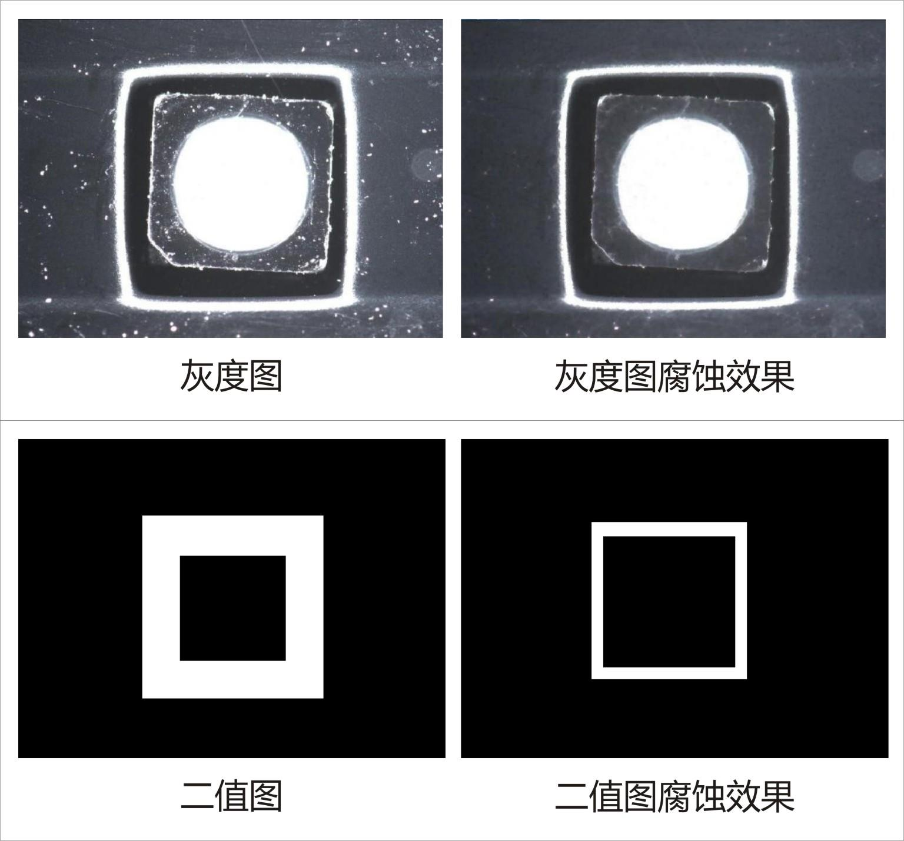

图2  腐蚀效果图

        **2、膨胀**

        膨胀的算法：用结构元素作为“探针”在图像上按规律移动，每次移动收集图像上被结构元素覆盖的所有像素值，取其中最大值去替换此次图像与锚点对应位置的像素值。

        膨胀，将与物体接触的所有背景点合并到该物体中，使边界向外部扩张的过程。可有效填补划痕、孔洞等，效果如图3。

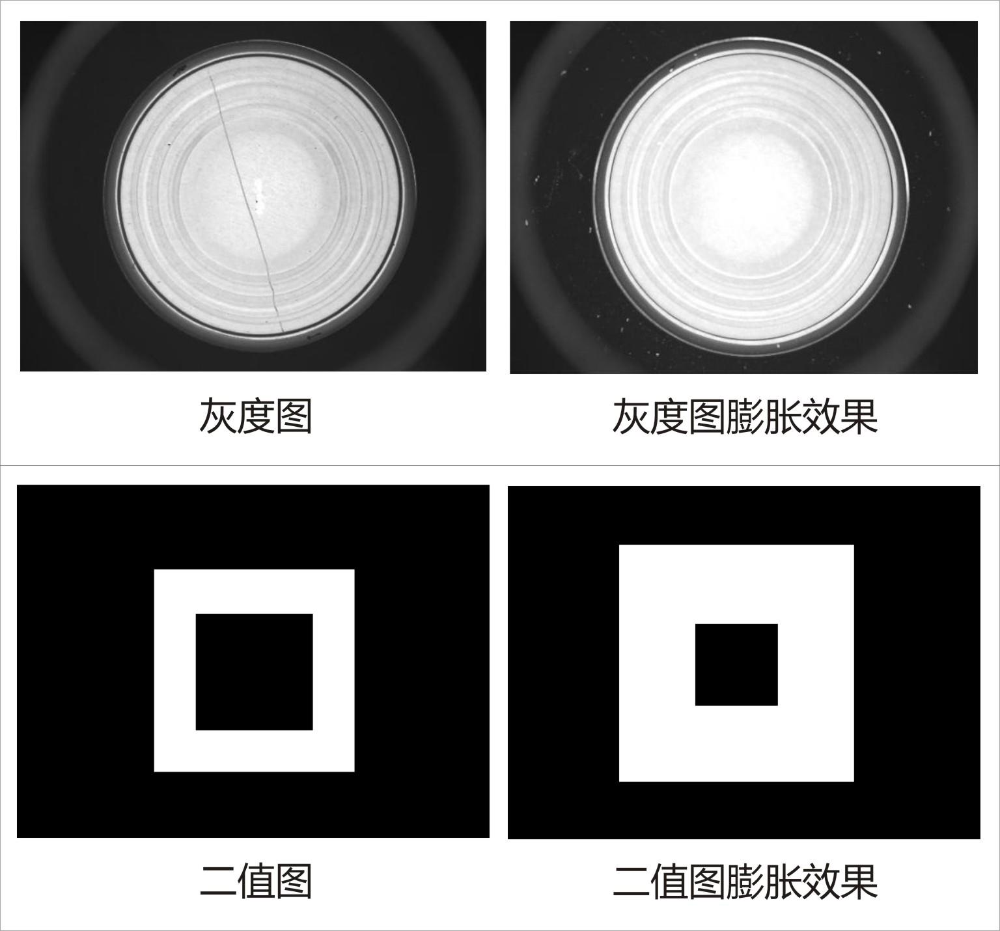

图3  膨胀效果图

        **3、开运算和闭运算**

        **开运算：**先腐蚀后膨胀的过程。用来消除小物体、在纤细处分离物体、平滑较大物体的边界的同时并不明显改变其面积。

        **闭运算：**先膨胀后腐蚀的过程。用来填充物体内细小空洞、连接邻近物体、平滑其边界的同时并不明显改变其面积。效果如图4。

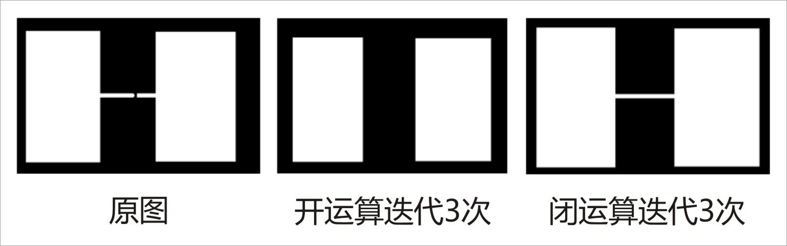

图4  开运算与闭运算效果图

        **4、梯度运算**

        梯度运算：膨胀图与腐蚀图之差。

        膨胀用于粗化一幅图像中的区域，而腐蚀则是细化区域。图像膨胀处理后减去腐蚀后的图像得到一幅形态学梯度的图像，强调了区域间的边界。效果如图5。

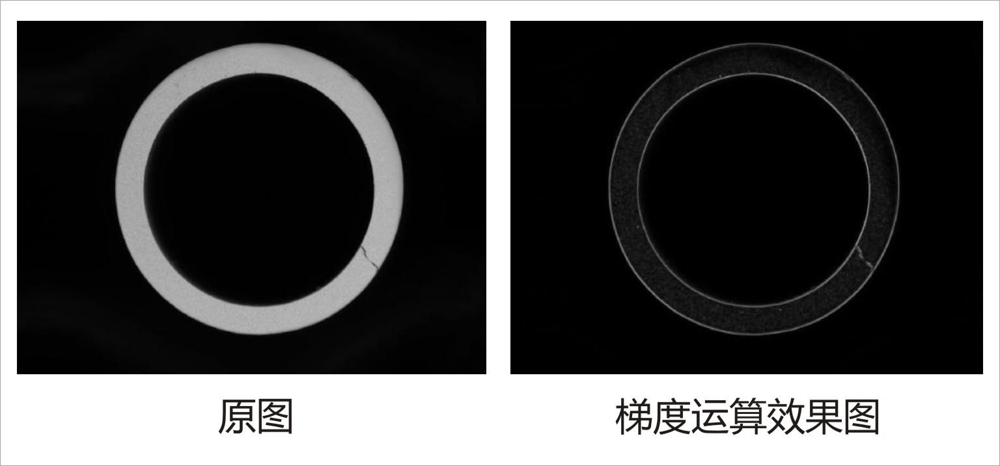

图5  梯度运算效果示意图

        **5、顶帽运算和黑帽运算**

        **顶帽运算：**源图像与开运算图之差。

        **黑帽运算：**源图像与闭运算图之差。

        开运算和闭运算与图像相减相结合，产生顶帽变换和底帽变换。顶帽变换用于暗背景上的亮物体，而底帽变换则用于相反的情况，所以也分别称白顶帽变换和黑底帽变换。效果如图6。

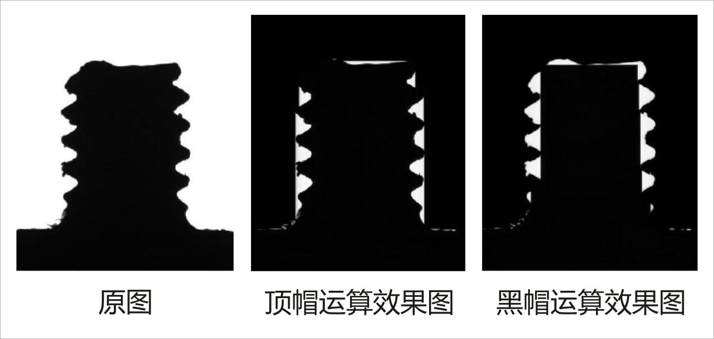

图6  顶帽运算与黑帽运算效果示意图

        **6、提取边缘运算**

        提取边缘运算：源图像与腐蚀图之差。对图像进行腐蚀，然后用源图像减去腐蚀后的图像即可得到边缘。相对于其他算法，这种算法更准确地判定了边缘及其方向，很好地保持了边缘细节。效果如图7。

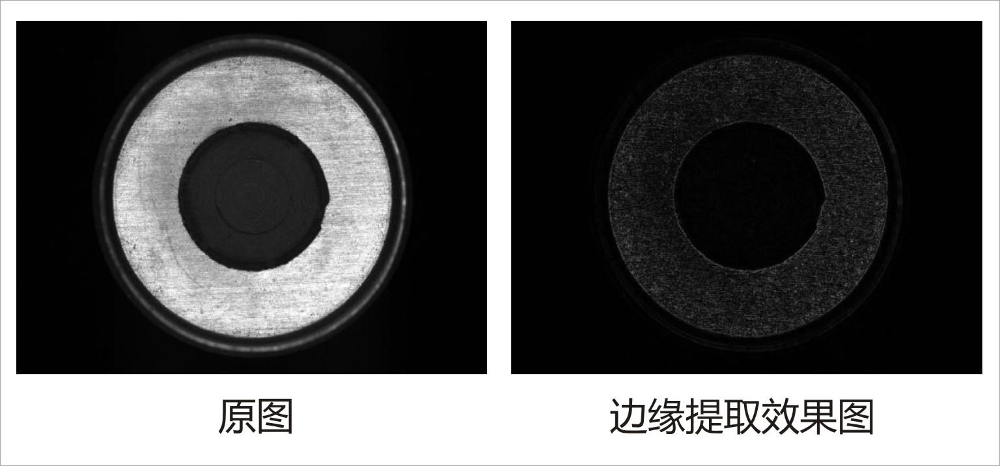

图7  边缘提取效果示意图

        **7、击中或击不中运算**

        HMT变换可以同时探测图像的内部和外部。在研究图像中的目标物体与图像背景之间的关系上，HMT能够取得很好的效果，所以常被用于解决目标图像识别和模型识别等领域。效果如图8。

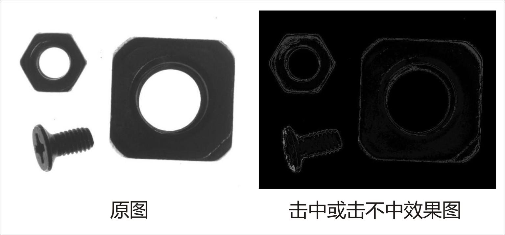

图8  击中或击不中运算效果示意图

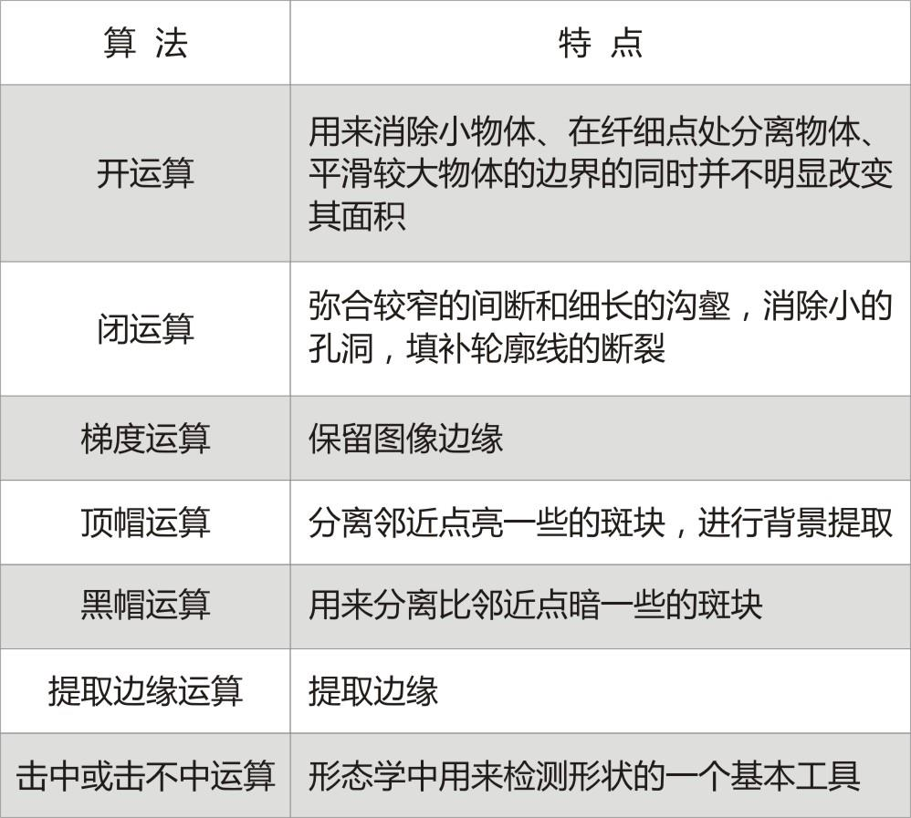

表1  算法特点对比

        以上为OPT小讲堂之Smart智能视觉软件操作培训第五课内容，如有任何问题欢迎在留言区留言或来电咨询，全国服务热线400-0769-068。

# [OPT小讲堂第六课 ∣ Smart图像增强之二值化](https://www.optmv.com/content/details114_4310.html)

        图像二值化(Image Binarization)简单理解就是通过适当的高低阈值将256个亮度等级的图像转换为二值图。本文中提及的二值图像均指灰度值为0(黑色)或255(白色)的图像。

        在数字图像处理中，二值图像有着非常重要的作用。图像的二值化有利于图像的进一步处理，使图像变得简单，而且数据量减小，能突出感兴趣目标。以下主要讲解如何对单通道灰度图像和三通道彩色图像进行二值化处理。

**二值化(灰度)**

**一、参数介绍**

        单击二值化(灰度)图标，弹出二值化(灰度)工具常规页面。点击设置，进入到二值化(灰度)参数设置界面，如图1：

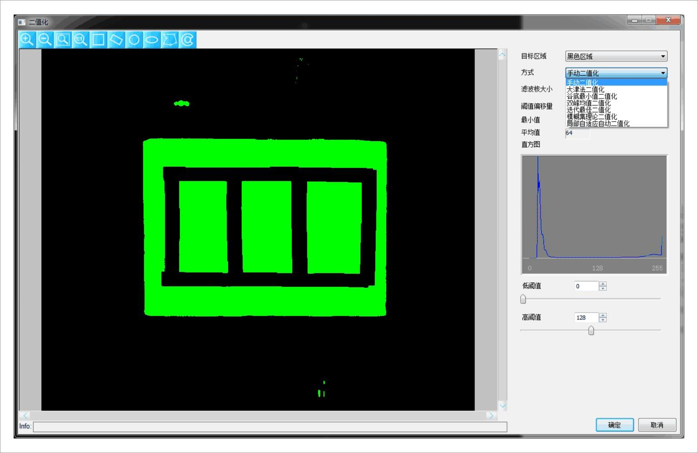

图1  二值化(灰度)参数设置界面

        **1、阈值区间**

        阈值区间是从低阈值起到高阈值组成的区间，阈值的取值范围是\[0,255\]，且低阈值小于或等于高阈值，如图2。

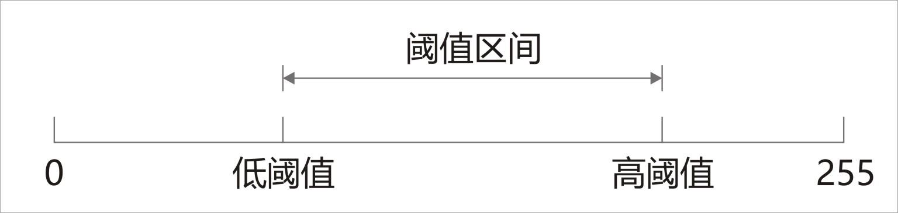

图2  阈值区间示意图

        **2、目标区域**

        图像中灰度值在阈值区间范围内的像素集合即为目标区域。

        1)选择黑色目标时：目标区域的灰度值置为0，否则为255。

        2)选择白色目标时：目标区域的灰度值置为255，否则为0。

        在阈值区间为\[0, 128\]时，分别选择黑色目标和白色目标，二值化后的效果图如图3。

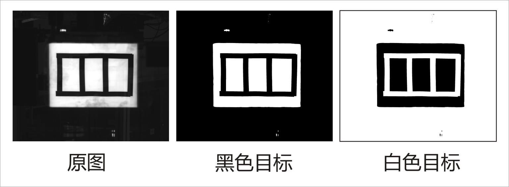

图3  选择不同目标区域时二值化效果图

        **3、灰度直方图概念**

        灰度直方图描述了一幅图像中某一个通道的灰度统计信息，主要应用于图像分割和图像灰度变换等处理过程中。从图形上来说，灰度直方图就是一个二维图，横坐标表示灰度值(灰度级别)，纵坐标表示具有各个灰度值或者灰度级别的像素在图像中出现的次数或者概率，如图4。

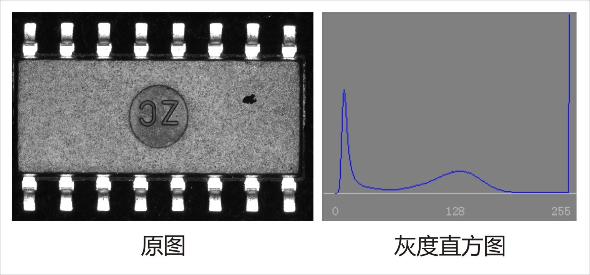

图4  灰度直方图示意

        **4、二值化方式(确定阈值的方式)**

        1)手动二值化：通过手动调节阈值实现图像二值化。

        2)大津法二值化：图像根据灰度直方图分布，采用OTSU算法自动计算阈值，对整张图像进行二值化处理。

        3)迭代最佳二值化：该方法先假定一个阈值，然后计算在该阈值下的前景和背景的中心值，当前景和背景中心值的平均值和假定的阈值相同时，则迭代中止，并以此值为阈值进行二值化。

        4)模糊集理论二值化：基于模糊集理论求出合理阈值(加强版的迭代最佳二值化)。

        5)谷底最小值二值化：该方法适用于具有明显双峰直方图的图像，其寻找双峰的谷底作为阈值。

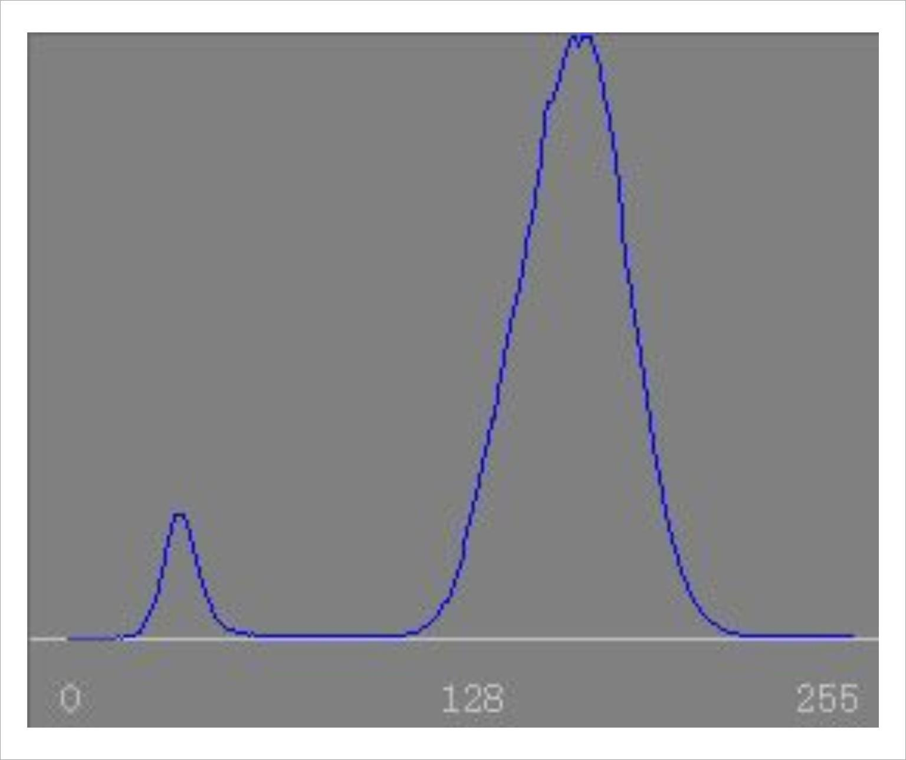

图5  双峰灰度直方图示意图

        6)双峰均值二值化：具有明显双峰直方图的图像，将双峰的平均值作为阈值进行图像二值化。

        7)局部自适应二值化：根据邻域块的大小，自动计算邻域块内图像局部阈值，利用局部阈值对局部图像进行二值化。同理计算其余部分图像进行二值化。

**二、算法对比**

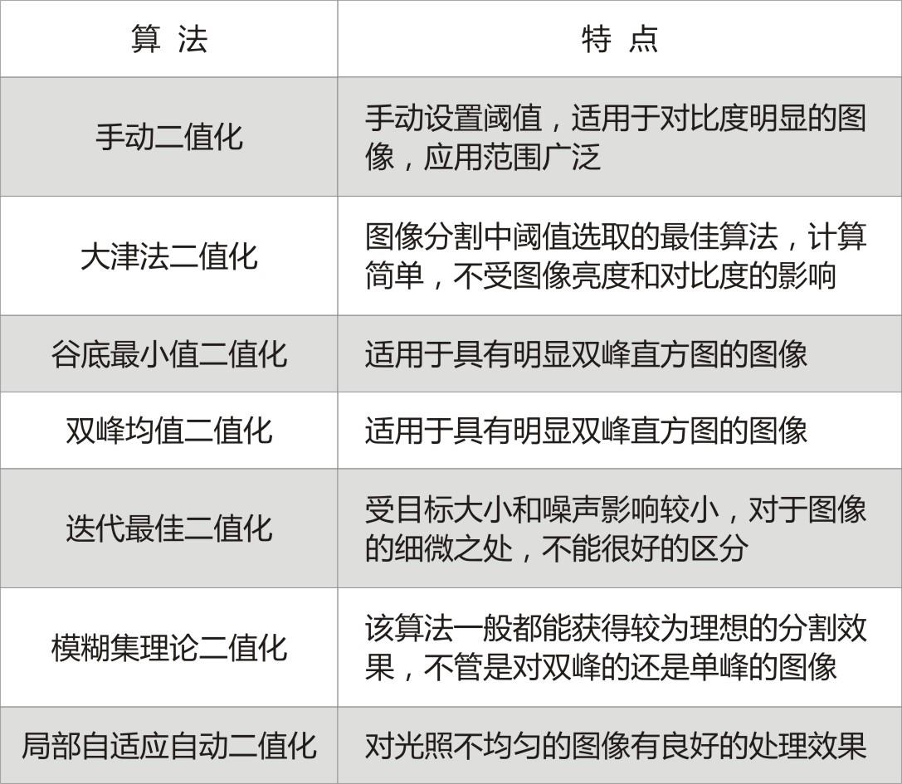

表1  二值化算法对比

**二值化(彩色)**

**一、图像通道**

        数字图像中，每个彩色图像都由多个图像通道组成，图像通道数以及每个通道的含义都取决于其颜色空间模式。如常见的RGB颜色空间模式下，一幅彩色图像可以分成R(红)，G(绿)，B(蓝)三个图像通道，如图6所示：

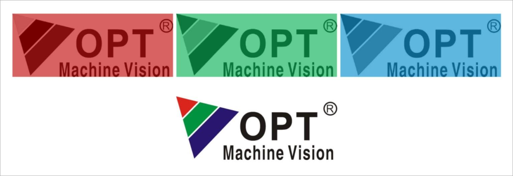

图6  RGB颜色空间模式

**二、颜色空间模式**

        颜色空间也称彩色模型(又称彩色空间或彩色系统)，它的用途是在某些特定标准模式下用通常可接受的方式对彩色加以说明。这些特定标准模式称为颜色空间模式，常见颜色空间模式如下：

        1、RGB模式：基于颜色的加法混色原理，从黑色不断叠加Red，Green，Blue的颜色，最终可以得到白色光。将R、G、B三个通道作为笛卡尔坐标系中的X、Y、Z轴，就得到了一种对于颜色的空间描述。

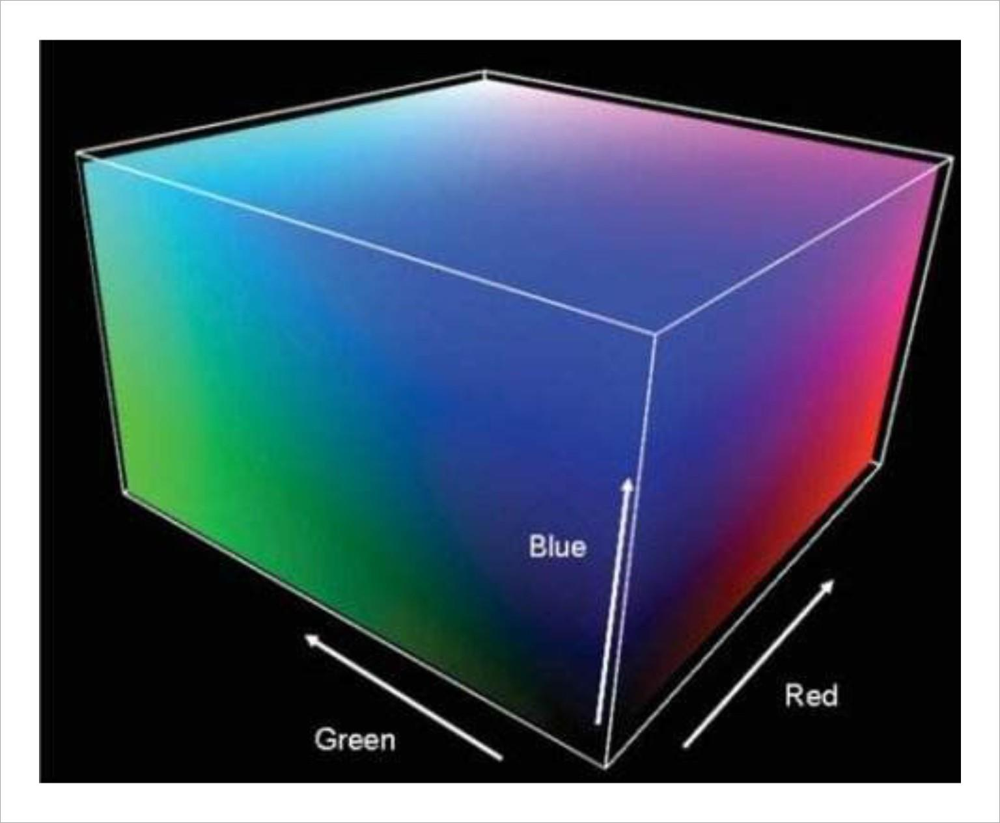

图7  RGB模式笛卡尔坐标系

        2、HSL模式：该模式认为颜色可以用色调(H:hue)，饱和度(S:saturation)，亮度(L:Lightness)进行描述。这是根据人观察色彩的生理特征而提出的颜色模型。

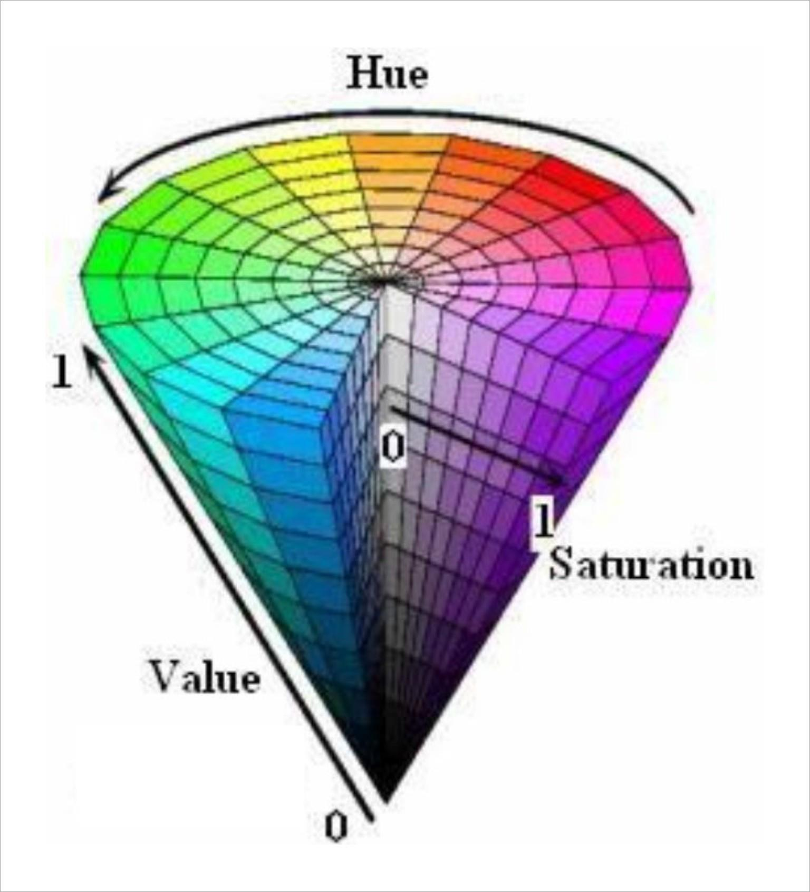

图8  HSV空间模式

        3、HSV模式：与HSL类似，该模式下亮度(L:Lightness)替换为明度(V:Value)。

        4、HSI模式：与HSL类似，该模式下亮度(L:Lightness)替换为强度(I:Intensity)。

**三、二值化(彩色)算法原理**

        彩色二值化算法过程首先是将图像转换到指定的彩色空间模式，然后按设定的阈值对图像各个通道进行灰度二值化，最后对各个二值化结果进行与运算，得到彩色二值化结果。以图9为例，指定颜色空间模式为RGB模式，设定R通道上下限阈值为\[35,227\]，G通道为\[0,142\]，B通道为\[59,187\]，其流程为：

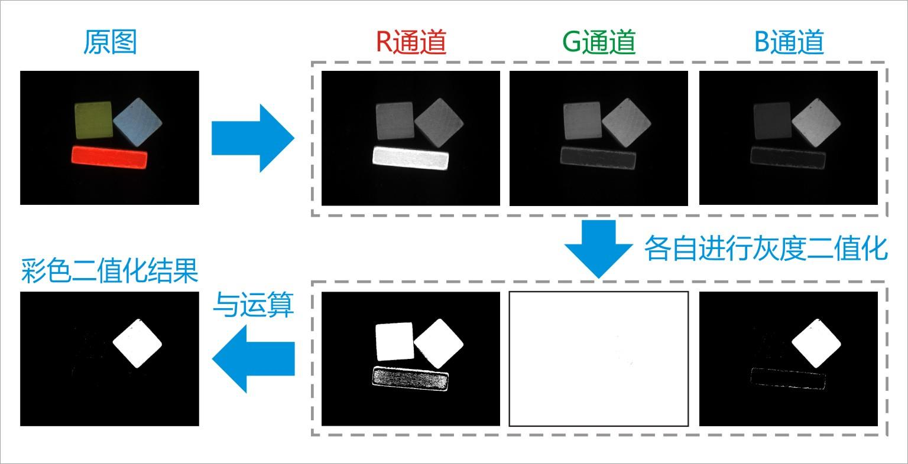

图9  二值化(彩色)算法流程图

**四、参数设置**

        单击二值化(彩色)图标，弹出二值化（彩色）工具常规页面。点击设置，进入到二值化（彩色）参数设置界面，可对参数进行设定，如图10。

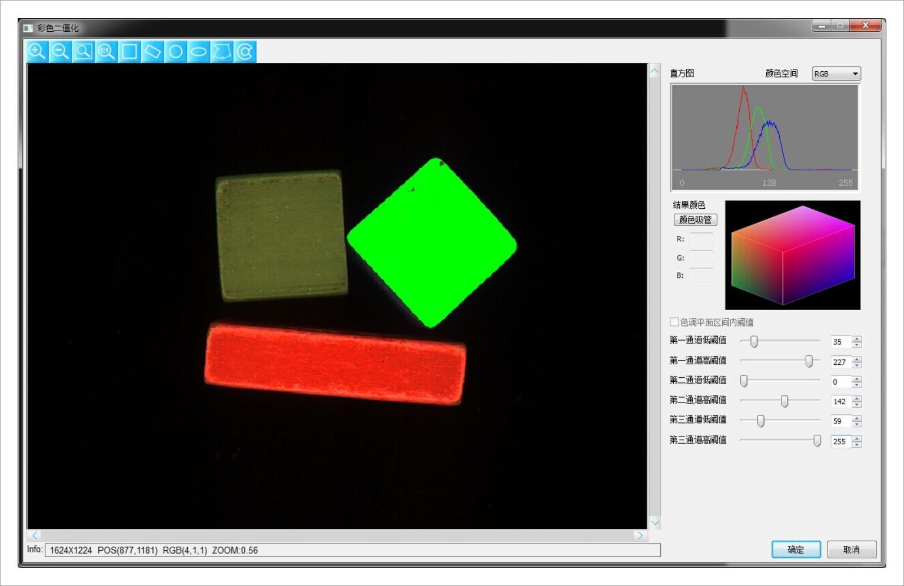

图10  二值化(彩色)参数设置界面

        参数介绍，如图11所示：

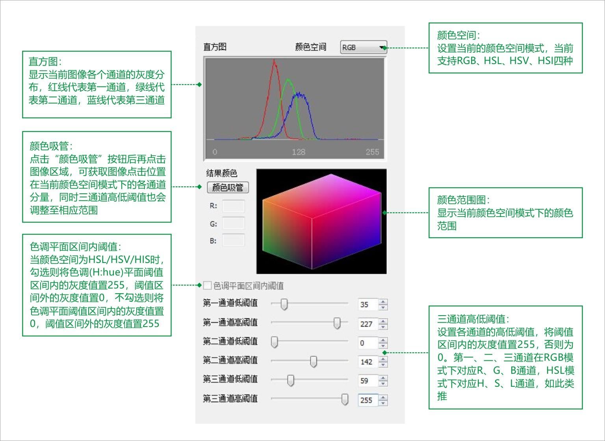

图11  二值化(彩色)参数介绍

        以上为OPT小讲堂之Smart智能视觉软件操作培训第六课内容，如有任何问题欢迎在留言区留言或来电咨询，全国服务热线400-0769-068。

# [OPT小讲堂第七课（上） ∣ Smart图像定位-找边缘点应用(上)](https://www.optmv.com/content/details114_4309.html)

        整个6月OPT先后参加了日本横滨、泰国曼谷和深圳的三场展会。在深圳举办的第23届华南国际工业自动化展展会期间，由OPT软件应用资深工程师现场讲解“功能概述”、“自动对焦”、“光度立体技术”、“标定”等主题，吸引了大量专业观众驻足聆听。今天我们继续讲第七课，Smart图像定位之找边缘点应用。

**什么是图像定位？**

        图像定位，简单理解就是根据一幅图像中已知的特征，作为ROI基准源，从而调整ROI的位置，定位图像中的被检测对象。其特征包括点、直线、圆、几何特征等。

        在定位的实际应用中，找点、找直线和找圆是常规的定位工具，对图像的特征进行定位处理并学会应用是一门非常实用的技巧。让我们一起来看下Smart软件是如何实现的，以及应用场景的分布情况。

        打开Smart智能视觉软件，在主界面右下方工具箱栏点击图像定位的图标。在图像定位功能列表中可以看到，除找点外，还有灰度匹配、特征匹配、轮廓匹配、ROI校正等功能，如图1所示。

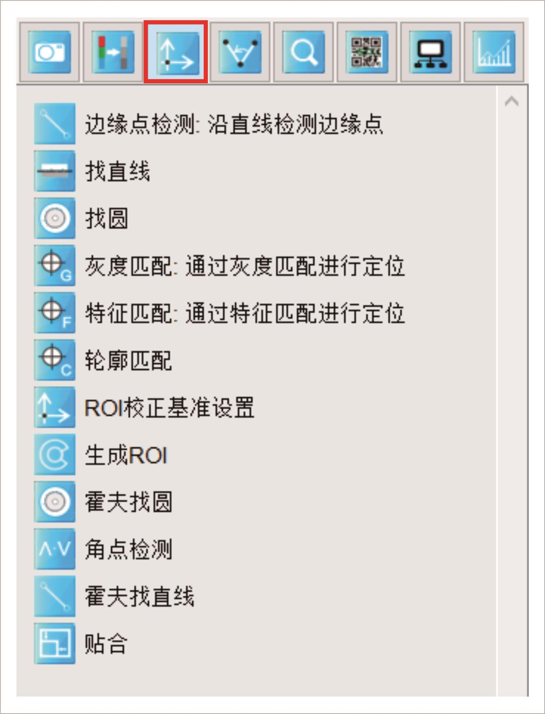

图1  图像定位工具箱

 **什么是找点？**

        首先指定256个亮度等级的灰度图像中要处理的直线ROI区域，按直线ROI搜索方向搜索满足设定条件的边缘点。

**一、找点的工具界面**

        沿直线ROI区域内绿色的点为符合参数条件的边缘点，如图2所示。

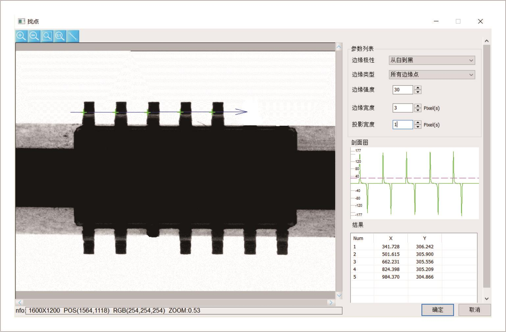

图2  找点工具界面

**二、找点的参数设置**

        剖面图解析：显示沿直线ROI各个边缘点的强度剖面图。绿色的线代表梯度，紫色的线代表当前边缘强度值，如图3。

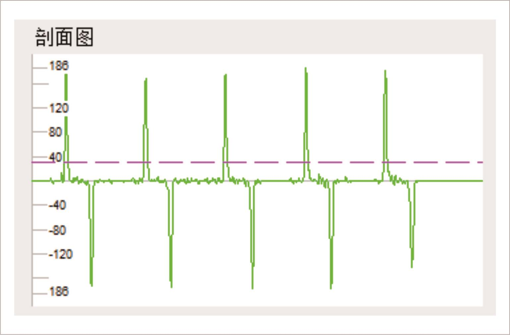

图3  边缘点剖面图示意

        边缘极性：指定用于确定边缘的像素强度过渡类型。

        (1)从黑到白，表示沿搜索线方向，搜索灰度由暗到亮变化的边缘点。

        (2)从白到黑，表示沿搜索线方向，搜索灰度由亮到暗变化的边缘点。

        (3)所有，指搜索任意极性的所有边缘点。

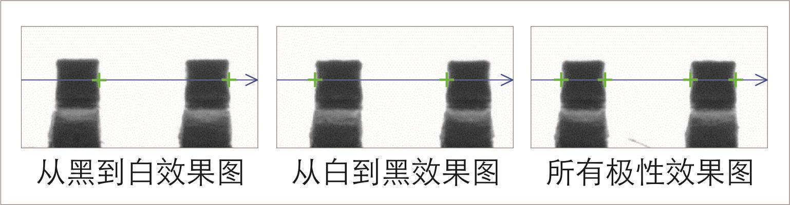

图4  边缘极性效果示意图

        边缘类型：指定在图像中找到的边缘点的边缘类型。

        (1)第一个边缘点，是指沿搜索线方向根据设定条件搜索到的第一个满足条件的点，如图5。

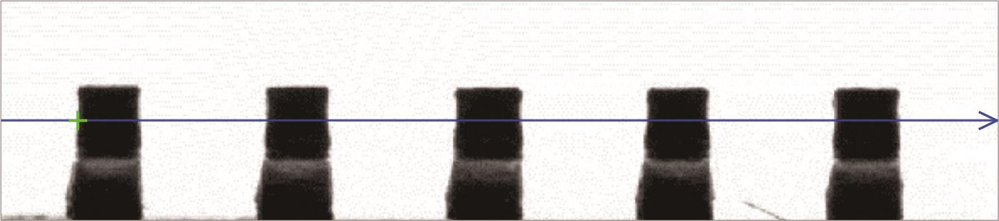

图5  第一个边缘点示意图

        (2)第一个和最后一个边缘点，是指沿搜索线方向根据设定条件搜索到的第一个和最后一个满足条件的边缘点，如图6。 

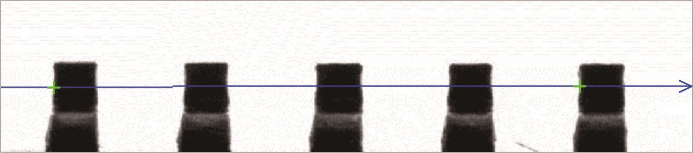

图6  第一个和最后一个边缘点示意图

        (3)最佳边缘点，是指沿搜索线方向根据设定条件搜索到的灰度值差最大的边缘点，如图7。

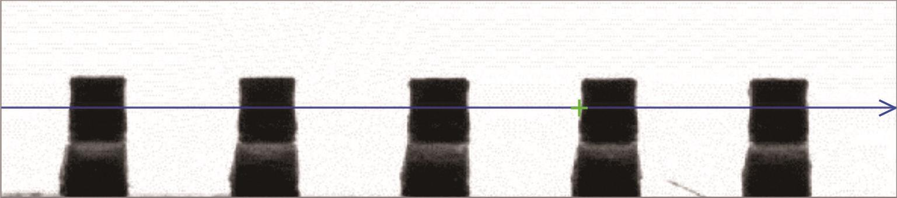

图7  最佳边缘点示意图

        (4)所有边缘点，是指沿搜索线方向根据设定条件搜索所有满足条件的边缘点，如图8。

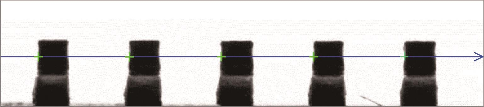

图8  所有边缘点示意图

        边缘强度：沿搜索线方向，边缘宽度对应的两像素点的灰度值之差。

        投影宽度：为降低噪声干扰，在垂直搜索线的方向上，取左右两侧相邻n个像素的均值作为该点的灰度值，其中n即为投影宽度。如图9，n=2。

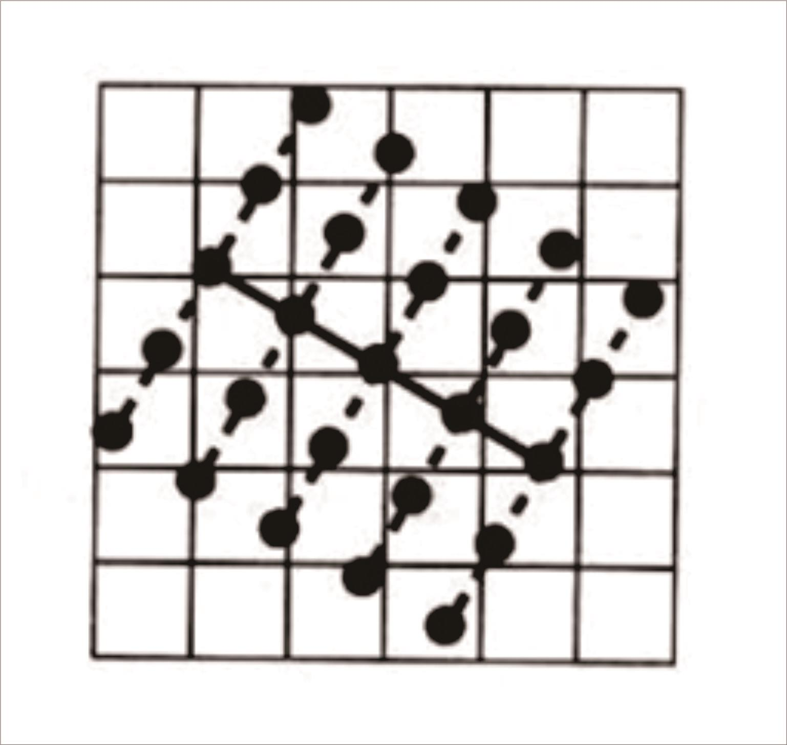

图9  投影宽度示意图        

        边缘宽度：考虑到图像中边缘是渐变的，因此计算采用沿搜索线方向边缘点前后相邻的n个像素的灰度，其中n为边缘宽度，如图10所示。

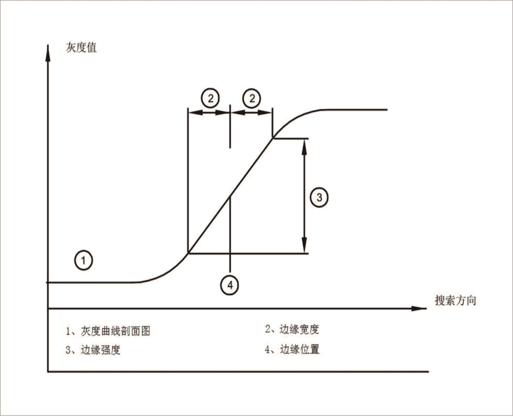

图10  边缘点检测参数定义

**三、找点参数影响**

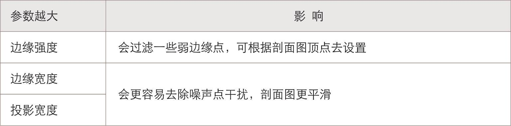

表1  找点参数简表

**四、找点应用场合举例**

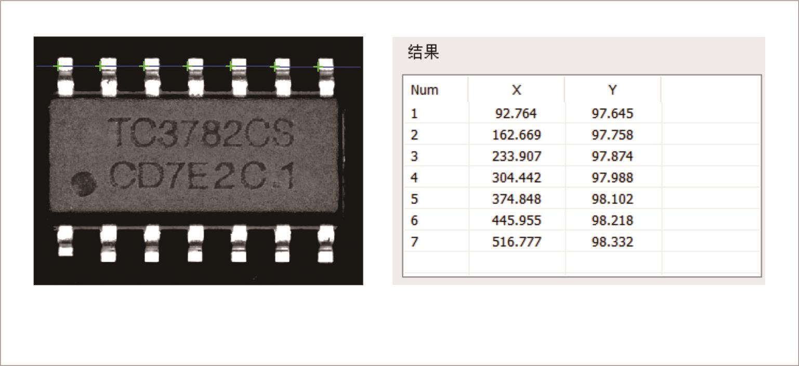

图11  找点实例示意图

        ● 我们通过边缘点的数量可以得到引脚个数，从而判断产品是否缺损；

        ● 通过坐标数据计算对比，检测产品的规格。

**什么是找直线？**

        找直线工具是在256个亮度等级的灰度图像中，设定正矩形或斜矩形ROI区域，在ROI区域内，对每一条搜索线，按照设定的方向和适当的阈值搜索满足条件的边缘点。然后通过底层的拟合算法，将满足条件的边缘点按照最小二乘法、剔除比例、剔除距离拟合成直线。

**一、找直线工具界面**

        ROI框内的绿色直线为满足设定参数条件拟合成的直线。

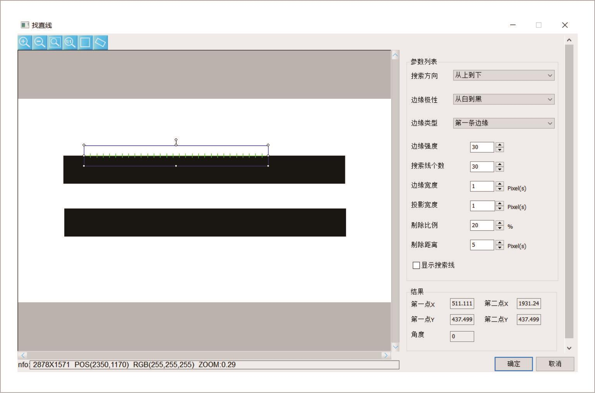

图12  找直线工具界面

**二、找直线参数设置**

        搜索方向：ROI区域内边缘点搜索线的搜索方向(极性为从白到黑)，如图13。

        从上往下：从上往下搜索边缘点。

        从下往上：从下往上搜索边缘点。

        从左往右：从左往右搜索边缘点。

        从右往左：从右往左搜索边缘点。

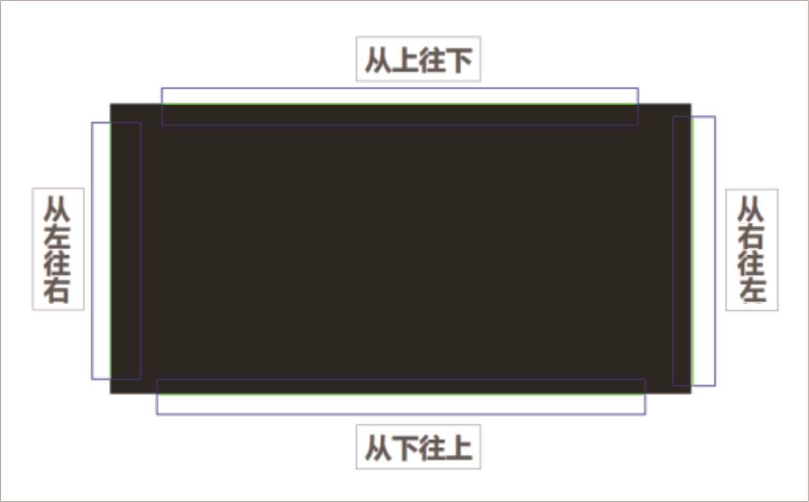

图13  找直线搜索方向示意图

        搜索线个数：设置ROI区域内搜索线的条数。如图14所示。

        显示搜索线：勾选框被选中，则在图像上ROI区域显示搜索线，否则不显示。

        左图搜索线个数为60且显示搜索线，右图搜索线个数为20且不显示搜索线。

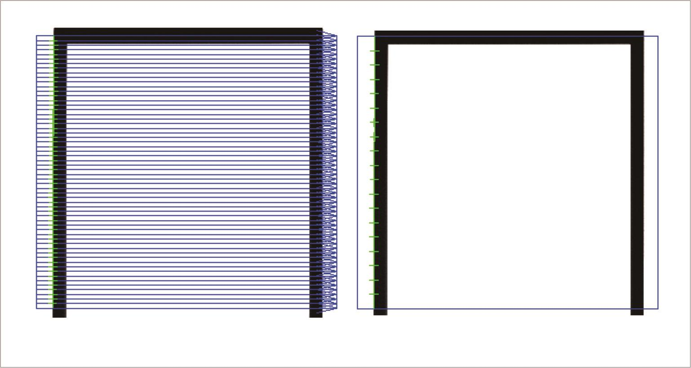

图14  搜索线效果示意图

        剔除比例：所拟合的直线按照比例剔除偏移较远的点。被剔除的点将呈红色。

        剔除距离：计算所有参与直线拟合的边缘点到拟合直线的距离，与拟合直线的距离大于剔除距离的边缘点将被剔除。

**三、找直线参数影响**

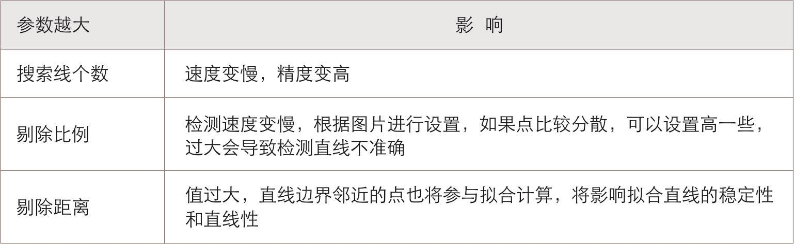

表2  找直线参数简表

**四、找直线应用场合举例**

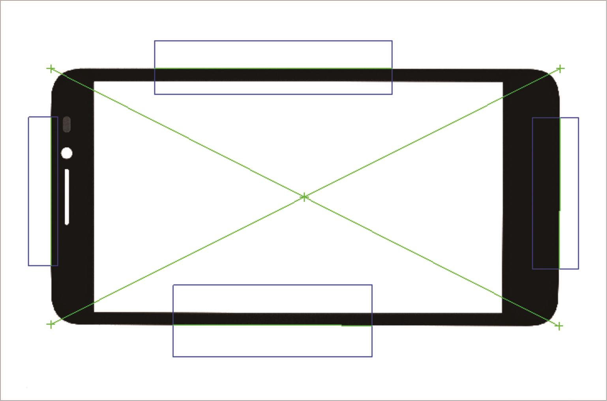

图15  找直线应用示意图

        ● 用于产品精定位：通过找两直边，运用几何关系可以得到其直线交点，然后可通过4个交点分别拟合成两直线，再运用直线交点可得到产品的中心点。

**什么是找圆？**

        找圆算法的基本原理，在256个亮度等级的灰度图像中设定圆环形ROI区域，在ROI区域内，对每一条搜索线，按照设定的方向和适当的阈值搜索满足条件的边缘点。然后通过底层的拟合算法，将满足条件的边缘点按照最小二乘法、剔除比例拟合成圆。

**一、找圆工具界面**

        图16中绿色点即为满足参数条件的点，由这些点拟合成的圆即为找到的圆。

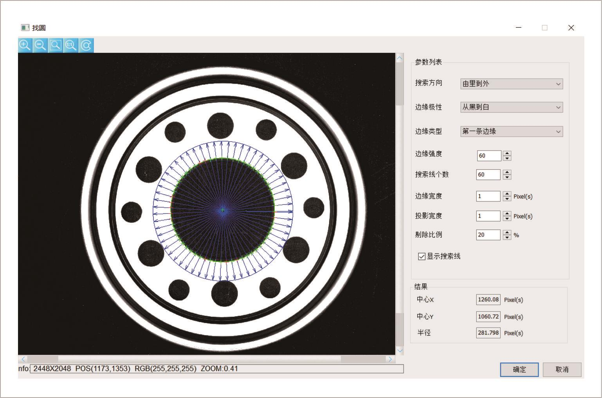

图16  找圆工具界面

**二、找圆参数设置和参数影响**

        与找直线算子类似，这里不再重复叙述。

**三、找圆应用场合举例**

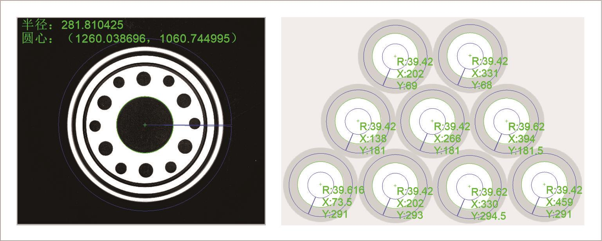

图17  找圆应用举例

        ● 用于圆孔定位、测量等案例；

        ● 可以直接测量出圆孔型产品的孔径和中心，判定产品的规格情况。

        以上为OPT小讲堂之Smart智能视觉软件操作培训第七课的上篇内容，下篇将在近期推出，敬请期待。如对课程有任何问题欢迎在留言区留言或来电咨询，全国服务热线400-0769-068。

# [OPT小讲堂第七课（上）∣ 图像定位-找边缘点应用(下)](https://www.optmv.com/content/details114_1791.html)

**什么是霍夫找圆？**

        霍夫找圆，就是在灰度图像上指定的区域，利用霍夫变换以及约束条件找到合适的多个圆，但是霍夫找圆不能同时找到同心圆的多个圆，只能根据半径去选择想要的圆。

        获取圆心的原理，简单理解，是每个边缘点沿着梯度方向记录像素点位置，查看记录的点是否与其他边缘点的记录点相交，相交则累加1。当某交点的累加次数超过了累加器阈值，则定为候选圆心。如图1，点3累加次数最高，则最有可能是圆心。

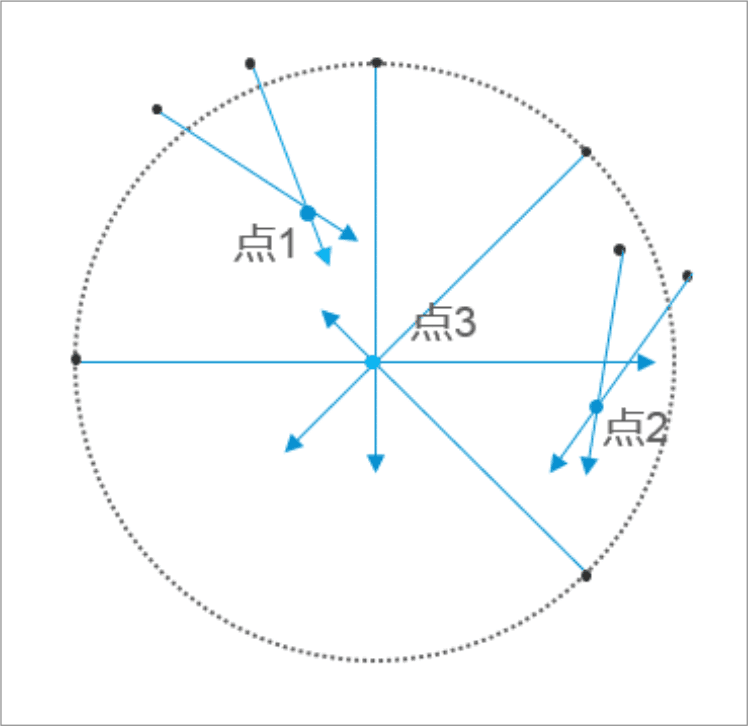

图1  获取圆心的原理示意图

**一、霍夫找圆工具界面**

        如图2所示，ROI框内绿色圆即为检测到符合设定参数条件的圆。

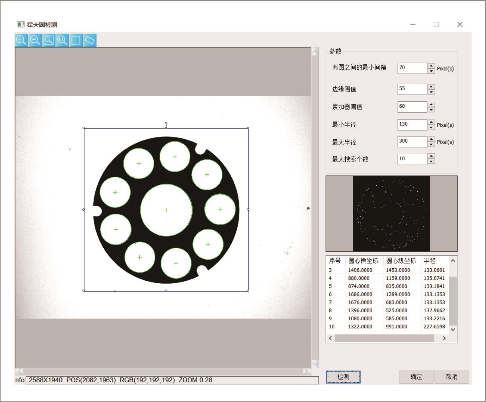

图2  霍夫找圆工具界面

**二、霍夫找圆参数设置**

        **两圆之间的最小间隔：**任意两个圆心之间的距离要大于这个值， 两个圆才会被选取，否则只选择累加值更大的那一个圆，范围是\[1, 1000\]。

        **边缘阈值：**霍夫变换的边缘阈值参数，其值代表Canny运算中的高阈值，Canny运算的低阈值取其一半。边缘图像显示在界面右下的这个小框里面，可以直观地看出阈值调整的结果。范围是\[0, 255\]。

        **累加器阈值：**霍夫变换的累加器阈值，范围是\[1, 1000\]。

        **最小半径：**待检测圆的最小半径，其值小于或者等于最大半径，范围是\[1, 1000\]。

        **最大半径：**待检测圆的最大半径，其值大于或者等于最小半径。最小半径和最大半径设定了检测圆的一个半径范围，只选取在这个范围内的圆，超出这个范围的圆不考虑，范围是\[1, 1000\]。

        **最大的搜索个数：**待检测圆最大检测个数，范围是\[1, 1000\]。

**三、霍夫找圆参数影响**

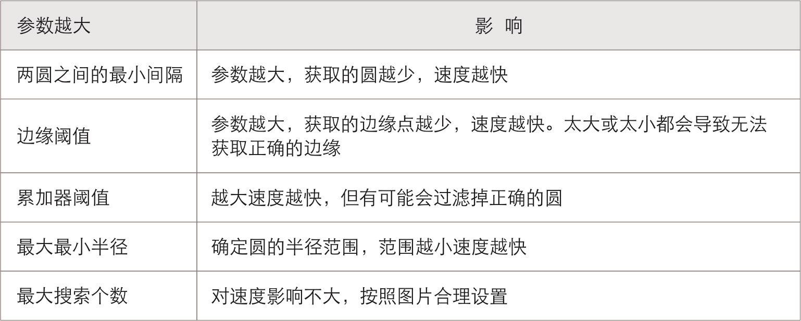

表1  霍夫找圆参数简表

**四、霍夫找圆应用场合举例**

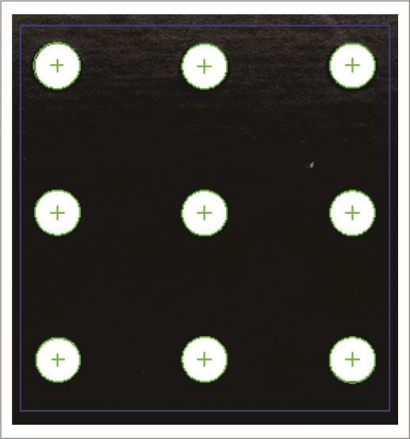

图3  霍夫找圆应用举例

        ● 用于一次性可对多个产品进行定位，给出产品中心位置信息，引导取料、切割和分拣等。

**什么是霍夫找直线？**

        霍夫找直线，就是在灰度图像上指定的区域利用霍夫变换以及约束条件找到合适的多条直线。

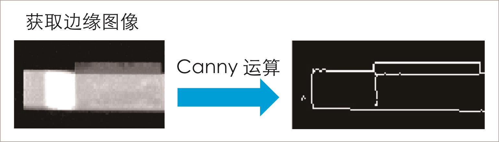

图4  霍夫找直线中获取边缘图像

        梯度值大于Canny高阈值的点被标记为边缘点，梯度值小于Canny低阈值的点则被视为非边缘点。对于梯度值介于两阈值之间的像素点，若其邻域中存在已经被标记的边缘点，则该点也标记为边缘点，否则标记为非边缘点。

**霍夫直线原理**

        霍夫变换定义了一种图像点到累加器空间(霍夫变换)的映射。

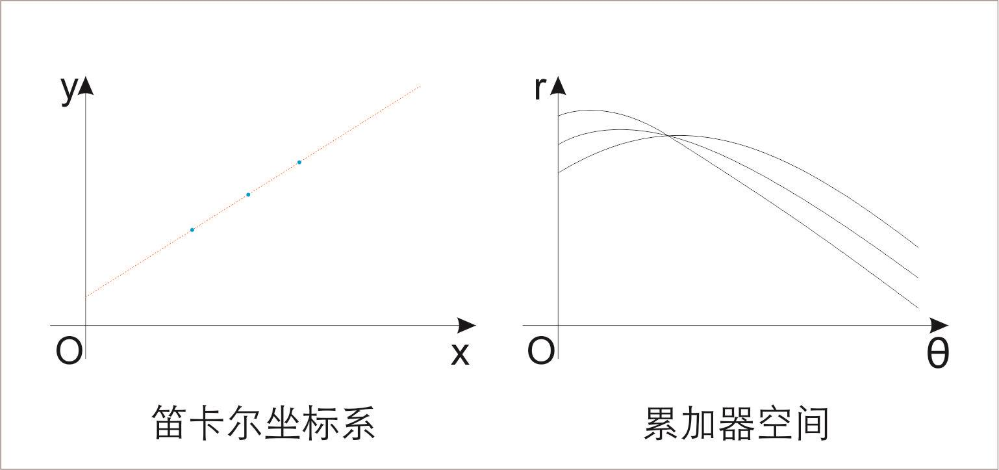

图5  霍夫直线的原理示意图

        如图5所示，同一条直线上的点在累加器空间上相交于同一点，同一条直线上的点越多，累加值则越高。设定某一累加器阈值， 超过该阈值时，确定为候选直线，候选直线再根据多个筛选条件确定最终的直线。

**一、霍夫找直线工具界面**

        绿色直线为满足设定参数条件拟合成的直线，如图6。

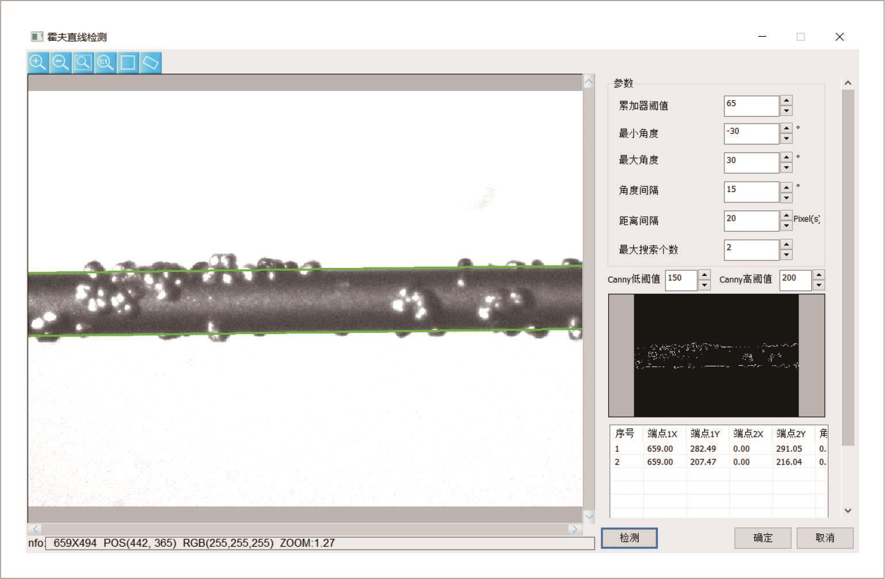

图6  霍夫找直线工具界面

**二、霍夫找直线参数设置**

        **累加器阈值：**霍夫变换累加器阈值参数，范围是\[1, 10000\]。

        **最小角度：**直线的旋转角度的最小值，逆时针为正，顺时针为负，其值小于或者等于最大角度，范围是\[-90, 90\]。

        **最大角度：**直线的旋转角度的最大值，逆时针为正，顺时针为负，其值大于或者等于最小角度，范围是\[-90, 90\]。

        **角度间隔：**两条直线之间角度的最大值，范围是\[0,90\]。

        **距离间隔：**两条直线之间距离的最大值，范围是\[0,10000\]。

        **最大搜索个数：**检测出直线数目的最小值，范围是\[1,1000\]。

**三、霍夫找直线参数影响**

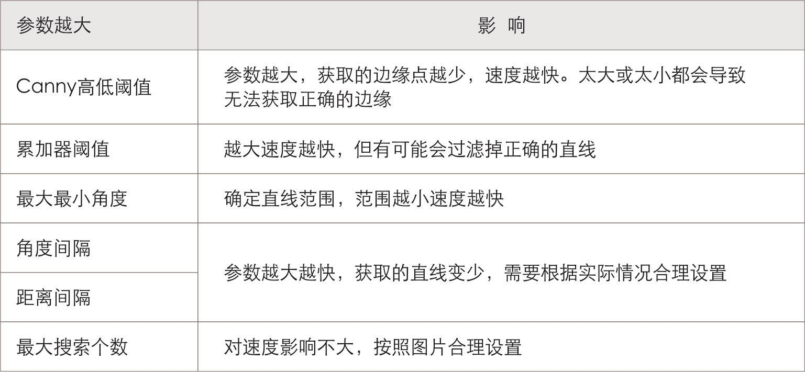

表2  霍夫找直线参数简表

**四、霍夫找直线应用场合举例**

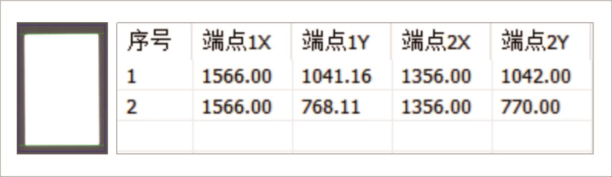

图7  霍夫找直线应用举例

        ● 用于一次性找多条直线，对产品进行距离计算。

        以上为OPT小讲堂之Smart智能视觉软件操作培训第七课(下)的全部内容，如有任何问题欢迎在留言区留言或来电咨询，全国服务热线400-0769-068。
        
        
        

# [OPT小讲堂第八课 ∣Smart图像定位-图像匹配算法](https://www.optmv.com/content/details114_6926.html)

 股票代码：688686

这是OPT小讲堂的第八课，主要讲解图像匹配算法中，灰度匹配、特征匹配、轮廓匹配这三种算法的原理、参数、案例等。

    **什么是图像匹配**

    图像匹配，是指以模板图像作为标准目标，在待匹配图像中寻找与标准目标相似性高的单个或多个目标，根据图像信息如：灰度，梯度等计算不同位置不同角度情况下的相似性，确定目标在图像中的位置以及相对于模板的角度。常用的匹配算法有灰度匹配、特征匹配和轮廓匹配。

    **灰度匹配的原理是什么？**

    灰度匹配是通过利用某种相似性度量，如平均绝对差算法、绝对误差和算法、误差平方和算法、平均误差平方和算法、归一化积相关算法，计算两幅同等大小图像之间的相似度。以模板图像大小为窗口，在不同角度待匹配图像上滑动，计算模板图像与当前窗口覆盖区域的相似性。相似性越高，该覆盖区域为目标的可能性就越大，最终获得目标位置和目标角度。为了提高效率，对模板图像与待匹配图像进行金字塔分解操作；为了提高精度，算法对金字塔图像自顶向下进行搜索，由粗到精匹配，得到更为精准的匹配结果。

    一、灰度匹配的工具界面

  

    图1为灰度匹配的工具界面，右上角灰度图为模板，图像中绿色框内为匹配到的目标物体。

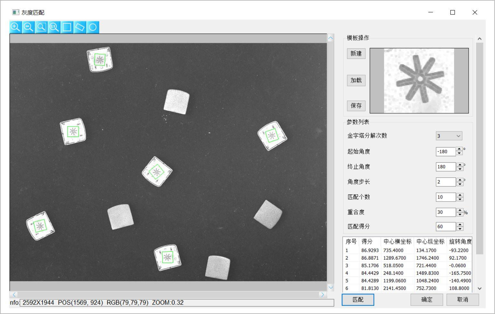

图1  灰度匹配工具界面示意图

    二、灰度匹配的参数设置

    起始角度：旋转匹配时起始搜索角度，其值小于或者等于终止角度。  
    终止角度：旋转匹配时终止搜索角度，其值大于或者等于起始角度。  
    角度步长：旋转匹配时角度的步长。  
    匹配个数：设定匹配目标的个数。  
    重合度：以模板大小的百分之几作为搜索区域，对这片区域内的匹配得分进行非极大值抑制算法。这个百分之几就是通过重合度设置的，输入50表示取模板大小的50%作为搜索区域。范围是\[0,100\]。  
    匹配得分：限制匹配结果的分数。  
    金字塔概念：通过采样，将图像分成不同分辨率的图像。分解级数越高，金字塔分解后图像的分辨率越低，图像尺寸越小，其图像越模糊。如图2。

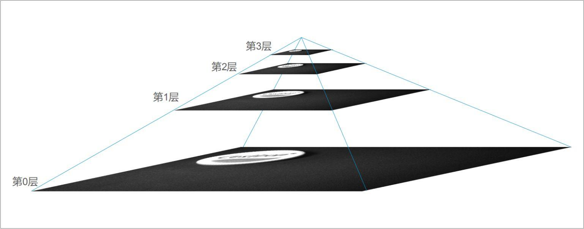

图2  金字塔分解示意图

    金字塔层数：分解级数，图像的分解层次，范围是：\[-1,7\]，“-1”表示自动分层，“0”表示不分层。若选择“自动”，则内部自动计算最大的分解级数。

    三、灰度匹配参数影响

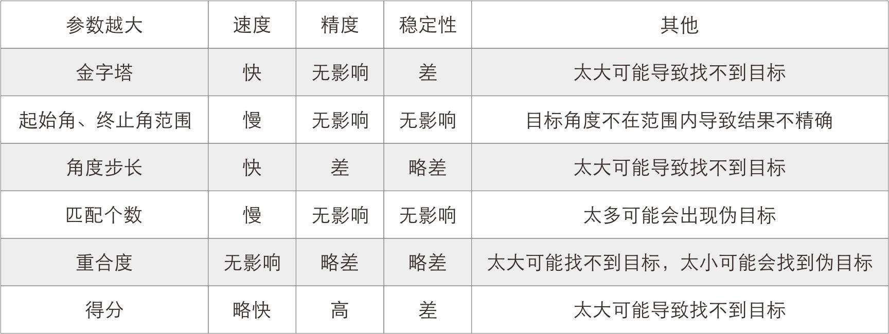

表1  灰度匹配参数影响表

    四、灰度匹配应用案例

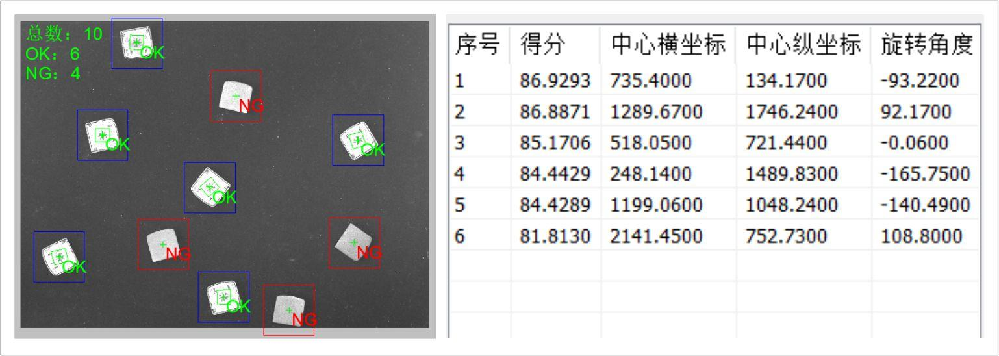

图3  灰度匹配案例

    1、灰度匹配可用于初定位，数据值可在ROI中引用，做基准定位使用；  
    2、通过匹配得分可以剔除一些不符合要求的产品。

    **什么是特征匹配？**

    图像处理中，特征点指的是图像灰度值发生剧烈变化的点，或者在图像边缘上曲率较大的点(即两个边缘的交点)。  
    Hessian矩阵可以求取图像像素曲线中的极大值点和极小值点，即特征点。高斯-拉普拉斯方法能够求取图像的尺度信息，保证图像的尺度不变性。

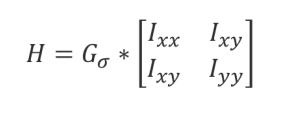  

    如图4(左)，右上角灰度图为模板，图像中绿色框内为匹配到的目标物体。右图为特征点模板编辑界面，可对特征点进行删减等编辑操作。

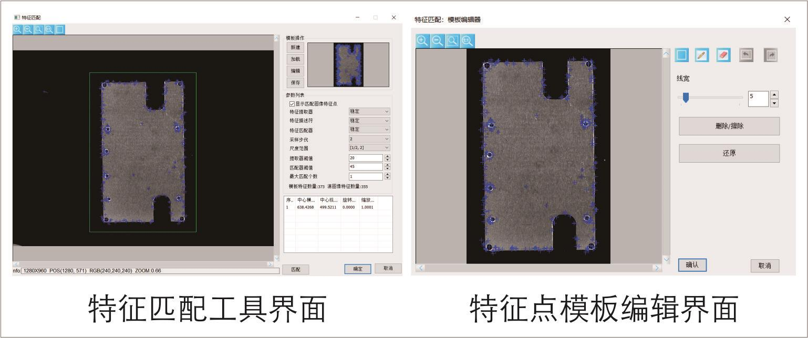

图4  特征匹配工具界面示意图

    二、特征匹配的参数设置  
    特征检测算法：是指特征点检测的算法，有以下几种方法：  
      1)稳定算法：默认算法，速度与稳定性较好。  
      2)快速算法：速度最快，稳定性一般。  
      3)边缘点算法：提取边缘特征点。

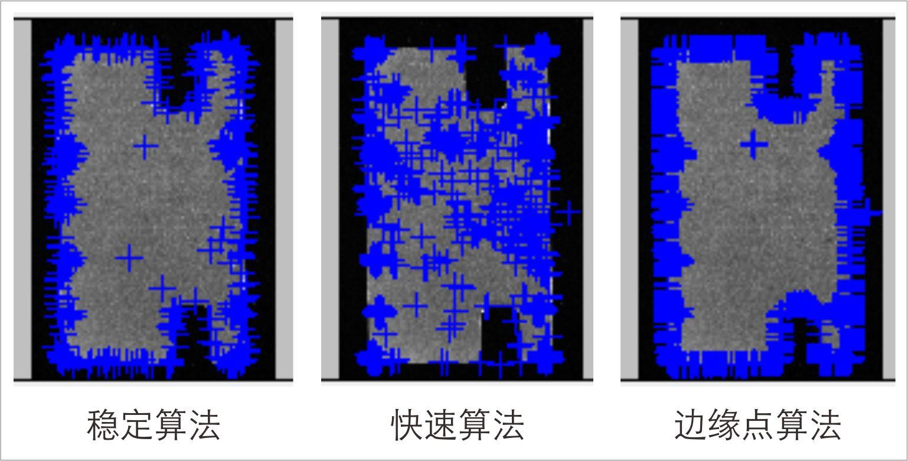

图5  特征点检测的三个算法

    特征描述算法：是指对特征点进行描述的方法，主要有以下几种方法：  
      1)稳定算法：默认算法，速度较快，泛用性稍强。  
      2)快速算法：速度较快，适用于特征点数目较多的情况。

    特征匹配算法：对特征描述符进行匹配的方法。  
      1)稳定算法：速度快，效果稳定，适用场合较广。

    采样步伐：对源图像进行采样的步长。  
    尺度范围：图像的尺度变化范围。  
    提取器阈值：提取器阈值，用于控制特征点数量。  
    匹配阈值：匹配器阈值，用于控制匹配点数量。  
    最大匹配个数：设置最大匹配目标的个数。

    三、特征匹配参数影响

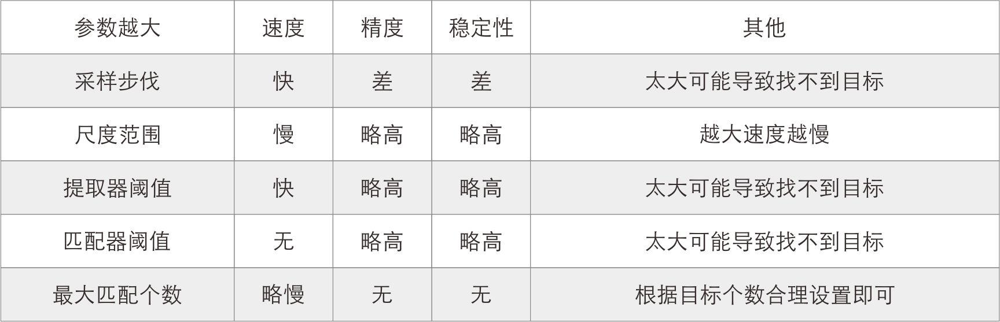

表2  特征匹配参数影响表

    四、特征匹配应用案例

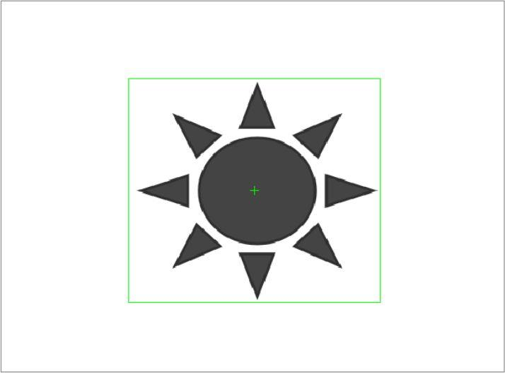

图6  特征匹配案例

    1、可用于初定位，数据值可在ROI中引用，做基准定位使用；  
    2、根据产品的局部特征，对产品进行匹配。在特征较为明显的产品中使用，可判断产品有无。

    **什么是轮廓匹配？**

    轮廓匹配的特点：图像的边缘可以不连续，或可以有遮挡或断裂；可识别部分重合的物体；可方便的计算匹配得分，判断匹配程度。  
    模板轮廓提取：根据Canny高低阈值，利用Canny算子提取轮廓，再根据长度筛选出符合要求的阈值。  
    方向向量：此处定义任一轮廓点的方向向量为该点强度变化最大的方向。如果两个像素点的方向向量越接近说明两个点越相似。  
    相似度量：模板相对图像滑动，每滑动一个步长，图像上和模板轮廓点相应的像素计算相关性(如下图公式)，结果越大，越相似。

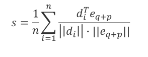

    一、轮廓匹配的工具界面

    图7为轮廓匹配工具界面，右上角蓝色轮廓为模板，图像中绿色框内为匹配到的目标物体。

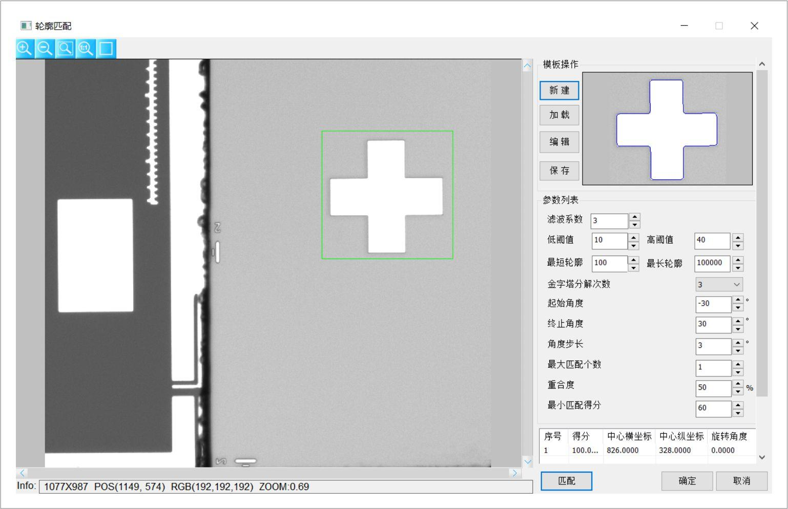

图7  轮廓匹配工具界面示意图

    二、轮廓匹配的参数设置

    滤波系数：滤波系数，范围是\[0.1,50\]。  
    低阈值：Canny边缘检测低阈值，其值小于高阈值，范围是\[0,255\]。  
    高阈值：Canny边缘检测高阈值，其值大于低阈值，范围是\[0,255\]。  
    最短轮廓：Canny边缘检测最短轮廓，其值小于或者等于最长轮廓，范围是\[1,100000\]。  
    最长轮廓：Canny边缘检测最长轮廓，其值大于或者等于最短轮廓，范围是\[1,100000\]。  
    金字塔分解次数：金字塔分级层数，范围是：\[-1,7\]，“-1”表示自动分层，“0”表示不分层。若选择“自动”，则内部自动计算最大的分解级数。  
    起始角度：旋转匹配时搜索的起始角度，其值小于或等于终止角度，范围是\[-180°,180°\]。  
    终止角度：旋转匹配时搜索的终止角度，其值大于或等于起始角度，范围是\[-180°,180°\]。  
    角度步长：每间隔几度进行搜索，范围是\[1°,10°\]。  
    最大匹配个数：最多一次匹配多少个目标物体，范围是\[0,100\]。  
    重合度：以模板大小的百分之几作为搜索区域，对这片区域内的匹配得分进行非极大值抑制算法。这个百分之几就是通过重合度设置的，输入50表示取模板大小的50%作为搜索区域。范围是\[0,100\]。  
    最小匹配得分：最低匹配分数，范围是\[0,100\]。

    三、轮廓匹配参数影响

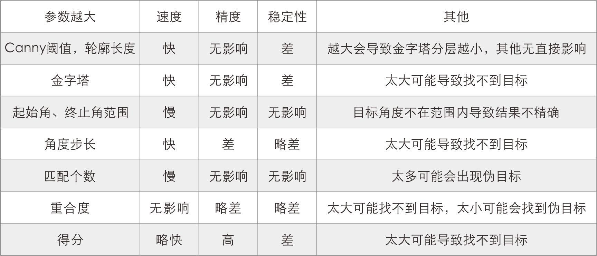

表3  轮廓匹配参数影响表

    四、轮廓匹配应用案例

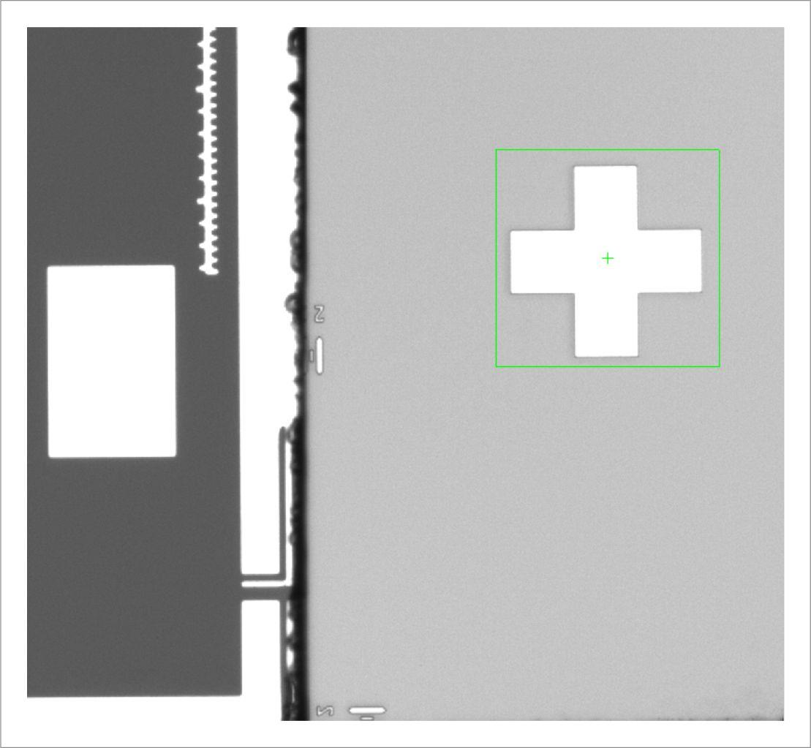

图8  轮廓匹配案例

    1、可用于初定位，数据值可在ROI中引用，做基准定位使用；  
    2、根据产品的轮廓特征，对产品进行匹配。用于轮廓较为明显的产品。  

    根据上述三种匹配算法的介绍，我们整理了一份匹配算法对比表格如下(点击右键可保存图片)：

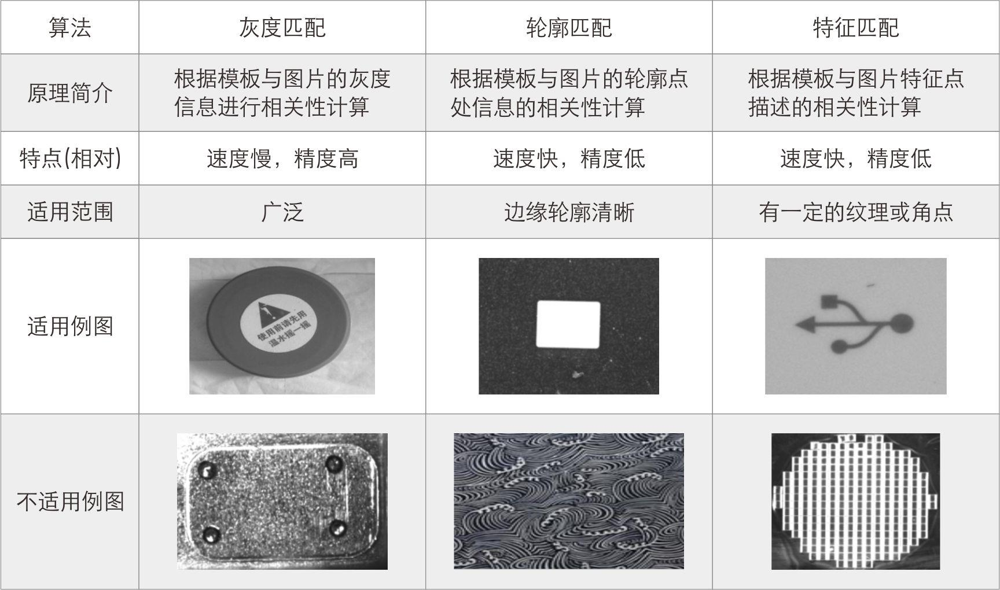

表4  三种匹配算法对比简表

    以上为OPT小讲堂之Smart智能视觉软件操作培训第八课的内容，如对课程有任何问题欢迎在留言区留言或来电咨询，全国服务热线400-0769-068。

联系OPT（奥普特）：

[联系销售团队](https://www.optmv.com/about/contact.html)|

[获取产品演示](https://www.optmv.com/service/free.html)|

[获取产品报价](https://www.optmv.com/service/consultant.html)

[查看相关产品](https://www.optmv.com/product/)

# [OPT小讲堂第九课 ∣Smart图像定位-ROI校正算法](https://www.optmv.com/content/details114_6965.html)

 股票代码：688686

    今天讲解的是OPT小讲堂第九课，内容是ROI生成和ROI校正两大功能。  
    感兴趣区域(ROI，region of interest)，在机器视觉、图像处理中，在被处理的图像上以方框、圆、椭圆、不规则多边形等方式勾勒出需要处理的区域，称为感兴趣区域，简称ROI。在图像处理领域，感兴趣区域是从图像中选择的一个图像区域，这个区域是图像分析所关注的重点。圈定该区域以便进行进一步处理，或使用ROI圈定你想处理的目标，可以减少处理时间，提高精度。  
    在具体的视觉应用中，当工件来料位置固定不变时，常量ROI可以覆盖工件来料。但是当来料位置存在较大波动时，就无法通过固定的ROI来实现视觉应用。这时候我们可以通过粗定位对产品进行定位，根据定位位置、长宽，角度等数据使用生成ROI，通过生成ROI工具来满足视觉应用的要求；或者通过粗定位数据使用ROI校正工具对固定的ROI进行仿射变换，跟随产品位置来满足视觉应用的要求。

    **什么是ROI生成？**

    ROI生成，通过在图像上绘制一个ROI或者用前面模块的输出结果，或用户定义的指定数据生成特定ROI。可以创建的ROI类型有：点、直线、旋转矩形、椭圆、环形、不规则。  
    在后面的算子中调用所生成的ROI，将不进行全图搜索检测，只在ROI区域内进行搜索，这样可以屏蔽不感兴趣区域，令检测时间缩短。

    一、ROI生成的应用场合

    1、目标物体周边存在干扰点时，可以通过限定感兴趣区域来规避；  
    2、图片数据量大，感兴趣区域小，可以通过划定感兴趣区域，令检测时间缩短；

    二、ROI生成算法界面

    如图1中蓝色矩形框即为划定的旋转矩形ROI：

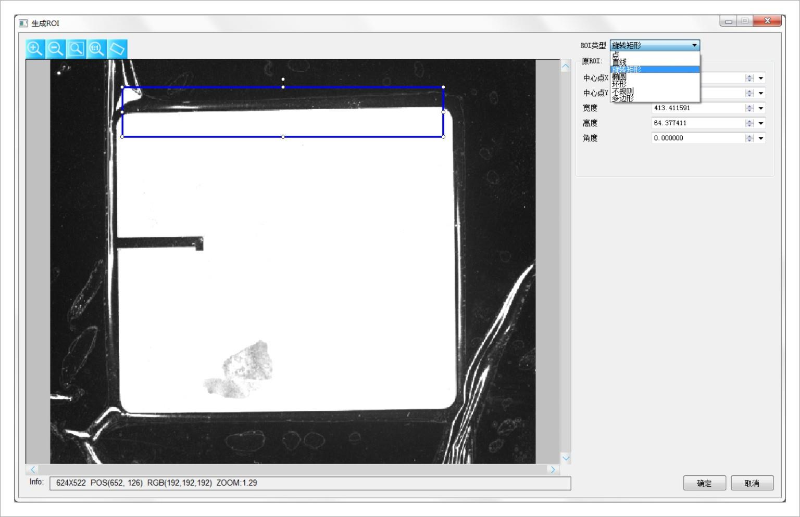

图1  ROI生成功能界面

    三、ROI生成参数设置

    ROI类型：支持自定义的ROI类型。  
    1、点  
    2、直线  
    3、旋转矩形  
    4、椭圆  
    5、环形  
    6、不规则  
    7、多边形

    ROI的生成可手动自定义参数，也可以从外部引用变量参数，如图2所示：

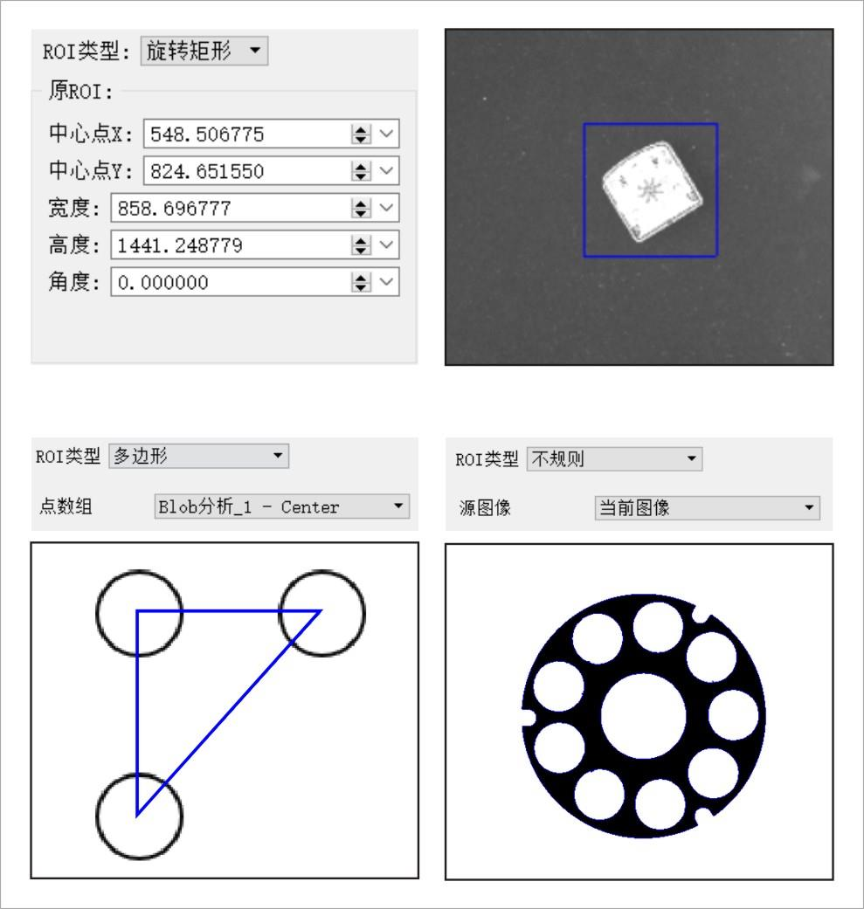

图2  ROI类型示例

    四、应用场合案例

    图3中矩形框即为划定的矩形ROI，ROI设置选定ROI生成后，找直线功能只在该ROI区域进行搜索边缘点。

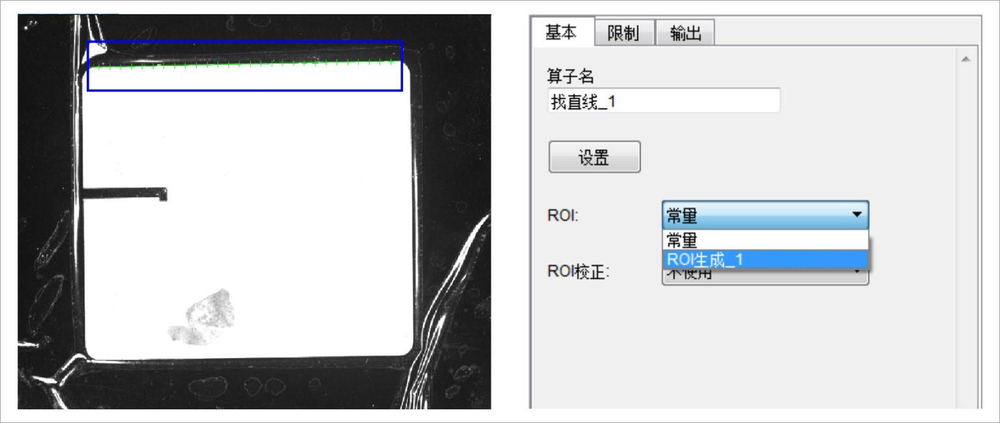

图3  ROI生成案例

   

**什么是ROI校正？**

    在实际应用中，每一个待检测工件在图像中的位置都发生偏移，从而ROI也需要移动，否则会导致检测不到所需要的特征。此时就可以创建定位基准，使ROI跟随基准移动，能够很好的解决这个问题。

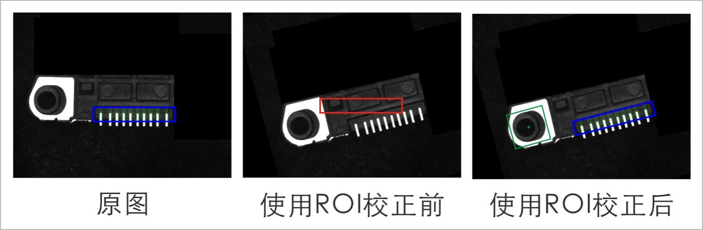

图4  使用ROI校正前后效果对比示例

(单击图片放大可查看详情)

    一、ROI校正应用场合

    1、定位产品抓取类项目应用  
    2、定位产品放料类项目应用  
    3、激光打标、切割类项目应用  
    4、点胶、焊点定位类项目应用

    二、ROI进行校正的步骤

    第一步：确定基准源。通过匹配或Blob分析等功能对此图像部分进行分析，获得基准点和基准角度。  
    第二步：选择生成仿射矩阵的参数。根据校正模式、参考点、参考角度生成仿射变换矩阵。  
    第三步：引用基准对ROI进行校正。选择支持的ROI校正方式的算子(例如定位、测量、检测、识别等算子工具)，在算子中引用ROI基准对应的仿射变换矩阵，使ROI跟随基准进行移动，保证ROI能够准确框住测量区域。

    三、算法原理

    其工作原理是找到校正前后的基准点及基准角度，通过两点和两角度之间的关系计算出仿射变换矩阵，原ROI的位置信息通过仿射变换求得校正后的位置信息，根据校正后的位置信息重新生成ROI。  
    校正模式：补正可选方法有水平方向补正，垂直方向补正，水平和垂直方向上进行补正，水平、垂直以及角度进行补正，水平方向加角度补正，垂直方向加角度补正。  
    参考点：依据参考点计算出仿射矩阵中平移分量，可以由Blob分析结果、匹配结果、几何关系或用户自定义变量等点变量构成。  
    参考角度：依据参考角度计算出仿射矩阵中旋转分量，可以由Blob分析结果、匹配结果、几何关系或用户自定义变量等数值变量构成。

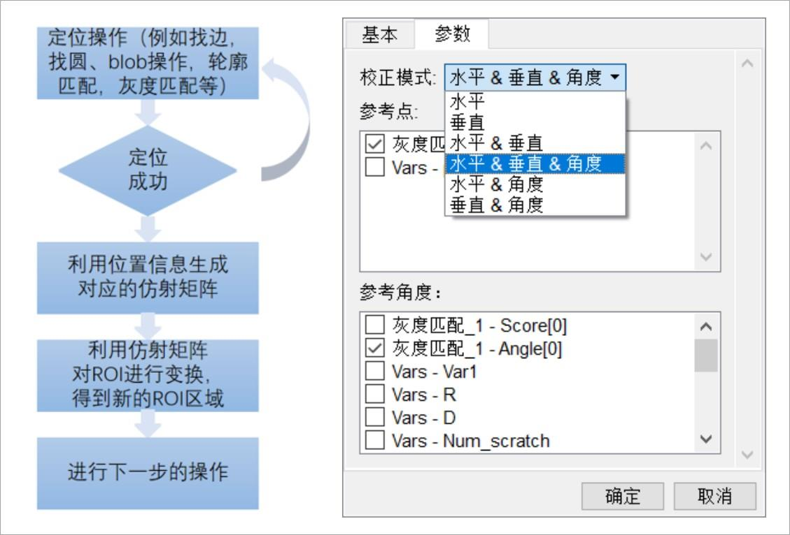

图5  ROI校正原理

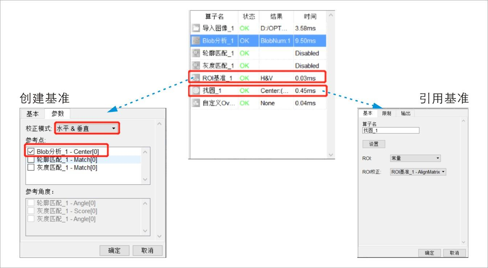

图6  ROI校正示例

    四、应用场合案例

    以灰度匹配的匹配结果中心点作为参考点，选择水平和垂直方向上进行补正，生成带有平移分量的仿射变换。当工件的位置发生偏移时，ROI校正能保证ROI相对于工件测量的位置是不变的，从而能够精确地进行找圆操作。

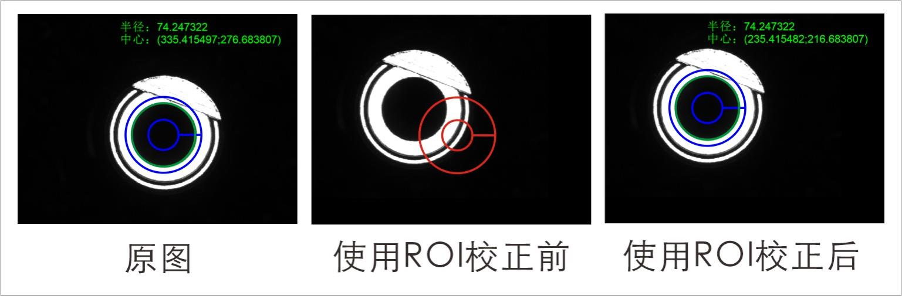

图7  ROI校正案例示意

(单击图片放大可查看详情)

    以上为OPT小讲堂之Smart智能视觉软件操作培训第九课的内容，如对课程有任何问题欢迎在留言区留言或来电咨询，全国服务热线400-0769-068。

联系OPT（奥普特）：

[联系销售团队](https://www.optmv.com/about/contact.html)|

[获取产品演示](https://www.optmv.com/service/free.html)|

[获取产品报价](https://www.optmv.com/service/consultant.html)

[查看相关产品](https://www.optmv.com/product/)

# [OPT小讲堂第十课 ∣你玩Blob分析，你玩它有啥用啊？](https://www.optmv.com/content/details114_7089.html)

    在第九课的内容中，我们介绍了SciSmart智能视觉软件中图像定位-ROI校正算法，今天我们来讲解图像检测模块中的Blob分析功能。在展开内容之前，先了解三个小问题：什么是图像检测？什么是Blob分析？Blob分析的用途是什么？

    **什么是图像检测？**

    图像检测，简单理解就是根据产品已知的特征对目标进行提取、筛选、分类等。  
    打开Smart智能视觉软件，在主界面右下方工具箱栏点击图像检测的图标。在图像检测功能模块列表中可以看到，除了Blob分析，还有划痕检测、边缘提取、轮廓操作等工具，如图1所示：

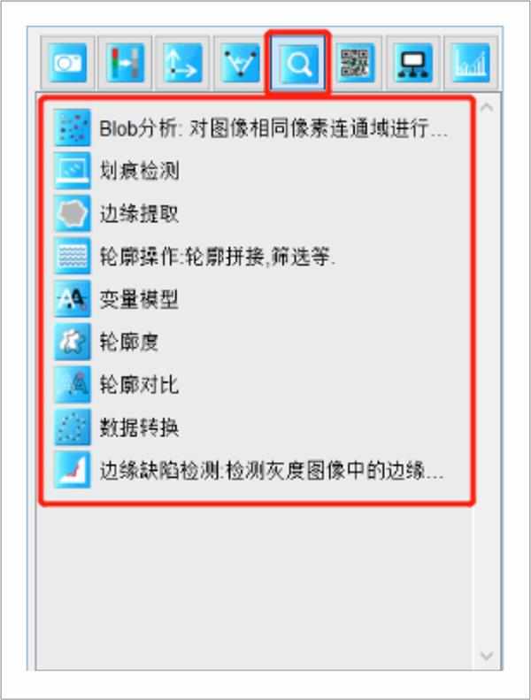

图1  图像检测工具箱

    **什么是Blob分析？**

    Blob是指图像中的具有相似颜色、纹理等特征所组成的一块连通区域。Blob分析是将图像进行二值化，分割得到前景和背景，然后进行连通区域检测，从而得到Blob块的过程。

    **Blob分析的用途是什么？**

    Blob分析为机器视觉应用提供图像中斑点的数量、位置、形状和方向，还可以提供相关斑点间的拓扑结构。Blob分析可应用于特定目标定位、缺陷检测、数量统计等，主要适用于二维目标图像、高对比度图像，以及存在缺陷检测、数量范围和旋转不变性的场景需求。同时，Blob分析不适用于低对比度图像，以及必要的图像特征不能用2个灰度级描述的图像等。

   

**一、Blob分析工具界面**  
    点击Blob分析中的“设置”按钮，打开设置参数界面，如图2。

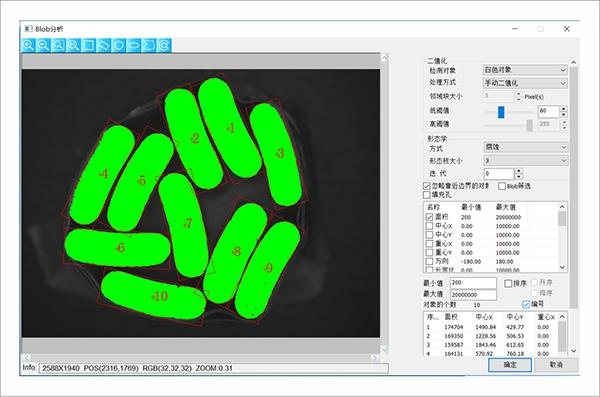

图2  Blob工具界面示意图

 

  **二、Blob分析的参数设置及解析**

    1、参数设置  
     Smart智能视觉软件中Blob分析工具界面参数设置，如图3。

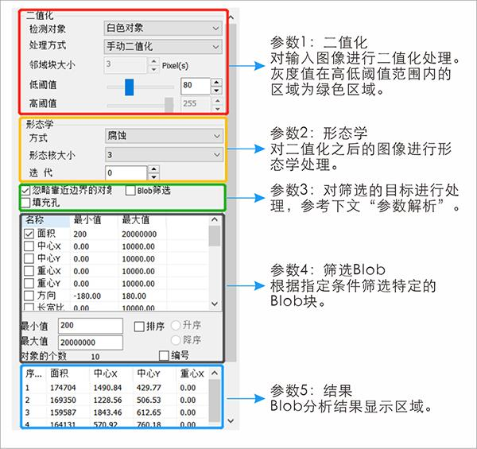

图3  Blob分析工具参数栏示意图

    2、参数解析  
    2.1 图3中的参数1二值化和参数2形态学，是针对图像进行预处理。  
    2.2 图3中的参数3详解。  
    2.2.1 忽略靠近边界的对象：  
    图4中蓝色框为ROI，勾选表示忽略靠近图像边缘或者ROI边界的Blob块区域，否则靠近边界的Blob块将被保留，进行后续的计算。

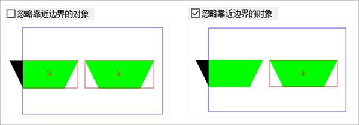

图4  忽略靠近边界对象效果图

    2.2.2 填充孔  
    勾选表示填充轮廓区域内的孔洞，如图5。

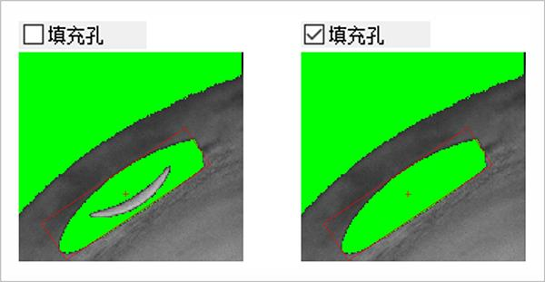

图5  填充孔效果图

    2.2.3 Blob筛选  
    勾选表示结果图像将输出一张二值图，符合筛选条件的Blob作为白色区域输出，并将此结果图像显示在图像控件上；否则结果图为源图，将源图显示在图像控件上，并以绿色区域表示符合筛选条件的Blob块。 

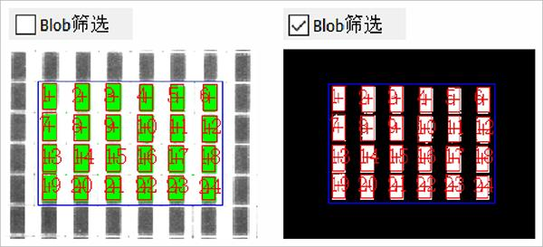

图6  Blob筛选效果图

    2.3 图3中的参数4筛选Blob详解  
    面积：Blob的面积，单位为像素。   
    中心X，Y：Blob的中心X，Y坐标。   
    重心X，Y：Blob的重心X，Y坐标。   
    方向：Blob几何重心的方向。   
    长宽比：Blob外接矩形的长宽比。   
    孔洞数：表示一个Blob内有多少个孔洞(孔洞指Blob轮廓内与之不连通的区域)。例如一个白色连通区域内有3个不连通的黑色区域，则孔洞数为3。   
    角度：外接矩形与水平轴的夹角。   
    外矩宽度：Blob的最小外接矩形的宽度。   
    外矩高度：Blob的最小外接矩形的高度。   
    轮廓长度：Blob块的轮廓的长度。   
    紧凑度：Blob的紧凑度，范围是\[0, 10000\]。   
    对称性：以经过中心和重心的一条直线为分界线，求直线两侧的对称性，对称性数值越接近0，表示Blob块越对称。   
    中重距离：中心到重心的距离。

    3、数据输出：  
    在Blob分析工具界面将参数设定好，分析到目标数据后，点击“确定”退出，切换到输出界面：勾选想要进行输出的测量值，才能在其它数据处理中对测量值进行调用。

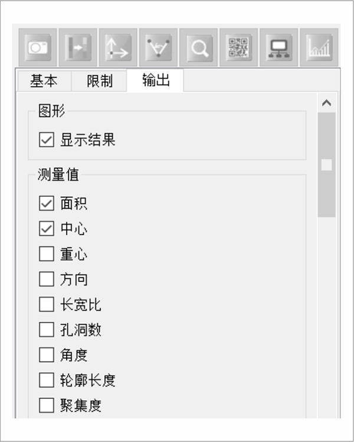

图7  数据输出界面

   

**三、应用场合**

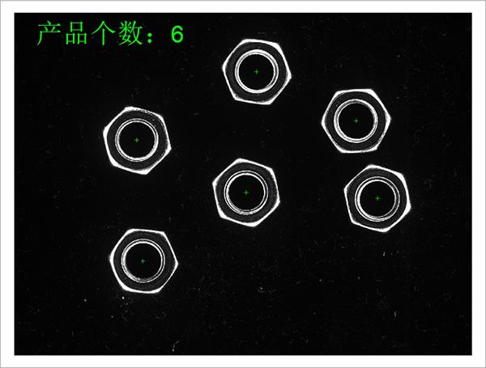

图8  应用场合效果图

    1、适用于初定位，中心坐标数据可在ROI中引用，做基准定位使用。  
    2、适用于有无检测、缺陷检测等应用场景。

    以上为OPT小讲堂之Smart智能视觉软件操作培训第十课的内容，如对课程有任何问题欢迎在留言区留言或来电咨询，全国服务热线400-0769-068。

# [OPT小讲堂案例 ∣ 图像增强模块在检测中的应用实例](https://www.optmv.com/content/details114_4324.html)

        **图像增强的应用场景举例**

        ● 成像背景复杂、产品表面干扰大

        ● 成像不稳定，感兴趣区域不明显，误判、漏判风险高

        ● 图像数据量大，处理效率低

        ● 产品规格过大，无法用相机一次完成整个产品拍摄

        **图像增强应用的效果**

        当成像效果无法满足我们的检测要求时，可以通过图像增强模块中算子的应用，对图像进行二次处理，将图像的特征更直观地呈现出来，提高检测质量，如以下三组图所示：

        预处理算子应用：对图像进行手动二值化、开运算和膨胀综合处理，如图1；

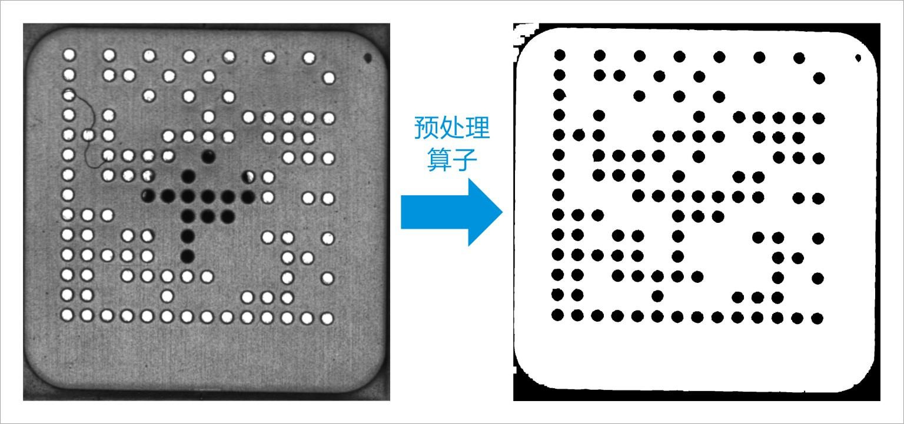

图1  预处理算子应用效果示意图

        形态学算子应用：对图像进行闭运算处理，如图2；

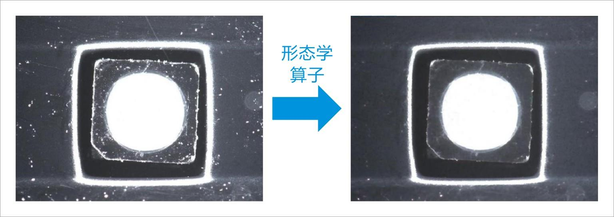

图2  形态学算子应用效果示意图

        亮度调整算子应用：对图像进行亮度、对比度、伽马值调整，如图3。

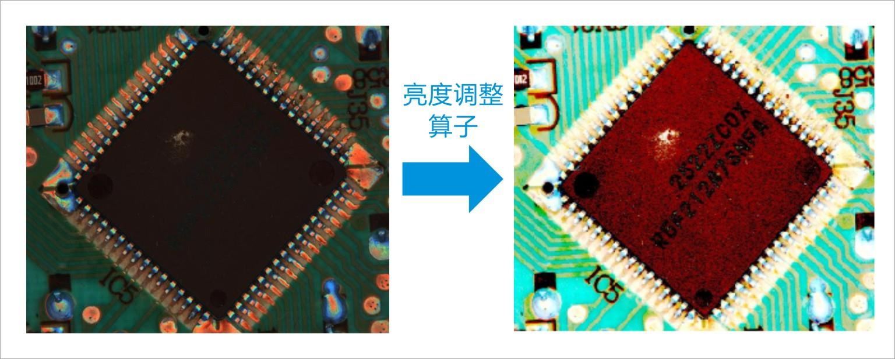

图3  亮度调整算子应用效果示意图

        下面通过图像增强的一个应用实例来演示效果。

        **(1)检测需求**

        分析石墨片的通孔是否有冲压不良。

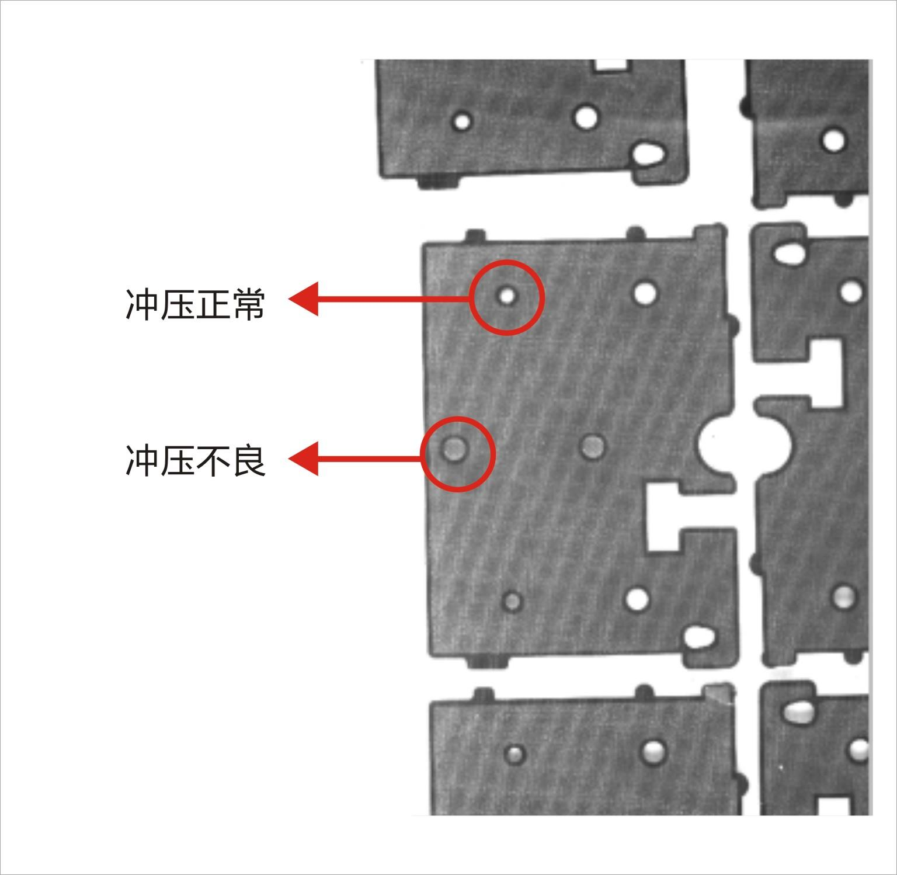

图4  石墨片通孔指示图

        **(2)两种实现方式对比**

        方式一：直接对原图进行分析

        ● 成像中含有多个产品，不方便对单个产品图像进行分析处理

        ● 产品图像表面干扰点多，不利于筛选目标

        方式二：先对图像进行二值化、图像操作等综合性处理后，再进行分析

        ● 提取单个产品图像，便于分析处理

        ● 产品图像表面无干扰点，利于筛选目标，更直观且稳定

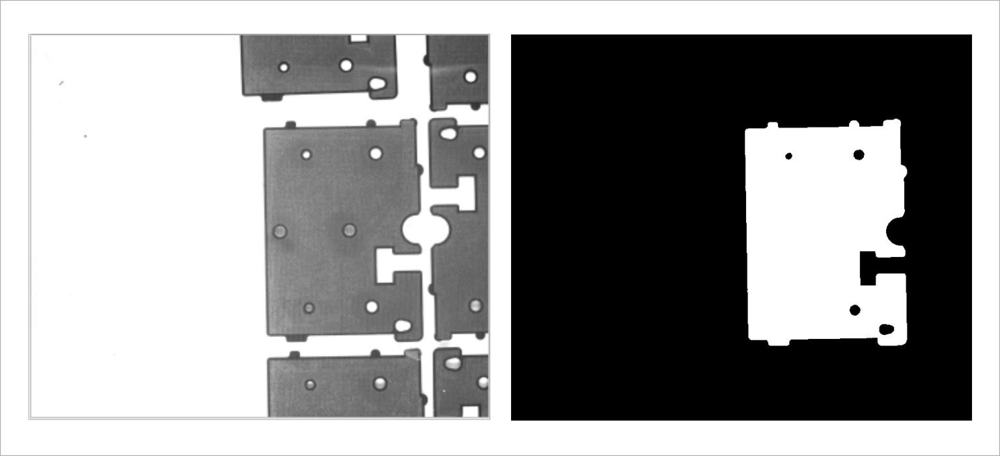

图5  原图(左)与综合性处理后的效果图(右)

        通过以上两个实现方式的对比可以看出，对图像进行综合性处理后再进行处理和分析，能够更加直观提取目标特征，有效降低误检率。同时处理后的图像数据量减小，提高了检测效率。那么接下来，我们一起来看看方式二是如何实现的：

        **(3)方式二的实现步骤**

        a、屏蔽视野中不完整的产品，提出单个完整的产品通过二值化将原图转换为一张背景为黑色的黑白图像，接着进行闭运算处理将二值化后还保留的细小不良通孔及产品表面的干扰屏蔽处理，最后通过Blob筛选设定合理筛选条件(如：面积大小)提取出完整的产品，并屏蔽不完整的产品。这样处理便于后面能够更加快速、稳定、准确地对通孔进行检测与分析。具体的处理流程如下：

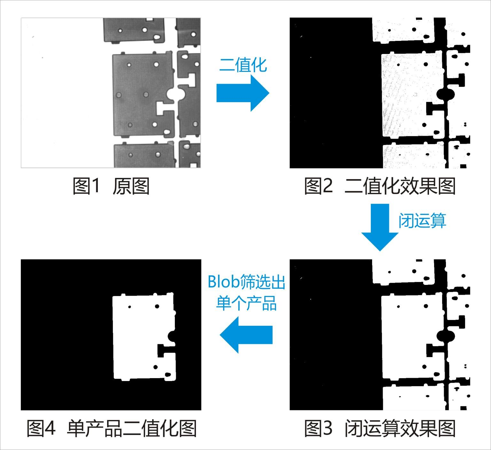  

图6  提取单个产品处理流程

        b、通孔提取、结果分析：

        ● 通孔提取：在上一步的基础上通过Blob分析工具设定合理的参数，提取出通孔位置及个数

        ● 结果分析：当前产品识别得到的通孔个数与标准产品通孔个数进行对比，从而判断当前产品是否合格

        以上的操作步骤如下流程图所示：

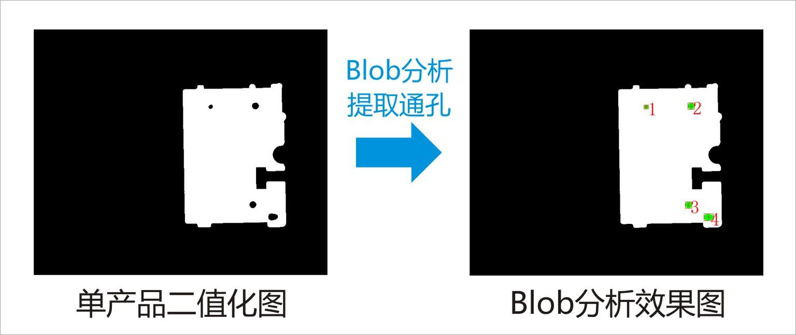

图7  通孔提取、分析流程图

        c、结果显示

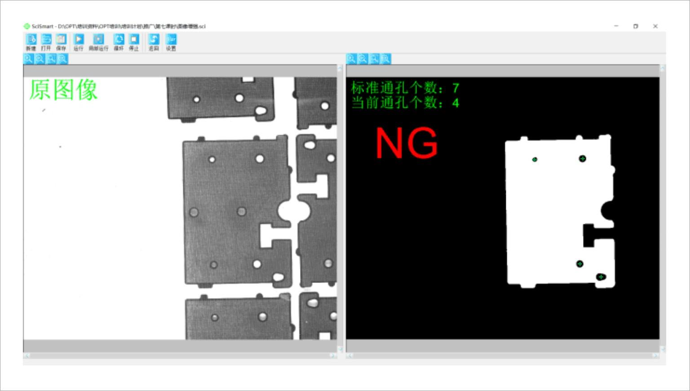

图8  不良品运行效果图(图片可放大看细节)

[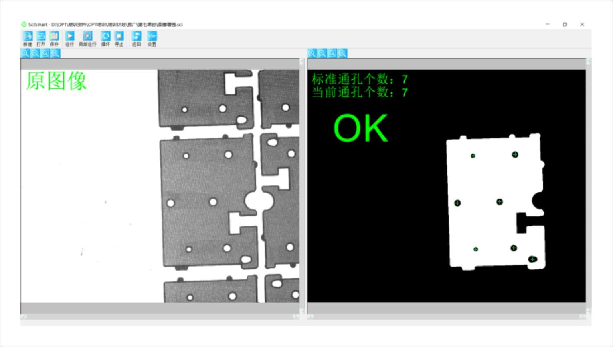](http://net.bangong.cn:8771/ajax/download.aspx?id=4821&name=59714E0AFAFDE0D61A576AFD16F8A497)

图9  良品运行效果图(图片可放大看细节)

        通过以上实例可以看出，在机器视觉图像分析领域，图像增强可以说是既基础又至关重要。在Smart智能视觉软件图像增强模块下，除了“OPT小讲堂”此前推过的滤波、形态学、二值化，还有缩放、图像拼接、图像操作、通道提取、直方图均衡化、光度立体技术等功能。无论任何行业，运用图像增强模块下的各种功能，都可以对图像质量进行优化处理，满足我们对图像分析的需求。

[点击这里获取培训文档](http://net.bangong.cn:8771/ajax/download.aspx?id=4821&name=59714E0AFAFDE0D61A576AFD16F8A497)

# [OPT小讲堂第十一课 ∣ Smart图像检测-划痕检测](https://www.optmv.com/content/details114_7157.html)

       上一课我们讲了图像检测中的Blob分析，今天讲一讲它的另一模块──划痕检测工具。

       所谓划痕就是物体表面出现的与周围其它部分不一致的目标，如斑点、异物、擦伤、气泡、条痕等，其特征就是边缘灰度变化大，划痕检测就是采用自差分方法来将这些异类目标找出来，从而达到检测物体表面缺陷的目的。

       **行业应用**

       产品表面的缺陷极有可能会影响产品的整体外观和性能，因此表面缺陷检测是许多产品生产过程中不可或缺的一部分。

       在划痕检测当中，与人类视觉相比，机器视觉优势明显：精确度高、速度快、稳定性好、信息的集成与留存十分方便。SCI所提供的解决方案已经成功地应用于锂电池、消费电子、半导体、食品饮料、医药等不同的行业中，为企业有效保证了产品质量，降低了成本，提高了竞争力。

       **应用案例**

       **1、锂电池行业**  
       1.1 涂布机表面缺陷检测；  
       1.2 分条机水印极片穿孔、亮斑、边缘破损、异物等缺陷检测；  
       1.3 极片表面缺陷检测。

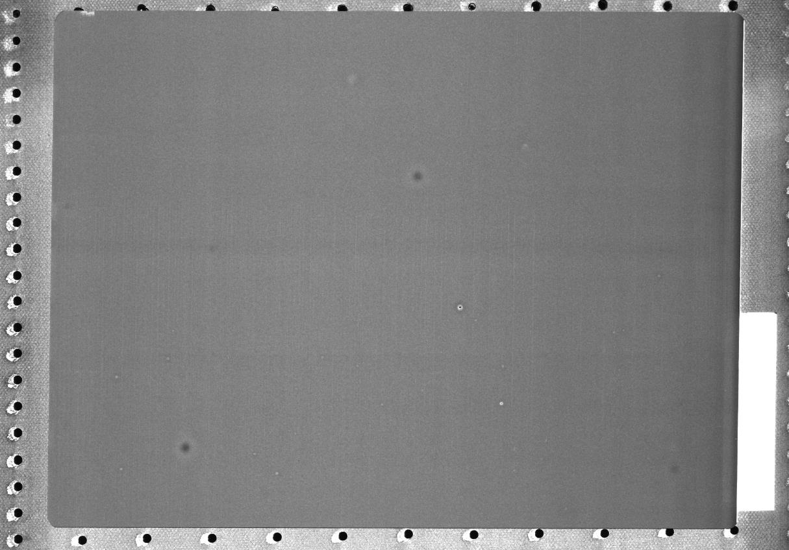 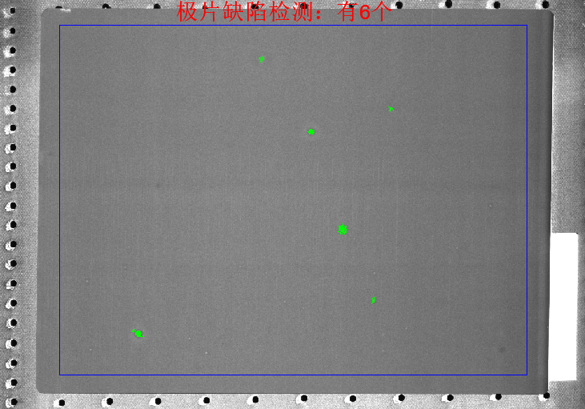

实物图                                                           效果图

图1  极片表面缺陷检测示意图

     

 **2、消费电子行业**  
       2.1 手机外观缺陷检测：划伤、脏污、颗粒、碰伤等；  
       2.2 手机摄像头异物、划伤缺陷检测；  
       2.3 手机芯片表面脏污、划伤缺陷检测。

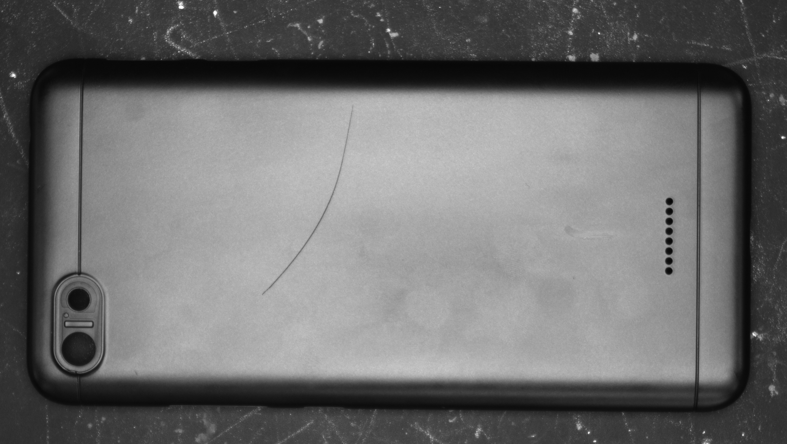 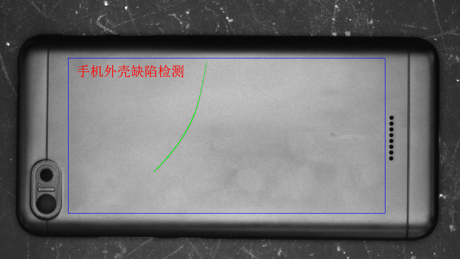

实物图                                                           效果图

图2  手机外壳缺陷检测示意图

     

 **3、半导体行业**  
       3.1 IC芯片体表面的缺陷检测；  
       3.2 LED表面缺陷检测；  
       3.3 硅片表面缺陷检测。

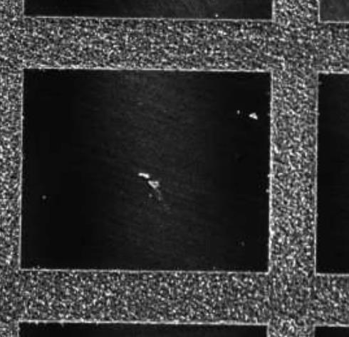 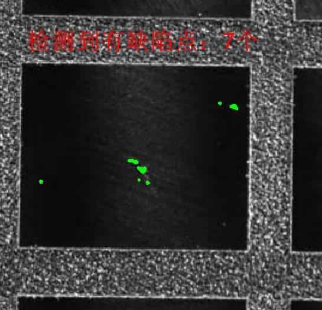

实物图                                                           效果图

图3  硅片表面缺陷检测示意图

       

**4、食品饮料行业**  
       4.1 盒装食品外包装破损、生产日期有无等检测；  
       4.2 透明瓶装饮料的瓶盖缺损检测；  
       4.3 易拉罐包装饮料、罐头食品等的拉环质量、生产日期和序列号有无等检测；  
       4.4 纸盒饮料的外包装如吸管有无、插孔是否破损等检测。

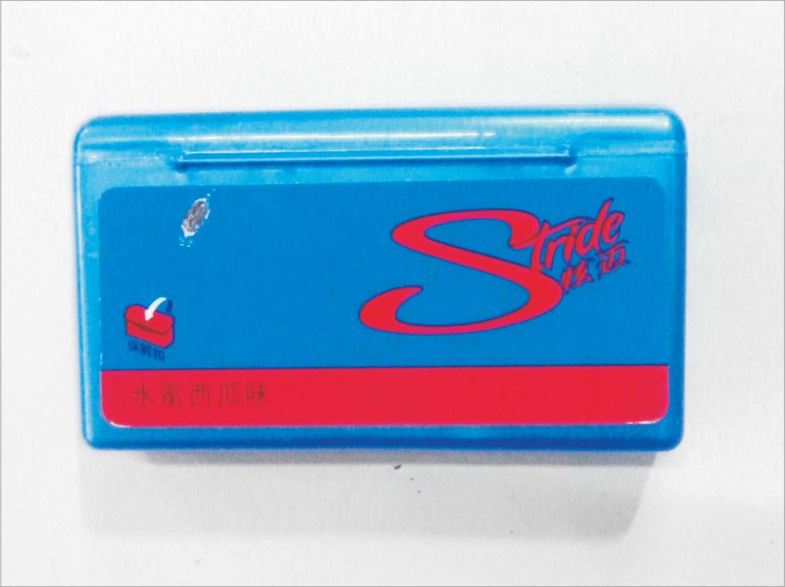 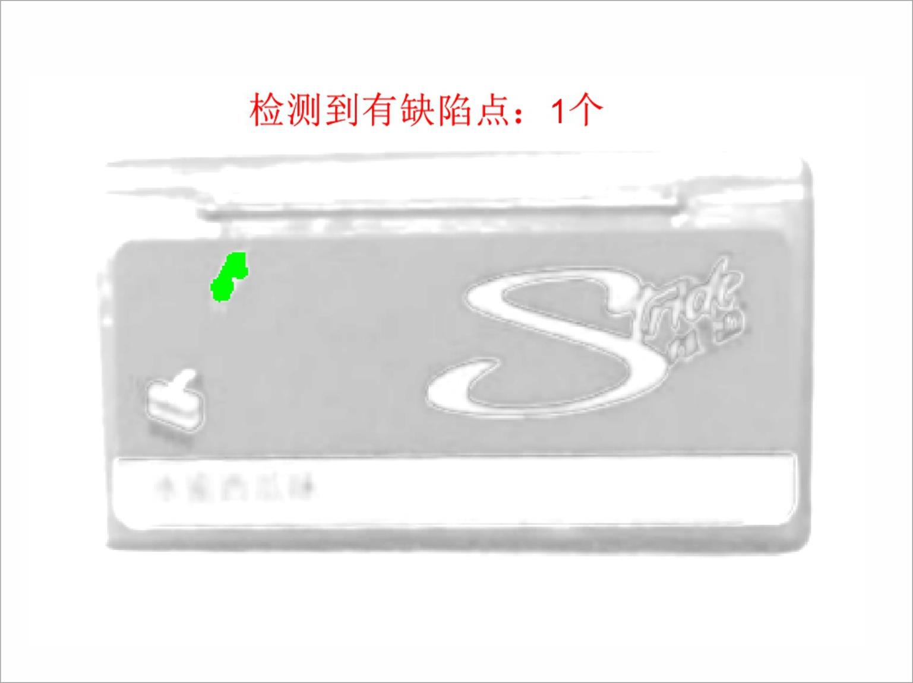

实物图                                                           效果图

图4  口香糖包装盒检测示意图

       

**5、医药行业**  
       5.1 药片、胶囊表面破损、脏污缺陷检测；  
       5.2 医药瓶脏污检测。

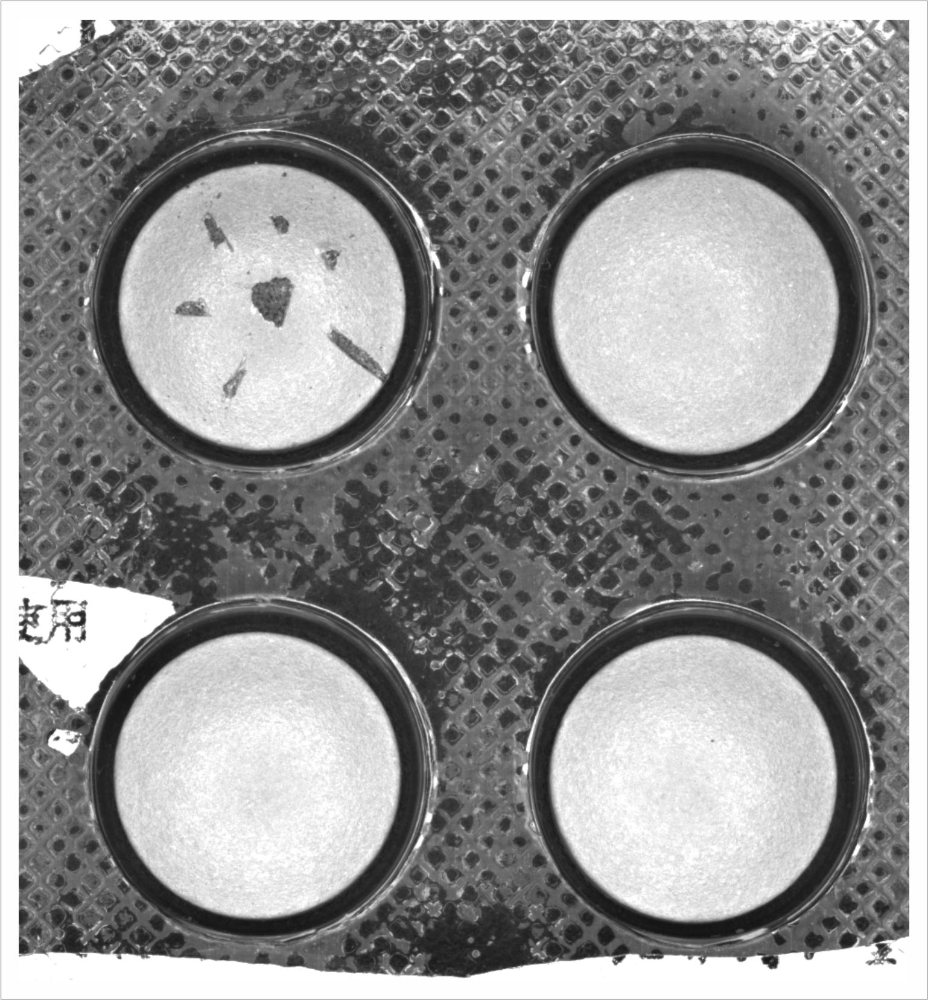 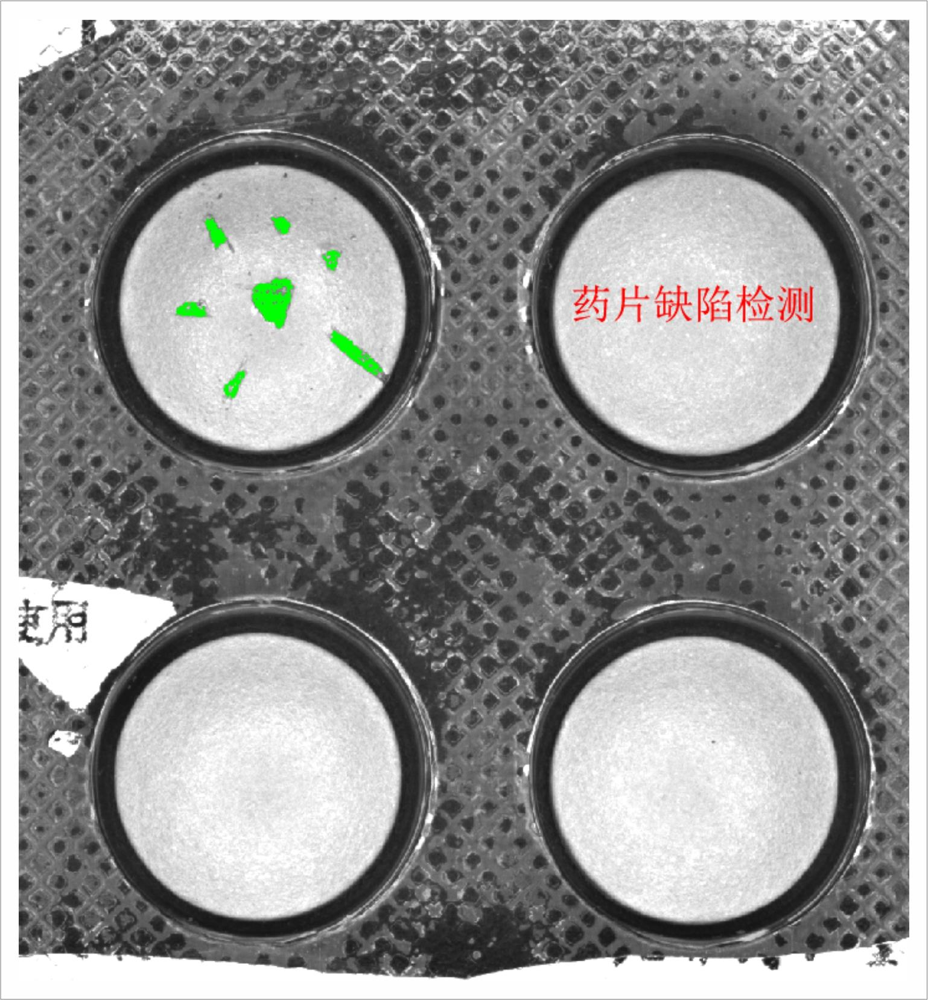

实物图                                                           效果图

图5  药片缺陷检测示意图

       

**操作详解**

       一、划痕检测工具界面  
       点击划痕检测中的“设置”按钮，打开设置参数界面，如图6：

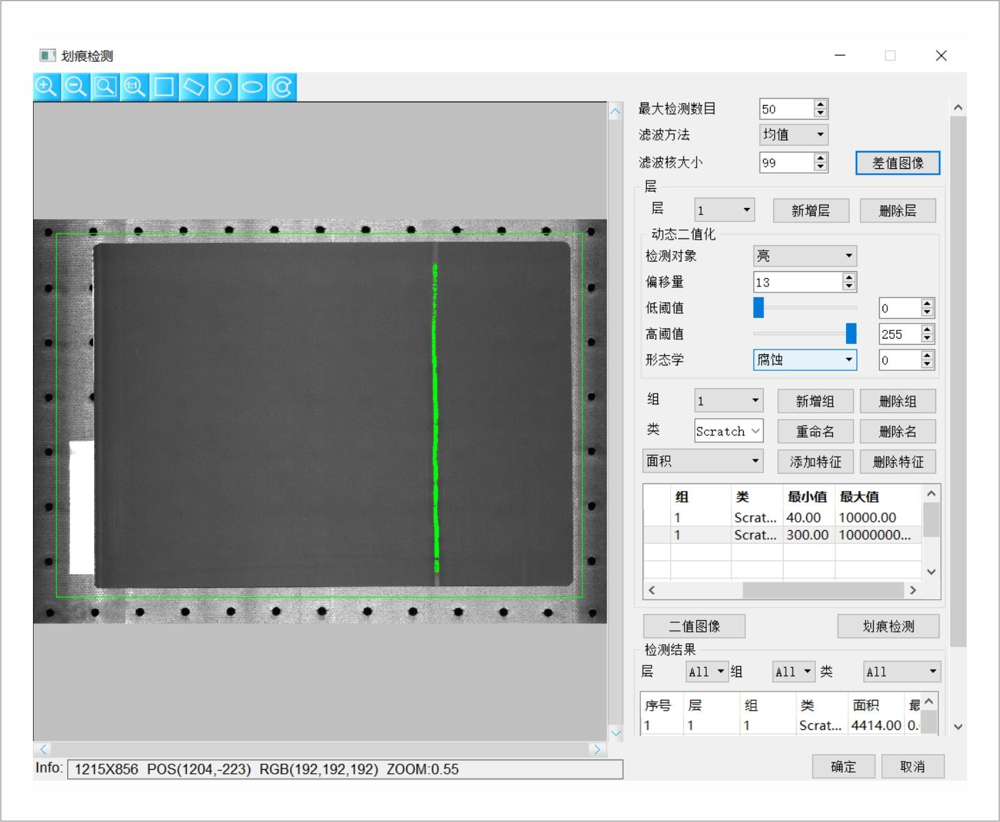

图6  划痕检测工具界面示意图

       二、划痕检测的参数解析及效果图  
       1、参数解析  
        Smart智能视觉软件中划痕检测工具界面参数设置，如图7：

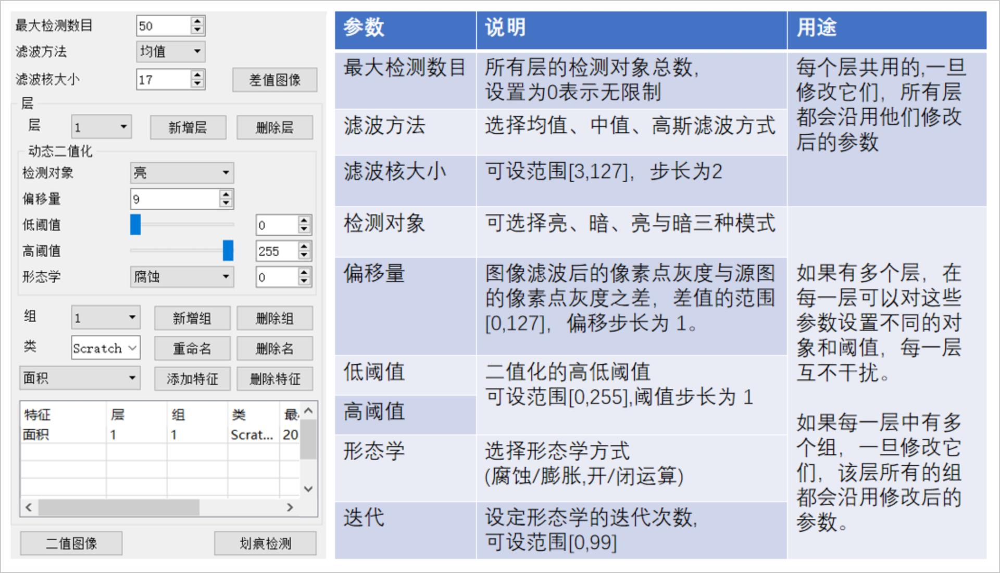

图7  划痕检测工具参数解析示意图

       2、参数设置效果图

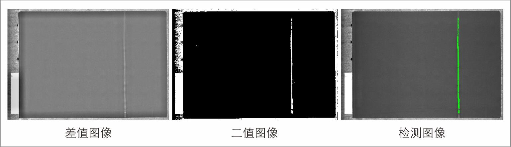

图8  效果示意图

       3、层、组、类等之间的关系

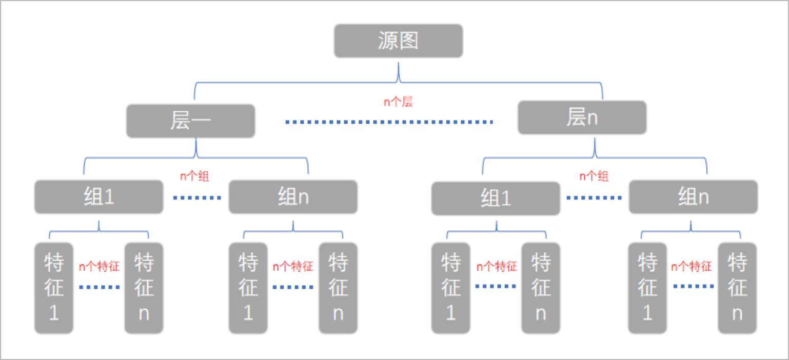

图9  层次结构局部示意图

       4、数据输出  
       在划痕检测工具界面将参数设定好，分析到结果数据后，点击“确定”退出，切换到输出界面：勾选想要进行输出的检测值，才能在其它数据处理中对检测值进行调用。

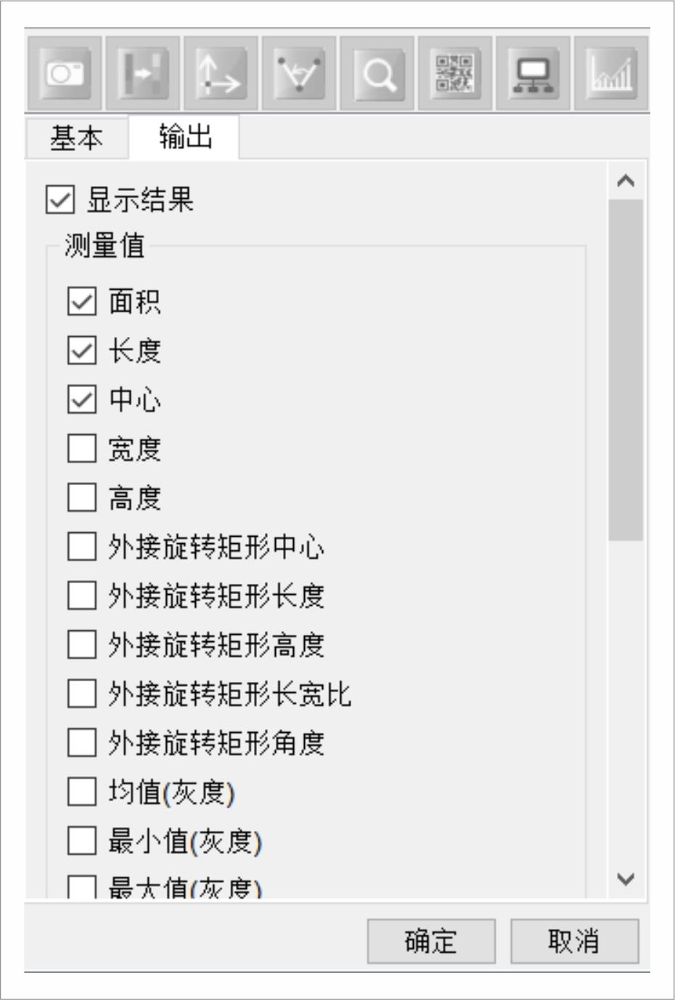

图10  数据输出界面

     

 **三、应用场合**

**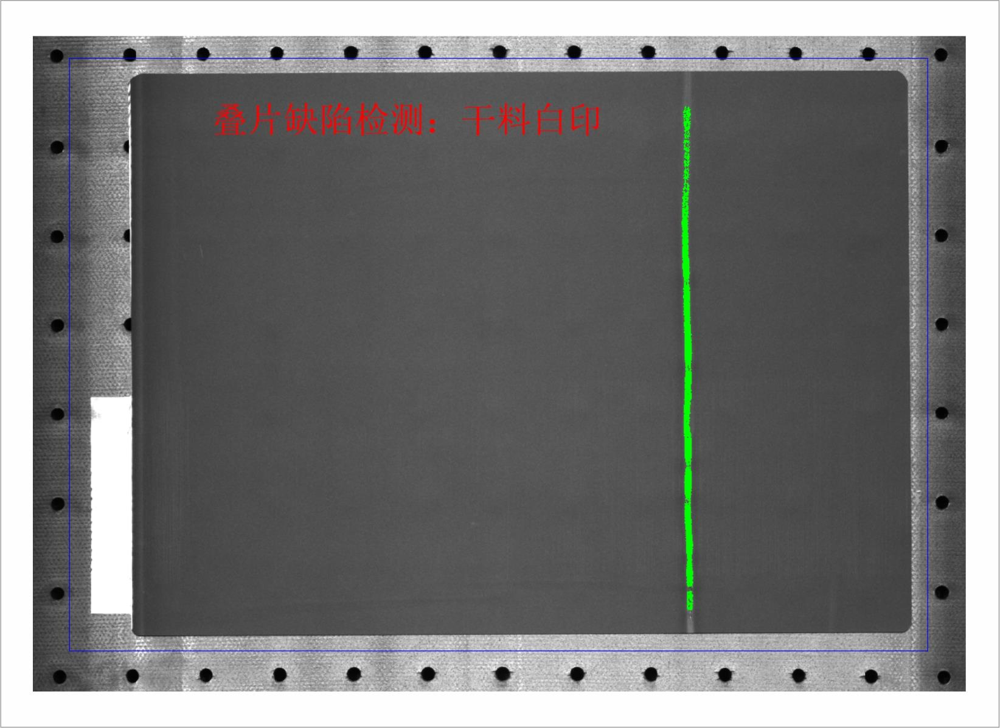**

图11  应用场合效果图

       根据工件表面的灰度值变化较大，与周边其它部分出现明显不一致的特征，将这些异类目标找出来，从而精准地检测出划痕位置。

         以上为OPT小讲堂之Smart智能视觉软件操作培训第十一课的内容，如对课程有任何问题欢迎在留言区留言或来电咨询，全国服务热线400-0769-068。

# [OPT小讲堂第十二课 ∣Smart图像检测之轮廓提取和轮廓操作](https://www.optmv.com/content/details114_7199.html)

---

       在第十一课中我们讲了图像检测中的划痕检测，今天讲一讲其中的轮廓提取和轮廓操作工具。

****什么是轮廓提取？****

       图像中灰度值变化比较剧烈的，且具有连续性等特性的地方定义为轮廓，轮廓提取功能就是获取图片中的轮廓。

       轮廓提取的基本思想是利用边缘增强算子，突出图像中的局部边缘，然后定义像素的“边缘强度”，通过设置阈值的方法提取边缘点集。因此，轮廓提取包括两个基本内容： 

       1、用轮廓提取算子提取出反映灰度变化的边缘点集。 

      2、在边缘点集合中剔除某些边界点或填补边界间断点，并将这些边缘连接成完整的线。用于边缘检测的算子有 Sobel、Canny、Deriche1、Deriche2、Lanser1、Lanser2、Shen。

****轮廓提取的基本原理****

图1  轮廓提取基本原理

****一、轮廓提取工具界面****

       点击轮廓提取中的“设置”按钮，打开设置参数界面，如图2。

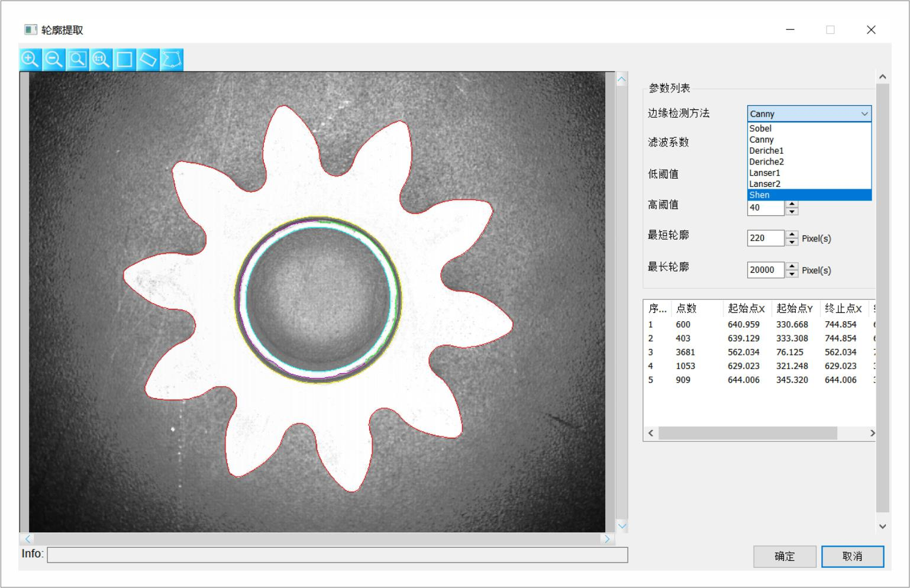  

图2  轮廓提取工具界面

****二、轮廓提取的参数解析****

       1、边缘检测方法：Sobel、Canny、Deriche1、Deriche2、Lanser1、Lanser2、Shen。

       2、滤波系数：Sobel滤波器的轮廓提取效果与滤波系数无关；Canny提取方法，滤波系数越大，所提取的轮廓越平滑；Deriche1、Deriche2、Lanser1、Lanser2、Shen滤波系数越小，所提取的轮廓越平滑，得到的细节越少。

       3、低阈值：边缘检测低阈值，低阈值不能大于高阈值。范围是\[0, 255\]。

       4、高阈值：边缘检测高阈值，高阈值不能小于低阈值。边缘检测高低阈值剔除轮廓的逻辑是当轮廓点梯度高于高阈值的时候轮廓点保留，当轮廓点梯度介于高低阈值之间，如果此轮廓点能连接高阈值轮廓则被保留，否则去掉。当轮廓点梯度低于低阈值，则去掉。范围是\[0, 255\]。

       5、最短轮廓：轮廓长度的下限。剔除长度小于该值的轮廓。范围是\[1, 100000\]，不得大于最大轮廓长度。

       6、最长轮廓：轮廓长度的上限。剔除长度大于该值的轮廓。范围是\[1, 100000\]，不得小于最短轮廓长度。

**三、梯度滤波器及滤波系数的影响**

图3  滤波器及滤波系数的影响

       轮廓操作功能是增加对轮廓的处理，可以根据长度、面积、坐标等条件对轮廓进行筛选，可以根据是否共圆、共线连接断裂轮廓，还可以去除干扰的轮廓信息等，从而获得所需要的目标轮廓。

****一、轮廓操作工具界面****

       点击轮廓操作中的“设置”按钮，打开设置参数界面，如图4。

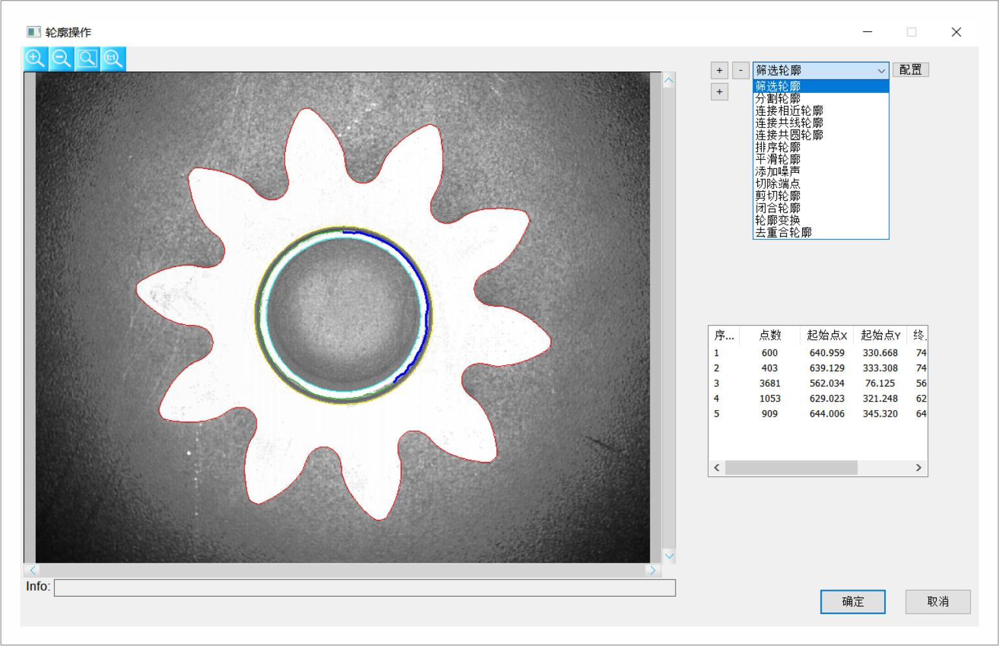  

图4  轮廓操作算子界面

****二、轮廓操作功能介绍举例****

       2.1 筛选轮廓

       通过不同的条件，调整参数，筛选出所需要的目标轮廓。

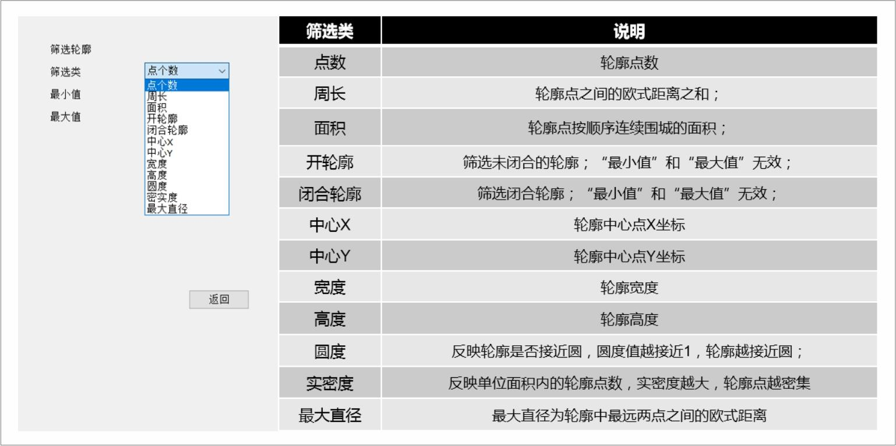  

图5  筛选轮廓

       2.2 分割轮廓

       需要对完整轮廓进行分段解析时，可以将轮廓进行分割开来，逐一解析判定。

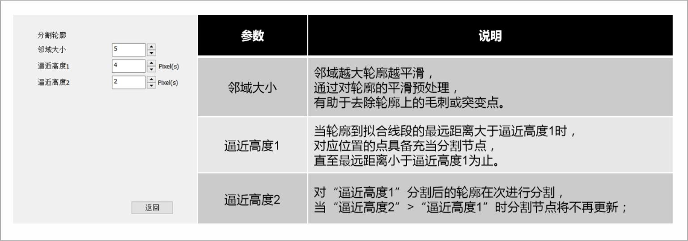  

图6  分割轮廓

       2.3 连接共线轮廓

       通过参数设置，对在同一条拟合直线上的轮廓进行连接操作。

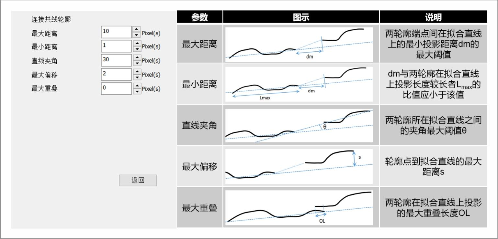  

图7  连接共线轮廓

****三、应用场合****

图8  应用场合-效果图

       1、当提取多个轮廓时，需要对轮廓进行筛选、分割等处理，从而得到所需要的目标轮廓。

       2、当提取的轮廓比较零散、不连续时，需要对轮廓进行连接、平滑等处理，从而得到理想轮廓。

       以上为OPT小讲堂之Smart智能视觉软件操作培训第十二课的内容，如对课程有任何问题欢迎在留言区留言或来电咨询，全国服务热线400-0769-068。

# [OPT小讲堂第十三课 ∣ Smart图像识别之OCR：字符识别](https://www.optmv.com/content/details114_7793.html)

在第十二课中，我们讲了图像检测中的轮廓提取和轮廓操作工具。

今天我们来讲解Smart图像识别模块中的OCR功能。在这之前，先了解2个小问题：什么是OCR？OCR的技术特性是什么？

**一.什么是OCR**

**1.OCR的概念**

OCR，是Optical Character Recognition的简称，即光学字符识别技术，是指电子设备（例如扫描仪或数码相机）检查纸上打印的字符，通过检测暗、亮的模式确定其形状，用字符识别的方法将形状翻译成计算机文字的过程；通俗地说，即对文本资料进行扫描，然后对图像文件进行分析处理，获取文字及版面信息的过程。

**2.OCR的技术特性**

OCR技术针对印刷体字符，采用光学的方式将文本资料中的文字转换成为灰度图像，并通过识别软件将图像中的文字转换成文本格式，供文字处理软件进一步编辑加工。

一个OCR系统通常具有分类、识别与转换功能。衡量一个OCR系统性能好坏的主要指标有：拒识率，误识率，识别速度，用户界面的友好性，产品的稳定性、易用性及可行性等。本公司的OCR系统能有效定位图像中的字符，并通过提取字符的特征快速分类与识别。

**二.OCR操作详解**

打开Smart智能视觉软件，在主界面右下方工具箱栏点击图像识别的图标，如图1所示：

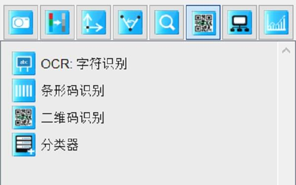

图1 图像识别工具界面图

**1.OCR操作的基本流程**

 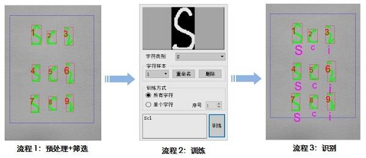

图2 OCR操作的流程图

**2.OCR算子工具界面**

**2.1 OCR分割界面及参数解析**

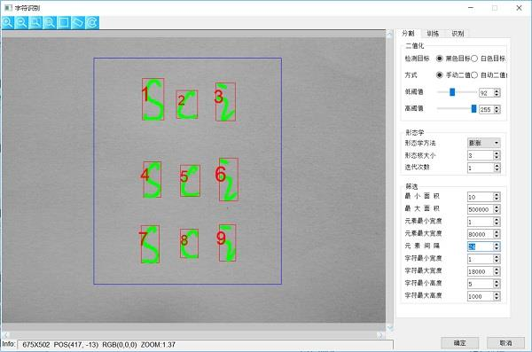

图3  OCR分割界面图

**（1）预处理：**

通过二值化、形态学等方法将字符区域从背景中提取出来，只留下字符区，其它部分去掉

**（2）筛选：**

●最小面积：找到的字符的面积最小值

●最大面积：找到的字符的面积最大值

●元素最小宽度：当一个连通域的总宽度小于元素最小宽度，此连通区域不为元素

●元素最大宽度：当一个连通域的宽度大于元素最大宽度，此连通区域不为元素

●元素间隔：元素之间的最小距离，大于该距离则认为是两个独立的元素，否则就进行合并

●字符最小宽度：找到的字符的宽度最小值

●字符最大宽度：找到的字符的宽度最大值

●字符最小高度：找到的字符的高度最小值

●字符最大高度：找到的字符的高度最大值

**2.2 OCR训练界面及参数解析**

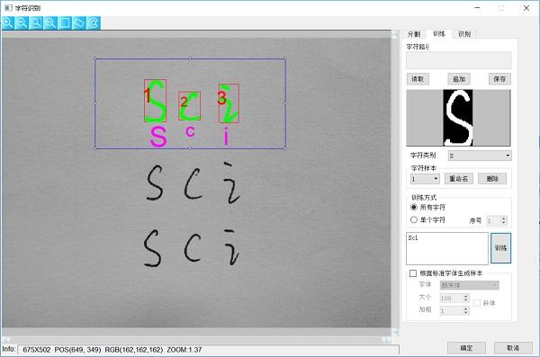

图4 OCR训练界面图

**（1）字符路径：**

●读取：读取指定的路径下已经存在的字符集文本

●追加：追加字符集到已经存在的字符集文本

●保存：保存字符集到指定的路径

**（2）训练方式：**

●所有字符：将所有字符一次性进行训练

●单个字符：选择指定序号单个字符进行训练

**（3）根据标准字体生成样本：**

●字体：选择识别对象的字体

●大小：调整字体的大小

●加粗：调整字体加粗

**2.3 OCR识别界面及参数解析**

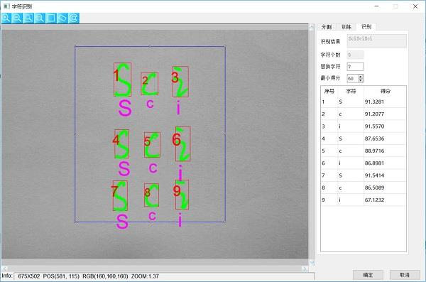

图5 OCR识别界面图

（1）**识别结果：**显示 OCR 识别的字符信息

（2）**字符个数：**OCR 识别的数量

（3）**替代字符：**识别失败的字符，可用自定义编辑的字符代替

（4）**最小识别得分：**设置字符识别的最低得分。若小于这个得分，识别失败

**3.OCR的应用场景及举例**

**3.1应用场景**

（1）产品外包装生产批号字符识别

（2）汽车零部件编号的字符识别

（3）交通标识、车牌等字符识别

**3.2应用举例**

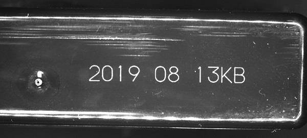

图6  OCR原图

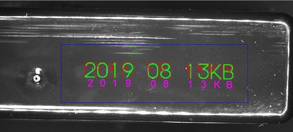

图7  OCR效果图

以上为OPT小讲堂之Smart智能视觉软件操作培训第十三课的内容，如对课程有任何问题欢迎来电咨询，全国服务热线400-0769-068。

# [OPT小讲堂第十四课 ∣Smart图像识别之条形码识别、二维码识别](https://www.optmv.com/content/details114_8538.html)

      在第十三课中，我们讲了图像识别中的OCR：字符识别。

本课将继续介绍图像识别中的条形码识别、二维码识别。我们将分别介绍二者的基本概念、操作流程、参数解析及应用案例。

**条形码识别**

**条形码识别的概念**

条形码识别，即在一幅灰度图像中指定 ROI 区域检测出所有符合参数条件的条形码，获得其解码字符串与位置信息。

**条形码识别的特性** 

检测时通过指定待检条形码的类型（可通过“类型”栏内的自动检测按钮进行自动选定）， 设定检测的参数包括：对比度、搜索步长、最大条宽，即可在指定的 ROI 区域内检测出指定类型的所有条形码，并返回定位区域和解码结果。Smart智能视觉软件支持同时识别多个条形码。

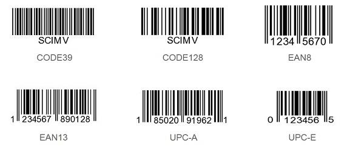 

图1  常见的条形码类型示意图

**条形码识别的操作流程及参数详解**

打开Smart智能视觉软件，在主界面右下方工具箱栏点击图像识别的图标，如图2所示，选择“条形码识别”，二维码识别同此操作：

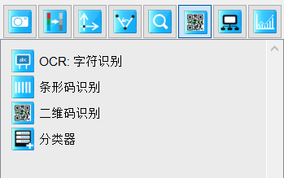 

图2  图像识别工具界面图

**1.** **条形码识别操作的基本流程**

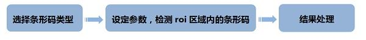 

图3  条形码识别流程图

**2\. 条形码识别的参数详解**

    点击条形码算子中的“设置”按钮，打开设置参数界面，如图4所示：

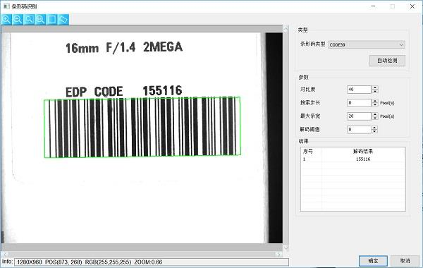 

图4  条形码识别的算子工具界面图

**（1）****类型：**

**●条形码类型：**包括 39 码、128 码、EAN-8 码、EAN-13 码、UPC-A 码、 UPC-E 码、93码、ITF 码。

**●自动检测：**用于自动判断可能的条形码类型。

**（2）参数：** 

**●对比度：**指定条码黑色部分和白色部分的对比度，该值增大时可以减少其它目标对条形码检测的干扰，只检测黑白对比度较明显的目标；减小时可以检测黑白对比不那么分明的目标，但同时也更易受到其它目标的干扰。

**●搜索步长：**将该参数调大时，将提高搜索速度，同时降低搜索精准度，在检测目标视野较大的条形码时可将其调大；反之，将其调小时，可以提高搜索的精准度，但同时将降低搜索速度，适合检测目标视野较小的条形码。

**●最大条宽：**指定需要检测条形码的最大条宽（黑色或白色条纹的宽度，以像素为计数单位），大于该条宽的条形码将被忽略。

**●解码阈值：**解码时黑色部分与白色部分的边缘阈值。

**（3）结果：**显示所成功读取的条形码内容。

**条形码识别的应用场景及举例**

**1.应用场景**

（1）3C行业零部件条形码读取。

（2）医药、烟草等外包装盒条形码检测。

**2.应用举例**

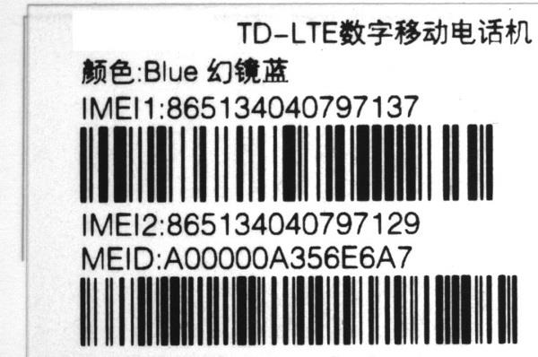 

图5  条形码识别原图

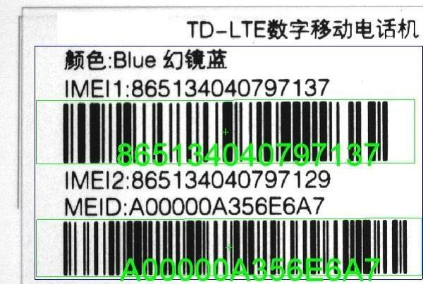 

图6  条形码识别效果图

**二维码识别**

**二维码的概念**

 二维码，是用某种特定的几何图形，按一定规律在平面(二维方向上)分布的黑白相间的图形记录数据符号信息，其在水平和垂直方向均存储信息。 

 二维码有多种不同的编码方式，称为码制。常用的码制有QRCode码（简称QR码）、DataMatrix码（简称DM码）、PDF417 码等。

 二维码偏重于描述商品。相较于一维条形码，二维码不仅可以存储关键值，还可将商品的基本资料编入二维码中，达到描述商品信息的目的，进一步提供许多一维条形码无法达成的应用。

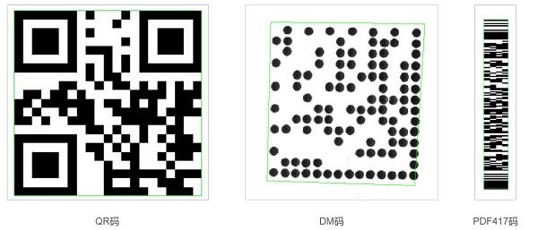

图7  常见的二维码类型示意图

**二维码识别的操作流程及参数详解**

**1.二维码识别的基本流程**

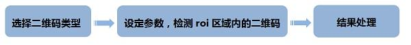 

图8 二维码识别流程图

**2、二维码识别的参数界面**

点击二维码算子中的“设置”按钮，打开设置参数界面。二维码类型的不同，出现的界面不同，如图9、图10、图11所示：

**2.1 QR码识别界面及参数解析**

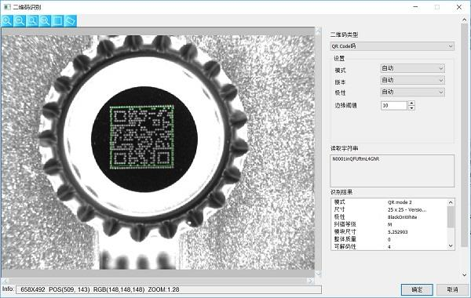

图9  QR码识别的算子工具界面图

**模式：**模式选择。可供选择的有自动，模式 1 ，模式 2。

**版本：**二维码版本。可选版本有自动、其他选项，范围：自动、\[0, 40\]。

**极性：**极性选择。有自动、深色符号浅色背景、浅色符号深色背景选项。

**边缘阈值：**边缘提取的灰度差，范围是\[2,255\]。 

**读取字符串：**将识别到二维码字符串信息显示在该区域。

**识别结果：**识别二维码信息。 

**2.2 DM码识别界面及参数解析**

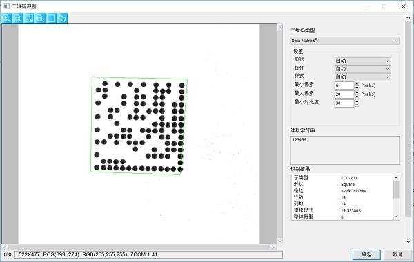 

图10  DM码识别的算子工具界面图

**形状：**二维码的形状，可选的有自动，长方形和正方形。 

**极性：**极性选择，有自动、深色符号浅色背景、浅色符号深色背景选项。

**样式：**Data Matrix 码的样式，可选的有自动和其他选项。

**最小像素：**Data Matrix 码中模块的最小像素宽度，可设范围是 \[1,100\]。

**最大像素：**Data Matrix 码中模块的最大像素宽度，可设范围是 \[2,100\]。

**最小对比度：**灰度差的最小值，范围是\[1,100\]。 

**读取字符串：**将识别到二维码字符串信息显示在该区域。

**识别结果：**识别二维码信息。

**2.3 PDF 417码识别界面及参数解析**

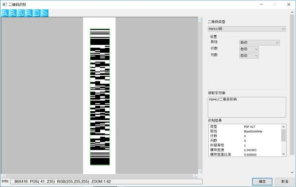 

图11  PDF417码识别的算子工具界面图

**极性：**极性选择，有自动、深色符号浅色背景、浅色符号深色背景选项。

**行数：**PDF417 码行数，PDF417 码专用参数。范围：自动，\[3, 90\]。

**列数：**PDF417 码列数，PDF417 码专用参数。范围：自动，\[1, 30\]。 

**读取字符串：**将识别到二维码字符串信息显示在该区域。

**识别结果：**识别二维码信息。 

**3.二维码识别的应用场景及举例**

**3.1 应用场景**

（1）电池二维码识别。

（2）外包装盒标签二维码码检测。

（3）PCB板二维码识别。

**3.2 应用举例**

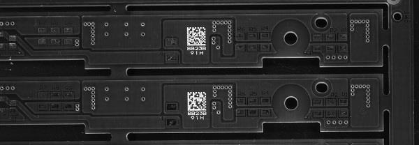 

图12  二维码识别原图

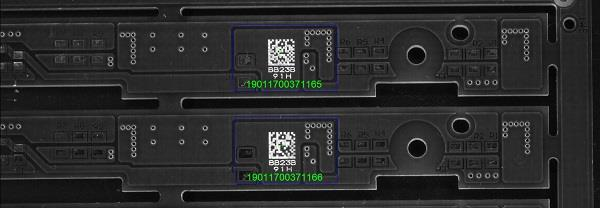 

图13  二维码识别效果图

以上为OPT小讲堂之Smart智能视觉软件操作培训第十四课的内容，如对课程有任何问题欢迎来电咨询，全国服务热线400-0769-068。

# [OPT小讲堂第十五课 ∣Smart通讯配置之TCP/IP通讯应用](https://www.optmv.com/content/details114_9114.html)

      今天，我们将为大家讲解通讯工具应用。**通讯工具用于实现信息交互（数据接收和发送），**本课以**TCP/IP通讯方式**为例进行阐述。

**通讯工具详解**

      打开Smart智能视觉软件，在主界面右下方工具箱栏点击通讯工具的图标，如图1所示。通讯工具包含TCP/IP、串口、通用I/O、Modbus、USB-HID、键盘事件、其它等几大模块。各模块作用见表1：

          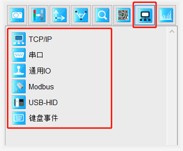

图1  通讯工具界面图

<table class="MsoNormalTable ke-zeroborder"><tbody><tr><td>
<b>模块</b>
</td><td>
<b>作用</b>
</td></tr><tr><td>
TCP/IP
</td><td>
使用TCP/IP协议进行数据接收发送
</td></tr><tr><td>
串口
</td><td>
使用串口进行数据接收发送
</td></tr><tr><td>
通用I/O
</td><td>
通过通用可编程 I/O 端口进行控制外部的设备与智能相机进行通讯&nbsp;
</td></tr><tr><td>
Modbus
</td><td>
它在连接至不同类型总线或网络的设备之间提供客户机/服务器通信
</td></tr><tr><td>
USB-HID
</td><td>
与符合USB-HID的设备通讯，实现与USB-HID设备的命令发送和接收
</td></tr><tr><td>
键盘事件
</td><td>
键盘事件可以接收特定的按键消息，适用于通过按键来控制流程的情况。目前支持的快捷键有任意键和 F1-F12
</td></tr><tr><td>
其他
</td><td>
除标准软件中支持的通讯方式外，还可以通过扩展接口支持与PLC、机器人等通讯端进行通讯交互
</td></tr></tbody></table>

表1 通讯工具模块及作用

**TCP/IP 通讯创建详解**

      下面，我们先通过微视频来看下Smart是如何实现数据交互的。

一. IP配置准则

      服务器与客户端PC进行连接通讯，需要服务器PC端的IP地址与客户端的PC的IP地址设置在同一网段及同一通讯端口号，例如图2：

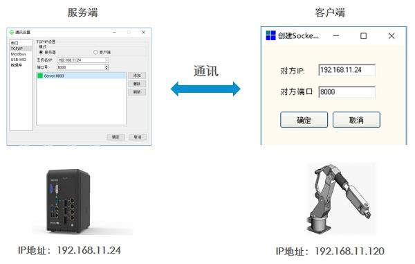

图2 服务器与客户端连接示意图

**二. Smart软件实现TCP/IP通讯步骤**

      点击“菜单栏”—“设置”—“通讯设置”，打开通讯配置界面，点击“TCP/IP”选项，进入 TCP/IP 通讯配置界面。

**1.TCP/IP通讯配置：**

     进入 TCP/IP 通讯配置界面将Smart软件配置为服务器或客户端。

****(1)Smart软件作为服务器****

    ****主机名/IP：**填写本机本地连接所设置的IP地址**

    **端口号：**自定义

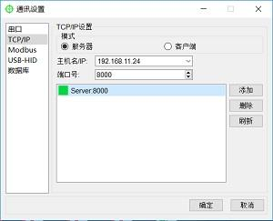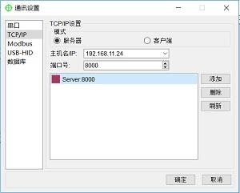

图3  Smart软件作为服务器界面图

（注：左图绿色方块表示已连接，右图红色方块表示未连接）

**(2)Smart软件作为客户端**

       **主机名/IP：**填服务端本机本地连接的IP地址

       **端口号：**服务端的端口号

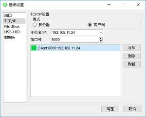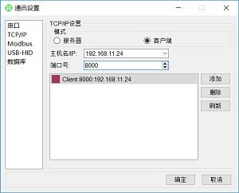

图4  Smart软件作为客户端界面图

（注：左图绿色方块表示已连接，右图红色方块表示未连接）

**2\. 添加TCP/IP通讯算子**

      在流程图中的功能模块添加TCP/IP算子实现接收或发送数据。（注：单个TCP/IP算子只能作为接收或发送中的一种，如需要同时实现接收和实现则添加多TCP/IP算子。）

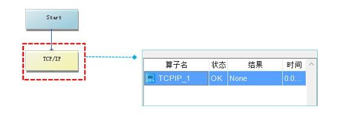

**(1)TCP/IP通讯算子设置**

      **A. 基本参数设置**

      ●**修改超时：**勾选有效，设置超时等待时间。

      ●**保持连接（客户端）：**勾选有效，检测 TCP 连接状态，如连接已断开，则重新进行连接。

      ●**清空缓存：**勾选有效，清空接收缓冲区的数据。

      **B. 数据**

      **●接收/发送。**

      **●待发送文本：**可通过变量或手动输入发送需要发送的数据。

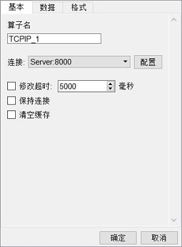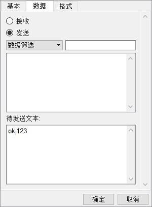

图6  TCP/IP通讯算子基本参数设置界面

       **C.发送和接收数据的查看方式**

      **●**接收或发送的数据可在**算子的结果栏**直观查看。

      **●**接收或发送的数据存储在**TCP/IP通讯算子DataString**中。

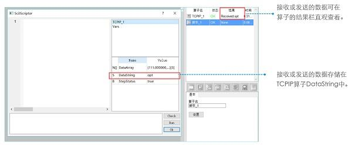  

图7  数据查看/存储说明图

三. **案例3.1 需求**

      TCP/IP通讯算子，发送指令控制，分别执行流程(找圆和匹配)。

      (1)计算圆形工件的内外半径及差值。

      (2)统计视场中螺母个数。

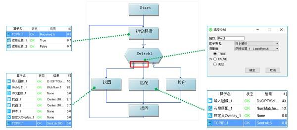

图8 流程图

**3.2 运行效果**

      解析指令OK后(指令分别为“A”和“B”)，执行流程运行，显示并返回结果数据。

      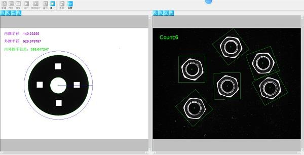

图9  运行界面图

  

    以上为OPT小讲堂之Smart智能视觉软件操作培训第十五课的内容，如对课程有任何问题欢迎点击右侧在线客服处或来电咨询，全国服务热线400-0769-068。

# [OPT小讲堂第十六课 ∣ Smart之Scriptor脚本编程应用](https://www.optmv.com/content/details114_10218.html)

      在第十五课里，我们以TCP/IP通讯方式为例，对通讯工具的应用进行了阐述。今天，我们将介绍Scriptor脚本编程应用。

**一、Scriptor简介**

     Smart智能视觉软件支持脚本编写功能，通过SciSmart智能视觉软件的脚本可以完成包括变量复杂运算、获取日期和时间、对结果进行排序、对文件操作(新建、删除、txt文件内容读写)等操作。

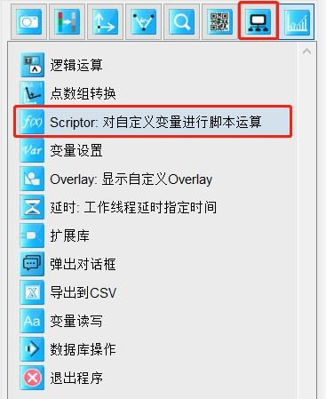

图1  界面图

**二、全局变量**

      按照以下步骤，添加全局变量：菜单栏->设置->变量设置。

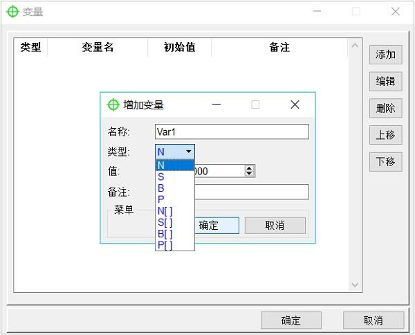

图2  变量设置界面图

**1.全局变量说明：**  
      ●全局变量在流程图中的各模块有效。

      ●全局变量名称以Vars.为开头。(注：Vars.为系统自动添加，无需手动添加，如添加名称为n的全局变量，流程图显示为Vars.n。)

      ●变量名称支持中文。

      ●添加变量时，可以对变量进行初始化及备注。

**2.** **变量类型说明：**

     ●N：数值型(Number)可以进行数值运算的数据类型。

     ●S：字符型(String)由数字、字母、下划线组成的一串字符。

     ●B：布尔型(Boolean)非true(真)，即false(假)。

     ●P：点类型(Point)其成员有两个，即 Point.x 和 Point.y。

     ●N\[  \]：数值型数组。

     ●S\[  \]：字符型数组。

     ●B\[  \]：布尔型数组。

     ●P\[  \]：点类型数组。

**3.使用“脚本”算子进行赋值：**

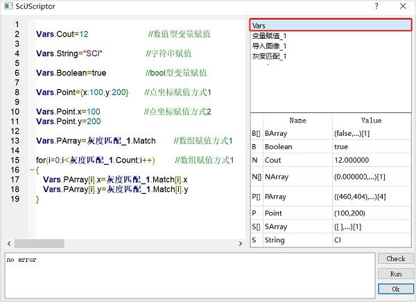

**三、局部变量**

     **1.局部变量：**这里所指的局部变量是仅在当前脚本有效的变量，其他脚本算子或其他模块无法调用的变量。

     **2.var语句：**

     **(1)声明变量：**

      ●var variable

      ●var variable2=value

     **(2)参数：**

       ●variable，variable2为被声明的变量的名字。

       ●value为赋给变量的初始化值。

     **3.局部变量示例：**下例阐明了var语句的用法，需要注意的是，使用var语句来声明变量，初始值的数据类型决定变量的数据类型。

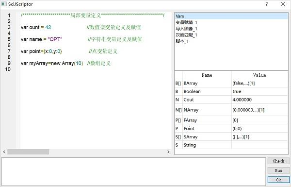

图4  var语句用法示例图

      **4.注释符号：**在Scriptor中，有以下两种形式的注释：

      ●单行注释：单行注释以双斜线“//”开头。

      ●多行注释：多行注释以“/\*”开始，以“\*/”结束。

**四、常用运算符**

      ●加法运算符(+)

      ●减法运算符(-)

      ●乘法运算符(\*)

      ●除法运算符(/)

      ●==运算符：比较两个表达式是否相等

      ●&&运算符：对两个表达式执行逻辑与运算

      ●||运算符：对两个表达式执行逻辑或运算

      ●++运算符：变量值加1

      ●<运算符：比较两个表达式，看是否一个小于另一个

      ●<=运算符：比较一个表达式的值是否小于等于另一个表达式的值

      ●其他运算符

**五、控制语句**

      **1.条件语句：**

      **(1)if…else语句：**根据一个表达式的值，有条件地执行一组语句。

if(condition)

  {statement1}

else

  {statement2}

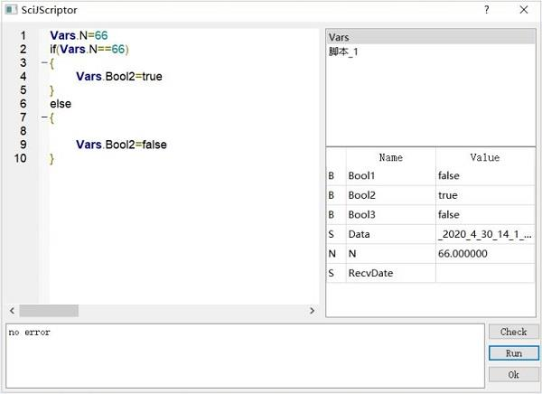

图5  if...else语句用法示例图

      **(2)switch语句：**当指定的表达式的值与某个标签匹配时，即执行相应的一个或多个语句。

switch(expression) {

   case label :

       statementlist

   case label :

       statementlist

   case label :

       statementlist

   ...

   default :

       statementlist

} 

图6  switch语句用法示例图

      **2. 循环语句：**

      **(1)for语句：**只要指定条件为true都执行语句块，例如：  
for(initialization; test; increment)

{   

statements 

}

      **(2)while语句：**在循环第一次被执行前检查expression。每当expression满足条件，则执行一次该循环；如果expression不满足条件，循环结束。例如：

while(expression) 

{

       statements

} 

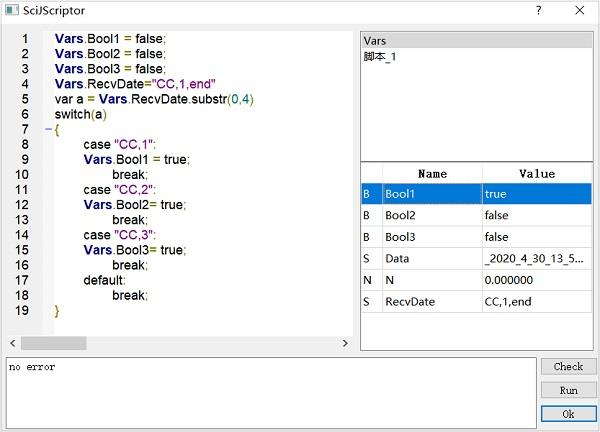

      **3.自定义函数：function**，例如：

function Demo()

{

   statements

} 

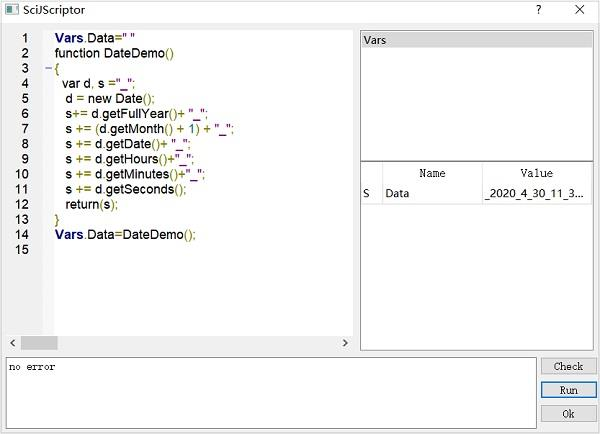

图8  自定义函数function用法示例图

**六、内部对象**

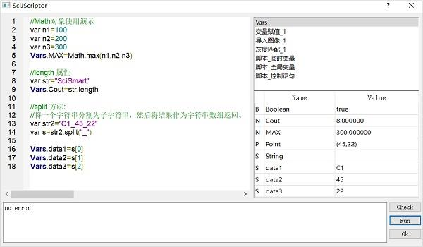

图9  内部对象使用示例图

      **(2)内部对象查找：**

      **●方式一**：使用JScript中文参考手册快速查找。

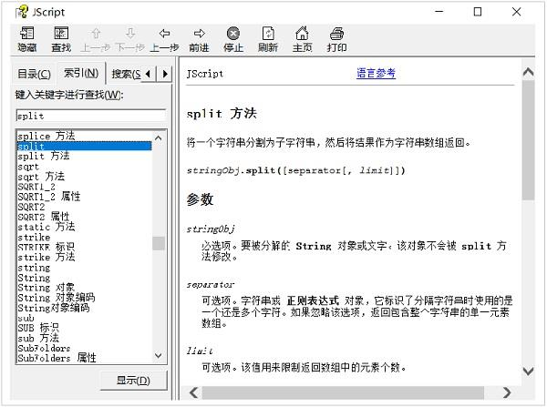

图10  使用JScript中文参考手册查找示例图

      **●方式二：**上网查找。

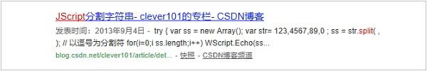

**七、注意事项**

      **1.检查脚本的方式：**

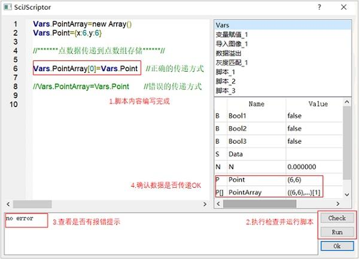

图12  脚本检查方式示例图

      **2.脚本数据的浅拷贝和深拷贝：**

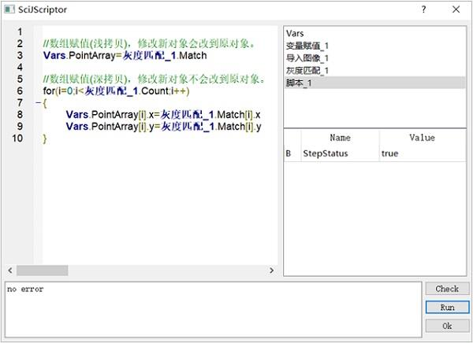

      以上为OPT小讲堂之Smart智能视觉软件操作培训第十六课的内容，如对课程有任何问题欢迎来电咨询，全国服务热线400-0769-068。

# [OPT小讲堂第十七课 ∣ Smart之标定应用](https://www.optmv.com/content/details114_15143.html)

在第十六课中，我们讲了 Smart之Scriptor脚本编程应用。

今天，我们将介绍**Smart之标定应用**。

**相机标定简介**

**相机标定的作用：**标定是实现准确测量和获取准确位置信息的基础，其主要作用是建立图像像素尺寸与实际尺寸的关系、以及建立图像坐标系与世界坐标系的映射关系。

**相机标定的场景及解析：**

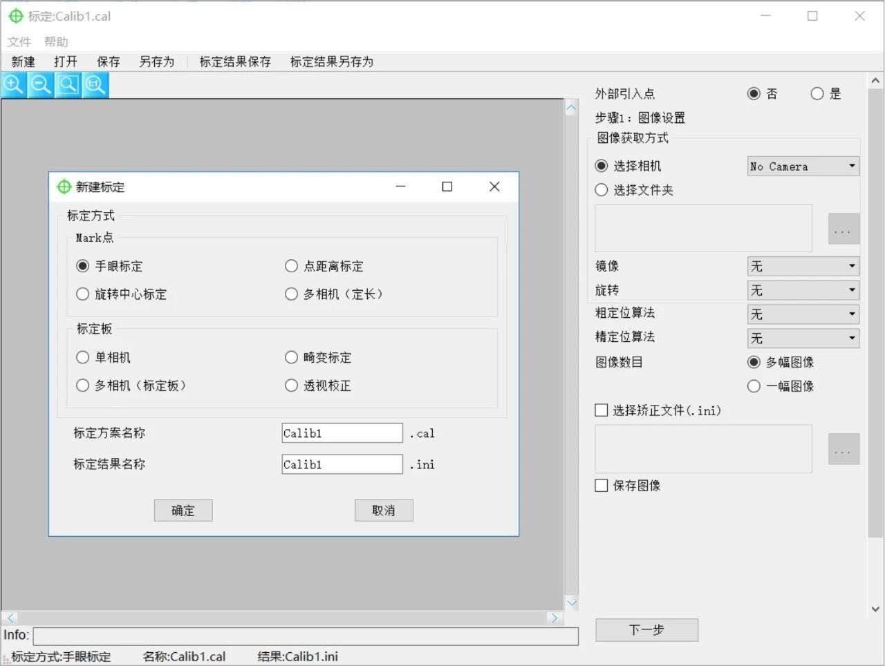

图1  标定主界图

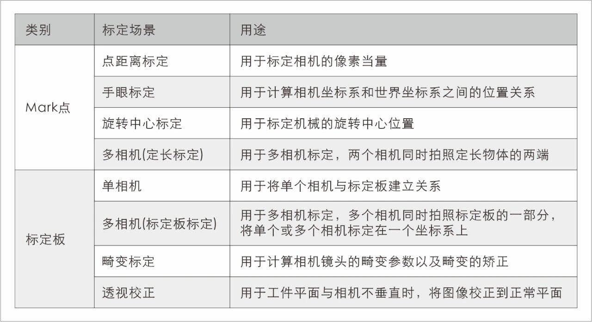

表1：标定场景解析

本文以点距标定和手眼标定为例，进行原理、步骤、用途等详解。

**点距标定**

**点距标定：**用于标定相机的像素当量。

**适用场合：**适用于仅能够单方向移动的场景，例如单轴伺服。

像素当量的计算公式：实际距离/像素距离=像素当量，本例即10/100=0.1(mm/pix)。

机械坐标：P1(0,10)  P2(0,20)

像素坐标：P1(0,10)  P2(0,110)

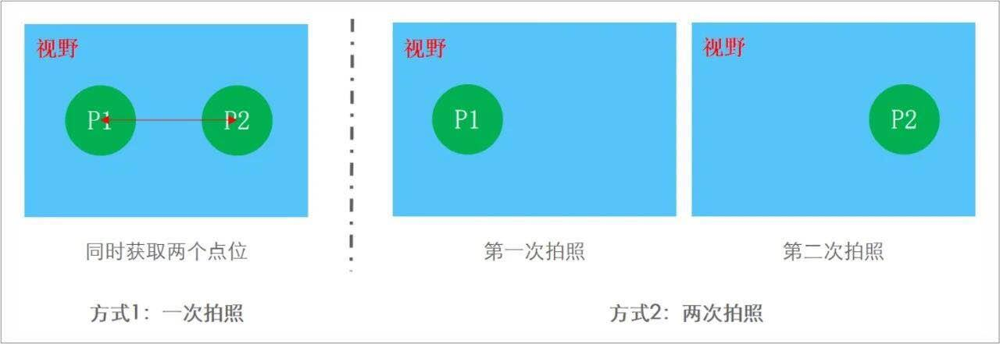

**1 点距标定-图像设置**        

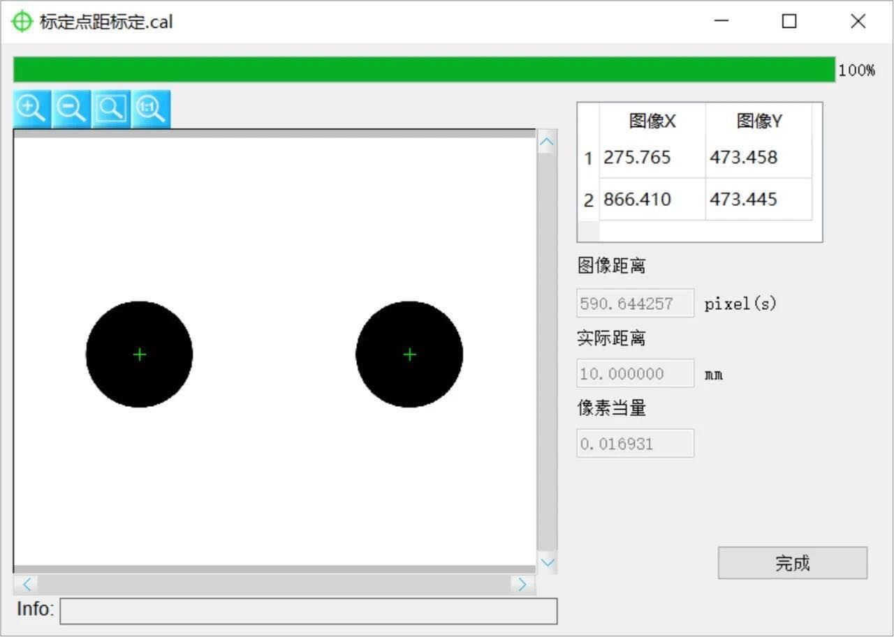

图2  点距标定图像设置页面 

1.1 引入点：是否从外部引入点数据。

1.2 图像获取方式：图片来源既可“选择相机”也可“选择文件夹”。

1.3 镜像：对图片来源是否进行镜像操作，可选择无、垂直、水平、中心等。

1.4 旋转：对图片来源是否进行旋转，可选择无、90、180、270。旋转方向是逆时针旋转，同时选择镜像和旋转操作会先镜像，对镜像结果图逆时针旋转相应角度。

1.5 粗定位算法：可调用灰度匹配、特征匹配、轮廓匹配、Blob分析、卡尺算法。

1.6 精定位算法：需先通过粗定位生成基准点，再使用精定位算法进行 Mark 点定位。可调用找圆、两直线交点算法。

1.7 图像数目：为了获取 两个点在图像中的坐标。

1.8 实际距离：两个 Mark 点间的实际距离。

1.9 保存图像：是否保存标定过程中的图像。若勾选，则按照时间边处理边保存图像在程序目录下的 Picture 文件夹中；若不勾选，则不保存。

1.10 下一步：设置好参数后，点击下一步按钮。

**2 点距标定-结果界面**

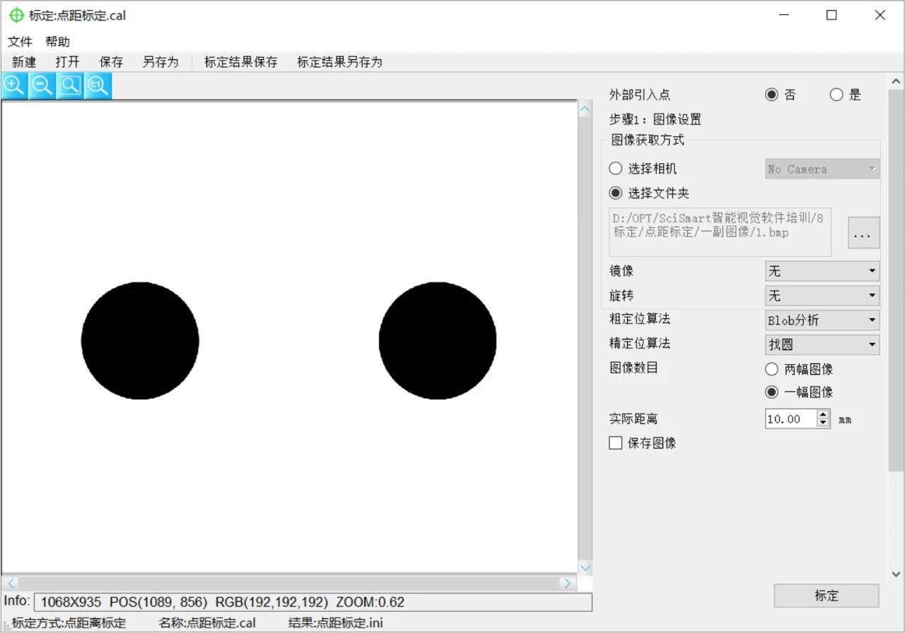

图3  点距标定结果页面

2.1 图像距离：两个 Mark 点的像素距离。

2.2 实际距离：两个 Mark 点的实际距离。

2.3 像素当量：实际距离与像素距离的比值。

**手眼标定**

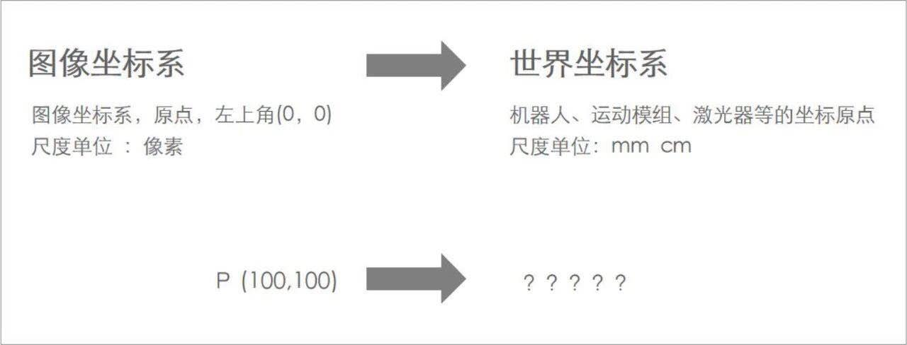

**1 世界坐标系与图像坐标系点位的对应关系**

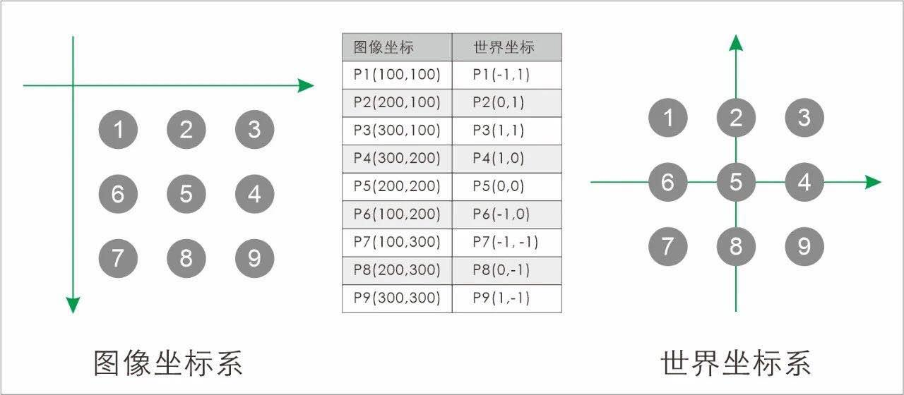

**2 世界坐标系与图像坐标系点位要逐一对应**

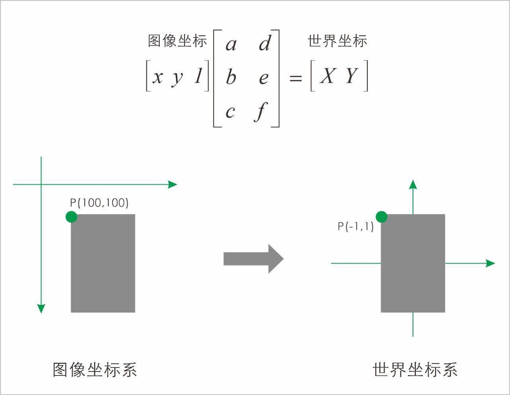

**3 手眼标定的基本流程**

**3.1 创建新的标定文件**

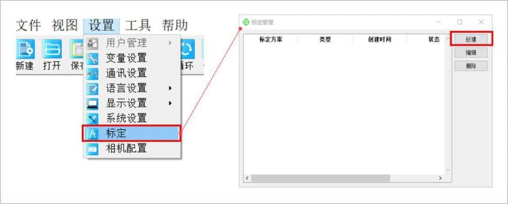

**3.2 编写Mark点定位算法：**

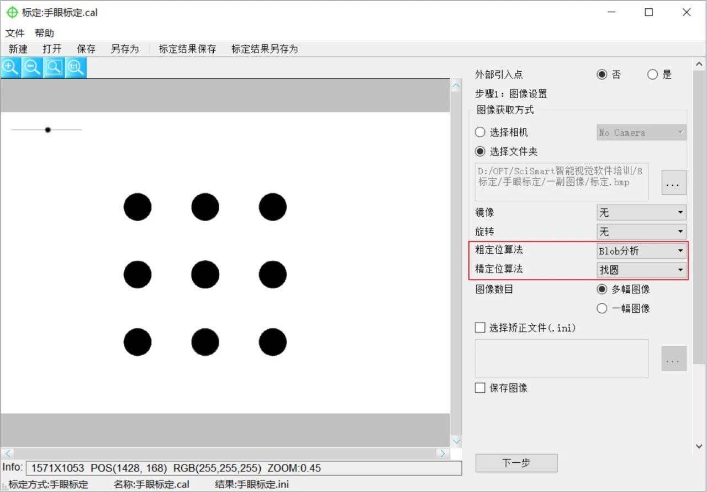

图4 手眼标定-图像设置页面 

3.2.1 引入点：是否从外部引入点数据。

3.2.2 图像获取方式：图片来源既可“选择相机”也可“选择文件夹”。

3.2.3 镜像：对图片来源是否进行镜像操作，可选择无、垂直、水平、中心等。

3.2.4 旋转：对图片来源是否进行旋转，可选择无、90、180、270。旋转方向是逆时针旋转，同时选择镜像和旋转操作会先镜像，对镜像结果图逆时针旋转相应角度。

3.2.5 粗定位算法：可调用灰度匹配、特征匹配、轮廓匹配、Blob分析算法。

3.2.6 精定位算法：需先通过粗定位生成基准点，再使用精定位算法进行 Mark 点定位。可调用找圆、两直线交点算法。

3.2.7 图像数目：为了获取多个点在图像中的坐标。

3.2.8 选择矫正文件：如果图像存在畸变，则需要使用，勾选复选框，加载畸变矫正文件，在标定过程中先校正图像，然后进行九点标定；如果不存在畸变，则不勾选。

3.2.9 保存图像：是否保存标定过程中的图像。若勾选，则按照时间边处理边保存图像在程序目录下的 Picture 文件夹中；若不勾选，则不保存。

3.2.10 下一步：设置好参数后，点击下一步按钮。

**3.3 输入机械坐标点位：**

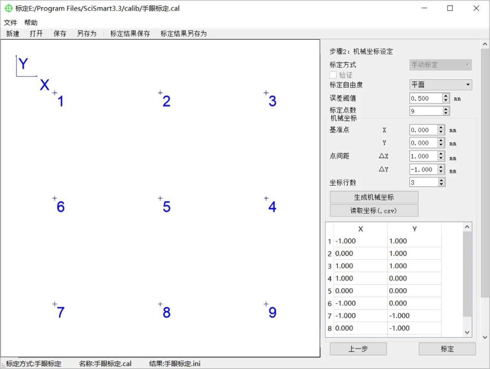

图5  手眼标定-机械坐标设定页面

3.3.1 标定方式：手动标定、半自动标定、自动标定，选择手动标定。

3.3.2 验证：若勾选，则需要 13 个点，前 9 个点用来生成标定矩阵并计算标定误差，后 4 个点参与计算验证误差；若不勾选，则只需要 9 个点，用来计算标定矩阵和标定误差。

3.3.3 标定自由度：平面、倾斜。

3.3.4 标定点数：自定义标定的点位数量。

3.3.5 机械坐标。

**3.4 确认点位的顺序，执行标定：**

标定误差：根据前9个点生成的标定矩阵计算出的误差最大值。

验证误差：根据生成的标定矩阵计算后4个点的误差最大值，未勾选验证则为0。

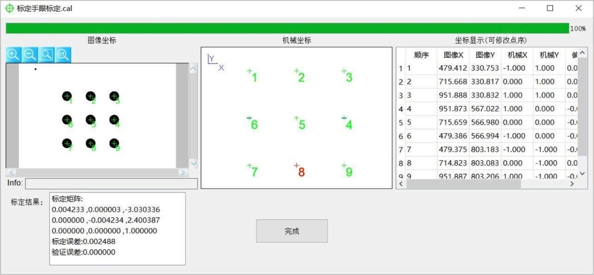

图6  手眼标定-结果页面

**3.5标定结果的验证**

**3.5.1**未使用标定工具，得到的有效数据只有像素坐标系下的坐标。

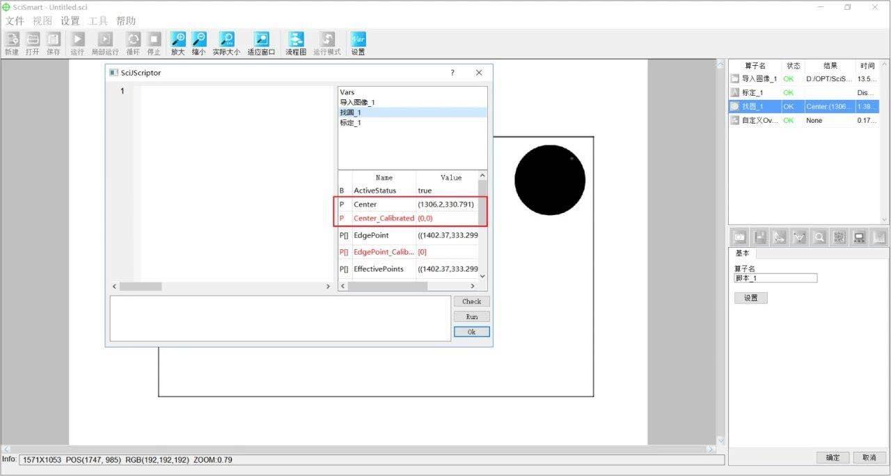

图7  引用标定结果-前图

**3.5.2 标定文件的引用**

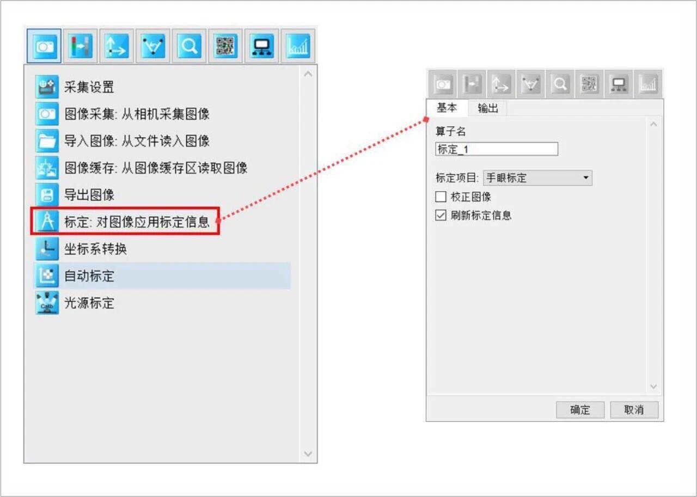

**3.5.3**使用标定工具，得到的有效数据除了像素坐标，也有世界坐标。

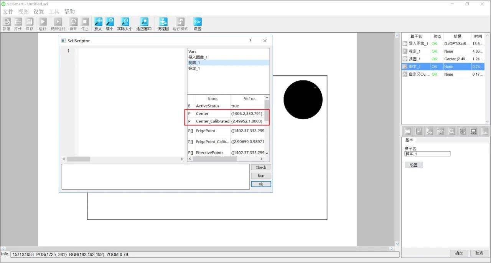

图8  引用标定结果-后图

