# [Smart应用案例——Blob分析](https://www.optmv.com/content/details114_4823.html)

   在机器视觉中，Blob是指图像中的具有相似颜色、纹理等特征所组成的一块连通区域。Blob分析是将图像进行二值化，分割得到前景和背景，然后进行连通区域检测，从而得到Blob块的过程。简单来说，Blob分析就是在一块“光滑”区域内，将出现“灰度突变”的小区域寻找出来。  
   Blob分析为机器视觉应用提供图像中斑点的数量、位置、形状和方向，还可以提供相关斑点间的拓扑结构。Blob分析可应用用于特定目标定位、存在／缺陷检测、数量统计等。其主要适用于以下图像：二维目标图像、高对比度图像、存在缺席检测、数量范围和旋转不变性需求。另一方面，Blob分析并不适用于以下图像：低对比度图像、必要的图像特征不能用2个灰度级描述、按照模板检测。

**实例：**计数

**软件：**Smart\_v2.5.1903.0及以上

**功能：**统计产品的数量

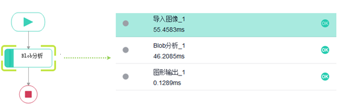图1&nbsp; 原图像

​                               

**操作步骤：**

图2案例流程

**步骤一：**使用“导入图像”算子从本地路径导入图像，替换图像所在的路径，例如：D:/应用案例 /Blob分析 /图像 /1.jpg。

**步骤二：**使用“Blob分析”算子获取白色区域（即产品区域）的中心位置及个数。

**步骤三：**使用“图形输出”算子将“Blob分析”得到的结果显示在图像窗口上。

步骤四：使用UI设置器完成运行界面的布局与编辑。

运行效果图：

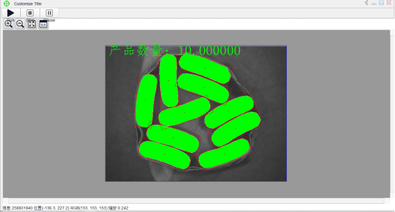图3&nbsp;&nbsp;运行界面

# [SciSmart应用案例——二值化](https://www.optmv.com/content/details114_5780.html)

  对单通道灰度图像进行二值化处理，将灰度图像只转换为黑白二值图像。图像的灰度分为从低(黑色)到高(白色)的256个等级，即\[0,255\]。设置参数时，灰度。在高阈值和低阈值之间的像素组成目标区域(在界面中，用绿色标记的区域)，其余为背景区域。

**应用：**增强图像边缘效果

**软件：**Smart\_v1.0.0.4

**功能：**如图1所示，左侧图像边缘模糊，图像边缘不够清晰。通过阈值来增强边缘效果

 

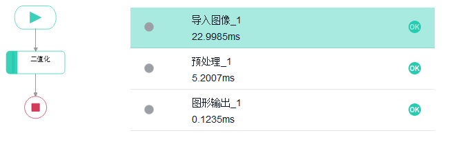图1 二值化(灰度)原图像

**操作步骤：**

图2&nbsp; 流程图

**步骤一：**使用“导入图像”算子从本地路径导入图像，替换图像所在的路径，例如:D:/应用案例/二值化(灰度)/二值化(灰度图像)/1.jpg。

**步骤二：**使用“预处理”算子，选择手动二值化工具，将灰度图像转换为黑白二值图像。打开设置参数界面，如图3所示，可以设置参数。

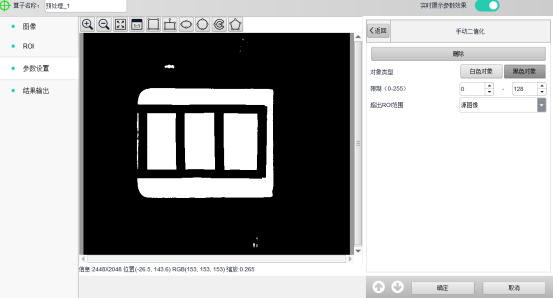图3&nbsp; 二值化(灰度)参数设置界面

**步骤三：** 使用“图形输出”算子将文本内容显示在图像窗口上。

步骤四： 使用UI设置器完成运行界面的布局与编辑。

**运行效果图：**

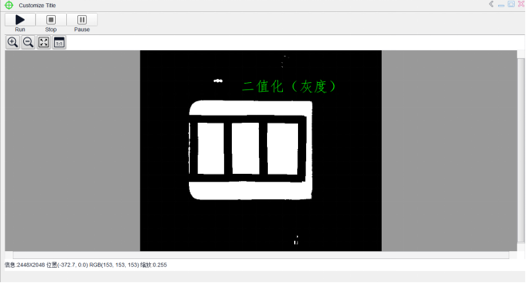图4 运行界面

# [Smart应用案例——灰度匹配](https://www.optmv.com/content/details114_5781.html)

   灰度匹配原理：以统计的观点将图像看成是二维信号，采用统计相关的方法寻找信号间的相关匹配。利用两个信号的相关函数，评价它们的相似性以确定其位置。  
   灰度匹配通过利用某种相似性度量，如相关函数、协方差函数、差平方和、差绝对值和等测度极值，判定两幅图像中的对应关系。采用的相似性度量是归一化的相关函数，其原理是逐像素的把一个以一定大小的实时图像窗口的灰度矩阵，与参考图像的灰度阵列，按某种相似性度量方法计算其相关系数值，值越大，则两者越相似。该值的范围为\[0,100\]。  
   匹配结果由匹配得分、 匹配区域的中心点坐标和匹配区域相对模板的旋转角度组成。灰度匹配不支持尺度缩放。灰度匹配主要应用于产品定位。

**实例：**螺母计数

**软件：**Smart\_v1.0.0.4

**功能：**计算图中无序产物的数量

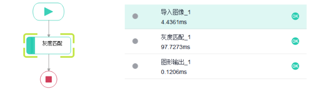
图1 螺母原图像<o:p></o:p>

</td><td> </td></tr></tbody></table>

**步骤：**

图2&nbsp; 流程图

**步骤一：**使用“导入图像”算子从本地路径导入图像，替换图像所在的路径，例如:D:/应用案例/灰度匹配/灰度匹配图像/Grey.bmp。

**步骤二：**使用“灰色匹配”算子定位螺母。图3为满足参数的灰度级匹配结果(模板右上角为灰度圈，图像帧匹配目标对象)。

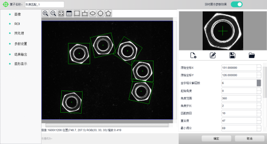图3&nbsp; 灰色匹配参数设置界面

**步骤三：**使用“图形输出”算子将“灰度匹配”得到的结果显示在图像窗口上。

步骤四：使用UI设置器完成运行界面的布局与编辑。

**运行效果图：**

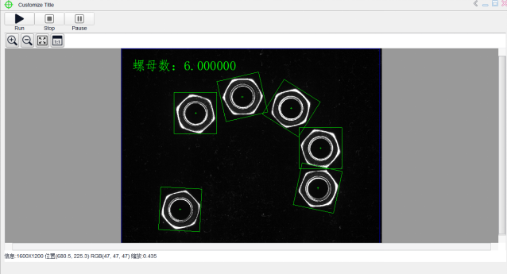图4&nbsp; 运行界面

# [Smart应用案例——条码识别](https://www.optmv.com/content/details114_5782.html)

   条码识别就是在一幅灰度图像中检测出所有符合参数条件的一维码，获得其解码字符串与位置信息。条码识别工具能够自动定位并识别，是一个能对图像中条形码进行分析判断的工具，它能识别 Code39 码、Code128 码、EAN-8 码、EAN-13 码、UPC-A 码、UPC-E 码、Code93 码和 ITF 码。  
   可以通过自动识别来推荐码制，或者手动选择指定待检条码的类型，设定检测的参数，包 括：对比度、搜索步长、最大条宽，即可在指定的 ROI 区域内或者全图中检测出指定类型的所有条码，并返回定位区域和解码结果。支持同时识别多个条码。支持显示坏的条码区域，可配置是否显示。

**实例：**条形码识别

**软件：**SciSmart\_v1.0.0.4

**功能：**读取产品上的所有条形码

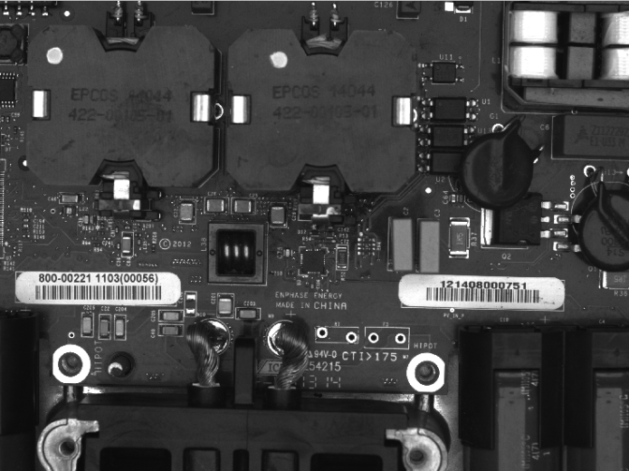图1&nbsp; 原图

**步骤：**

图2&nbsp; 流程图

**步骤一：**使用“导入图像”算子从本地路径导入图像，替换图像所在的路径，例如:D:/应用案例/条码识别/条形码识别图像/1.jpg。

**步骤二：**使用“条码识别”算子，读取产品上的所有条码。如下图所示：

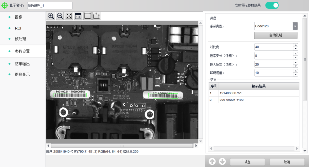

图3 条码识别参数设置界面

**步骤三：**使用“图形输出”算子将“条码识别”得到的结果显示在图像窗口上。

步骤四：使用UI设置器完成运行界面的布局与编辑。

**运行效果图：**

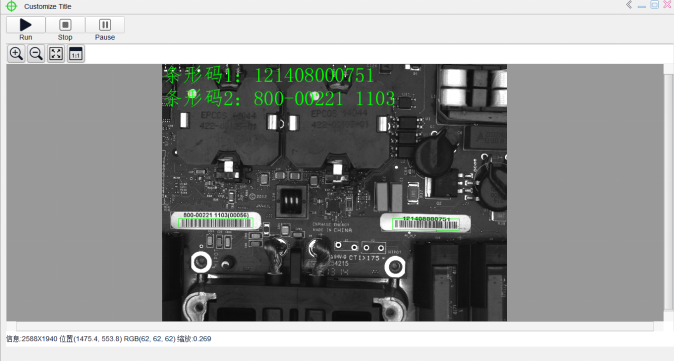图4&nbsp; 运行界面

# [Smart应用案例——形态学](https://www.optmv.com/content/details114_5785.html)

  形态学图像处理的基本思想是利用结构元素作为“探针”在图像中不断移动，在这个过程中收集图像信息，分析图像各部分之间的逻辑关系，了解图像的结构特征。基本形态操作有溶胀、侵蚀、开放计算、封闭计算。利用这些算子及其组合对图像的形状和结构进行分析和处理，可以解决噪声抑制、特征提取、边缘检测、形状识别、纹理分析、图像恢复和重建等问题。

**实例：**填充划痕

**软件：**Smart\_v1.0.0.4

**功能：**填补产品表面的划痕

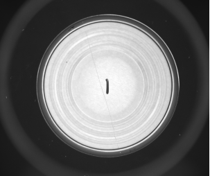图1 原图像

**步骤：**

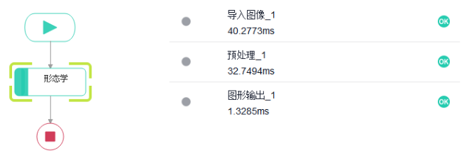图2&nbsp; 流程图

**步骤一：**使用“导入图像”算子从本地路径导入图像，替换图像所在的路径，例如:D:/案例应用/形态学 /形态学图像 /1.jpg。

**步骤二：**使用“预处理”算子，添加形态学工具，选择膨胀处理，填充产品表面划痕，如图3所示。

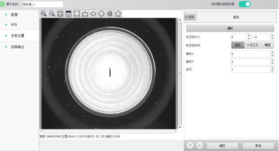
图3&nbsp;&nbsp;形态学算子工具界面
</td><td> </td></tr></tbody></table>

**步骤三：**使用“图形输出”算子将文本显示在图像窗口上。

步骤四：使用UI设置器完成运行界面的布局与编辑。

**运行效果图：**

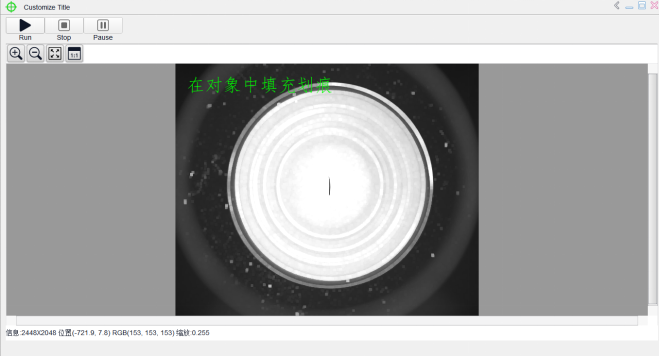图4&nbsp; 运行界面

# [Smart应用案例——找圆](https://www.optmv.com/content/details114_5786.html)

   找圆，就是在灰度图像上指定的区域内寻找合适的边缘点，并将这些点拟合为圆。首先指定256个亮度等级的灰度图像中要处理的环形 ROI 区域，然后在该区域内，对每一条搜索线，按照设定的方向、边缘强度、边缘宽度、适当的阈值选取边缘点；每一条搜索线获得一个点（如果该搜索上没有符合要求的点，则点为空），最后将这些点拟合为圆。常用于圆孔定位、测量等案例中。

**实例：**圆孔定位

**软件：**Smart\_v1.0.0.4

**功能：**产品圆孔定位

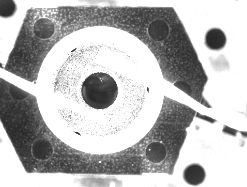图1 原图像

**步骤：**

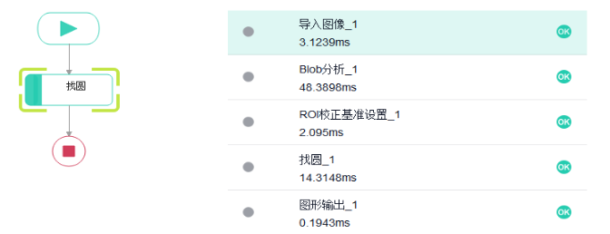
图2&nbsp; 流程图

**步骤一：**使用“导入图像”算子从本地路径导入图像，替换图像所在的路径，例如:D:/应用案例/找圆/找圆图像/1.jpg。

**步骤二：**使用“Blob分析”算子，设置筛选的面积大小，粗定位圆。

**步骤三：**使用“ROI校正”算子，跟踪发现边缘的感兴趣区域，确保边缘被准确找到。

**步骤四：**使用“找圆”算子精定位找圆，并启用ROI校正功能。

**步骤五：**使用“图形输出”算子将“找圆”得到的结果显示在图像窗口上。

步骤六：使用UI设置器完成运行界面的布局与编辑。

**运行效果图：**

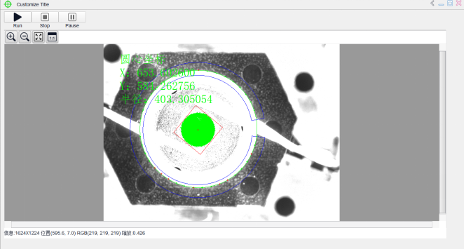图3&nbsp; 运行界面

# [Smart应用案例——找直线](https://www.optmv.com/content/details114_5787.html)

找直线，就是在灰度图像上指定的区域内首先寻找合适的、符合条件的边缘点，然后将这些点拟合为一条直线。

首先指定256个亮度等级的灰度图像中要处理的ROI区域，然后在该ROI区域内，对每一条搜索线，按照设定的方向和适当的阈值搜索满足条件的边缘点。然后通过底层的拟合算法，将满足条件的边缘点按照最小二乘法、剔除比例、剔除距离拟合成直线。直线检测工具常用于定位、测量等案例中。

**案例名称：**两线夹角

**软件版本：**Smart\_v1.0.0.4

**功能说明：**通过定位直角的两条直边，计算出夹角

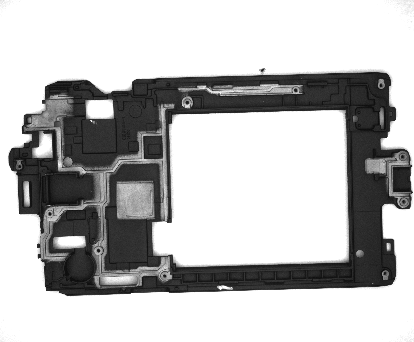图1 原图

**步骤：**

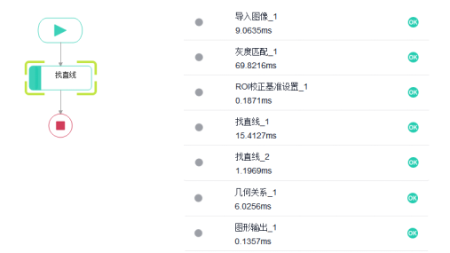图2&nbsp; &nbsp;流程图

**步骤一：**使用“导入图像”算子从本地路径导入图像，替换图像所在的路径，例如:D:/应用案例/ 找直线 /找直线图像/1.jpg。

**步骤二：**使用“灰度匹配”算子，以匹配中心和匹配角度作为校正参考。

**步骤三：**使用“ROI基准校正”算子跟踪发现边缘的感兴趣区域，确保边缘被准确找到。

**步骤四：**使用“找直线”算子找到水平边缘，进行ROI校正。

**步骤五：**使用“找直线”算子找到垂直边缘，并进行ROI校正。

**步骤六：**利用几何关系工具中向量的夹角计算两条边之间的夹角。

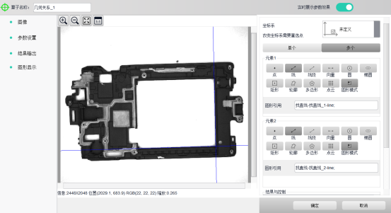

图3   几何关系算子参数设置

**步骤七：**使用图形输出工具显示结果。

步骤八：使用UI设置器完成运行界面的布局与编辑。

**运行效果图：**

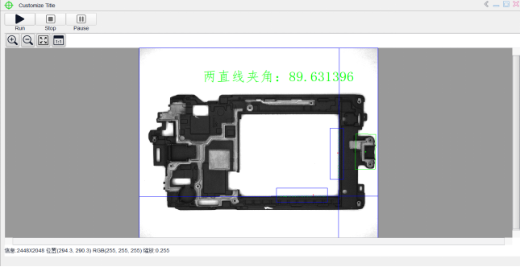
图4 运行界面<o:p></o:p>

</td><td> </td></tr></tbody></table>

# [Smart应用案例——图像拼接](https://www.optmv.com/content/details114_5784.html)

   图像拼接，就是对两幅或两幅以上具有重叠区域的图像拼接缝合成一张图像。这里的图像拼接指的是平面水平拼接或平面垂直拼接，要求摄像头是水平拍摄或者被拍物体时水平移动的（允许存在x,y偏移和平面角度旋转），而不是由拍摄360角旋转的全景图拼接。主要应用在区域过大，无法用摄像机一次完成拍摄，需摄像机多次拍摄后对图像进行拼接融合的情况。  

图像拼接要求至少输入2幅图像，且图像具有一定的重叠区域，拼接完成后，系统将输出拼接完成的一整副图像。

**实例：**图像拼接

**软件：**Smart\_v1.0.0.4

**功能：**将两幅有重叠区域的图像拼接成一幅图像

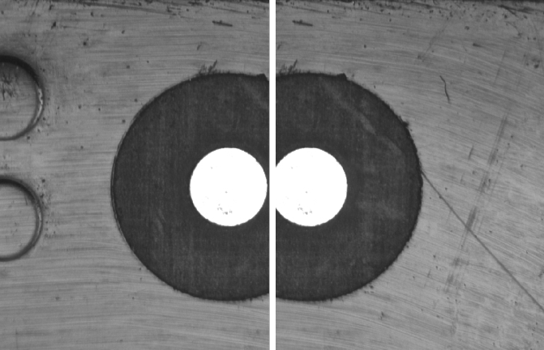图1&nbsp; 原图像

**步骤：**

图2&nbsp; 流程图

**步骤一：**使用“导入图像”算子从本地路径导入图像，替换图像所在的路径，例如:D:/应用案例/图像拼接/图像拼接图像/1.jpg。

**步骤二：**使用“图像拼接”算子将两幅图像拼接成一幅图像，如图3所示。

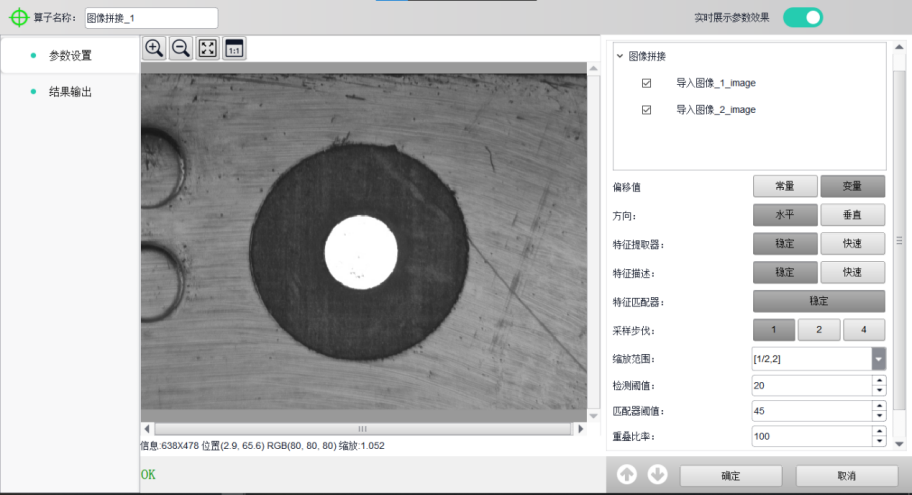

图3 图像拼接工具界面

**步骤三：**使用“图形输出”算子显示结果。

步骤四：使用UI设置器完成运行界面的布局与编辑。

**运行效果图：**

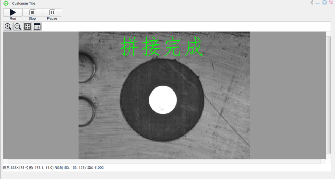图4&nbsp; &nbsp;运行界面

# [Smart应用案例——图像滤波](https://www.optmv.com/content/details114_5783.html)

   在成像、传输和描述的过程中，图像会受到各种信号的干扰，从而产生噪声。同样，噪声总是以孤立的像素点或像素块的形式出现，对图像具有很强的视觉效果。在数字图像处理中，图像滤波一直被用来处理这类图像。图像滤波是一个抑制图像噪声信号，保证图像细节不被破坏的过程。滤波方法有均值滤波、中值滤波、高斯滤波、拉普拉斯滤波、Sobel滤波等。

**实例：**抑制噪声信号

**软件：**Smart\_v1.0.0.4

**功能：**利用高斯滤波工具对图像中的噪声信号进行抑制

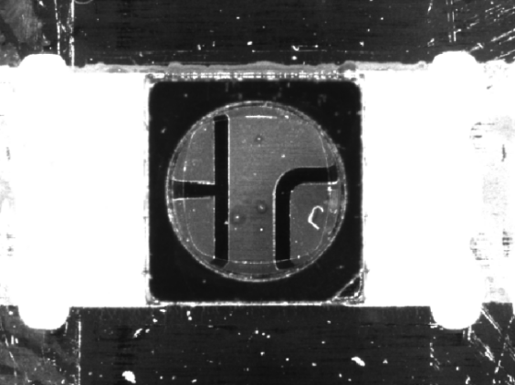图1 原图

**步骤：**

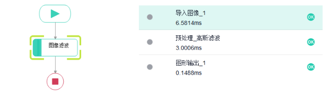图2&nbsp; 流程图

**步骤一：**使用“导入图像”算子从本地路径导入图像，替换图像所在的路径，例如:D:/应用案例/图像滤波/图像滤波图像/1.jpg。

**步骤二：**使用“预处理”算子，添加高斯滤波选项，设置其参数，对图像中的噪声信号进行抑制。如图3所示。

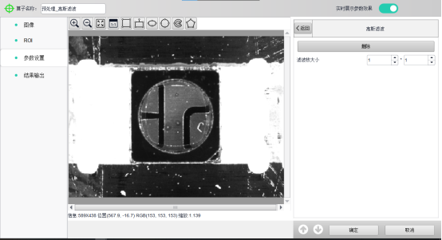图3&nbsp; 滤波工具界面

**步骤三：**使用“图形输出”算子将文本内容显示在图像窗口上。

步骤四：使用UI设置器完成运行界面的布局与编辑。

**运行效果图：**

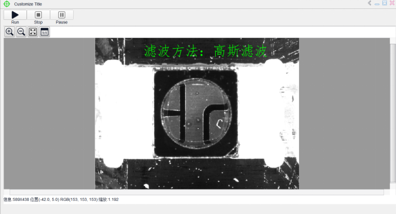图4&nbsp;&nbsp;结果运行界面