## 机器视觉概述

### 机器视觉系统简介  

​       机器视觉顾名思义是使机器具有像人一样的视觉功能，从而实现各种检测、判断、识别、测量、定位等功能。机器视觉可以显著提高生产效率和自动化、智能化程度。一个典型的机器视觉系统包括：光源、镜头、相机、图像处理硬件、图像处理软件、执行单元等。  
​       机器视觉综合了光学、机械、电子、计算机软硬件方面的技术，涉及图像处理、模式识别、人工智能、光机电一体化等多个领域。近年来，图像处理和人工智能等技术的快速发展，极大地推动了机器视觉的发展。

### 机器视觉系统工作原理  

​       机器视觉系统通过图像采集硬件(相机、镜头、光源等)将光信号转换成图像信号，并传送给图像处理软件。图像处理软件根据像素亮度、颜色分布等信息，对目标进行特征提取，并做出相应的判断，根据结果输出来控制现场设备，实现检测功能。  
​       视觉处理系统包含硬件和软件两方面。根据硬件的不同，机器视觉系统分为智能相机和基于PC的视觉系统。一个基于PC的机器视觉系统最为核心的部分由光源、镜头、相机、视觉处理系统四个部分组成。     
​       镜头主要作用是将被测目标成像至摄像机的感光芯片上。  
​       相机主要作用是采集图像，将光信号转换成电信号，从而输出图像给计算机。  
​       软件的核心技术为图像处理及分析算法，它包括图像增强、图像分割、特征抽取、图像识别与分析等。通过图像处理与分析，对产品质量判断、尺寸测量，并将结果信号传输到相应的硬件进行显示或执行。

### 机器视觉与人工视觉的对比

​    在以往大批量工业生产过程中，主要靠人工视觉对产品进行测量、识别和分析。由于人工视觉处理时，效率低，稳定性差且精度不高，用机器视觉可以大幅度提高处理效率和自动化程度；同时，在一些不适合人工作业的危险工作环境或人眼难以满足要求的场合，也常用机器视觉来替代人眼，如核电站监控、晶圆缺陷检测；而且机器视觉易于实现信息集成，是实现计算机集成制造的基础技术之一。由于机器视觉系统可快速获取大量信息，且易于自动处理及信息集成，故在现代自动化生产过程中，机器视觉系统广泛用于装配定位、产品质量检测、产品识别、尺寸测量等方面。机器视觉与人工视觉主要区别如右表。

|          | 机器视觉           | 人工视觉                         |
| -------- | ------------------ | -------------------------------- |
| 效率     | 效率高             | 效率低                           |
| 速度     | 速度快             | 速度慢                           |
| 可靠性   | 检测效果稳定       | 易疲劳、有情绪，不易保持检测效果 |
| 工作时间 | 可24小时不停工作   | 容易疲劳，工作时间有限           |
| 信息集成 | 可实现信息集成     | 不易实现信息集成                 |
| 成本     | 成本(一次投入)     | 成本高                           |
| 环境     | 适于危险的检测环境 | 不适于危险的检测环境             |

### 机器视觉的发展历程

#### ◆国内外机器视觉的发展历程     

​    国外机器视觉技术起步较早，20世纪50年代机器视觉概念出现，70年代真正开始发展，90年代后期进入行业高速发展期。在机器视觉发展的历程中有两次大的飞跃，一是20世纪70年代CCD图像传感器的出现，让光学影像转化为计算机能处理的数字信号，是机器视觉发展历程中的一个重要转折点；二是20世纪80年代CPU、DSP等图像处理技术的飞速进步，为机器视觉飞速发展提供了有利条件。从全球机器视觉行业当前格局来看，中、德、美、日等工业强国占据了机器视觉技术及应用的绝大部分市场。在国外，机器视觉广泛应用于半导体、电子信息、汽车、食品、医疗等行业。进入21世纪，国外机器视觉市场虽增速放缓，但在技术上仍处于领先地位。
​    国内机器视觉起步于80年代，20世纪末和本世纪初进入到发展初期，2010年前后至今一直在高速发展。随着工业自动化程度的不断提高和对质量更加严格的要求，机器视觉大量代替人工检测成为必然。另外，中国早期的工业设备自动化程度普遍较低，因此需要大量的更新换代，这些都构成了机器视觉的大量市场需求。随着机器视觉技术的逐渐进步，国内科技公司不断开发和推出相应的产品。从相机、镜头、光源到图像处理软件等，国内陆续涌现一批技术成熟的研发型厂商。受到制造业人口红利消退、智能制造利好政策刺激以及工厂自动化亟待提高等多重因素的共同作用，中国已成为世界机器视觉发展最有潜力和最为活跃的地区之一。

#### ◆机器视觉发展趋势

​    随着机器视觉应用场景的复杂多样，其与深度学习算法、3D应用技术、互联互通标准等技术的融合也越来越紧密。
​    深度学习算法：深度学习算法模拟类似人脑的层次结构，通过深度神经网络建立从低级信号到高层语义的映射，以实现数据的分级特征表达。深度学习算法被引入机器视觉图像处理系统来进行外观检测，使识别过程更智能，视觉信息处理能力更强大。
​    3D应用技术：随着3D应用技术的不断深入，越来越多的3D重构技术被引入到机器视觉，如结构光、DFF、TOF、立体视觉、光度立体法等。3D图像处理与分析的算法也被研究得越来越广泛，将成为机器视觉的一个主流发展方向。
​    互联互通标准：机器视觉系统内部，以及与智能制造设备之间，与企业的管理系统之间，有必要进行互联互通，使设备和制造管理朝着更智能方向发展。目前视觉行业内部，包括EMVA、AIA、CMVA、JIIA等，合作制定了GenICam标准。AIA制定了GigE Vision，USB3 Vision等相机通信协议。视觉行业还与其他行业协会合作，不断拓展互联互通的外延，旨在促成视觉系统与其他行业的互联互通。

### 机器视觉的典型应用

   在现代自动化生产过程中，人们将机器视觉系统广泛地应用于电子、SMT、半导体、医药/医疗、烟草、印刷、食品/饮料、汽车、锂电、光伏等各行各业中。应用项目包括装配定位、产品质量检测、产品识别、产品尺寸测量等方面。更多应用案例，请参考OPT官方网站www.optmv.com。

##### ◆ 电子行业视觉应用

   电子行业的快速发展，给机器视觉带来了巨大的机遇和挑战。机器视觉技术不断地渗透到电子行业产业链的各个环节，从电子产品的设计、制造到产品质检、复检、包装等，都给电子行业的发展注入了新的力量。

   检测内容包括：
   电容、电感外观检测；液晶屏AA区定位、手机卡槽定位、手机外观缺陷检测、手机壳LOGO检测等。

|  |  |
| ----------------------------------- | ----------------------------------- |
|                                     |                                     |

##### ◆ SMT行业视觉应用

​    SMT(Surface Mounted Technology)是目前电子组装行业里最常用的一种技术和工艺。机器视觉主要用于SMT生产线上的定位与质量检验，包括印刷机中钢网与PCB对位，锡膏3D扫描，贴片机元器件定位，印刷后AOI、贴片后AOl、炉后AOl等。

    检测内容包括：
    点胶检测、元件正负极判断、元件组装定位、PCB板焊锡复检(虚焊、多锡、少锡等)、OCR(光学字符识别)、表面二维码识别等。

|  |  |
| ----------------------------------- | ----------------------------------- |
|                                     |                                     |

##### ◆ 半导体行业视觉应用

​    机器视觉在半导体行业的应用已非常普遍，涉及到半导体外观缺陷、尺寸大小、数量、平整度、间距、定位、焊点质量、弯曲度等检测。    

​    检测内容包括：
​    金属棒、晶圆尺寸测量、晶圆划片定位、晶棒切割定位、外观、异物缺陷检测、IC引脚平整度检测、SMD包装检测、字符识别等。

|  |  |
| ----------------------------------- | ----------------------------------- |
|                                     |                                     |

##### ◆ 医药/医疗行业视觉应用

   机器视觉技术在医药行业的广泛适用性为其赢得更加广阔的市场空间。

   检测内容包括：
   液体制剂的灌装定位、尺寸不合格的胶囊检测、瓶体内杂质及封盖检测、胶囊脏污检测、医药产品外包装的条码检测、外包装外观检测、外包装纸箱的满箱检测等。

|  |  |
| ----------------------------------- | ----------------------------------- |
|                                     |                                     |

##### ◆ 烟草行业视觉应用

​    香烟的生产速度非常快，在生产过程中有许多不合格品产生。通过机器视觉及时发现不合格品并将其剔除是非常必要的。   

　　检测内容包括：
    烟叶原料杂物检测、过滤烟嘴尺寸测量、卷纸包装缺陷检测、烟盒表面字符二维码检测、烟包变形检测、烟盒计数等。

|  |  |
| ----------------------------------- | ----------------------------------- |
|                                     |                                     |

##### ◆ 印刷行业视觉应用

​    印刷行业是机器视觉常见的应用行业之一。机器视觉系统能够迅速准确的检测出印刷品中的各类缺陷，提高产品质量和生产效率，降低企业成本。被检测的印刷品形式多样，从印刷材质类型可分为纸质、塑料和金属钢板等；从印刷的形式可分为卷曲材料和单张产品。

　   检测内容包括：

​    材质的缺陷检测(如孔洞、异物等)、印刷缺陷检测(如飞墨、刀丝、蹭版、套印不准等)、颜色缺陷检测(如浅印、偏色、露白等)。

|  |  |
| ----------------------------------- | ----------------------------------- |
|                                     |                                     |

##### ◆ 食品/饮料行业视觉应用

​    近年来，在食品/饮料高速生产流水线上，人工检测已不能满足企业对于食品/饮料质量的检测要求，机器视觉的迅速发展大大提高了食品/饮料行业检测技术水平。随着一系列应用问题得到解决，基于机器视觉应用的食品/饮料生产自动化程度显著提高。

　  检测内容包括：
　　玻璃瓶的质量检测，如瓶口破损、瓶身、瓶底异物检测。瓶子计数、饮料灌装定位、灌装液位检测、灌装后异物检测、标签位置及喷码识别等。

|  |  |
| ----------------------------------- | ----------------------------------- |
|                                     |                                     |

##### ◆ 汽车行业视觉应用

​    由于人工成本的增加、人力资源的紧缺以及汽车产业对于产线高效率、高精度、高品质、高智能的要求，机器视觉技术在汽车行业已经广泛的应用，不仅可以大大提高工作效率，而且可以提升产品质量。

　　检测内容包括：
    汽车五金件尺寸测量、外观缺陷检测、零件条码读取、钣金焊点检测、汽车零部件组装定位、汽车灯罩、卡扣等字符识别、外观检测、面板标识检测等。

|  |  |
| ----------------------------------- | ----------------------------------- |
|                                     |                                     |

##### ◆ 锂电行业视觉应用

　　近年来国家大力推动新能源发展，锂电池行业发展迅速。锂电池极片在生产过程中，会因为涂布机、辊压机的原因造成负极露箔、暗斑、亮斑、掉料等缺陷。使用机器视觉检测的方式替代人工挑选出次品，能够实现极片自动化检测，确保产品的安全。

    检测内容包括：

　　涂布外观检测、极耳焊接定位、尺寸测量、折痕检测、焊接爆点检测、电池表面字符识别、成品外观检测等。

|  |  |
| ----------------------------------- | ----------------------------------- |
|                                     |                                     |

##### ◆ 光伏行业视觉应用

​    随着人力成本的提高，同时为保证产品的质量，避免众多人为因素造成的质量问题，在太阳能电池板制程中，从前端到后端，任何一个环节出错，都会影响到太阳能电池板成品的发电效率，例如二次污染和破片。使用机器视觉检测技术代替人工，对硅片、太阳能电池片进行检测与分选，是光伏制造技术的发展趋势。
​    
​    检测内容包括：
　　 太阳能电池涂锡及尺寸测量、太阳能电池板焊接定位、焊接表面脏污检测、电池片缺陷检测(裂纹、杂质、空隙、边角断裂、栅线断裂、浆料污渍、色彩偏差)等。

|  |  |
| ----------------------------------- | ----------------------------------- |
|                                     |                                     |

## 镜头

### 镜头的成像原理

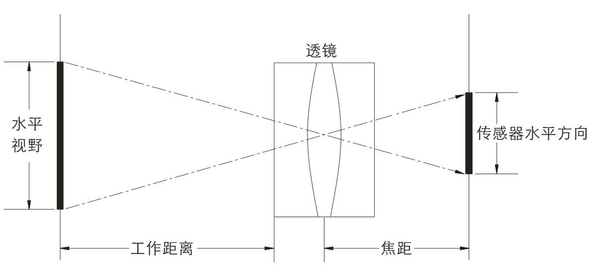

   镜头的成像是以凸透镜成像的原理为基础，通过透镜的组合，把物体发出或者反射的光线成像在像平面上(与芯片面重合) 。运用凹凸透镜组合能有效地平衡球差、轴外像差、色差等各种像差，提高成像质量。

​    

### 技术指标介绍

#### 1、焦点/焦距

   与光轴平行的光线射入凸透镜时，理想的镜头应该是所有的光线聚集在一点后，再以锥状扩散开来，这个聚集所有光线的点叫做焦点。对于单个透镜来说，焦距是指从光心到焦点的距离，如图一；对于多个透镜组成的镜头组来说，焦距是指像方主平面到焦点的距离，如图二。

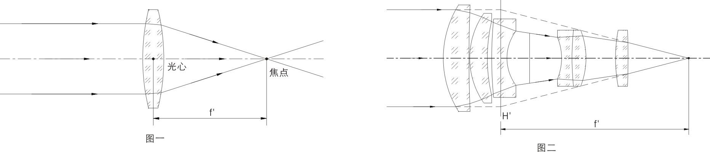

#### 2、光圈 

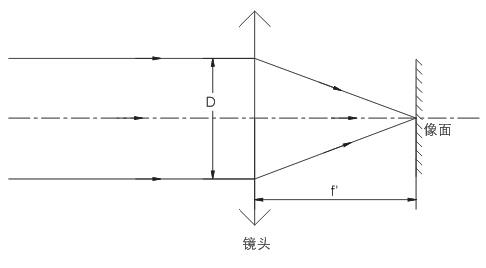

   在镜头内部，有一个多边形或者圆形且面积可变的孔状光栅装置，这个装置就叫做光圈。光圈的作用是控制镜头的通光量，通常用光圈系数来描述其大小。光圈系数是指镜头焦距   与整个镜头入瞳直径D的比值，通常用f/#来表示。其计算公式：f/#=f′/D。

   

   

   f/#值越小，光圈越大。一般f/#值是以√2倍递增，因此光圈常用的计数为F1.4，F2.0，F2.8，F4.0……在同一单位时间内上一级的通光面积是下一级的两倍，例如光圈从f/8调整到f/5.6，通光面积便增加一倍。

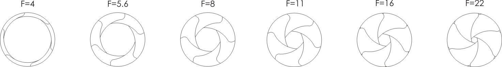

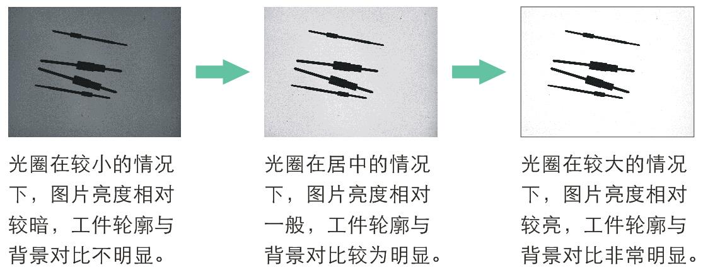

   光圈对图片亮度的影响：相同应用条件下，同一镜头，光圈越大，通光孔径越大，图片越亮。

   

#### 3、工作距离

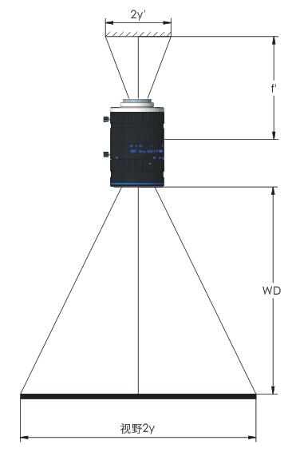

​    工作距离(Working Distance)：镜头聚焦清晰时，被测目标到镜头最前端的距离称为工作距离。实际应用中，镜头不能对任意物距下的目标都同时聚焦清晰，因此镜头的工作距离有一定范围。 

#### 4、视场角/视野

 1、视场角

​    在光学工程中，视场角是指镜头对图像传感器的张角，即若y'为Sensor的半对角线长度，则视场角2θ≈2*arctan(y'/f')。

 2、视野

​    视野(Field of View, FoV)，也叫视场范围，是指镜头能观测到的实际范围。镜头的视野大小和相机的分辨率，决定视觉系统所能达到的视觉检测精度。

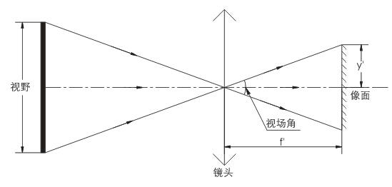

​     相同的工作距离下，焦距越短，视场角越大，视野也就越大；相同的焦距下，视场角一定，工作距离越远，视野越大。  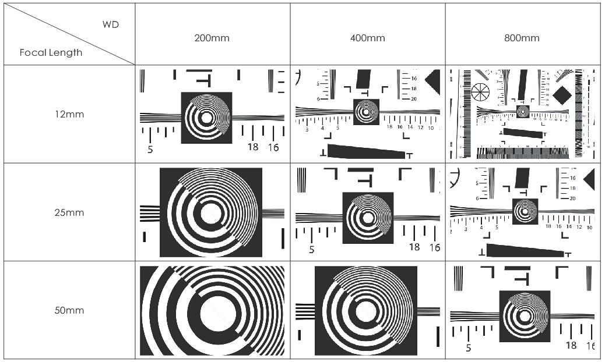

#### 5、放大倍率

 放大倍率定义为像的大小与物的大小之比。 
    -1＜β ＜0时，物像异侧，成倒立缩小的实像，如AA′所示，这就是镜头的成像原理。
    β=-1时，物像异侧，成倒立等大的实像，如BB′所示。
    β＜-1时，物像异侧，成倒立放大的实像，如CC′所示，这就是显微镜的成像原理。
    β＞0时，物像同侧，成正立放大的虚像，如DD′所示，这就是放大镜的成像原理。

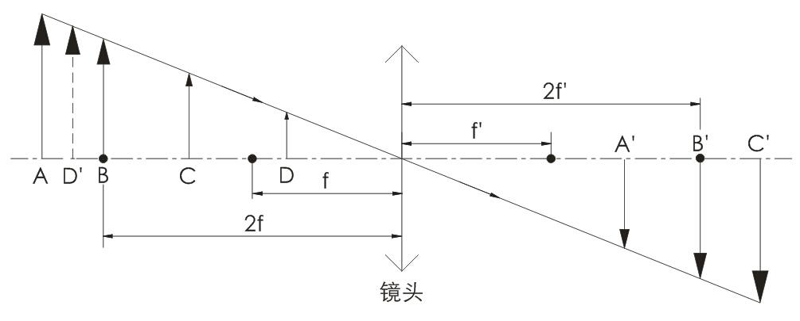

#### 6、分辨率

​     分辨率是指光学系统可以测到的被测物体上的最小可分辨特征尺寸。镜头能分辨物体的细节越小，镜头的分辨率就越高。通常用像面处每毫米能够分辨的黑白相间的条纹对数(lp/mm)描述。
​     在实际应用中，建议镜头的分辨率不低于相机的分辨率。

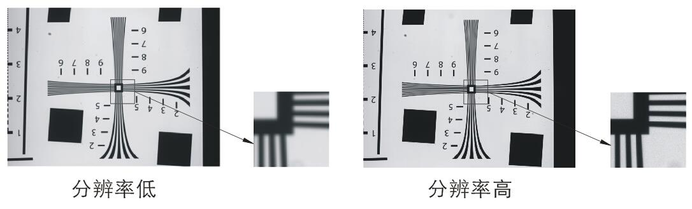

#### 7、景深

​    景深：能在像平面上获得清晰像的物方空间深度。即：在被摄物平面(对焦点)前后一定范围内的物体，在无需调焦的情况下，其成像仍然清晰，这段可清晰成像空间深度就是景深。

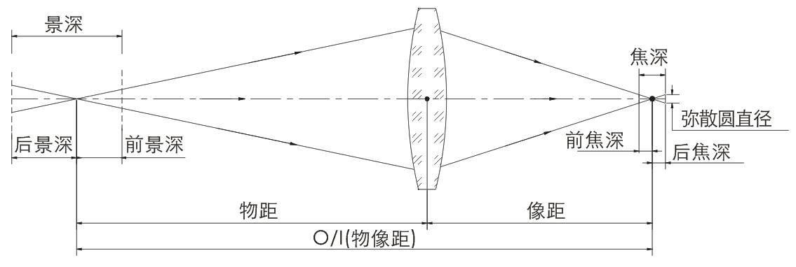

影响景深的主要因素

1、镜头光圈

​    光圈越大，景深越小；光圈越小，景深越大。

2、镜头焦距

​    镜头焦距越长，景深越小；焦距越短，景深越大。

3、拍摄距离

​    距离越远，景深越大；距离越近，景深越小。

| 镜头光圈对景深的影响上面两张图同为OPT-C3514-5M镜头在相同工作距离下拍摄。左图的光圈为F1.4，右图的光圈为F16，可以看出右图的景深比左图的景深大。 | 镜头焦距对景深的影响    上面两张图片是在相同的光圈，相同的工作距离下拍摄的。左图是用OPT-C1218-5M拍摄的，焦距f’=12mm；右图则是用OPT-C3514-5M拍摄的，焦距f’=35mm。可以看出左图的景深比右图的景深大。 |
| ------------------------------------------------------------ | ------------------------------------------------------------ |
|                                                              |                                                              |

| 工作距离对景深的影响    上面两张图片是用镜头OPT-C3514-5M，在光圈相同的前提下，改变工作距离拍摄的。左图是的工作距离是1.2m，右图的工作距离是4.2m，可以看出右图的景深比左图的景深大。 |
| ------------------------------------------------------------ |
|                                                              |

#### 8、光学畸变

​    光学畸变(distortion)：由于镜头在不同视场放大倍率的不一样，使得像相对于物体失去相似性，这种像变形的缺陷称为光学畸变。光学畸变只影响成像的几何形状，并不影响成像的清晰度。常见的光学畸变主要有两种类型，桶形畸变和枕形畸变(如图)。

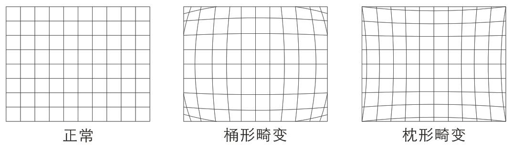

#### 9、TV畸变

​    TV畸变是图像的视觉畸变的度量，TV畸变的定义有很多 。其中RIAA TV畸变计算公式如下：
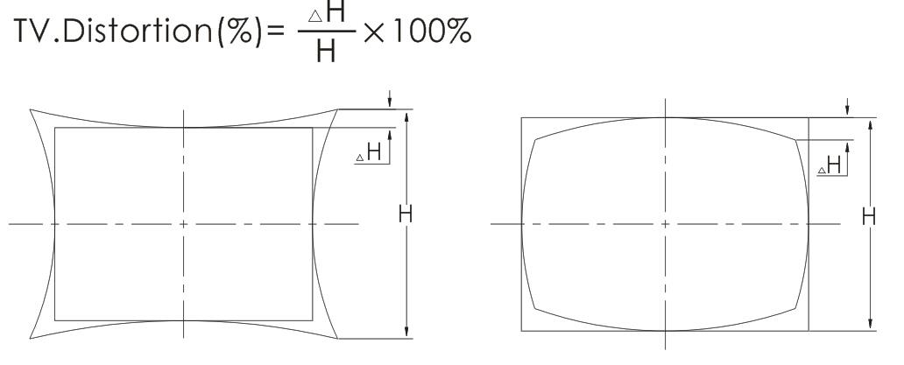

#### 10、后截距

1、法兰距：镜头法兰面到像面(芯片)的距离。
2、机械后截距：镜头最后的机械面到像面的距离。
3、光学后截距：镜头最后端镜片表面顶点到像面的距离。
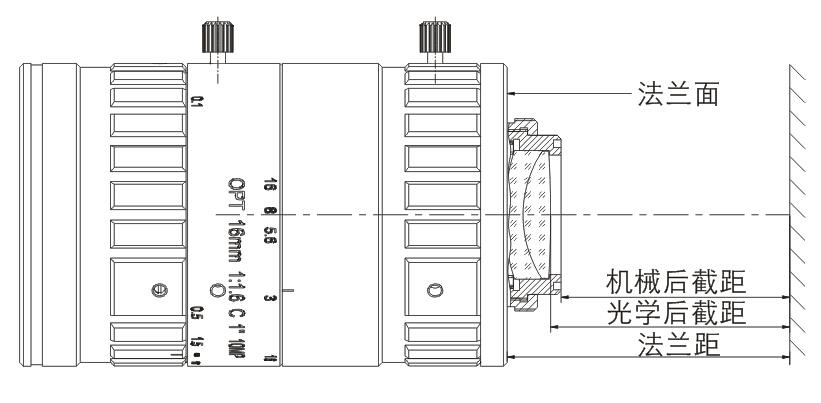

### 镜头分类与选型

#### 镜头分类

**镜头有多种分类方法：**

按功能分类：定焦镜头、变焦(倍)镜头、定光圈镜头；
按用途分类：远心镜头、FA镜头、线扫镜头、微距镜头(或者显微镜头)；
按视角分类：普通镜头、广角镜头、远摄镜头；
按焦距分类：短焦距镜头、中焦距镜头、长焦距镜头。

​    工业应用中，最常用的镜头为定焦镜头和远心镜头。定焦镜头指固定焦距的镜头；远心镜头(Telecentric)主要是为纠正传统镜头的视差而特殊设计的镜头，它在一定的工作距离范围内，所得图像的放大倍率不随工作距离的变化而变化，即被测物在不同工作距离下，所成像的大小相同，因此普遍应用在高精度测量的场合中。一般可分为以下几类：

​    物方远心镜头：物方主光线平行于光轴，即主光线的会聚中心位于物方无限远，能够消除物方因调焦不准确而导致的读数误差。(图1)

​    像方远心镜头：像方主光线平行于光轴，即主光线的会聚中心位于像方无限远，能够有效消除因像方调焦不准而导致的测量误差。(图2)

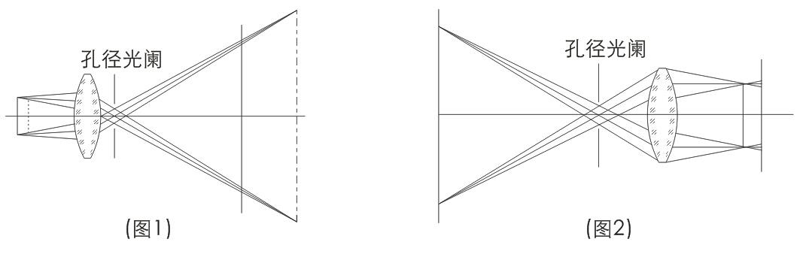

​     双侧远心镜头：物方主光线和像方主光线分别投射到各自端无限远，兼容以上两款镜头的优点。

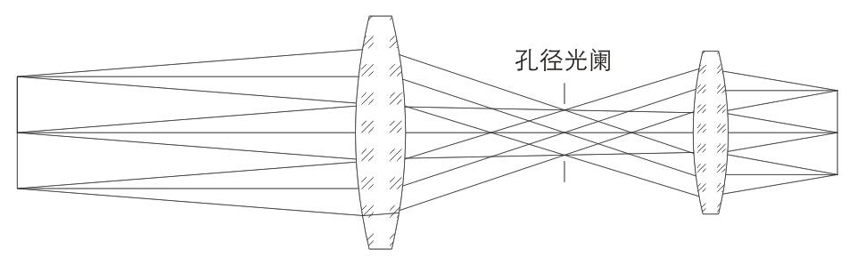

​     常规的表面缺陷检测、有无判断等对系统精度要求不高时，可以选用普通镜头。对于精密测量的应用需求则考虑选择远心镜头，因为普通镜头成像时，由于不同工作距离造成放大倍率不一致而造成视差，即产生近大远小的效果，从而影响测量精度。远心镜头能确保检测目标在一定范围内放大倍率一致，克服视差，从而提高测量精度。下图为普通镜头与远心镜头效果对比：

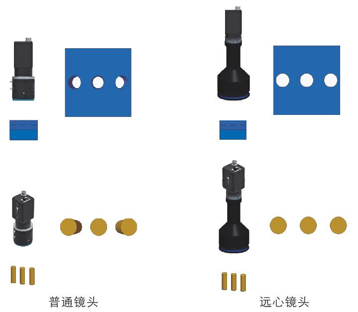

#### 镜头选型

##### 1、选型思路

在机器视觉系统中，镜头的主要作用是将工件成像至相机传感器芯片上，因此镜头的选型将直接影响到机器视觉系统的整体性能。一般可以通过以下方式合理地选择镜头：

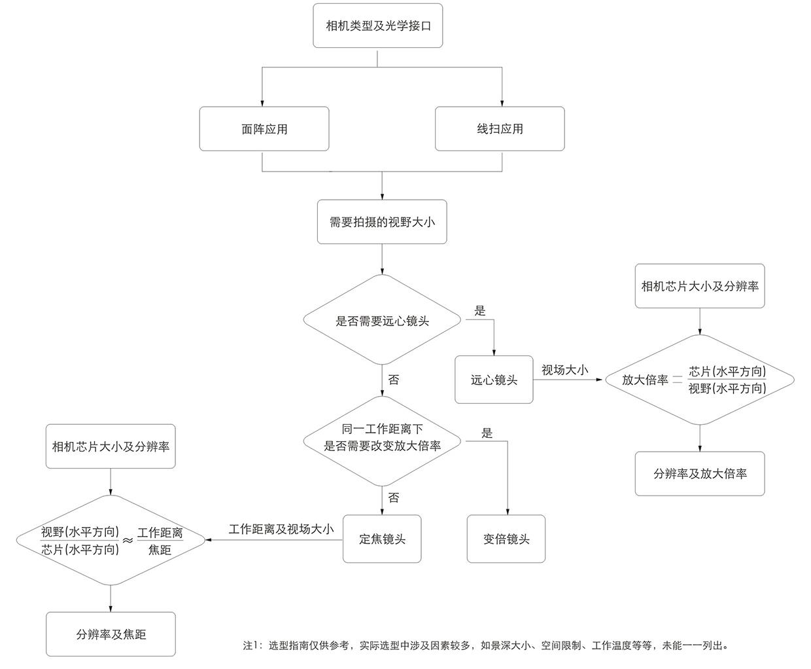

##### 2、注意要点

a.对焦环与光学接口

​    调节镜片组的相对位置或光学系统的后焦距使成像清晰的结构部件称为对焦环(或调焦环)。下图为对焦环不同状态下的成像效果：

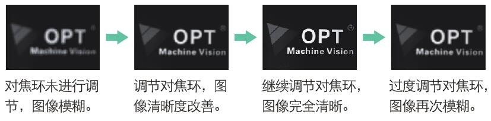

​    镜头与相机连接的机械接口。行业内常用的光学接口已形成通用规范，例如C口、CS口、F口和K口。

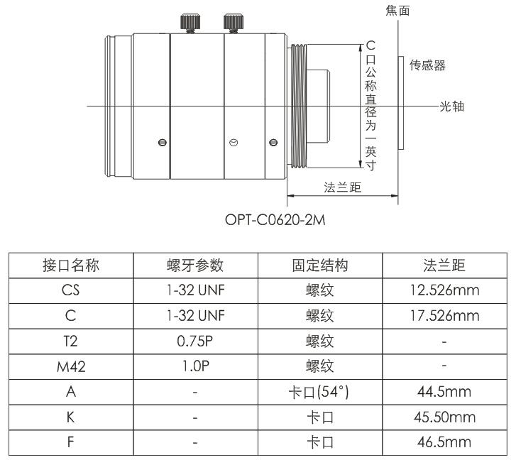

 b.最大兼容相机芯片尺寸
    最大兼容相机芯片尺寸指镜头能支持的最大清晰成像的范围。在实际选择相机和镜头时，要注意所选择镜头的最大兼容芯片尺寸要大于或等于所选择的相机芯片的尺寸。

​    以下为常用镜头及相机芯片的兼容性说明

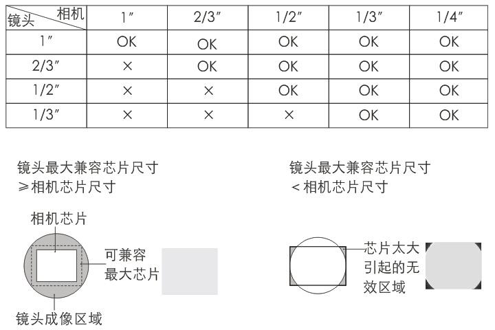

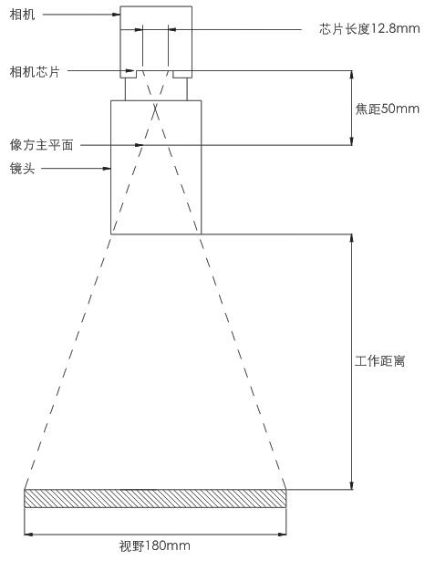

##### 3、选型过程

a.首先确定应用需求(视野、精度、安装高度等)。
b.根据应用需求计算关键的光学性能参数。例如，由视野范围、相机芯片尺寸以及工作距离，计算焦距：视场（水平方向）/芯片（水平方向）≈工作距离/焦距

c.分辨率匹配：在实际应用中，应注意镜头的分辨率不低于相机的分辨率。
d.景深要求：对景深有要求的项目，尽可能使用小光圈；由于景深影响因素较多以及判定标准较为主观，具体的景深计算需要结合实际使用条件。
e.注意与光源的配合，选配合适的镜头。

f.注意考虑使用环境的可安装空间。

案例：

​    使用需求：视野为180mm×135mm，相机芯片为1″(芯片尺寸12.8mm×9.6mm)，像元尺寸为3.5μm，相机接口为C型接口，工作距离小于800mm。
​    (1)根据焦距公式计算，可得：f′=工作距离÷(水平视场÷芯片)=800÷(180÷12.8)=56.89mm。
​    (2)选择最接近的焦距，f′取50mm，根据确定的焦距，计算新的工作距离，可得：新的工作距离≈(水平视场÷芯片)×焦距=(180÷12.8)×50=703.125mm，新的工作距离＜800mm，因此所选定的焦距可行。
​    (3)像素匹配：像素=12.8÷(3.5×10-3)×9.6÷(3.5×10-3)=1.00×107 ，建议选择高清晰1000万像素级定焦镜头。
​    (4)确定接口为C接口。
​    (5)综上所述，可选择OPT Machine Vision的OPT-C5024-10M。

## 相机

### 机器视觉相机概述

 相机的主要功能是采集图像。较早的相机称为模拟相机，需要配合图像采集卡使用，通过采集卡将模拟电信号转换成数字电信号，再传送至电脑。随着IEEE1394、GigE、USB 3.0、Camera Link 、CoaXPress等数字接口技术的发展和普及，模拟相机逐渐被数字相机所取代。数字相机遵从一定的通信协议，能够直接将采集到的图像转换成数字电信号，因此已成为机器视觉系统中的主流相机。

#### CCD相机组成与工作原理

##### CCD传感器

 电荷耦合器件(Charge Coupled Device)是一种半导体成像器件，能感应光线，并将光信号转换成电信号，具有灵敏度高、抗强光、体积小、寿命长、抗震动等 优点。典型的CCD相机主要由CCD芯片、驱动电路、信号处理电路、视频输出模块、电子接口电路、光学机械接口等组成。CCD芯片上包含的像元数越多，其提供的画面分辨率越高。

##### CCD相机的工作原理

 被摄物体一方的光线经过光学镜头聚焦至CCD芯片上，在驱动电路提供的驱动脉冲下CCD完成光电荷的转换、存储、转移和读取，从而将光学信号转换为电信号输出。信号处理电路接收来自CCD的电信号，并进行采样保持、相关双采样、自动增益控制等预处理，然后进行视频信号合成，即将CCD输出的电信号转换为所需要的视频格式输出。

#### CMOS相机组成与工作原理

##### CMOS传感器

 CMOS是Complementary Metal-Oxide-Semiconductor(互补金属氧化物半导体)的缩写，CMOS技术将图像传感器阵列、驱动和控制电路、信号处理电路、模/数转换器、全数字接口电路等完全集成在一起，从而提高了CMOS相机的集成度与设计的灵活性。CMOS相机一般由CMOS图像传感器、外围控制电路、FPGA或DSP处理模块、接口电路组成。感光芯片将入射的光信号转换为电信号，并以一定形式收集并储存电荷信号然后输出至FPGA芯片。FPGA对该信号做一定的预处理后缓存至内存，以待后续的图像传输。图像的传输经由相应的通讯接口传输至图像接收端。

##### CMOS相机的工作原理

 在光电转换这个过程中，CMOS相机的工作流程与CCD相机相似，都是利用光电二极管进行光电转换。两者的主要差异是图像数据传送的方式不同。在CCD传感器中，每一行中每一个像素的电荷数据都会依次传送到下一行像素中，由最底端部分输出，再经由传感器边缘的放大器进行放大，因此信号的输出一致性好；而在CMOS传感器中，每个像素单元都会集成一个放大器及模/数转换电路，CMOS芯片可以直接输出数字信号，大部分CMOS相机设计直接加有FPGA或DSP处理模块，可对图像数据进行滤波、校正等预处理。

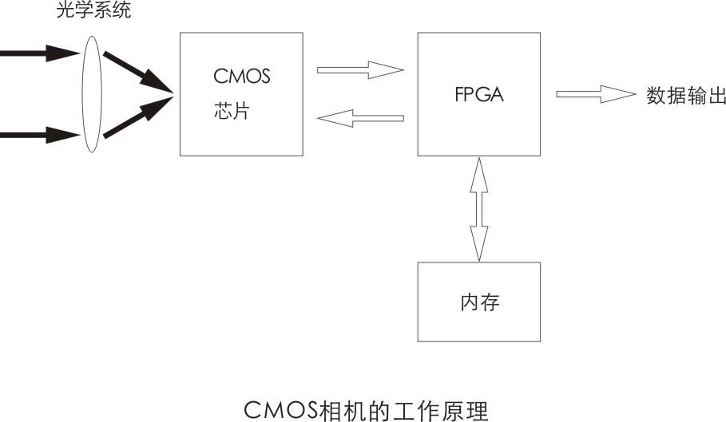

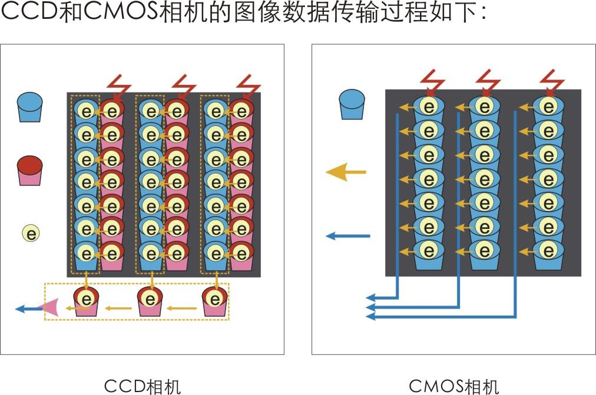

### 相机的分类

####  按芯片工艺类型

| 分类 | 主要区别                                                     |
| ---- | ------------------------------------------------------------ |
| CMOS | lCMOS集成在金属氧化物的半导体材料上； lCMOS的制造成本和功耗低；l色彩还原能力偏弱； lCMOS芯片有卷帘式曝光和全局式曝光，卷帘式曝光适合拍摄静止物体，拍摄运动物体有拖影，且图像会变形； l全局式曝光可以拍摄静止或运动物体。 |
| CCD  | lCCD集成在半导体单晶材料上； lCCD的制造成本和功耗高； l色彩还原性相对较强，图像锐利度、清晰度好； lCCD芯片曝光方式一般为帧曝光或全局曝光，可拍摄静止或运动物体。 |

####  按传感器类型（像素排列方式）

| 分类     | 主要区别                                                     |
| -------- | ------------------------------------------------------------ |
| 线阵相机 | l芯片为线状； l相机和物体间要有相对运动才能成像； l价格比较高；l能够拥有非常高的行频与横向分辨率； l由于传输数据量大，数据传输接口一般为GigE接口或CameraLink接口、CoaXPress接口。 |
| 面阵相机 | l芯片为面阵，相机接口常见有C、 CS 、F； l物体静止或运动都可成像； l根据性能，价格不一； l可以实时获得二维图像信息，能够直观的对图像进行测量； l数据传输接口有GigE、IEEE1394、USB、Camera Link等多种接口。 |

####  按图像模式

| 分类     | 主要区别       |
| -------- | -------------- |
| 彩色相机 | 图像为彩色     |
| 黑白相机 | 图像为灰度图像 |

####  按信号输出方式

| 分类     | 主要区别                                                     |
| -------- | ------------------------------------------------------------ |
| 模拟相机 | l一般分辨率较低，常见40万，采集速度慢，典型帧速为每秒30帧，价格便宜； l模拟相机分为逐行扫描和隔行扫描，一般都是隔行扫描，      且图像传输易受到噪声干扰，导致图像质量下降； l信号输出为模拟信号，在相机外部采用图像采集卡进行 模/ 数信号转换； l多用在实时监控等安防行业，市场使用率逐渐 降低。 |
| 数字相机 | l分辨率从30万到1.2亿多种选择，采集速度快，价格不一； l有卷帘曝光和全局曝光方式，图像质量好； l信号输出为数字信号，在相机内部完成模/ 数信号转换； l逐渐取代模拟相机。 |

####  其他分类方式

| 按分辨率大小       | 可分为普通分辨率相机、高分辨率相机；               |
| ------------------ | -------------------------------------------------- |
| **按输出信号速度** | **可分为普通速度相机、高速相机；**                 |
| **按响应光谱**     | **可分为可见光(普通)相机、红外相机、紫外相机等。** |

###  面阵相机的主要参数及应用说明

#### 传感器尺寸

 即靶面尺寸，面阵相机以芯片的 对角线长度来度量；线阵相机以芯片的横向长度来度量。工业上，面阵相机常用的传感器尺寸如下表，实际尺寸略有差异。

| 芯片 | 水平H (mm) | 垂直V (mm) | 对角D (mm) |
| ---- | ---------- | ---------- | ---------- |
| 1"   | 12.8       | 9.6        | 16.0       |
| 2/3" | 8.8        | 6.6        | 11.0       |
| 1/2" | 6.4        | 4.8        | 8.0        |
| 1/3" | 4.8        | 3.6        | 6.0        |
| 1/4" | 3.2        | 2.4        | 4.0        |

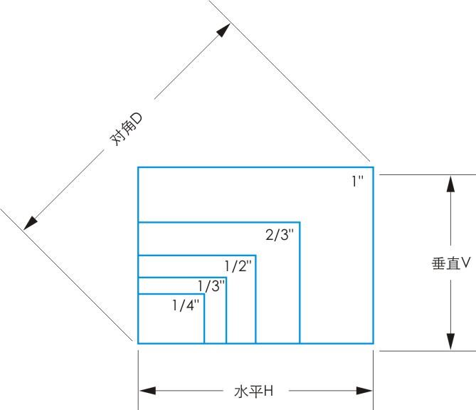

#### 像素

 像素是图像的最小组成单元。如下图，将原图局部放大，每一小格表示一个像素，其中每一个像素对应一个灰度值。

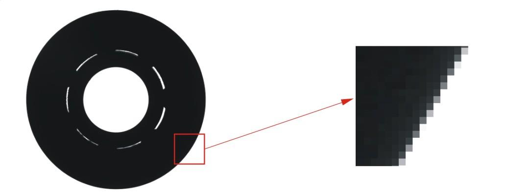

#### 像元

 像元是相机芯片上的最小感光单元，每个像元对应图像上的一个像素。

#### 像元尺寸

 像元尺寸是相机芯片上每个像元的实际物理尺寸，常见的有2.2μm，3.45μm，3.75μm，4.8μm，5.5μm，5.86μm，7.4μm等。对同尺寸的芯片，外部光照环境和相机参数设置相同(比如曝光时间和增益等)的情况下，像元尺寸越大，能够接收到得光子数量越多，芯片灵敏度越高，感光性越好，所成图像越亮。

#### 像元深度

 存储每个像素所用的数据位数，称为像元深度。对于黑白相机来说，像元深度定义灰度由暗到亮的灰阶数。例如，像元深度是8位的相机，输出的图像灰度等级是2的8次方，即0-255共256级。像元深度是10位的相机，输出的图像灰度等级是2的10次方，即0-1023共1024级。像元深度越大，固然可以增强测量的精度，但同时也降低了系统的速度。一般工业上都是使用8位的像元深度。 

#### 分辨率

 分辨率由芯片阵列排列的像元数量决定，对于面阵相机来说水平像素数和垂直像素数相乘即为相机的分辨率。例如一个相机的分辨率是1280(H)×1024(V)，表示每行的像元数量是1280，有1024行像元，此相机的分辨率大约是130万像素。在对同样大小的视场成像时，分辨率越高，对细节的展示越明显。目前常用相机的分辨率有30万、130万、200万、500万、1000万、2900万、7100万、1.2亿等。

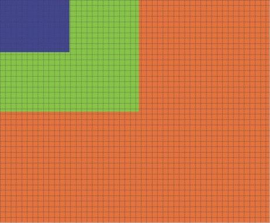

#### 精度

 图像中每个像素代表的实际物理尺寸。
     精度=单方向视场大小/相机单方向分辨率
 例如：视场水平方向的长度是32mm，相机水平分辨率为1600，可求得视觉系统的精度为每像素对应0.02mm。
 在实际应用中，为提高系统稳定性，通常要求机器视觉的理论精度高于要求精度。

#### 帧率/行频

 相机的采集频率，面阵相机用帧率表示，线阵相机用行频表示。
 面阵相机帧率单位为FPS(frame per second)，即帧/秒，指相机每秒钟能采集多少幅图像，1幅图像为1帧。例如15帧/秒，表示相机一秒钟最大能采集15幅图像。一般来说，分辨率越高的相机，帧率越低。
 线阵相机行频单位为Hz，1Hz对应采集一行图像。例如50KHz/秒，则表示相机1秒钟内，扫描50000行。一般来说，分辨率越高的相机，行频越低。

#### 增益

 输入信号与输出信号的放大比例，用来整体提高画面的亮度。增益的单位为dB。

#### 外触发

 工业相机一般都具有外触发功能，可以根据外部信号控制图像采集，即接收到一次外部信号，采集一次图像。在实际使用中，可以用传感器和相机的外触发功能配合，进行灵活的使用。

#### 注意事项：

 在有些使用相机外触发功能的场合，可能会有其他的电子设备的运用，例如直流/交流电机，变频器，接触器等等，如果对各种信号的屏蔽做的不好，很有可能对相机的外触发信号造成干扰，影响相机的使用。

#### 信号输出:

 在使用相机的外触发功能时，一般来讲，外部光源的照明也是配合相机处于外触发状态。相机采集时光源亮，相机未采集时光源灭。有的相机具有信号输出功能，输出触发信号，控制光源的亮和灭，从而配合相机的图像采集。

#### 曝光时间/曝光方式

 曝光时间指光投射到相机传感器芯片上，相机芯片的感光时间。 一般曝光时间越长，图像越亮。    
 外触发同步的采集方式，曝光时间可以与行周期一致，也可以设定一个固定的时间。
 工业相机中曝光方式分为行曝光与帧曝光，其中行曝光指逐行曝光，帧曝光为一次性曝光所有像元。线阵相机为逐行曝光，可以选择固定行频。

#### 拖影

 拍摄运动物体时，由于曝光时间与运动速度不匹配，导致物体在像元上重复成像。

#### 动态范围

 相机的动态范围表明相机可探测光信号的范围，相机所能拍摄到从“最暗”至“最亮”的范围。对于固定相机，其动态范围是一个固定值，不随外界的条件变化而变化。动态范围可以用倍数、dB或bit等方式来表示。动态范围越大，则相机更能适应不同的光照强度，所能表现的层次越丰富，所包含的色彩空间也越广。
 在线性响应区，相机的动态范围定义为饱和曝光量与噪声等效曝光量的比值：

#### 噪点/信噪比

 噪点：感光芯片将光线作为接收信号并输出的过程中所产生的图像中的粗糙部分，也指图像中不该出现的外来像素。  
 信噪比：为相机系统中真实图像信号与图像噪声的比例。

#### 光谱响应

 光谱响应是指相机的芯片对不同波长的光线的响应能力。一般用光谱响应曲线表示，如图X轴表示入射光的波长，Y轴表示响应能力。根据响应光谱不同，可以把相机分为可见光相机(400nm-1000nm，峰值500nm-600nm)，红外相机(700nm以上)，紫外相机(200nm-400nm)。根据应用不同，而选择不同的光谱响应相机。

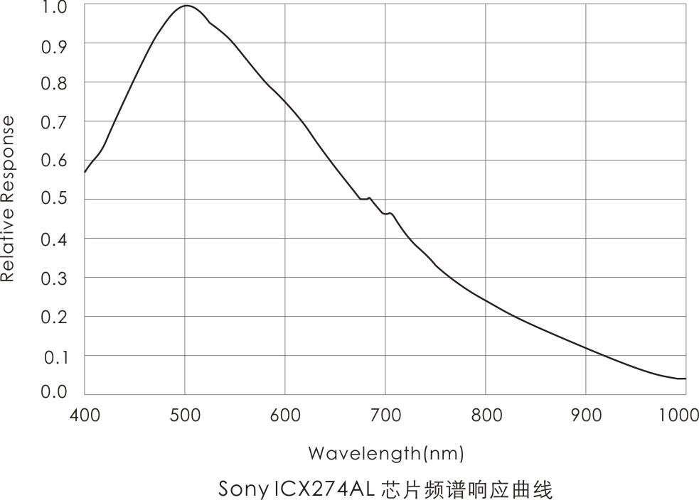

### 相机标准

#### GenICam

 GenICam(相机通用协议)可为各种类型的相机提供通用编程接口，从而实现不同品牌相机的互换性，其目的是在全行业实现相同应用编程接口(API)。

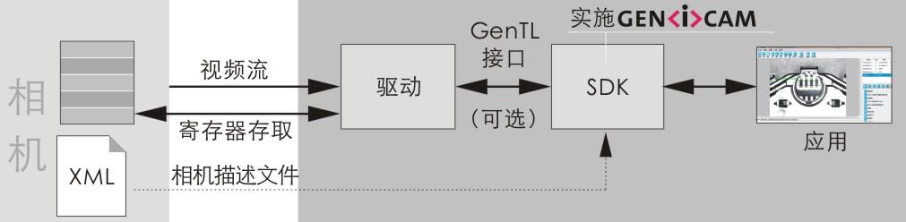

#### GenICam 标准由多种模块构成

 GenTL: (通用传输层)将传输层编程接口标准化。实现相机列举、相机寄存器访问、流数据和异步事件传输。由于 GenTL 是种较为底层的接口，因此终端用户一般借助使用软件开发工具包，而非直接使用 GenTL。GenTL 的主要目的是确保不同供应商提供的驱动和软件开发工具包能够共同无缝工作。
 GenApi: (通用应用编程接口)用于设置相机的应用程序开发接口。该文件列出了(标准和定制)相机具有的所有特点，并且定义了它们对相机寄存器的映射。文件格式基于 XML，因此可阅读。该文件通常存储于相机固件中，当相机第一次连接到系统中时可由软件开发工具包检索。
 SFNC: (标准特点命名规范)将相机自描述文件中的相机特点的名称、类型、意义和使用标准化。确保不同供应商提供的相机在相同功能下时使用同一名称。
 GenCP: (通用控制协议)将控制协议的包布局标准化，且由接口标准使用，以重新使用部分控制路径应用。GenICam 标准组的成员维护了一个参考实现组件，能够解析包含相机自我描述内容的文件。产品级代码采用 C++ 书写，可免费使用。具有高度便携性，可兼容一系列操作系统和编译程序。大多数可用的软件开发工具包采用该参考实现，因此确保高度互操作性。

### 硬件传输接口

 对于数字相机来说，目前业内常用的接口有GigE，USB，IEEE1394(有1394a和1394b之分)，Camera Link和CoaXPress等。对于不同的接口，其特性不同。

#### GigE接口  

 GigE Vision 标准是广泛应用的相机接口标准，基于以太网(IEEE 802.3)通信标准制定。该标准于 2006 年 5 月发布，并且分别于 2010 年(第 1.2 版)和 2011 年(第 2.0 版)修订。GigE Vision支持多流通道，通过使用标准以太网电缆可实现超远距离、快速、准确地图像传输。不同供应商的硬件和软件在以太网连接中可以实现无缝交互操作。
 千兆以太网技术作为最新的高速以太网技术，相对以前的百兆网，在传输速度上提高了十倍，且价格便宜，是一种高性价比的数据传输解决方案。同USB接口一样，10M/100M以太网接口是PC上的一种标准接口，从10M/100M网升级到千兆网不必改变网络应用程序、部件和操作系统，能够最大程度的实现兼容，节约成本。GigE接口是一种使用较为广泛的一种数据传输接口方式。

#### USB接口  

 USB3 Vision 标准于 2011 年末启动，其第 1.0 版于 2013 年1月出版。虽然是新标准，但机器视觉行业对 USB 技术并不陌生。USB接口简单的即插即用式安装和高性能等特点，引起广大消费者的关注。多家公司的专家联合，建立了一项能够在机器视觉行业适应不同需求的标准。该方法可支持现有USB 主机硬件和几乎所有的操作系统，利用硬件直接存储器存取(DMA)直接将相机中的图像传输到用户缓存上。采用 GenICam 标准中的相机控制概念，终端用户可将 USB3 Vision 轻松应用至现有系统中。

#### IEEE1394接口

 1394接口，又称为“火线”(FireWire)。该接口基于苹果公司在1987年开发的串行标准。1394a最高传输速度为400Mbps，1394b最高传输速度为800Mbps。不同的数字设备间通过1394接口直接连接，真正的点对点传输，这种接口还支持热插拔。在工业场合使用中，IEEE1394是一种比较稳定的数据传输接口，已逐渐退出主流市场。

#### Camera Link接口

 Camera Link标准由美国自动化工业学会AIA制定、修改和发布。Camera Link是从Channel Link技术发展而来的，Camera Link标准规范了数字摄像机和图像采集卡之间的接口，采用了统一的物理接插件和线缆定义。只要是符合Camera Link 标准的摄像机和图像卡采集就可以物理上互联。Camera Link主要运用在高速数据传输的场合，线阵相机上多采用Camera Link接口，比起其他几类接口，它的价格是更高的。
 Camera Link 标准于 2000 年第一次发布。这是一种强大、完善的通信链路，将相机和图像采集卡之间的连接标准化，并定义了一种完整的接口，包括提供数据传输、相机定时、串口通信和实时向相机发送信号。Camera Link 是一种非封包式协议，仍为最简单的相机/图像采集卡互联标准。目前在第 2.0 版中，标准规范包括Mini Camera Link 连接件、Power over Camera Link(PoCL)、PoCL-Lite(支持 base 配置的最小化 PoCL 接口)和电缆性能规范。

#### CoaXPress 接口

 CoaXPress(CXP)标 准 于 2010 年 12 月 发 布。CoaXPress为相机和图像采集卡之间提供高速接口，支持长电缆传输。在CoaXPress最简单的形式中，其采用单根同轴电缆 ：以高达6.25Gbits/s 的速度将图像数据从相机传输至图像采集卡；同时以20.8 Mbits/s 的速度将控制数据从图像采集卡传输至相机 ；并可以向相机提供最高达24V 的电源。可使用链路聚合，采用一条以上的同轴电缆共享数据。第 1.1 版支持更小的 DIN 1.0/2.3 的连接件。
 CoaXPress支持实时触发，包括触发特高速线扫描相机。通过标准的 20.8 Mbits/s 上行链路连接至相机，触发延时为 3.4 微秒(μs)，使用高速上行链路时，触发延时一般为150 ns。目前市面上，CoaXPress已能够支持最快的相机，余量大，在一个连接件中的 6条链路能够实现最高达 3.6 Gbytes/s 的速度。

## 光源

### 光源基础

#### 光的直线传播

光的传播定律：光在同种均匀介质中沿直线传播。 
  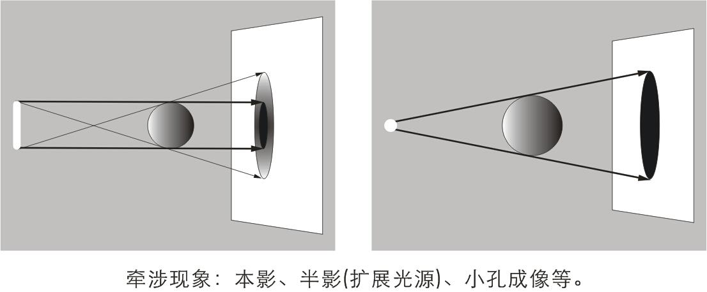  

#### 光的反射

​     反射定律：反射光线与入射光线、法线在同一平面上，反射光线和入射光线分居在法线的两侧，反射角等于入射角。

#### 光的折射

​     折射定律：其中i为入射、i'为折射角、n1和n2分别为界面两侧物质的折射率。sini/sini'=n2/n1

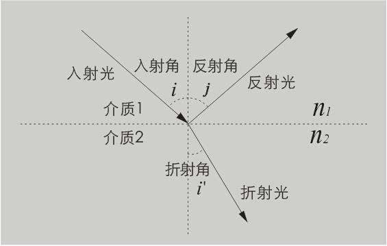

#### 光的散射

​    光线照射到微小构造(颗粒、小坑等)时，不再严格遵循反射和折射等规律，其能量将以散射点为中心，杂乱无章地向四周发射出去，这种现象称为光
的散射。

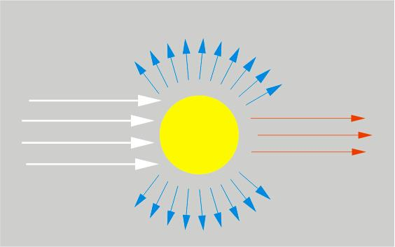

#### 光的偏振

​    光是电磁波，是电场与磁场交互感应行进的一种能量传播，振动方向由电矢量表征；在光的传播过程中，光矢量的横向振动状态相对于传播方向表现出不对称性，称之为光的偏振性。光按照其偏振态的差异可以分为：自然光、线偏振光、部分偏振光、椭圆偏振光和圆偏振光。
​     1、自然光：在垂直于传播方向的平面内，各个方向上光振动的振幅相同的光，称为自然光。常用光源发出的光线均为自然光。
​     2、线偏振：光在垂直于传播方向的平面内，光矢量沿某一固定方向振动的光，称为线偏振光，也叫平面偏振光或完全偏振光。
​     3、部分偏振光：彼此无固定相位关系、振动方向任意、不同方向上振幅不同的大量光振动的组合，称为部分偏振光。部分偏振光在垂直于光传播方向的平面内沿各方向振动的光矢量都有，但振幅不对称，在某一方向振动较强，而与它垂直的方向上振动较弱。它介于自然光和线偏振光之间。
​     4、椭圆偏振光和圆偏振光：光矢量在垂直于光的传播方向的平面内，按一定频率旋转；如果光矢量的端点轨迹是一个椭圆，这种光叫做椭圆偏振光。如果光矢量端点轨迹是一个圆，这种光叫做圆偏振光。
​    偏振片是一种光学装置，它只允许振动方向平行于其偏振方向的光通过，而垂直于偏振方向的光被截止。

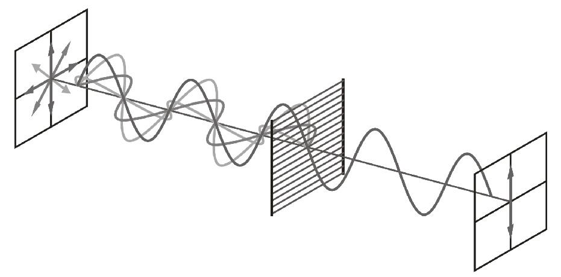

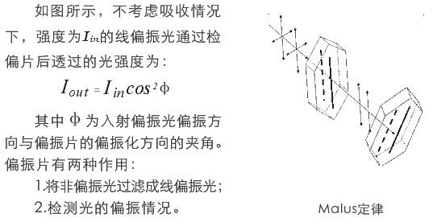

​     自然光在两种各向同性介质分界面上反射、折射时，反射光和折射光都是部分偏振光。反射光中垂直振动多于平行振动，折射光中平行振动多于垂直振动。
​    当入射角θB满足关系式tanθB=n2/n1时反射光为垂直于入射面的线偏振光，θB称为起偏角或Brewster角，此时反射光与折射光互相垂直。日常生活中，所有界面的反射 光都是偏振光或者部分偏振光，通过使用偏振片可以过滤掉某些强反光，详见下图。

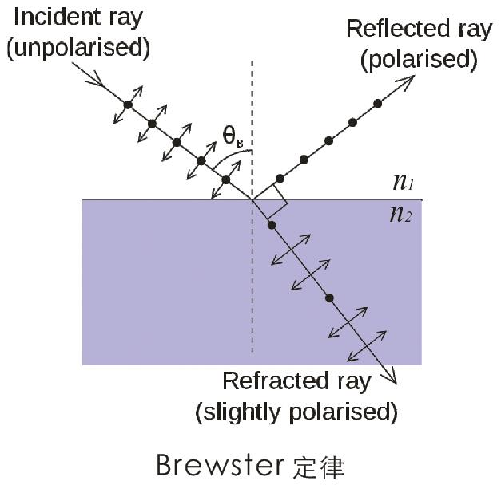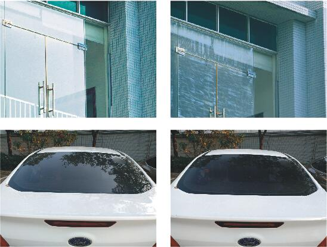

**常用光学配件光路简图**

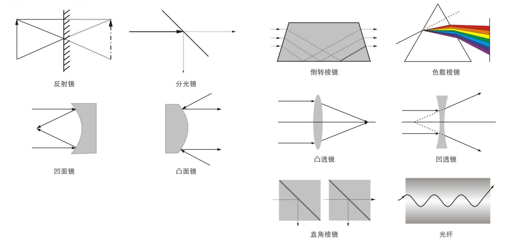

### 光源的作用和常见的视觉光源

##### 机器视觉光源概述 

**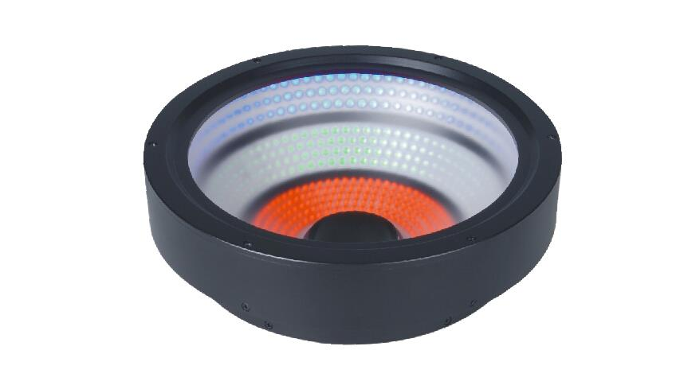**

​    光源分为两大类：自然光源和人造光源。自然光源主要是指日光，其次还包括星光等，能有效利用的主要是日光，星光只能用作导航的参照物；早期的人造光源主要是燃烧燃料的一些灯具，例如蜡烛、油灯或者燃烧木材和煤炭等。

##### 光源的作用

​     机器视觉系统的核心是图像的采集和处理。所有信息均来源于图像，图像的质量对整个视觉系统极为关键。一幅好的图像可以提高整个系统的稳定性，从而大大降低图像处理算法的难度，同时提高系统的精度和可靠性，合理有效的照明方案尤为重要。

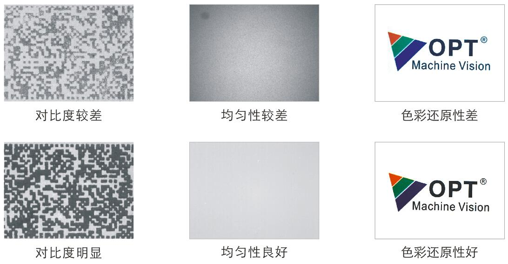

##### 一幅好的图像应该具备如下条件

​     1. 对比度：对比度明显，目标与背景的边界对比清晰，要求目标与背景灰度值至少相差30以上；

​     2. 均匀性：要求图片整体亮度均匀，或整体不均匀但灰度差不影响图像处理；

​     3. 真实性：与颜色有关的还需要颜色真实，亮度适中，不过度曝光，过度像素满足精度检测要求；

​     4. 背景尽量淡化。

   光源是影响机器视觉系统图像质量的重要因素，因为它直接影响输入数据的质量。所以在整个机器视觉系统中，光源有着关键性的作用。目前尚没有一个通用的机器视觉照明设备，因此针对每个特定的案例，要设计合适的照明装置，以达到最佳效果。

##### 光源主要起到如下作用

​     1.可以照亮目标，提高目标亮度；
​     2.形成最有利于图像处理的成像效果；
​     3.克服环境光干扰，保证图像稳定性；
​     4.用作测量的工具或参照。

##### 常见的视觉光源

​    机器视觉常用的一些光源主要有：LED灯、光纤卤素灯、氙灯、高频荧光灯等。

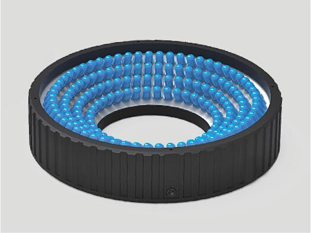

LED灯

寿命约30000-100000小时；优点：可以使用多个LED达到高亮度，同时可组合不同的形状，响应速度快，波长可以根据用途选择。

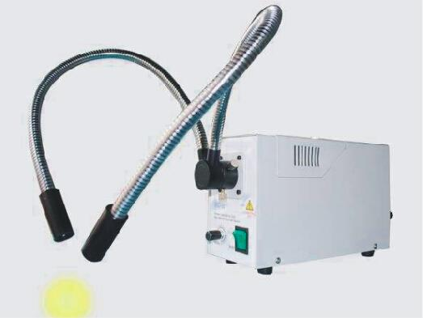光纤卤素灯

使用寿命约1000小时左右；光纤卤素灯：使用寿命约1000小时左右；优点：亮度高；缺点：影响速度慢，几乎没有光亮度和色温的变化。 

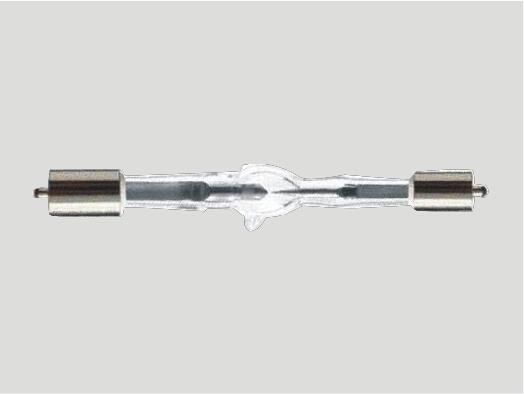氙灯

使用寿命约1000小时左右；优点：亮度高，色温与日光接近；缺点：响应速度慢，发热量大，寿命短、工作电流大、供电安全要求严格、易碎。 

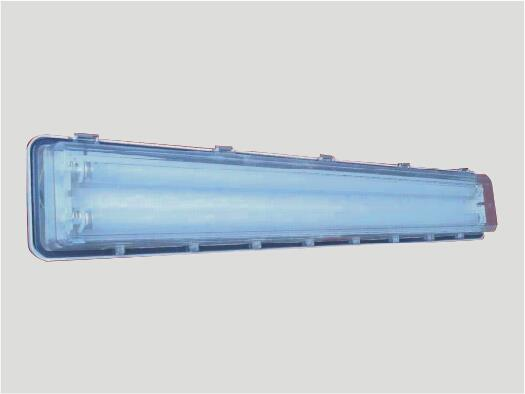

荧光灯

使用寿命约1500-3000小时；优点：扩散性好、适合大面积均匀照射；缺点：响应速度慢，亮度较暗。

LED光源的优势  

​     1.响应速度快：LED光源的响应时间一般为纳秒级，比其他光源具有更快的响应速度；     
​     2.使用寿命长：LED灯一般设计寿命为50000小时以上，常规设计插件LED连续点亮寿命高达25000小时，频闪使用寿命更长；推荐使用OPT公司自主研发生产的光源、控制器，采用外部触发或软件触发方式，可提高光源利用效率及延长光源使用寿命。
​     3.耗能低、亮度高：LED光源电流消耗小的一般在10mA至19mA之间；大功率的灯珠功耗低，光效高且节能环保；
​     4.LED灯可设计成高显指光源，典型的高显色指数Ra≥95%；

视觉常用光源综合性能对比

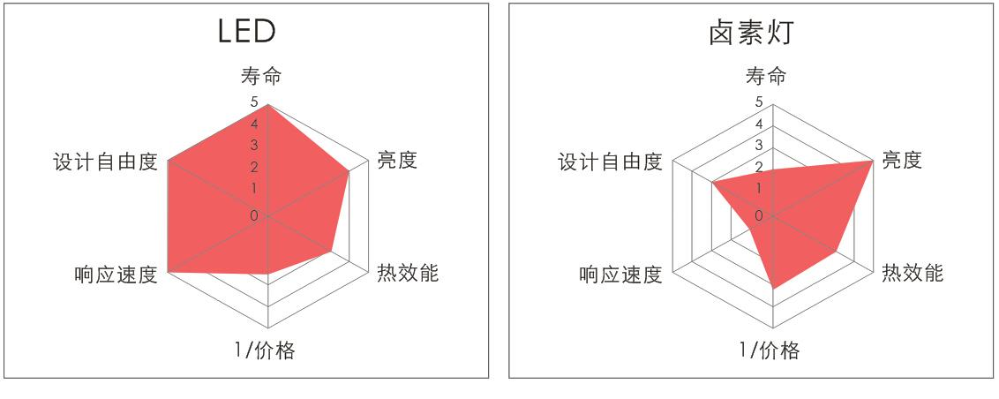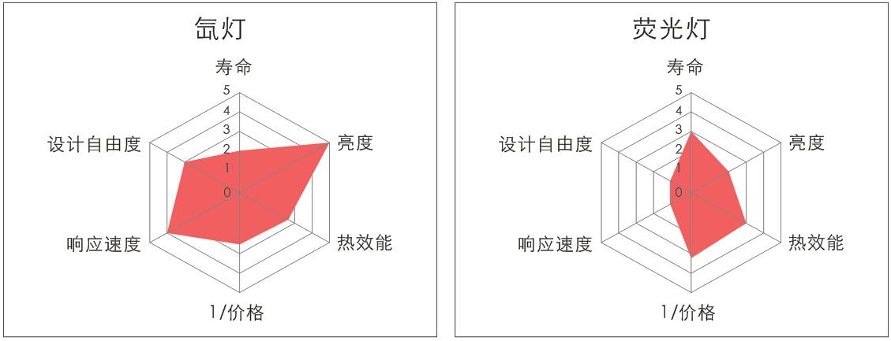

### 光源基本性能

#### 光通量

   光源在单位时间内发射的可以引起人眼感光刺激的那部分辐射通量称为光通量，单位为流明(lm) 。光通量为光度学单位。由于人眼对不同波长光的感光性能不同，不同波长的光源，即使辐射功率相同，其光通量也不一定相同。相机与人眼的感光范围和感光能力不同，在相同光通量下，相机与人眼感受的光的强弱也有差异。

#### 光效率

   光源消耗单位电功率所产生的光通量称为发光效率，是用光源发出的光通量除以电功率表示，其计量单位为流明/瓦(lm/w)。例如，某光源能够将1W电功率转化为180lm的光通量，那么光效率为180lm/W。

#### 发光强度

   光源在空间沿着某一方向上，单位立体角内发出的光通量大小，称为发光强度，单位为坎德拉(cd)。对发光强度为1cd的点光源，其在给定方向1球面度(sr)内发射的光通量为1流明(lm)，这一光源在整个球空间的总光通量为4π lm（约为12.566lm）。

#### 光照度

   被照面单位面积接受的光通量，称为光照度，单位为勒克斯(lx)，1 lx=1 lm/m² 。

#### 均匀性

   通常指光源发出的光线在某一受照面的一定范围内的照度值均匀，亮度一致，则称为光源在该受照面的照度均匀。光源在该受照面的均匀性受到光源本身的设计以及光源的工作距离和工作角度等影响。

#### 平行性

   理想平行光源经过特殊透镜模组、光学玻璃，能够发出照射角度都一样的光线，为此随着光源工作距离改变，平行光源的发出的光斑几乎不会发生形状和大小的变化。光源平行性越好，光斑随距离改变时越不易发生形状和大小的变化。平行光源多于镜面材料的缺陷检测、激光雕刻识别等。

#### 色温

   当光源所发出光的光谱分布与完全吸收光的黑体在某一温度时辐射出的光谱分布相同时，我们将绝对黑体的温度称为该光源的色温。色温用来表示颜色的视觉印象，通常情况下色温高的光源颜色偏蓝，色温低的光源颜色偏红。高色温光源照射下，如亮度不高则给人们有一种清冷的气氛；低色温光源照射下，亮度过高会给人们有一种温暖的感觉，因此光色偏蓝的称为冷色(大于5000K)，光色偏红的称之为暖色(小于3300K)，介于冷色和暖色之间称为中间色(3300-5000K)。

#### 显色性

   显色性是光源的光照射到物体上所产生的客观效果和对物体真实颜色的显现程度。光源的显色性是由显色指数(Ra)来表明，它表示物体在光下颜色比基准光(太阳光)照明时颜色的偏离，能较全面反映光源的颜色特性。显色性高的光源对颜色显现能力较强，在其照射之下看到的颜色就比较接近自然原色，比较逼真；显色性低的光源对颜色的显现能力就比较差，在其照射下看到的物体颜色与自然原色差异也比较大。光源的色温与显色性并没有直接的关系。国际照明委员会CIE把太阳的显色指数定为100，各类光源的显色指数各不相同。一般工业上，光源显色指数为Ra=90-100，显色性优秀，应用于色彩精确比对的场所；Ra=80-89，显色性良好，应用于色彩需要正确判断的场所。OPT标准的LED灯色温在5000~7000K范围，显色指数70-90，高显指的色温在2700~5600K范围，显色指数大于95。

#### 寿命

​    LED灯珠设计寿命通常为50000小时以上，常规设计插件LED连续点亮寿命高达25000小时。与传统光源灯丝熔断停止发光不同，LED不会直接停止发光，而是光通量随时间流逝而下降，通常以光源的光通量下降到初始的70%作为寿命时长。热量是影响LED光源寿命的主要因素，通过优化LED光源电气设计和散热设计，采用频闪触发控制光源工作，降低LED工作结温，能够有效延长LED光源的寿命。

#### 光的颜色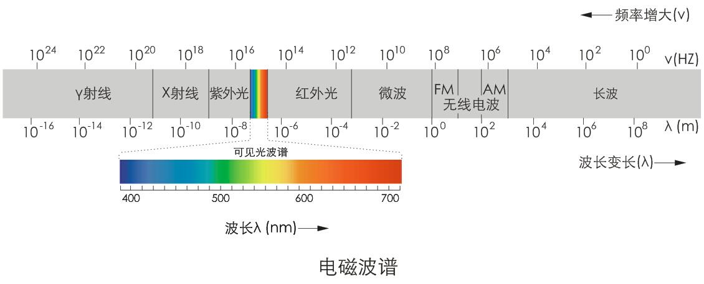

   光本质上是一种电磁波，在整个电磁辐射波谱中，可见光只占其中一小部分，波长在380nm~760nm之间的那部分可以为人眼所感知，称为可见光，不同的光谱对应不同的颜色。对不可见光，一般将波长10nm-400nm的光称为紫外光，将波长770nm-1mm的光称为红外光。电磁波谱如图所示：

#### 可见光与近可见光波段波谱

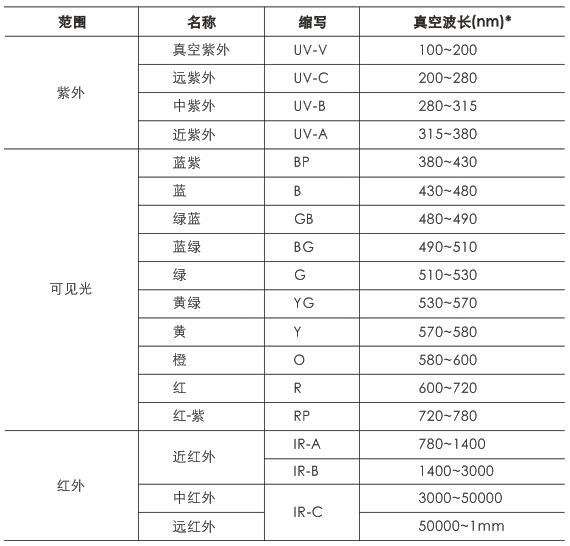

#### 常见LED颜色光谱

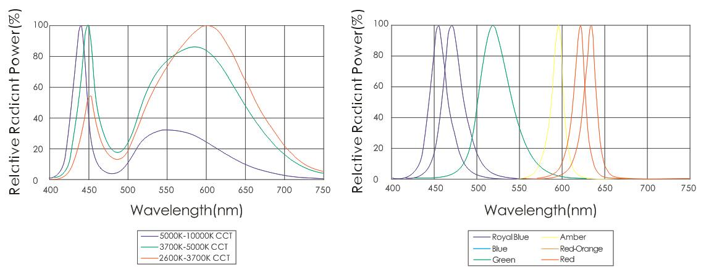

以上数据为OPT使用的部分灯珠光谱图

**颜色合成与互补关系**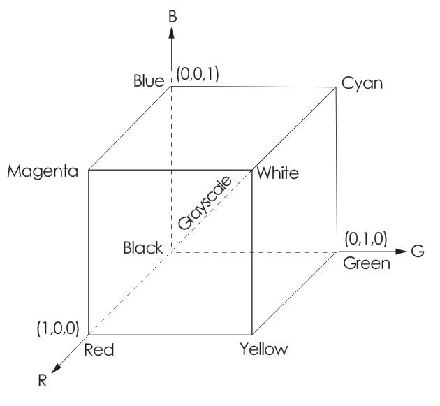

   从紫色经由蓝、青、绿、黄、橙到红色的渐变颜色中，其中的的红、绿、蓝三色中的任意一种均不能由其他两种调配出来。而且它们经一定比例混合，可以组成包括白光在内的任意颜色，因此称此三种颜色为三基色。以此为基底可以建立一种颜色空间，即常说的RGB空间，一种颜色对应该空间中的一个点。除此之外，还有很多其他的颜色空间，例如HSI、CIE、CMY、CMYK(印刷)等。颜色的主要合成关系如下表所示、如果两种颜色含有完全相同的基色成分，则称这两种颜色为相同色；如果两种颜色的组合成分有差异但差异不大，则称这两种颜色为相近色；如果两种颜色没有任何共同成分、则称这两种颜色为对比色；如果两种颜色以适当比例混合生成白光、则称这两种颜色为互补色。

#### 颜色的合成

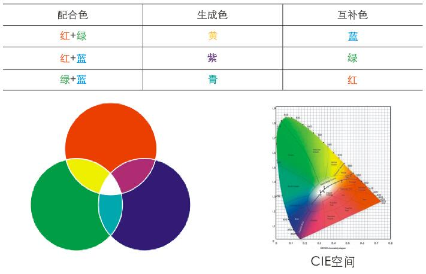

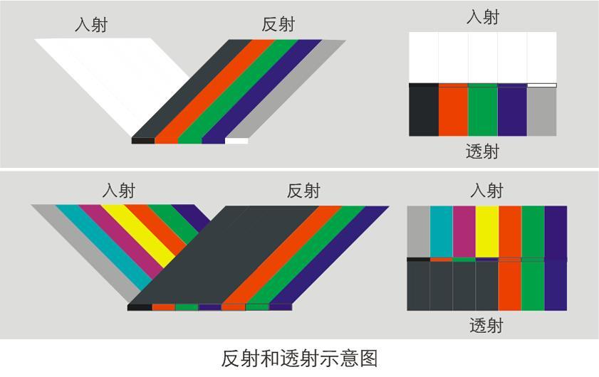

   光照射到物体表面，反射光的颜色主要与物体表面的自然色一致；光穿过透明的物体之后，透射光的颜色主要与透明体颜色一致。如果入射的颜色和物体本身颜色一致或者比较接近，则反射率或者透射率会比较高，反之如果入射光与物体的自然色是对比色，则反射率或者透射率会比较低。

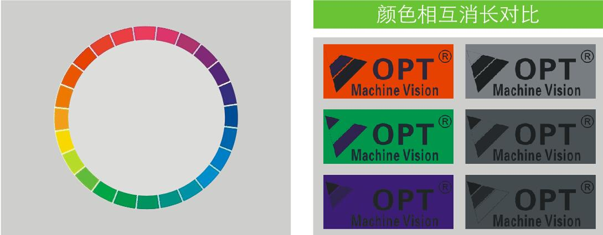

   为了方便应用，可以把可见光波段的颜色首尾相接组成一个圆环，也就是所谓的色环。色环中，距离比较近的颜色为相近色或者相邻色，关于圆环中心对称的为互补色，离得比较远的为对比色。在光照环境中，使用与物体本色相邻或相同的颜色照射，物体在图像中的亮度会相对比较高；反之，如果使用对比色光照，则会使物体在图像中显得比较暗。如下图所示，分别使用三种颜色光照射三基色图片的效果，左边从上到下依次是红、绿、蓝光照拍摄的彩色图片，右边是对应的黑白图片。从中可以发现，与照射光相同的颜色将融入到白色背景中去，而与之互补的颜色将变成黑的。因此，选择照射光的颜色可以过滤某些干扰背景，也可以加强对比效果。

### 各种打光方式的应用

#### 背光照明方式

**
**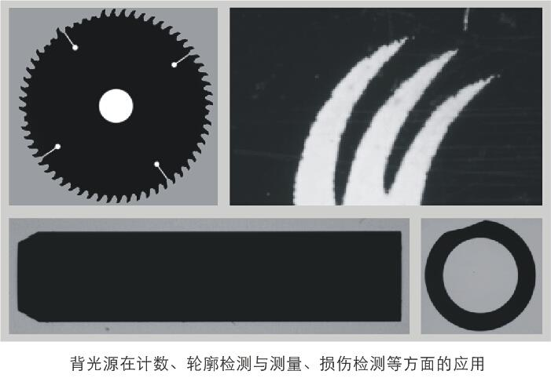 漫射背光源贯穿透射
   结构描述：如下图所示，漫射背光源置于待测工件正下方，摄像系统垂直于工件和光源进行拍照。
   主要应用：存在性检测、计数、薄片边缘检测、透明体表面和内部不透明异物或脏污检测、透明体和半透明体突变型和部分渐变缺陷、镂空打标检测等。
   优点：结构简单，整体价格较低，尺寸检测效果稳定可靠。一般情况下图像只有黑白两种区域，便于处理。相机正对光源拍摄，亮度容易满足。
   缺点：大部分在线检测项目不方便使用；多层交叠不透明体会互相干扰；有一定厚度，带倒角、圆角的物体或者圆柱体尺寸测量容易出现边缘发虚现象，结果会有偏差，如果测量精度要求很高，则可靠性不高。

   应用技巧：光源面积够用即可，面积过大会影响边缘效果；光源距离工件远一些，效果会在一定程度上改善；使用物方远心镜头，可以提高稳定性；图像亮度不宜过曝，通常最亮部分的灰度值不大于220。

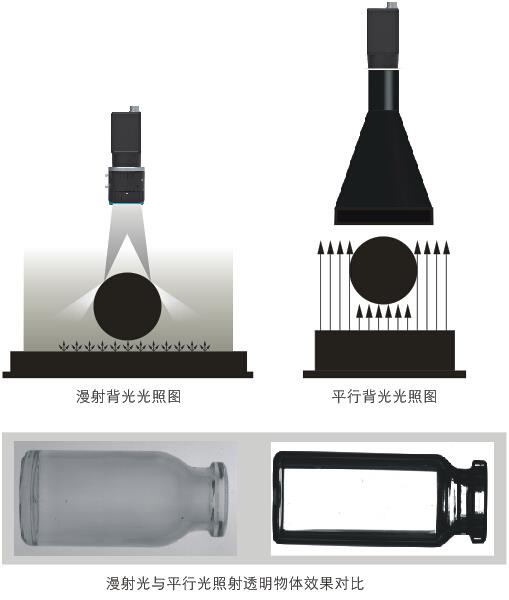

平行背光源贯穿透射

   结构描述：平行背光源置于待测工件正下方，摄像系统垂直于工件和光源进行拍照。
   主要应用：产品边缘形状导致的不适合使用漫射背光源的精确边缘检测、定位和尺寸测量等项目。
   优点：光线平行性好，图像效果极佳，测量精度高，准确稳定。
   缺点：光源本身结构复杂，成本高、对其他配套硬件要求也比较高(例如需配合远心镜头使用等)、安装调试要求高。
   应用技巧：光源与镜头必须调同轴，如果对不准，效果很差，一旦对准，效果极好。调好后稳妥固定，以免使用过程中由于震动或不对称外力长期影响而错位。

   漫射光方向比较散乱，被瓶身折射后依然是杂散光，整体上比较均匀，瓶子轮廓与背景对比不明显。

   平行光照射情况下，边缘区域将光线折射到镜头入瞳之外的区域，显示为黑色，与背景对比很明显。

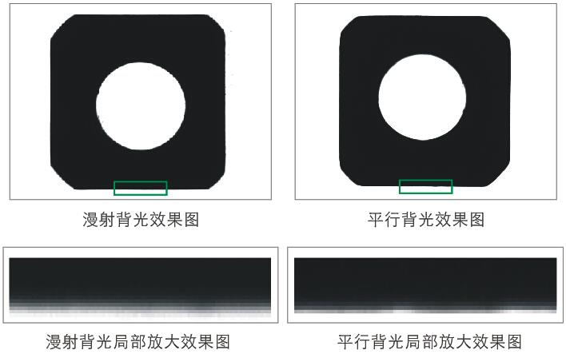

   使用漫射背光测量，由于侧部光线被反射进入镜头，会出现上图所示的“发虚”现象，过渡像素较多，无法满足高精度测量要求，影响测量的精度。

   使用同样大小的平行背光测量，全部光线方向统一，图像边缘很锐利，像素过度减少。同时配合远心镜头使用，可以提高成像稳定性和精度，也可进一步减少环境杂散光的干扰。

#### 前光照明方式

低角度直射光应用
   结构描述：如图所示，低角度照射，表面平整部位反光无法进入镜头，图像亮度较低；不平整部位反光进入镜头，图像亮度较高。
   主要应用：表面划伤检测，打标字符检测与识别，表面异物检测，边缘尺寸测量，定位，倒角测量，冲压，浇铸字符图案检测与识别等项目。
   优点：便于安装、效果稳定。
   缺点：透明物质、表面划伤边缘起毛的效果不明显，有些情况下现场要求光源必须处于一定高度之上，影响效果。
   常用光源：条形光、线形光、低角度环形光等。

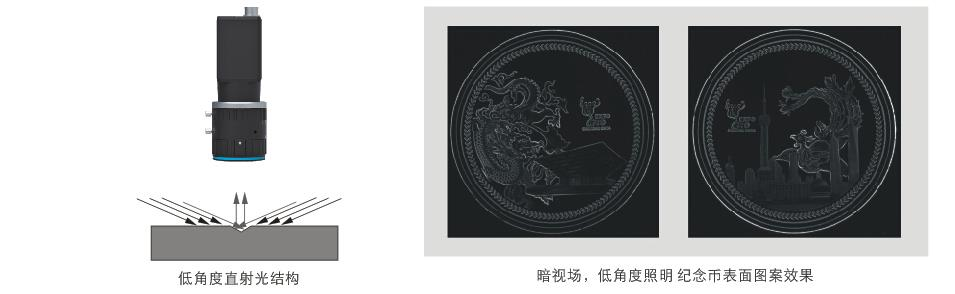

   低角度光源照射，图像背景为黑色，即暗场照明，可以显现物体边缘倒角等45~60°的坡度信息，表面比较杂乱的碰伤、划伤、雕刻特征也可以显示出来。

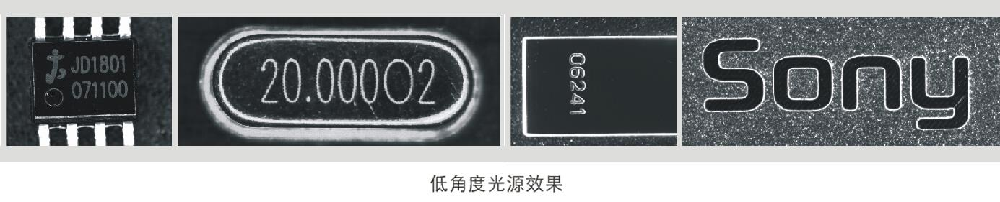

高角度直射光应用
   结构描述：如图所示，高角度照射，表面平整部位反光比较容易进入镜头，图像亮度较高；不平整部位反光杂乱，部分光线进入不到镜头，图像亮度较低。
   主要应用：表面细微划伤检测，打标字符检测与识别，表面异物检测，边缘尺寸测量，定位，冲压，浇铸字符图案监测与识别等项目。
   优点：效果明显，细节清晰。
   缺点：均匀性调节有一定难度。
   常用光源：高角度环形光、条形光、面光源、同轴光、点光。

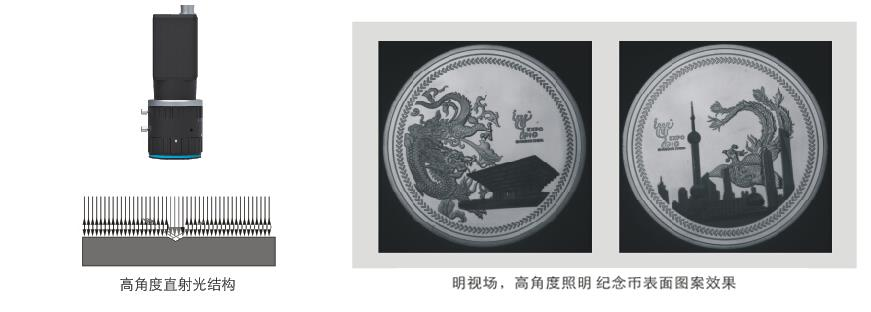

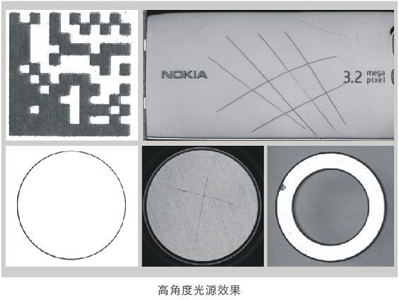

   高角度光源照射，图像背景为白色，即明场照射，可以显现物体表面平整区域的轮廓特征，表面比较杂乱的划伤、阶梯等特征也可以显示出来，表面粗糙程度不同或光反射率不同的区域也会有明显差异。

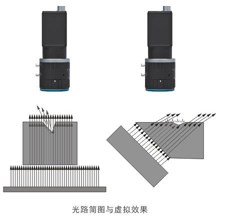

#### 折射光应用

   结构描述：如图所示，光源置于待检物体下方或者一侧，直射光线经平整表面垂直射入工件并从另一侧射出。在平整表面部分，透射光线沿着与入射光线一致的方向射出，不平整表面部分的透射光线则遵循折射定律与入射光线的方向出现偏移；此时镜头主轴垂直工件表面，平整部分将在图像中呈现为亮背景特征，而不平整部分则相反，将在明亮背景上呈现为暗特征。
   若表面较平整只是粗糙度不同，则可采用光线从侧面倾斜透射到待测表面的方法，如图所示。选取合适的透射方向，在平整特征部分光线遵循折射定律发生单向偏折，镜头无法捕获出射光线，将在图像上呈现为暗背景特征；而粗糙表面部分由于形状分布广泛，出射光线偏折方向均匀分布，必将有一部分被镜头捕捉到，将在图像的暗背景上呈现出亮特征。由此采用这两种方法可以区别透明物体表面的形状差异，同时对于透明体内部的异色杂质也具有较好的区分效果。

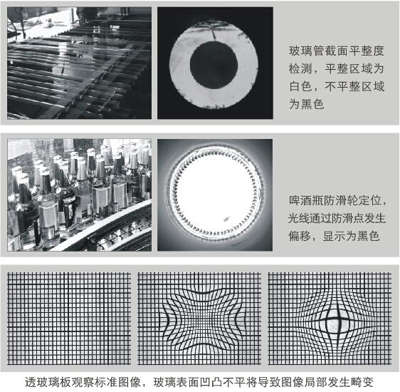    

对于渐变表面，使用以上方法可能无法达到理想效果，可以采用表面带有标准图案的面状光源从内部照射，如果表面特征(形状、厚度等)出现变化，则标准图形将在图像中表现出畸变，一般使用的图案包括LED点阵、透明标定板、光栅等。
    主要应用：透明物体表面细微划伤检测、形状图案识别与检测、物体表面平整度与厚度均匀性检测等。
    优点：效果明显，细节清晰，稳定性好。
    缺点：有些情况下，结构安装不方便。
    常用光源：面光源、点阵光源、带透明图层面光源等。

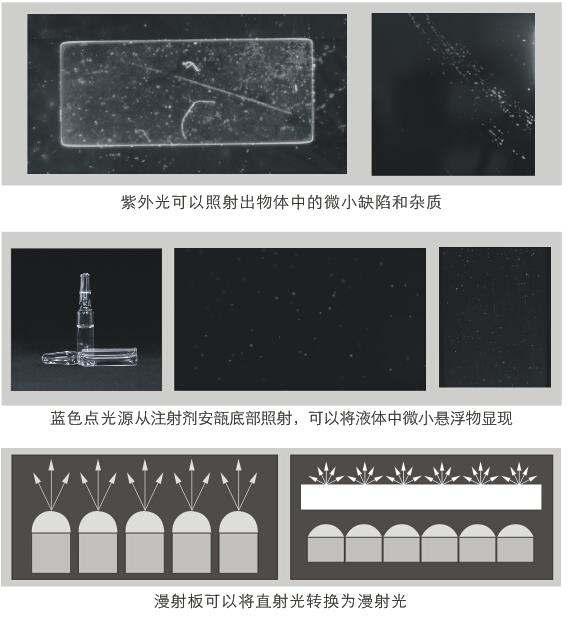

#### 散射光应用

​    直射光从检测目标单侧照射，光线照射到微观粗糙结构时发生散射，没有散射的区域为暗场，在图像中亮度比较低，发生散射的区域亮度比较高。
​    应用技巧：保证透射性能良好的情况下，尽可能选择波长比较短的光源。
​    主要应用：玻璃、塑料等透明物体细微划伤检测、表面激光雕刻字符识别与检测、透明薄膜边缘定位测量等项目。
​    优点：效果明显，细节清晰。
​    难点：有些情况下，要求检测有效距离比较远，对光源亮度要求比较高。
​    常用光源：线形光、条形光、点光等(大多数情况下需特制光源)。

#### 漫射无影光应用 

​    结构描述：直射光一般均匀性比较差，如下图所示。此类光源大部分为二次光源，例如：球积分光源采取的半球状漫反射面，将底部环形光反射到光源出光口，面分布均匀性、方向均匀性好，可以将形状比较复杂的表面照射出比较均匀的效果；拱形光源结构与之类似。其他类型的无影光大都是采用特制的漫射板，在其表面将透射光线散射，获得面分布和方向分布都比较均匀的光场。
​    主要应用：不平整反光物体轮廓检测、定位、尺寸测量，弧形表面严重缺陷检测、表面雕刻、印刷图案识别与缺陷检测等项目。
​    优点：整体均匀性良好、效果稳定。
​    难度：镜面反射物体倒影处理。
​    常用光源：环积分光源、拱形光源、四边无影光源、环形无影光源、超大面积光源、灯箱式光源等。

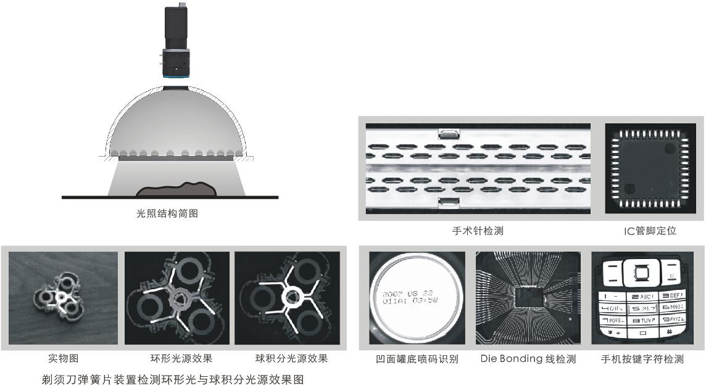

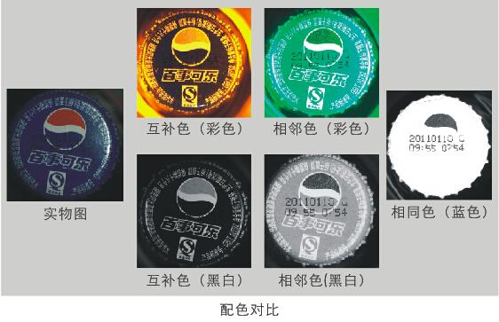

#### 颜色过滤与加强

   与物体表面自然色相同或相近颜色的光照射到物体上之后，反射率比较高；对比色照射，则反射率较低。利用这一原理，可以实现加强图像效果、过滤背景干扰的目的。

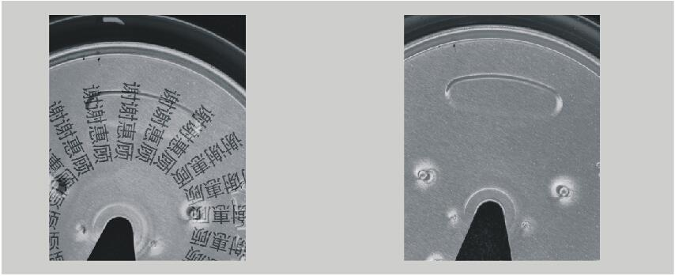

   如图所示，工件为易拉罐上盖，内部印有红色“谢谢惠顾”字样，检测目标为铝合金冲压之后的形貌。左图为白色光照射所拍图样，字符比较清晰，严重干扰对冲压痕迹的识别和检测；右图为红色光照射拍的图像，红色字符被全部过滤掉，不会造成任何影响。

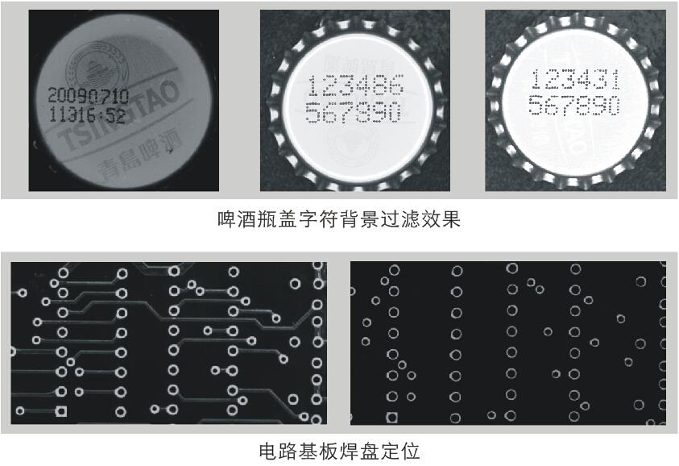

   右图为啤酒瓶盖子，检测目标是上面的喷码，每种盖子会有不同的背景色和图样，如第一幅所示，第二幅和第三幅所使用盖子为蓝色和绿色背景。选择和背景颜色一致的光源照射，即可获得图中的效果，背景被过滤掉或者大幅削弱，字符检测和识别不再受干扰。

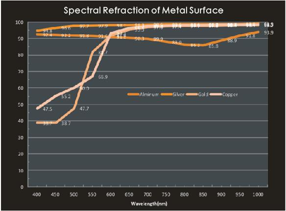

   不同的物质，其化学成分不一样，当光线照射在物体表面时，不同波长的光线会不同程度地被吸收和散射，宏观上表现出对不同颜色的光反射率
不一样。左图为金、银、铜、铝四种最常见的金属在可见

 光和红外波段的反射率。
   从图中可以看出，对于波长较长的光，四种物质反射率都比较高。而对于波长较短的光，铝和银的反射率都比较高；而对于波长较短的光，铝和银的反射率远远高于金和铜，根据这种显著差异，选择短波段的光照射，可以明显区分不同的物质。如果工件恰好由其中两种差异比较大的金属组成，检测目标又是其中的一种，即可利用这一种方法。

   左下图为Die Bongding线检测项目，主要工件为CCD感光芯片的基底电路，焊盘进行了镀银处理，焊线是纯金的，检测的目标是焊线是否断掉、好焊线在焊盘上焊接的位置。根据材料反光特性，选择蓝色同轴光作为打光光源，镀银焊盘反射率比较高，图像中高度比较高，焊线反射率比较低，在图片中为黑色，两者区别比较明显，此结构下得到的效果很稳定。

   右下图工件为电路板的转接结构，下部为铜材质的接触片，上部为镀银的弹片，检测目标为上部弹片前伸的长度。在自然光照射下所有金属都发白，底部接触片对检测造成严重干扰，图像处理几乎无法进行。用蓝色光照射时，底部接触片转化为黑色，形成如图所示的良好效果。

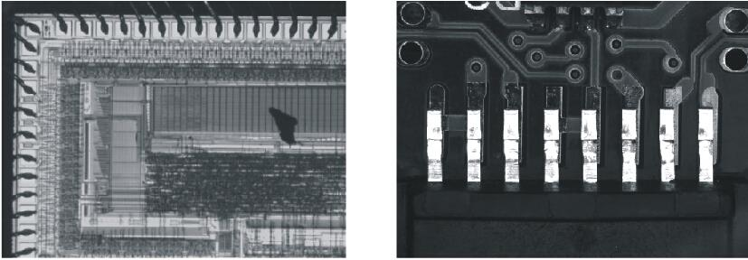

#### 红外光应用 

   视觉应用常用的红外光在近红外波段，主要有850nm和940nm两种，人眼一般看不到这两种光线。波长比较长，透过有机材质的能力比较强，此功能经常用于透过比较薄的塑胶物体，也可用于过滤一些有机染料形成的颜色干扰。

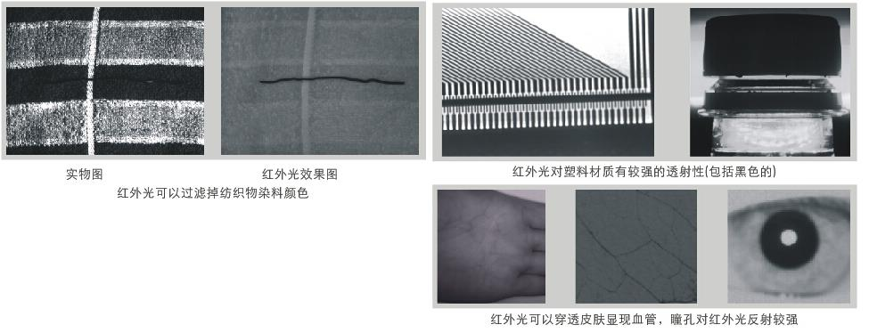

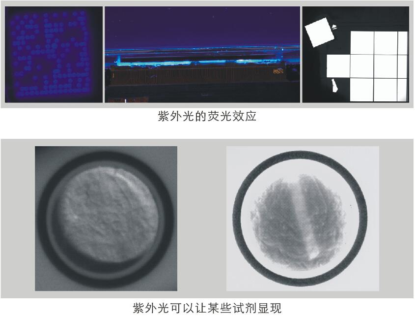

#### 紫外光应用

   紫外光在视觉中常用的有385nm和365nm两个波段，波长较短的紫外线容易造成物质发生光化学变化变质，因此在食品加工行业有些工位会禁止使用某些波段的紫外线。常用的紫外线作用一方面是荧光效应，另一方面是其良好的散射效果。

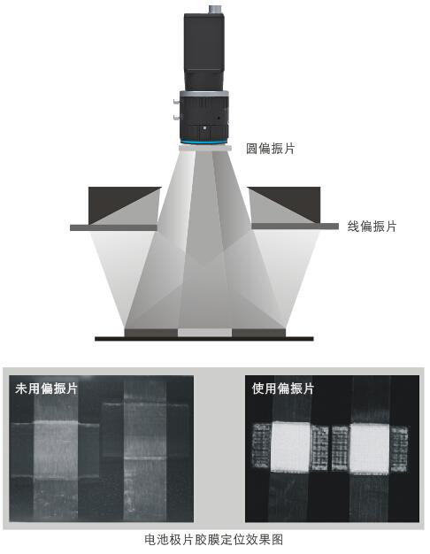

#### 偏振光应用

   如下图所示，在光源出光位置安装线偏振片，可以将光源发射的类自然光转换为线偏振光。光线照射到目标上之后，被目标反射，如果目标材质差异较大，则反射光偏振程度也会有重大差异。在镜头上安装圆偏振片，当其旋转到适合方向时，目标图像中不同材质亮度对比会发生翻转，如下图所示的电池极片胶膜定位效果图。
   镜头上安装圆偏振片主要是为了防止线偏振光进入相机后发生意想不到的光学现象而导致取像失败。
   技巧：一般情况下，让镜头聚焦，然后调节光源上偏振片方向，操作起来会比较顺手。

### 控制器的选型与介绍

#### 控制器的用途

   光源控制器可以准确控制光源亮度，并且可以通过通信接口如网口或者串口实现远程控制光源。控制器的外部触发功能可以高速准确控制光源亮灭，使相机在高速拍照下可以拍到稳定的图片，还可以有效延长光源寿命。工作人员可以根据实际需要选择合适的控制器。

#### 控制器技术特点

◆高精度电流控制技术
◆AutosenseTM 技术
◆OverdriveTM 技术可提升光源亮度
◆可编程触发技术
◆高效灵活的通信协议
◆触发响应时间短，触发频率高

#### AutosenseTM技术

| 电压控制的问题：由于电压控制器输出电压恒定，光源内阻随着光源温度的上升而变小，从而导致输出电流变大，光源亮度变高，所以电压控制方式光源亮度容易受温度影响。 解决方案：采用电流方式控制光源亮度。 |      | 电流控制的问题：控制器输出的电流并不总是与接入光源的额定电流匹配。例如，使用输出1000mA的控制器接入100mA光源。 解决方案1：光传感控制方法。 解决方案2：自动检测LED光源额定电流。 |
| ------------------------------------------------------------ | ---- | ------------------------------------------------------------ |
|                           |      |                           |
|                                                              |      | 自动检测电流与其它控制方式图表                               |

#### OverdriveTM技术

◆增亮作用，可瞬间最大输出20A电流。
◆触发脉宽可设。
◆触发响应时间短。

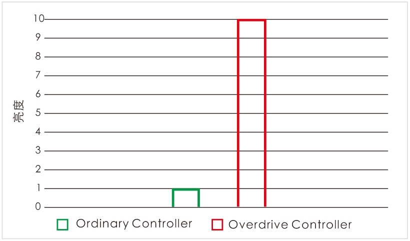

普通控制器和增亮频闪控制器亮度对比图

#### 可编程触发技术

​    可编程触发技术运用编程的思想，根据实际需求编写触发流程。触发流程表中的每一个流程都可以单独设置触发源、亮度值和触发脉宽，有且仅有唯一的触发源能触发该步骤。控制器会循环执行流程表中的各个步骤。在使用可编程触发模式前，要预先设置流程表。

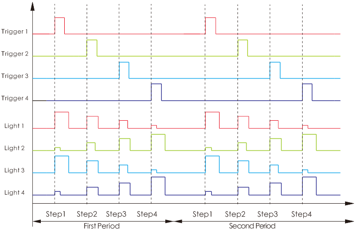

说明：
1、 Trigger为触发信号，Light为光源输出信号；
2、上图为可编程触发模式4个流程时序图，其触发信号源依次为Trigger1，Trigger2，Trigger3，Trigger4。  

#### DEMO软件

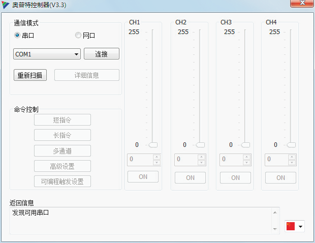

#### 控制器SDK

◆语言：VC， VB ，C# 

◆OS: Windows  
◆开发环境与架构：VS

#### 控制器选型指南

|  |      |      |
| ----------------------------------- | ---- | ---- |
|                                     |      |      |

#### 控制器触发接线图

| ◆开关量触发接线图                   | ◆电平触发接线图                     |
| ----------------------------------- | ----------------------------------- |
|  |  |

#### ◆选型表

| 类型           | 控制类型                 | 型号           | 通道数                | 触发方式   | 输出电压                 | 单通道功率         | 总功率             | 光源应用种类 | 通信方式     |
| -------------- | ------------------------ | -------------- | --------------------- | ---------- | ------------------------ | ------------------ | ------------------ | ------------ | ------------ |
| 数字控制器     | 电流型                   | OPT-DPA1024E-X | 标准4路(可扩展8/16路) | 电平触发   | 24V                      | 24W                | 4/8路:48W16路:180W | 24V光源      | 以太网/RS232 |
| OPT-DPM0524E-4 | 标准4路(可扩展8/12/16路) | 电平触发       | 24V                   | 12W        | 4路:48W8/12/16路:96W     | 24V光源            | 以太网/RS232       |              |              |
| OPT-DPA6024-2  | 2路                      | 开关量触发     | 24V                   | 144W       | 288W                     | OPT六芯光源        | RS232              |              |              |
| OPT-DPA2024E-X | 标准4路(可扩展8/16路)    | 电平触发       | 24V                   | 48W        | 4/8路:48W16路:180W       | 24V光源            | 以太网/RS232       |              |              |
| OPT-DPA2005E-X | 标准4路(可扩展8路)       | 电平触发       | 5V                    | 10W        | 4路:30W8路:50W           | 5V点光源           | 以太网/RS232       |              |              |
| 增亮型         | OPT-DPH20048E-4          | 4路            | 电平触发              | 48V        | peak power:960W          | peak power:1920W   | 24V光源            | 以太网/RS232 |              |
| 模拟控制器     | 电流型                   | OPT-APA6024-2  | 2路                   | 开关量触发 | 24V                      | 144W               | 288W               | OPT六芯光源  | 无           |
| OPT-APA0705F-X | 1/2/3/4路                | 开关量触发     | 5V                    | 3.5W       | 1/2/3/4路:3.5/7/10.5/14W | 5V点光源           | 无                 |              |              |
| OPT-APA3024-2  | 2路                      | 开关量触发     | 24V                   | 72W        | 144W                     | OPT六芯光源        | 无                 |              |              |
| 电压型         | OPT-AP1024F-X            | 1/2/3/4路      | 开关量触发            | 14~24V     | 24W                      | 1/2路:30W3/4路:40W | 24V光源            | 无           |              |
| OPT-APM0524B-2 | 2路                      | 开关量触发     | 14~24V                | 12W        | 24W                      | 24V光源            | 无                 |              |              |
| 频闪型         | OPT-SPM2024-1            | 1路            | 电平触发              | 12~48V     | 96W                      | 96W                | 12~48V光源         | 无           |              |

### 如何选择或设计光源照明方案

   通过恰当的照明方式可以把目标特征突显出来，同时将背景和干扰信息最大限度地过滤或者淡化，这样就可以得到有利于处理的图像，整个系统的精度和稳定性也可以得必要的保证。

#### 基本思路

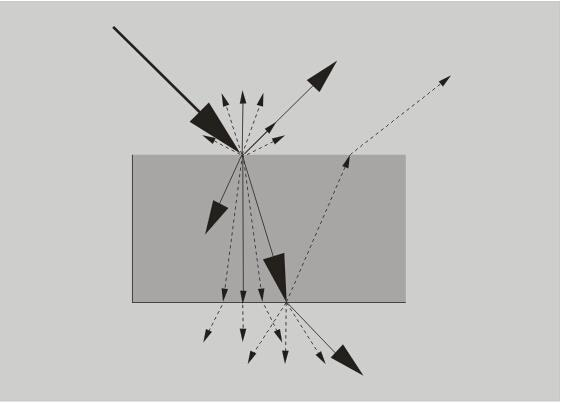

   如下图所示，光照射到物体表面之后，会发生一系列光学现象，主要包括镜面反射、漫反射、表面散射、折射、背散射、透射、背反射、色散等。还有一部分光被物体吸收，各种情况发生的条件由物体表面的形状、微观结构、颜色、化学成分等客观条件决定。   

   不同的表面发生各种光学现象的差异很大，例如镀膜良好的镜子表面，光照射之后几乎全部被反射，也就是镜面反射占了最主要的成分；光线接近垂直照射到玻璃上之后，几乎全部穿透，从另一面发射出去，这种情况下透射占了最主要的成分；黑色粗糙表面，基本没有光反射或者透射，几乎全部光会被吸收掉。
   除此之外，光学效果还取决于光源的发光方式和照射方式，例如漫射光均匀照射可以消除物体表面不平整造成的差异。而平行光照射则恰好相反，能够突出物体表面不平整的特征。因此想得到预期效果，需要选择合适的光源和恰当的照射方式。

#### 选光源的一般过程

1、了解项目需求，明确要检测或者测量的目标；
2、分析目标与背景的区别，找出两者之间成像差异最大的光学现象；
3、根据光源与目标之间的配合关系，初步确定光源的发光类型及颜色；
4、拿实际光源测试，以确定满足要求的打光方式；
5、根据具体情况，确定适用客户的产品。