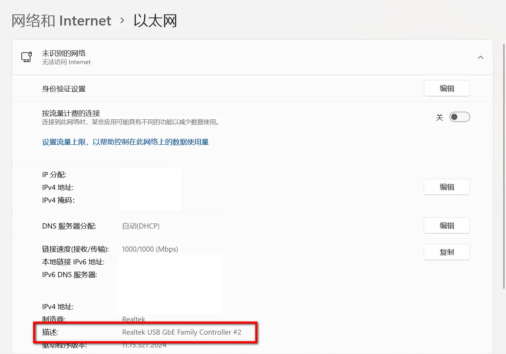

# VMware配置

四步走：

## 第一步：

打开当前虚拟机设置。
有三种方法，随便选一种即可。

-   一、快捷键【Ctrl+D】
-   二、双击右下角小图标
-   三、[虚拟机] --> [设置]


打开如下界面，勾选图中四个选项


## 第二步

打开虚拟网络编辑器：


点击更改设置，会弹出一个窗口，选择【是】


点击下拉框，根据你的需要选择实际网卡。

-   **虚拟机需要访问互联网** -> 选择你的 **无线适配器（WiFi网卡）**。
-   **虚拟机需要桥接到开发板等物理设备** -> 选择你的 **有线以太网适配器（网线网卡）**。


## 提示：关于怎么看自己的实际网卡

-   右键点击任务栏右下角的 **网络图标** *（Wi-Fi/以太网图标）*，选择 **【网络和Internet设置】**
-   *或* 进入 **设置**（Win+I）→ **【网络和Internet】** → **【高级网络设置】**


点击【属性】
以我这里为例，**WLAN**后面的【属性】对应（WiFi网卡）
**以太网2**后面的【属性】对应的是（网线网卡）
根据你的需要选就好了


查看网络描述：


## 第三步：

虚拟机内配置，点击右上角，设置有线连接


手动设置IP


# 开发板配置

## 配置IP

设置开发板的IP地址

-   a. vi /etc/profile , 编辑该文件
-   b. shift + g 光标定位到文件末尾
-   c. 按下按键 i 进入编辑模式
-   d. 添加如下指令，设置开发板的IP地址

```
ifconfig eth0 <IPV4地址> netmask 255.255.255.0 up
```

```
例如: ifconfig eth0 192.168.31.101 netmask 255.255.255.0 up
```

注意： 设置开发板的IP地址时，保持网段号与自己的虚拟机的网段设置一致，主机号不同

e. 按下 ESC 回到命令模式， 输入 :wq , enter执行，保存并退出vi

f. 输入 reboot 重启开发板

g. ifconfig 验证开发板的IP是否配置成功


## tftp传输命令

启动ubuntu上tftp: `sudo service tftpd-hpa start`
重启ubuntu上tftp: `sudo service tftpd-hpa restart`
停止ubuntu上tftp: `sudo service tftpd-hpa stop`
a. 在ubuntu上启动tftp服务
注意： 如果自己配置的Ubuntu，需要使用 `sudo apt-get install tftpd-hpa` ，
自己配置ubuntu的tftp的服务目录
b. 在Ubuntu把要传输到开发板的文件拷贝（cp）到 tftp 服务目录 （/home/china/tftpboot）
例如: `cp 源文件 /home/china/tftpboot`
c. 在开发板上，输入下载文件的指令
`tftp -g -r 要下载的文件名 虚拟机的IP地址`
例如: `tftp -g -r a.out 192.168.31.100`

# VMware连网

进入虚拟网络编辑器，点击桥接模式里的的下拉框，根据你的需要选择实际网卡。

-   **虚拟机需要访问互联网** -> 选择你的 **无线适配器（WiFi网卡）**。


虚拟机内配置，点击右上角，设置有线连接


新建一个网络配置即可


如果还不行？那就选择NAT模式吧。
虚拟机设置 --> 网络适配器 --> NAT模式


# 开发板连网

见pdf：【开发板连接外网.pdf】