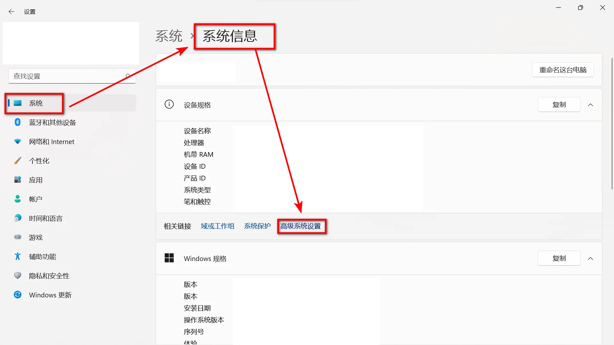
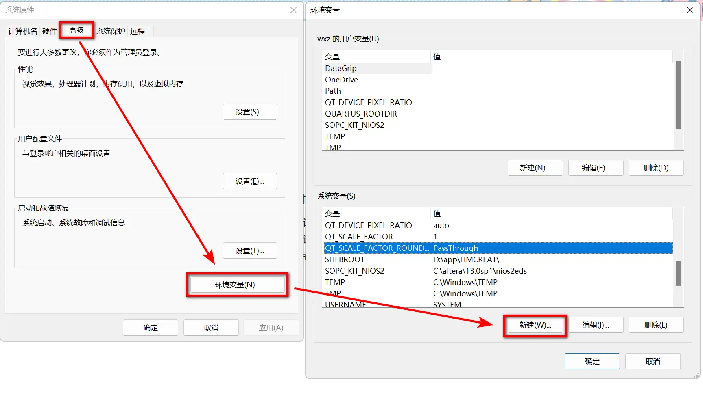
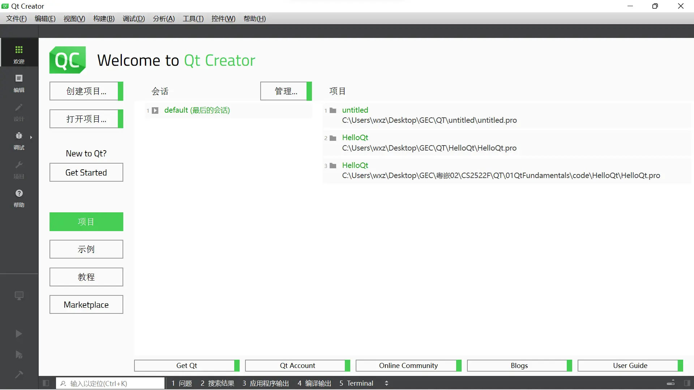
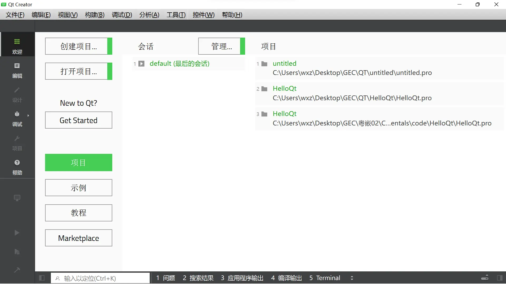
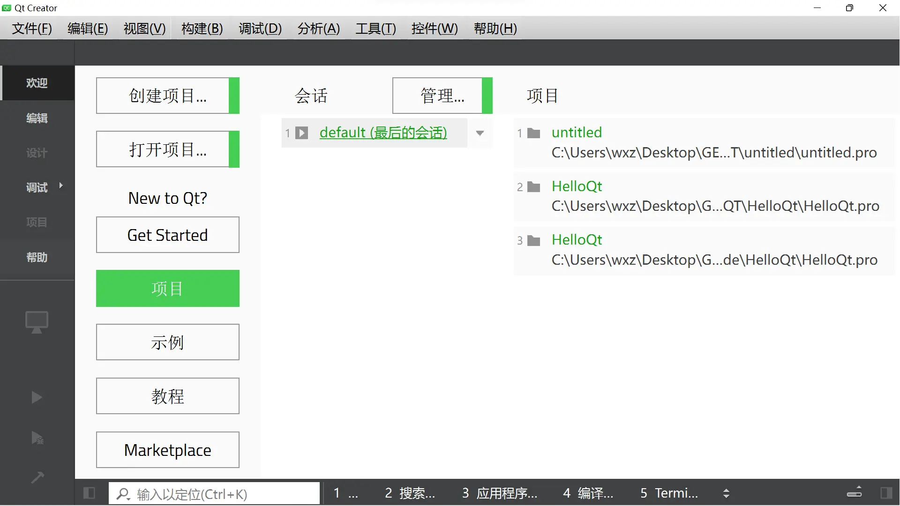
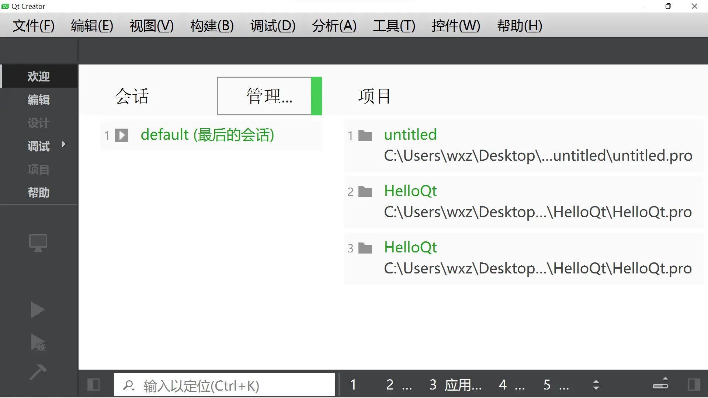

使用QT时，碰到了一个问题，程序界面元素显得异常巨大，布局错乱，严重影响界面设计。

搜了半天，终于解决了。

本文将详细介绍问题成因及如何通过环境变量正确配置 Qt 的缩放行为。

Qt 应用默认的 DPI 缩放策略导致了 UI 元素被过度放大，要让 Qt 正确处理高 DPI 显示，需要手动设置两个关键的环境变量：

1. `QT_SCALE_FACTOR`
2. `QT_SCALE_FACTOR_ROUNDING_POLICY`

步骤如下：
右键我的电脑-属性--高级系统设置--环境变量--新建    环境变量

| 变量名                            | 值                                   |
| --------------------------------- | ------------------------------------ |
| `QT_SCALE_FACTOR`                 | `1.25` （根据需要设为 1、1.5、2 等） |
| `QT_SCALE_FACTOR_ROUNDING_POLICY` | `PassThrough`                        |

下面是不同 `QT_SCALE_FACTOR` 设置下的界面缩放效果对比：

参考链接：

[解决win7下QtCreator显示界面过大的问题 - Nicholas-- - 博客园](https://www.cnblogs.com/Nicholas0707/articles/15400314.html)

[调整window下qt界面的缩放比例为自适应 - 变秃了也就变强了 - 博客园](https://www.cnblogs.com/lichangyi/p/18051727)